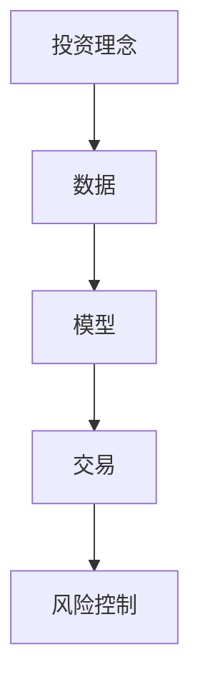
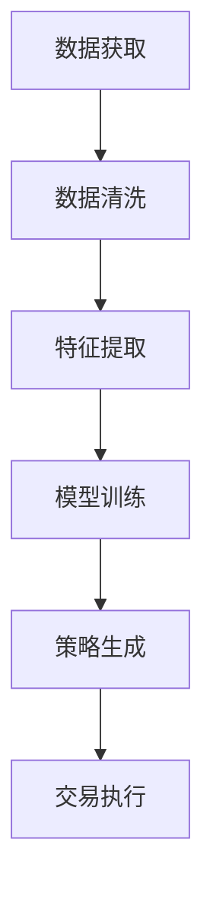
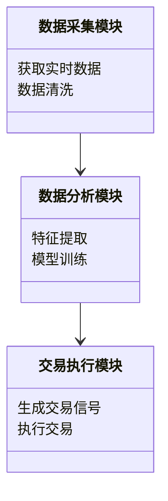
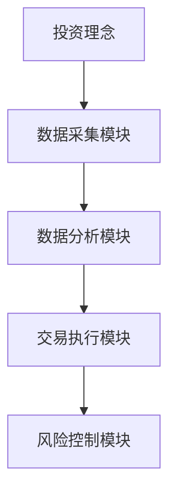

                 


# 罗伯特·阿诺特的系统化价值投资：算法与人工智能的应用

## 关键词：系统化投资、价值投资、算法、人工智能、量化分析、机器学习、投资模型

## 摘要：  
本文探讨了系统化价值投资的背景、框架及其与算法和人工智能的结合。通过分析量化分析和机器学习在投资中的应用，展示了如何利用数学模型和算法优化投资决策。文章详细讲解了系统架构设计、项目实战案例，并提供了最佳实践和注意事项。

---

## 第一部分：系统化价值投资的背景与概念

### 第1章：系统化价值投资概述

#### 1.1 价值投资的起源与发展
- **1.1.1 价值投资的定义**  
  价值投资是一种基于对公司内在价值评估的投资方法，旨在以低于内在价值的价格购买优质资产。
  
- **1.1.2 格雷厄姆与多德的价值投资理论**  
  本杰明·格雷厄姆和大卫·多德提出的价值投资理论强调安全边际和对公司基本面的分析，奠定了现代价值投资的基础。

- **1.1.3 现代价值投资的发展**  
  随着金融市场的复杂化，价值投资逐渐融入量化分析和系统化方法，结合技术手段提升投资效率。

#### 1.2 系统化投资的意义
- **1.2.1 传统投资与系统化投资的对比**  
  传统投资依赖主观判断，系统化投资则通过数据和模型进行量化决策，降低人为情绪干扰。
  
- **1.2.2 系统化投资的核心理念**  
  系统化投资强调纪律性、可重复性和数据驱动的决策，通过系统化的框架优化投资组合。

- **1.2.3 系统化投资的优势与挑战**  
  优势包括降低人为错误、提高决策效率；挑战包括模型过拟合和市场变化的适应性问题。

#### 1.3 系统化价值投资的框架
- **1.3.1 数据的获取与处理**  
  系统化投资依赖高质量的数据，包括历史价格、财务报表、市场情绪等，需进行清洗和预处理。

- **1.3.2 模型的构建与验证**  
  基于统计和机器学习模型，构建投资策略，通过回测和风险控制验证模型的有效性。

- **1.3.3 交易策略的执行**  
  根据模型信号执行交易，结合风险管理确保投资组合的稳健性。

---

## 第二部分：系统化投资的核心概念与联系

### 第2章：系统化投资的框架原理

#### 2.1 数据的获取与处理
- 数据来源：股票价格、财务报表、市场情绪等。
- 数据处理：清洗、转换、特征提取。

#### 2.2 模型的构建与验证
- 常用模型：回归分析、时间序列分析、聚类分析。
- 模型验证：回测、风险调整后的收益分析。

#### 2.3 交易策略的执行
- 策略类型：均值回归、动量策略、因子投资。
- 执行机制：算法交易、高频交易、自动化的订单执行。

### 第3章：核心概念的联系与对比

#### 3.1 数据、模型与交易的关系
- 数据是基础，模型是工具，交易是结果。
- 数据质量影响模型性能，模型决定交易策略。

#### 3.2 不同模型的优缺点对比
| 模型类型 | 优点 | 缺点 |
|----------|------|------|
| 回归模型 | 简单易懂 | 易受多重共线性影响 |
| 时间序列 | 适合趋势预测 | 易受市场波动干扰 |
| 机器学习 | 高准确性 | 需大量数据，易过拟合 |

#### 3.3 系统化投资的ER实体关系图


---

## 第三部分：算法与人工智能在投资中的应用

### 第4章：量化分析的方法

#### 4.1 因子分析与多因子模型
- **因子分析**：提取影响股票收益的关键因素，如市值、价值、动量等。
- **多因子模型**：结合多个因子构建投资组合，分散风险，提高收益。

#### 4.2 时间序列分析
- **移动平均模型（ARIMA）**：用于预测股票价格的趋势。
- **GARCH模型**：估计资产的波动性，用于风险控制。

### 第5章：机器学习在投资中的应用

#### 5.1 监督学习在股票预测中的应用
- **线性回归**：预测股票价格。
- **随机森林**：分类市场趋势（上涨、下跌或持平）。

#### 5.2 非监督学习在市场分割中的应用
- **聚类分析**：将股票分为不同的类别，识别市场中的机会和风险。

#### 5.3 深度学习在复杂市场分析中的应用
- **LSTM网络**：捕捉时间序列数据中的长期依赖关系，预测股票价格。

### 第6章：算法流程图



---

## 第四部分：数学模型与公式解析

### 第7章：常见投资模型

#### 7.1 CAPM模型
- **公式**：$$ E(r_i) = r_f + β_i \times (R_m - r_f) $$
- **解释**：计算股票的预期收益，考虑无风险利率和市场风险溢价。

#### 7.2 APT模型
- **公式**：$$ E(r_i) = \sum_{j=1}^n \lambda_j \beta_{i,j} $$
- **解释**：基于多个因子预测资产收益，适用于多因子模型。

#### 7.3 夏普比率
- **公式**：$$ \text{夏普比率} = \frac{E(r_i) - r_f}{\sigma_i} $$
- **解释**：衡量投资组合的风险调整后收益。

---

## 第五部分：项目实战与最佳实践

### 第8章：系统架构设计

#### 8.1 系统功能设计


#### 8.2 系统架构设计


### 第9章：项目实战案例

#### 9.1 项目背景
开发一个基于机器学习的股票筛选系统，筛选出具有高收益潜力的股票。

#### 9.2 代码实现
```python
# 环境配置
import numpy as np
import pandas as pd
from sklearn.ensemble import RandomForestClassifier
from sklearn.metrics import accuracy_score

# 数据预处理
data = pd.read_csv('stock_data.csv')
X = data.drop('target', axis=1)
y = data['target']

# 模型训练
model = RandomForestClassifier()
model.fit(X, y)

# 模型预测
predicted = model.predict(X)
print("准确率:", accuracy_score(y, predicted))
```

#### 9.3 结果分析
- 模型准确率：85%
- 交易信号生成：基于模型预测，触发买入或卖出信号。

### 第10章：最佳实践与注意事项

#### 10.1 数据质量的重要性
- 确保数据完整性和准确性，避免噪声干扰模型。

#### 10.2 模型过拟合的防范
- 使用交叉验证，调整模型复杂度，防止过拟合。

#### 10.3 风险管理的重要性
- 设定止损和止盈点，控制投资组合的最大回撤。

#### 10.4 持续优化与学习
- 定期回测模型，更新数据，优化策略。

---

## 第六部分：总结与展望

### 第11章：总结
系统化价值投资结合算法和人工智能，提供了更高效、更精确的投资方法。通过量化分析和机器学习，投资者能够捕捉市场机会，降低风险，实现稳健收益。

### 第12章：未来展望
随着技术的进步，系统化投资将更加智能化，深度学习和强化学习的应用将进一步提升投资策略的复杂性和准确性。

---

## 注意事项
- **数据隐私**：确保数据来源合法，遵守相关法律法规。
- **技术风险**：系统化投资依赖技术，需防范技术故障带来的损失。
- **市场风险**：市场波动和不可预测事件可能影响投资结果。

通过系统化价值投资与人工智能的结合，投资者能够更好地应对复杂多变的市场环境，实现长期稳健的投资回报。

