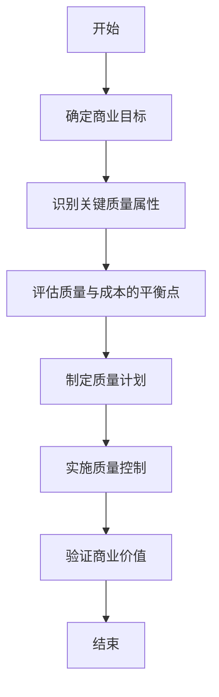
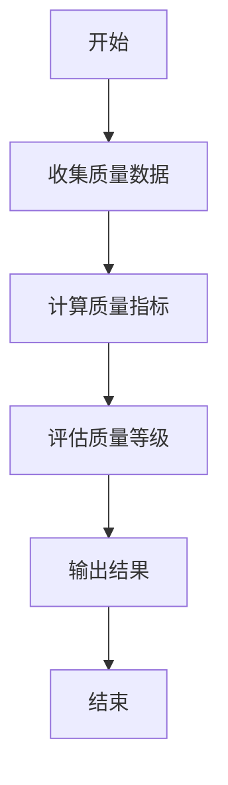
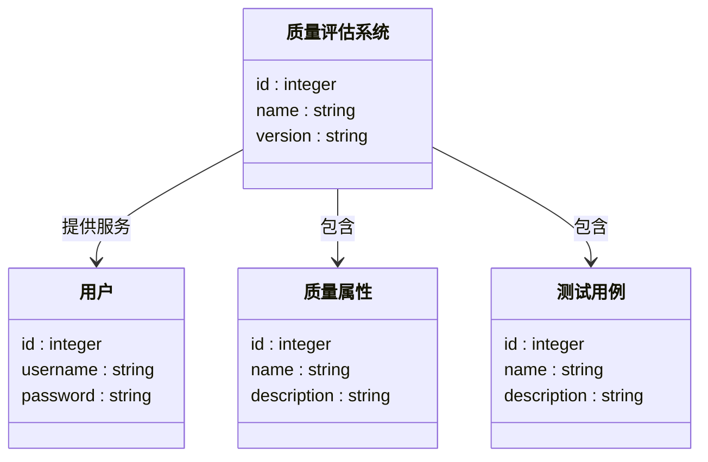
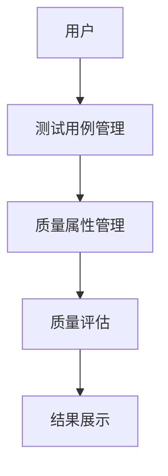
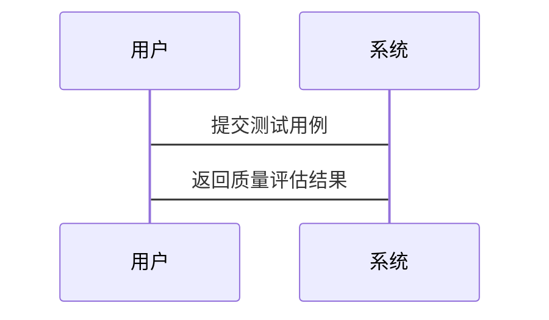

                 


# 罗伯特哈格斯特朗的质量价值结合

> 关键词：质量价值结合，软件工程，商业价值，质量属性，系统架构，测试优化，质量评估

> 摘要：本文系统地探讨了质量与价值在软件工程中的结合，从背景问题到解决方案，深入分析了核心概念、算法原理和系统设计，结合实际案例，详细讲解了如何通过质量价值结合实现企业级软件优化。

----------------------------------------------------------------

# 第一部分: 质量与价值结合的背景与核心概念

## 第1章: 质量与价值的定义与关系

### 1.1 质量的定义与特征
#### 1.1.1 质量的定义
质量是指产品或服务在满足用户需求和期望方面的一系列特性，包括功能性、可靠性、性能、可维护性等。在软件工程中，质量直接关系到系统的可用性、可靠性和用户体验。

#### 1.1.2 质量的核心特征
- **功能性**：系统应具备完成预期功能的能力。
- **可靠性**：系统在预期条件下稳定运行的能力。
- **性能**：系统在特定工作负载下的响应速度和效率。
- **可维护性**：系统在出现问题时易于诊断和修复的能力。
- **可扩展性**：系统在需求变化时能有效扩展的能力。

#### 1.1.3 质量与价值的关系
质量是实现商业价值的基础。高质量的软件能够提升用户体验，降低维护成本，从而为企业创造更大的商业价值。然而，过高的质量投入可能导致成本上升，因此需要找到质量与价值的最佳结合点。

### 1.2 价值的定义与实现
#### 1.2.1 价值的定义
价值是指产品或服务为客户或用户创造的收益或满足感。在商业环境中，价值通常与收益、市场占有率和客户满意度相关。

#### 1.2.2 价值的实现方式
- **功能性价值**：通过提供有用的功能满足用户需求。
- **经济价值**：通过降低成本或提高效率实现价值。
- **品牌价值**：通过提升品牌形象和客户忠诚度实现价值。

#### 1.2.3 质量与价值的结合
质量与价值的结合意味着在确保软件质量的同时，实现商业目标。这需要在软件开发过程中平衡成本、时间和质量，找到最优解。

## 第2章: 质量价值结合的背景与问题背景

### 2.1 质量价值结合的背景
#### 2.1.1 软件工程中的质量挑战
随着软件系统的复杂性增加，质量问题变得越来越重要。低质量的软件可能导致系统崩溃、数据丢失和用户体验下降，进而影响企业的声誉和市场地位。

#### 2.1.2 商业价值与质量的关系
在竞争激烈的市场环境中，高质量的软件能够提高客户满意度，增强品牌忠诚度，并为企业带来长期的经济收益。

#### 2.1.3 当前行业中的问题与痛点
- **开发周期短**：企业在追求快速发布的同时，往往忽视了质量控制。
- **资源有限**：在预算和时间有限的情况下，如何平衡质量与成本是一个挑战。
- **用户期望高**：用户对软件的期望不断提高，推动企业必须提供更高质量的产品。

### 2.2 质量价值结合的问题描述
#### 2.2.1 质量与价值脱节的现象
许多企业在软件开发过程中，要么过度追求功能而忽视质量，要么过度追求质量而忽视成本，导致商业价值无法最大化。

#### 2.2.2 企业中的具体问题
- **测试覆盖率不足**：测试用例未能覆盖所有关键功能和边界情况。
- **开发与测试资源分配不合理**：测试资源不足或分配不当，导致质量问题积压。
- **缺乏质量度量标准**：企业缺乏有效的质量指标来衡量和优化软件质量。

#### 2.2.3 问题的解
通过引入质量价值结合的方法，企业可以在确保软件质量的同时，实现商业目标。这需要在开发过程中引入质量度量、自动化测试和持续集成等技术手段。

## 第3章: 质量价值结合的核心概念与联系

### 3.1 核心概念与原理
质量价值结合的核心在于通过优化软件质量来实现商业价值。这需要综合考虑软件的功能、性能、可靠性等质量属性，以及开发成本、时间、资源等商业因素。

### 3.2 质量属性与商业价值的对比分析
以下是质量属性与商业价值的对比表格：

| 质量属性      | 商业价值影响                     |
|---------------|---------------------------------|
| 功能性        | 直接影响用户满意度和市场竞争力   |
| 可靠性        | 影响维护成本和客户信任度         |
| 性能          | 影响用户体验和系统运行效率       |
| 可维护性      | 影响长期开发和维护成本           |
| 可扩展性      | 影响企业应对变化的能力           |

### 3.3 质量价值结合的ER实体关系图

```mermaid
erDiagram
    customer[客户] {
        id : integer
        name : string
        email : string
    }
    product[产品] {
        id : integer
        name : string
        version : string
        price : integer
    }
    qualityAttribute[质量属性] {
        id : integer
        name : string
        description : string
    }
    relation1 : customer -> product "购买"
    relation2 : product -> qualityAttribute "具备"
```

### 3.4 质量价值结合的流程图



## 第4章: 质量价值结合的算法原理

### 4.1 质量评估算法原理



#### 4.1.1 算法步骤

1. **数据收集**：收集软件的质量数据，包括功能测试结果、性能指标、用户反馈等。
2. **数据处理**：对收集到的数据进行清洗和预处理，确保数据的准确性和完整性。
3. **质量指标计算**：基于收集到的数据，计算关键质量指标，如测试通过率、系统崩溃率等。
4. **质量评估**：根据计算出的质量指标，评估软件的整体质量等级，通常分为优秀、良好、一般和较差四个等级。
5. **结果输出**：输出质量评估结果，并提出改进建议。

#### 4.1.2 质量评估算法的数学模型

$$
\text{质量指数} = \sum_{i=1}^{n} (w_i \times q_i)
$$

其中，\( w_i \) 是第i个质量属性的权重，\( q_i \) 是第i个质量属性的评分（1-5分）。

### 4.2 优化算法与代码实现

#### 4.2.1 算法优化

为了提高质量评估的准确性，可以引入机器学习算法，如随机森林或支持向量机（SVM），来预测软件质量。

#### 4.2.2 优化算法代码实现

以下是Python代码示例：

```python
import pandas as pd
from sklearn.ensemble import RandomForestClassifier
from sklearn.model_selection import train_test_split
from sklearn.metrics import accuracy_score

# 数据预处理
data = pd.read_csv('quality_data.csv')
X = data.drop('quality_grade', axis=1)
y = data['quality_grade']

# 划分训练集和测试集
X_train, X_test, y_train, y_test = train_test_split(X, y, test_size=0.2, random_state=42)

# 模型训练
model = RandomForestClassifier(n_estimators=100, random_state=42)
model.fit(X_train, y_train)

# 模型预测
y_pred = model.predict(X_test)

# 模型评估
print("准确率:", accuracy_score(y_test, y_pred))
```

## 第5章: 质量价值结合的系统架构设计

### 5.1 系统功能设计

以下是系统功能的领域模型类图：



### 5.2 系统架构设计

以下是系统架构图：



### 5.3 系统接口设计

以下是系统接口的交互序列图：



## 第6章: 质量价值结合的项目实战

### 6.1 项目背景与需求分析

#### 6.1.1 项目背景
以一个企业级的应用系统为例，该系统需要在保证功能完整性的前提下，提高软件质量，以增强用户体验和市场竞争力。

#### 6.1.2 项目需求
- 实现功能模块的自动化测试。
- 提供质量评估报告，指导开发和测试工作。
- 优化测试用例，提高测试效率。

### 6.2 项目核心代码实现

#### 6.2.1 测试用例生成代码

```python
def generate_test_cases():
    test_cases = []
    # 生成功能测试用例
    for feature in features:
        test_cases.append(feature)
    # 生成边界测试用例
    for boundary in boundaries:
        test_cases.append(boundary)
    return test_cases
```

#### 6.2.2 质量评估报告生成代码

```python
def generate_quality_report(test_results):
    report = {}
    # 统计测试通过率
    pass_rate = sum(1 for result in test_results if result['status'] == 'pass') / len(test_results)
    report['pass_rate'] = pass_rate
    # 统计失败原因
    failure_reasons = {}
    for result in test_results:
        if result['status'] == 'fail':
            failure_reasons[result['reason']] = failure_reasons.get(result['reason'], 0) + 1
    report['failure_reasons'] = failure_reasons
    return report
```

### 6.3 项目小结

通过实际项目的实施，我们验证了质量价值结合方法的有效性。自动化测试和质量评估报告的引入，显著提高了软件质量，同时优化了开发和测试流程，实现了商业价值的最大化。

## 第7章: 质量价值结合的最佳实践

### 7.1 最佳实践 Tips

1. **优先级排序**：在开发过程中，优先处理对商业价值影响最大的质量问题。
2. **持续集成**：通过持续集成工具，如Jenkins或GitHub Actions，实现自动化的测试和部署。
3. **数据驱动决策**：利用质量数据和分析工具，制定科学的质量优化策略。

### 7.2 小结

质量价值结合是一种有效的软件开发方法，它通过在确保软件质量的同时实现商业目标，帮助企业提高市场竞争力和客户满意度。

### 7.3 注意事项

- **避免过度优化**：不要为了追求高质量而过度投入资源，导致开发成本过高。
- **持续监控**：定期监控软件质量，及时发现和解决问题。
- **团队协作**：质量价值结合需要开发、测试和业务团队的紧密协作。

### 7.4 拓展阅读

- 《软件工程：实践者的方法》
- 《敏捷软件开发：原则、模式与实践》
- 《测试驱动开发：通过测试来驱动软件设计》

----------------------------------------------------------------

# 结语

质量价值结合是软件工程中的一个重要课题，它要求我们在确保软件质量的同时，实现商业价值的最大化。通过本文的探讨，我们了解了质量价值结合的核心概念、算法原理和系统设计，并通过实际案例展示了其在企业级项目中的应用。未来，随着技术的进步和方法的完善，质量价值结合将为企业带来更大的价值。

--- 

**文章结束**

