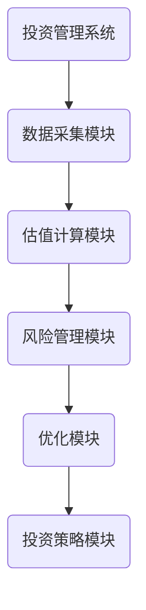

                 


# 罗杰·洛温斯坦的价值投资风险管理

> 关键词：价值投资、风险管理、投资策略、系统架构、数学模型、投资组合管理

> 摘要：本文系统地介绍了罗杰·洛温斯坦的价值投资风险管理方法，从价值投资的基本概念到风险管理的核心原理，再到具体的算法实现和系统架构设计，最后结合实际案例进行深入分析，帮助读者全面理解如何在投资中有效管理风险。

---

## 第一部分: 价值投资与风险管理的背景

### 第1章: 价值投资的基本概念

#### 1.1 价值投资的定义与核心理念
价值投资是一种基于对公司内在价值的评估的投资策略，核心在于寻找市场价格低于其内在价值的公司进行投资。其核心理念包括：
- **安全边际**：买入价格低于内在价值，以降低风险。
- **长期视角**：关注企业的长期盈利能力，而非短期市场波动。
- **逆人性**：在市场恐慌时买入，在市场狂热时卖出。

#### 1.2 风险管理的重要性
在价值投资中，风险管理是确保投资组合稳健增长的关键。有效的风险管理可以：
- 减少潜在损失。
- 提高投资组合的稳定性。
- 降低市场波动对投资组合的影响。

#### 1.3 价值投资与其他投资策略的区别
与趋势投资、技术分析等策略不同，价值投资强调对公司基本面的深入研究和长期持有。其区别主要体现在：
| 投资策略 | 核心理念 | 交易频率 |
|----------|----------|----------|
| 价值投资 | 寻找低估公司 | 长期持有 |
| 技术分析 | 通过价格走势预测 | 短期交易 |

### 第2章: 风险管理的重要性

#### 2.1 风险的定义与分类
风险是指投资收益的不确定性，主要分为：
- **市场风险**：整体市场波动带来的风险。
- **流动性风险**：资产难以快速变现的风险。
- **信用风险**：债券发行人违约的风险。

#### 2.2 风险管理在投资中的作用
风险管理能够帮助投资者：
- **降低损失**：通过分散投资和止损策略减少潜在损失。
- **提高收益稳定性**：通过合理的资产配置，平衡收益与风险。
- **增强信心**：在市场波动中保持投资策略的稳定性。

#### 2.3 价值投资中的风险管理
在价值投资中，风险管理的核心在于：
- **安全边际**：买入价格低于内在价值。
- **分散投资**：通过投资不同行业和公司降低风险。
- **长期持有**：避免短期波动的干扰。

### 第3章: 价值投资与风险管理的结合

#### 3.1 风险管理在价值投资中的应用
- **估值模型**：使用DCF模型评估公司内在价值，确保买入价格合理。
- **组合管理**：通过资产配置和分散投资降低风险。
- **情景分析**：在不同市场条件下评估投资组合的表现。

#### 3.2 风险管理的核心工具
- **风险调整后的收益（RAR）**：衡量投资回报的风险调整后表现。
- **夏普比率（Sharpe Ratio）**：评估投资组合的风险调整后收益。

### 第4章: 价值投资风险管理的案例分析

#### 4.1 经典投资案例分析
- **伯克希尔哈撒韦**：通过长期持有优质资产，实现稳健增长。
- **可口可乐投资**：巴菲特定价买入低估股票，长期持有。

---

## 第二部分: 价值投资与风险管理的核心概念与联系

### 第5章: 价值投资与风险管理的核心原理

#### 5.1 价值投资的核心原理
- **内在价值**：公司未来现金流的现值，决定股票的合理价格。
- **市场先生**：市场情绪的波动为理性投资者提供机会。

#### 5.2 风险管理的核心原理
- **风险分层**：将投资组合分为不同风险等级，分别管理。
- **风险调整后的收益**：在考虑风险的前提下，选择收益最高的投资。

### 第6章: 价值投资与风险管理的联系

#### 6.1 价值投资与风险管理的结合
- **估值与风险评估**：通过内在价值评估，确定投资的安全边际。
- **组合管理**：通过分散投资降低风险。

---

## 第三部分: 算法与数学模型

### 第7章: 价值投资与风险管理的算法实现

#### 7.1 风险评估算法
- **马科维茨有效组合模型**：通过优化算法寻找风险调整后的最优投资组合。

#### 7.2 价值评估算法
- **DCF模型**：通过现金流折现计算公司内在价值。

---

## 第四部分: 系统架构与设计

### 第8章: 投资管理系统架构设计

#### 8.1 系统功能设计
- **数据采集**：获取市场数据和公司基本面信息。
- **估值计算**：计算股票的内在价值。
- **风险管理**：评估投资组合的风险并进行调整。

#### 8.2 系统架构图


---

## 第五部分: 项目实战

### 第9章: 投资组合管理系统实现

#### 9.1 环境安装
- **Python**：安装Anaconda或Miniconda。
- **相关库**：安装pandas、numpy、scipy等。

#### 9.2 核心代码实现
```python
import pandas as pd
import numpy as np

# 示例：计算夏普比率
def calculate_sharpe_ratio(returns, risk_free_rate):
    excess_returns = returns - risk_free_rate
    sharpe_ratio = excess_returns.mean() / excess_returns.std()
    return sharpe_ratio

# 示例：风险调整后的收益计算
def risk_adjusted_return(returns, risk_free_rate):
    excess_returns = returns - risk_free_rate
    return excess_returns.mean()
```

#### 9.3 案例分析
- **数据获取**：从Yahoo Finance获取股票数据。
- **估值计算**：使用DCF模型计算内在价值。
- **风险管理**：通过夏普比率优化投资组合。

---

## 第六部分: 最佳实践与总结

### 第10章: 最佳实践与总结

#### 10.1 小结
- 价值投资与风险管理的结合是实现稳健投资收益的关键。
- 通过系统架构和数学模型可以提高风险管理的效率和准确性。

#### 10.2 注意事项
- 风险管理需要长期坚持，避免短期情绪化决策。
- 在实际操作中，需结合市场环境不断调整策略。

#### 10.3 拓展阅读
- 《投资之道》：学习价值投资的基本理念。
- 《风险管理与金融创新》：深入了解风险管理的理论与实践。

---

以上是《罗杰·洛温斯坦的价值投资风险管理》的完整目录和文章内容框架，后续可以根据具体需求补充每章的具体内容。

