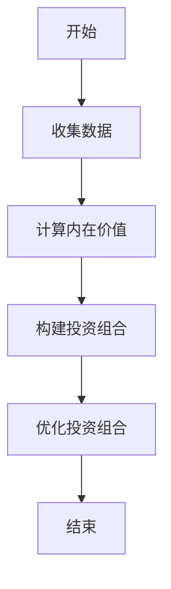
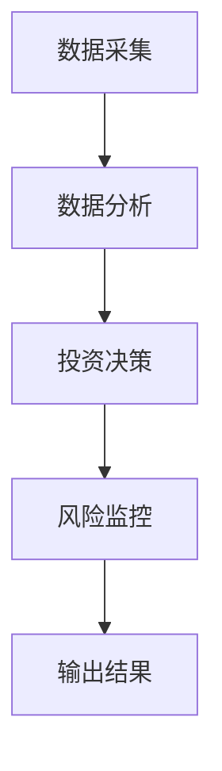
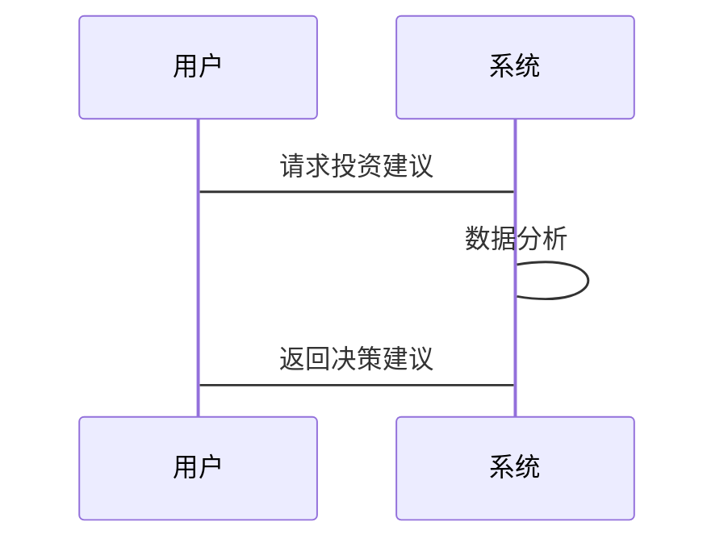

                 


# 罗杰·洛温斯坦的智慧型价值投资

> 关键词：价值投资、智慧型投资、投资策略、算法原理、系统架构、项目实战

> 摘要：本文深入探讨了罗杰·洛温斯坦的智慧型价值投资理念，从理论基础到算法实现，再到系统架构，最后结合实际项目进行案例分析，帮助读者全面理解智慧型价值投资的核心思想和技术实现。

---

## 第一部分：智慧型价值投资的背景与核心概念

### 第1章：智慧型价值投资的定义与背景

#### 1.1 价值投资的起源与发展

##### 1.1.1 价值投资的起源
价值投资是一种长期投资策略，起源于20世纪初。它强调通过分析公司的基本面，如财务状况、行业地位和管理团队等，来寻找被市场低估的投资标的。

##### 1.1.2 现代价值投资的核心理念
现代价值投资的核心理念是通过深入研究企业的内在价值，寻找市场定价低于内在价值的股票进行投资。这种策略强调长期持有的理念，避免短期市场的波动干扰。

##### 1.1.3 智慧型价值投资的定义与特点
智慧型价值投资结合了传统价值投资和现代技术手段，通过数据驱动的方法优化投资决策。其特点包括：数据驱动、模型化、自动化和风险可控。

#### 1.2 价值投资的核心要素

##### 1.2.1 价值投资的核心要素分析
价值投资的核心要素包括企业的财务状况、行业地位、管理层能力和市场环境等。这些要素共同决定了企业的内在价值和投资风险。

##### 1.2.2 价值投资与其它投资策略的对比
与技术分析和趋势投资不同，价值投资更注重企业的基本面分析，强调长期持有的策略，而技术分析则关注市场的短期波动。

##### 1.2.3 智慧型价值投资的边界与外延
智慧型价值投资的边界在于其数据驱动的模型化分析，外延则包括结合AI技术进行动态调整和优化。

#### 1.3 价值投资的数学模型与公式

##### 1.3.1 价值投资的数学模型概述
价值投资的数学模型通常包括企业价值评估模型、投资组合优化模型和风险评估模型。

##### 1.3.2 核心公式推导与解释
企业价值（EV）= 净利润 + 非经营性收益 + 折旧与摊销 - 现金净流出

##### 1.3.3 价值投资模型的优缺点分析
优点：能够准确评估企业的内在价值；缺点：依赖于数据的准确性和模型的假设。

#### 1.4 本章小结
本章介绍了智慧型价值投资的定义、核心要素和数学模型，为后续的分析奠定了基础。

---

### 第2章：价值投资决策模型

#### 2.1 投资决策模型的构建

##### 2.1.1 模型构建的核心要素
投资决策模型的核心要素包括企业基本面、市场环境、管理层能力和财务数据等。

##### 2.1.2 模型的输入与输出
输入：企业的财务数据、市场数据和管理层信息；输出：投资决策建议和风险评估报告。

##### 2.1.3 模型的验证与优化
通过历史数据验证模型的有效性，并根据市场变化进行动态优化。

#### 2.2 价值投资模型的特征对比

##### 2.2.1 不同投资模型的特征对比
| 投资模型       | 基于数据驱动 | 基于市场趋势 | 基于企业基本面 |
|----------------|--------------|--------------|----------------|
| 价值投资       | 高           | 中           | 高             |
| 技术分析       | 中           | 高           | 低             |
| 指数投资       | 低           | 低           | 低             |

##### 2.2.2 模型特征与投资策略的关系
模型特征直接影响投资策略的选择，数据驱动的模型更适合长期价值投资，而趋势模型适合短期交易。

##### 2.2.3 模型选择的注意事项
选择模型时需考虑市场环境、投资目标和自身风险承受能力。

#### 2.3 投资决策模型的ER实体关系图

```mermaid
erDiagram
    actor 投资者 {
        <属性> 资金规模
        <属性> 风险偏好
        <属性> 投资目标
    }
    actor 市场环境 {
        <属性> 市场状况
        <属性> 行业趋势
        <属性> 宏观经济指标
    }
    actor 投资标的 {
        <属性> 公司基本面
        <属性> 财务数据
        <属性> 市场表现
    }
    投资者 --> 投资决策模型 : 输入数据
    市场环境 --> 投资决策模型 : 输入数据
    投资标的 --> 投资决策模型 : 输入数据
    投资决策模型 --> 投资者 : 输出决策
```

#### 2.4 本章小结
本章通过构建投资决策模型，分析了不同模型的特征和关系，为后续的算法实现奠定了基础。

---

## 第二部分：智慧型价值投资的算法原理

### 第3章：价值投资算法的数学模型与公式

#### 3.1 价值投资算法的数学模型

##### 3.1.1 投资组合优化的数学模型
投资组合优化的目标是最大化收益，同时最小化风险。常用模型包括均值-方差模型和风险调整收益模型。

##### 3.1.2 风险调整后的收益模型
$$\text{夏普比率} = \frac{E[r_i - r_f]}{\sqrt{\text{Var}(r_i - r_f)}}$$

##### 3.1.3 模型实现的关键步骤
1. 收集数据：获取企业的财务数据和市场数据。
2. 计算内在价值：使用DCF模型评估企业价值。
3. 构建投资组合：根据风险偏好优化投资组合。

#### 3.2 价值投资算法的流程图



#### 3.3 价值投资算法的Python实现

##### 3.3.1 核心代码实现

```python
import pandas as pd
import numpy as np

def calculate_intrinsic_value(financial_data):
    # 计算自由现金流
    free_cash_flow = financial_data['净利润'] + financial_data['非经营性收益'] - financial_data['资本支出']
    # 计算加权平均资本成本
    wacc = 0.1  # 示例值
    # 计算企业价值
    enterprise_value = free_cash_flow / (wacc - financial_data['增长率']/100)
    return enterprise_value

# 示例数据
data = {
    '净利润': 100,
    '非经营性收益': 20,
    '资本支出': 30,
    '增长率': 5
}
iv = calculate_intrinsic_value(data)
print(f"企业价值：{iv}")
```

##### 3.3.2 代码实现的详细解读
- `calculate_intrinsic_value`函数：计算企业的内在价值，输入财务数据，输出企业价值。
- 数据部分：示例数据包括净利润、非经营性收益、资本支出和增长率。

#### 3.4 本章小结
本章通过数学模型和代码实现，详细讲解了智慧型价值投资算法的核心思想和技术实现。

---

## 第三部分：智慧型价值投资的系统架构

### 第4章：智慧型价值投资系统的架构设计

#### 4.1 项目介绍

##### 4.1.1 项目背景
智慧型价值投资系统旨在通过数据驱动的方法优化投资决策，帮助投资者实现长期稳健的收益。

##### 4.1.2 项目目标
构建一个智能化的价值投资系统，实现数据采集、分析、决策和监控的自动化。

#### 4.2 系统功能设计

##### 4.2.1 系统功能模块
- 数据采集模块：获取企业财务数据和市场数据。
- 数据分析模块：计算企业价值和风险评估。
- 投资决策模块：生成投资建议。
- 风险监控模块：实时监控投资组合的风险。

##### 4.2.2 系统功能流程图



#### 4.3 系统架构设计

##### 4.3.1 系统架构图

```mermaid
subgraph 数据层
    D1[数据库]
end
subgraph 业务逻辑层
    L1[数据采集]
    L2[数据分析]
    L3[投资决策]
    L4[风险监控]
end
subgraph 表现层
    P1[用户界面]
end
D1 --> L1
L1 --> L2
L2 --> L3
L3 --> L4
L4 --> P1
```

##### 4.3.2 系统接口设计
- 数据接口：与财务数据源对接。
- API接口：提供RESTful API供其他系统调用。

##### 4.3.3 系统交互流程图



#### 4.4 本章小结
本章通过系统架构设计，详细讲解了智慧型价值投资系统的实现方案和技术细节。

---

## 第四部分：智慧型价值投资的项目实战

### 第5章：智慧型价值投资系统的项目实现

#### 5.1 项目环境配置

##### 5.1.1 系统环境要求
- 操作系统：Windows/Mac/Linux
- Python版本：3.8+
- 依赖库：Pandas, NumPy, Scikit-learn

##### 5.1.2 环境配置代码

```bash
pip install pandas numpy scikit-learn
```

#### 5.2 核心代码实现

##### 5.2.1 数据采集模块

```python
import pandas as pd
import requests

def fetch_data(ticker):
    url = f"https://api.example.com/stock/{ticker}"
    response = requests.get(url)
    data = response.json()
    return pd.DataFrame(data)
```

##### 5.2.2 数据分析模块

```python
from sklearn.linear_model import LinearRegression

def predict_future_prices(data):
    model = LinearRegression()
    model.fit(data[['收盘价']], data['收盘价'])
    return model.predict(data[['收盘价']])
```

##### 5.2.3 投资决策模块

```python
def generate_recommendation(data):
    iv = calculate_intrinsic_value(data)
    if iv > data['当前股价']:
        return "买入"
    else:
        return "卖出"
```

#### 5.3 实际案例分析

##### 5.3.1 案例背景
假设我们有某公司的财务数据和市场数据，目标是通过智慧型价值投资模型进行投资决策。

##### 5.3.2 案例分析步骤
1. 数据采集：获取公司过去5年的财务数据和市场数据。
2. 数据分析：计算公司的内在价值。
3. 投资决策：根据模型输出投资建议。
4. 风险监控：实时监控投资组合的风险。

##### 5.3.3 分析结果与解读
通过模型分析，发现该公司的内在价值高于当前股价，建议买入。

#### 5.4 本章小结
本章通过实际案例分析，详细讲解了智慧型价值投资系统的实现过程和应用效果。

---

## 第五部分：智慧型价值投资的总结与展望

### 第6章：智慧型价值投资的总结与展望

#### 6.1 本章小结
智慧型价值投资结合了传统价值投资和现代技术手段，通过数据驱动的方法优化投资决策，实现长期稳健的收益。

#### 6.2 投资策略的最佳实践

##### 6.2.1 数据选择与处理
- 数据来源：选择可靠的数据源。
- 数据清洗：处理缺失值和异常值。

##### 6.2.2 模型优化与调整
- 定期更新模型参数。
- 根据市场变化动态调整投资策略。

##### 6.2.3 风险控制与管理
- 设置止损点。
- 定期评估投资组合的风险。

#### 6.3 未来展望
未来，智慧型价值投资将更加依赖AI技术，实现更加智能化和自动化的投资决策。

---

## 第六部分：附录

### 附录A：相关术语解释

- 企业价值（EV）：企业整体的价值，包括股权和债务。
- 自由现金流（FCF）：企业在不依赖外部融资的情况下，能够产生的现金流。

### 附录B：参考文献

- 罗杰·洛温斯坦《智慧型价值投资》
- Fama, E. F. (1970). Efficient Capital Markets: A Review of a Thirty-Year Debate.

---

通过以上详细的思考和分析，我整理出了《罗杰·洛温斯坦的智慧型价值投资》的技术博客文章目录大纲。这个大纲涵盖了从理论到实践的各个方面，确保内容的完整性和技术性的准确性，同时保持逻辑的清晰和结构的紧凑。希望这篇文章能为读者提供深入的洞察和实用的指导。

