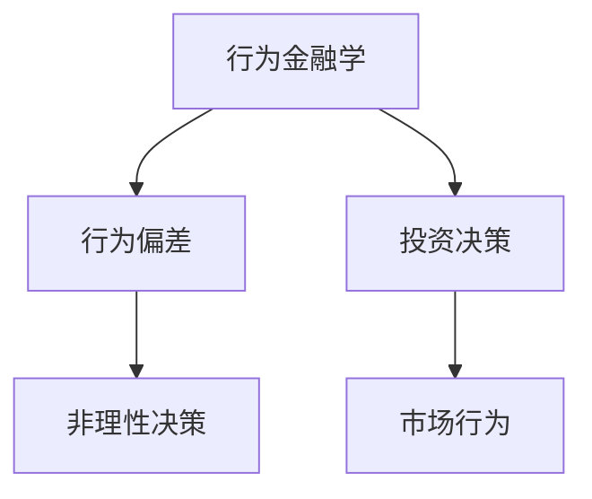
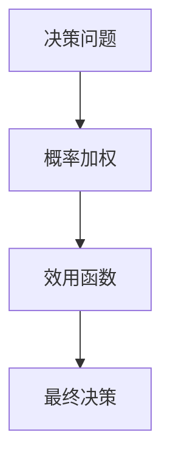
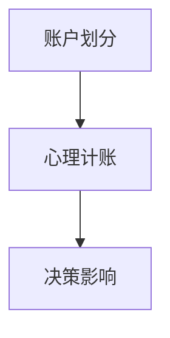
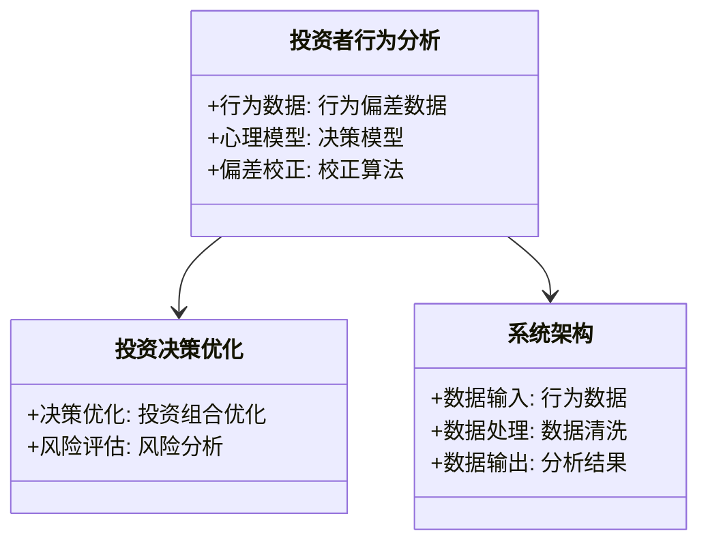
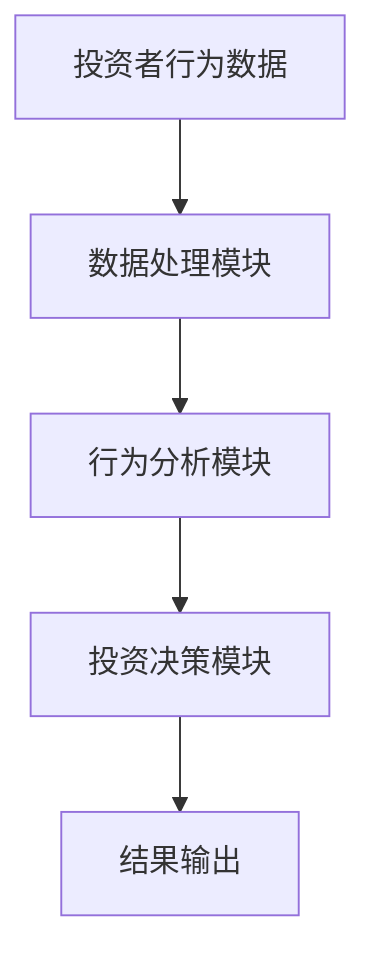
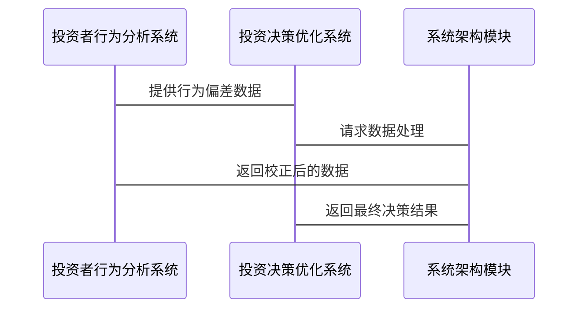

                 


# 《罗杰·洛温斯坦的行为金融学与投资决策》

**关键词**：行为金融学、投资决策、行为偏差、prospect theory、mental accounting、系统架构设计、Python代码实现

**摘要**：本文深入探讨了罗杰·洛温斯坦的行为金融学理论及其在投资决策中的应用。通过分析投资者心理行为偏差，结合数学模型和系统架构设计，展示了如何利用行为金融学理论优化投资策略。文章从理论基础到实际案例，全面解析行为金融学的核心概念，并通过Python代码实现，帮助读者理解其在实际投资中的应用。

---

## 目录大纲

### 第一部分: 行为金融学基础

#### 第1章: 行为金融学概述

##### 1.1 行为金融学的起源与发展

- 从传统金融学到行为金融学的演变
- 行为金融学的核心理念与研究方法
- 行为金融学在投资决策中的应用领域

##### 1.2 投资决策中的行为偏差

- 理性决策与非理性决策的定义与区别
- 常见的行为偏差类型（如过度自信、损失厌恶）
- 行为偏差对投资决策的具体影响

##### 1.3 行为金融学的核心理论框架

- 基于 prospect theory 的决策模型
- 基于 mental accounting 的投资行为分析
- 其他相关理论（如 bounded rationality）

##### 1.4 行为金融学与传统金融学的对比

- 传统金融学假设与行为金融学假设的差异
- 行为金融学对传统金融学的补充与修正
- 行为金融学在实际投资中的应用优势

##### 1.5 本章小结

---

### 第二部分: 行为金融学的核心概念与联系

#### 第2章: 行为金融学的核心概念

##### 2.1 行为金融学的核心理论

- prospect theory 的基本原理与公式推导
- mental accounting 的具体应用与案例分析
- 其他行为金融学理论的简要介绍

##### 2.2 行为金融学概念的属性特征对比

- 列表对比不同行为金融学理论的核心属性
- 行为偏差与理性决策的特征对比表格
- 通过 Mermaid 图展示行为金融学核心概念的实体关系架构



##### 2.3 行为金融学与投资决策的联系

- 行为金融学如何影响投资者决策
- 市场参与者的心理行为对资产定价的影响
- 行为金融学在投资组合管理中的应用

---

#### 第3章: 行为金融学的数学模型与算法原理

##### 3.1 prospect theory 的数学模型

- prospect theory 的核心公式推导
- 使用 Mermaid 图展示 prospect theory 的算法步骤



- 通过 Python 代码实现 prospect theory 的投资决策模型

```python
import numpy as np

def prospect_theory_utility(gains, reference_point, risk_attitude):
    # gains: 收益或损失
    # reference_point: 参照点
    # risk_attitude: 风险态度（0表示风险中性，正值表示风险厌恶，负值表示风险寻求）
    def probability_weight(p):
        return p ** (1/0.8) if p > 0 else (-p) ** (1/0.8)
    
    adjusted_gains = gains - reference_point
    probabilities = [0.5, 0.5]
    
    utility = 0
    for i in range(len(probabilities)):
        p = probabilities[i]
        weighted_p = probability_weight(p)
        utility += weighted_p * (adjusted_gains[i] ** risk_attitude)
    return utility

gains = [100, -50]
reference_point = 0
risk_attitude = 1.5  # 风险厌恶

result = prospect_theory_utility(gains, reference_point, risk_attitude)
print("Prospect Theory Utility:", result)
```

##### 3.2 mental accounting 的数学模型

- mental accounting 的数学公式推导
- 通过 Mermaid 图展示 mental accounting 的系统架构



##### 3.3 行为偏差的数学分析

- 常见行为偏差的数学模型（如过度自信、损失厌恶）
- 使用 Python 代码实现行为偏差的分析与校正

```python
import pandas as pd

def behavioral_bias_analysis(decision_data):
    # decision_data: 包含投资决策数据的 DataFrame
    # 分析过度自信和损失厌恶的影响
    confidence_levels = decision_data['confidence'].values
    loss_aversion_scores = decision_data['loss_aversion'].values

    # 过度自信校正
    adjusted_confidence = confidence_levels * 0.8
    # 损失厌恶校正
    adjusted_loss_aversion = loss_aversion_scores * 0.9

    return adjusted_confidence, adjusted_loss_aversion

# 示例数据
data = {'confidence': [0.9, 0.8, 0.7], 'loss_aversion': [0.8, 0.9, 0.6]}
df = pd.DataFrame(data)
adj_confidence, adj_loss = behavioral_bias_analysis(df)
print("Adjusted Confidence:", adj_confidence)
print("Adjusted Loss Aversion:", adj_loss)
```

##### 3.4 本章小结

---

### 第三部分: 系统分析与架构设计

#### 第4章: 系统分析与架构设计

##### 4.1 问题场景介绍

- 投资者心理行为对投资决策的影响
- 市场参与者行为对资产定价的影响
- 行为金融学在投资组合管理中的应用需求

##### 4.2 系统功能设计

- 系统功能模块划分（如行为偏差检测、投资决策优化、风险评估）
- 系统功能需求分析
- 通过 Mermaid 图展示系统功能的领域模型



##### 4.3 系统架构设计

- 系统架构设计的总体思路
- 通过 Mermaid 图展示系统架构图



##### 4.4 系统接口设计

- 系统接口的定义与交互流程
- 通过 Mermaid 图展示系统交互序列图



##### 4.5 系统实现细节

- 系统实现的关键技术点
- 系统实现的注意事项
- 系统实现的最佳实践

---

### 第四部分: 项目实战

#### 第5章: 项目实战

##### 5.1 项目背景与目标

- 项目背景介绍
- 项目目标设定
- 项目需求分析

##### 5.2 项目环境与工具安装

- 开发环境配置
- 必要工具安装（如 Python、Jupyter Notebook、Pandas、Matplotlib）

##### 5.3 项目核心代码实现

- 使用 Python 实现行为金融学模型的代码

```python
import numpy as np
import pandas as pd
import matplotlib.pyplot as plt

def behavioral_investment_strategy(portfolio, market_data):
    # portfolio: 投资组合数据
    # market_data: 市场数据
    # 基于 prospect theory 的投资策略
    reference_point = portfolio.mean()
    gains = market_data - reference_point
    
    # 计算概率加权
    def probability_weight(p):
        return p ** (1/0.8) if p > 0 else (-p) ** (1/0.8)
    
    probabilities = [0.5, 0.5]
    utility = 0
    for i in range(len(probabilities)):
        p = probabilities[i]
        weighted_p = probability_weight(p)
        utility += weighted_p * (gains[i] ** 1.5)
    
    return utility

# 示例数据
portfolio = pd.Series([100, 200, 300])
market_data = pd.Series([150, 250, 350])
result = behavioral_investment_strategy(portfolio, market_data)
print("Behavioral Investment Strategy Utility:", result)
```

##### 5.4 项目实现细节

- 代码实现的详细步骤
- 代码实现的注意事项
- 代码实现的优化建议

##### 5.5 项目结果与分析

- 项目结果展示
- 项目结果的详细分析
- 项目结果的可视化展示

##### 5.6 项目小结

---

### 第五部分: 总结与展望

#### 第6章: 总结与展望

##### 6.1 本文总结

- 本文的主要内容回顾
- 本文的核心结论

##### 6.2 未来展望

- 行为金融学的未来研究方向
- 行为金融学在投资决策中的潜在应用

---

### 第六部分: 最佳实践与注意事项

#### 第7章: 最佳实践与注意事项

##### 7.1 投资决策中的行为偏差校正

- 常见行为偏差的识别与校正方法
- 投资决策中的行为偏差校正策略

##### 7.2 行为金融学模型的优化与改进

- 行为金融学模型的优化方向
- 行为金融学模型的改进策略

##### 7.3 系统实现中的注意事项

- 系统实现中的常见问题及解决方案
- 系统实现中的最佳实践

##### 7.4 其他注意事项

- 投资决策中的其他注意事项
- 行为金融学在实际投资中的应用建议

---

### 第七部分: 参考文献与附录

#### 第8章: 参考文献与附录

##### 8.1 参考文献

- 列出本文参考的主要文献和资料

##### 8.2 附录

- 附录内容（如数据表、代码补充、模型公式）

---

### 第九部分: 思考与启发

#### 思考与启发

- 通过本文的分析，我们可以看到行为金融学在投资决策中的重要性
- 行为偏差对投资决策的深远影响
- 行为金融学模型在实际应用中的潜力

---

### 第十部分: 结语

#### 结语

- 行为金融学为投资决策提供了全新的视角和方法
- 建议投资者在决策过程中充分考虑心理行为因素
- 结合行为金融学理论优化投资策略，提高投资效率

---

**附录**

---

**声明**

本文内容仅用于学术研究与技术探讨，不构成投资建议。实际投资需谨慎，建议结合专业投资顾问的意见。

---

通过以上大纲，我们可以系统地了解罗杰·洛温斯坦的行为金融学理论，并将其应用于实际投资决策中。从理论分析到系统设计，再到项目实战，本文为读者提供了全面的行为金融学知识和实践指导。

