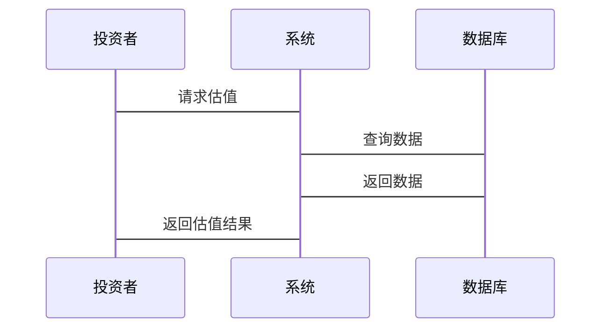

                 


# 美国股市估值:多角度评估方法

## 关键词:
- 美国股市
- 估值方法
- 基本面分析
- 技术分析
- DCF模型
- 市盈率
- 投资策略

## 摘要:
本文将从多个角度详细分析美国股市估值的方法，涵盖基本面分析、技术分析、行业分析等核心概念，并深入探讨估值模型的数学原理和实际应用。通过详细的步骤分析和实例演示，帮助读者全面理解如何准确评估美国股市的价值。

---

## 第1章: 美国股市估值的背景与重要性

### 1.1 美国股市的基本情况
#### 1.1.1 美国股市的定义与特点
美国股市是全球最大的股票市场之一，主要由纽约证券交易所（NYSE）和纳斯达克（NASDAQ）等交易所组成。其特点包括高流动性和多样性，涵盖科技、金融、能源等多个行业。

#### 1.1.2 美国股市在全球经济中的地位
作为全球经济的晴雨表，美国股市不仅影响国内经济，还对全球资本市场产生深远影响。其波动往往引发全球市场的连锁反应。

#### 1.1.3 投资者为何关注美国股市估值
准确的估值帮助投资者做出明智的投资决策，避免高估或低估带来的损失。尤其是在全球经济波动加剧的情况下，准确的估值显得尤为重要。

### 1.2 估值的重要性
#### 1.2.1 估值在投资决策中的作用
估值是投资决策的核心，帮助投资者判断股票是否被高估或低估，从而决定买入或卖出的时机。

#### 1.2.2 估值错误对投资的影响
估值错误可能导致重大损失，例如在高估时买入或低估时卖出，都会影响投资回报。

#### 1.2.3 多角度估值的必要性
单一估值方法存在局限性，多角度估值可以提高准确性，减少误判风险。

---

## 第2章: 美国股市估值的核心概念

### 2.1 核心概念与定义
#### 2.1.1 市盈率（P/E Ratio）
市盈率是股价与每股收益的比率，反映投资者对公司盈利能力的预期。

#### 2.1.2 市净率（P/B Ratio）
市净率是股价与每股净资产的比率，适用于评估资产密集型行业。

#### 2.1.3 市销率（P/S Ratio）
市销率是股价与每股销售收入的比率，适用于高增长或亏损企业。

#### 2.1.4 股息率（Dividend Yield）
股息率是股息与股价的比率，反映投资的收益能力。

#### 2.1.5 内在价值（Intrinsic Value）
内在价值是基于公司基本面计算的理论价值，是估值的基础。

### 2.2 核心概念之间的关系
#### 2.2.1 估值指标的对比分析
通过对比分析，了解不同指标的适用场景和局限性。

#### 2.2.2 估值指标的优缺点
市盈率适用于盈利稳定企业，市净率适用于资产密集行业，股息率适用于追求稳定收益的投资者。

#### 2.2.3 估值指标的适用场景
根据公司特点和市场环境选择合适的估值指标。

---

## 第3章: 多角度估值方法的原理与应用

### 3.1 基本分析法（Fundamental Analysis）
#### 3.1.1 基本分析法的定义
基本分析法通过分析公司的财务报表、行业地位和宏观经济环境来评估其内在价值。

#### 3.1.2 基本分析法的步骤
1. 收集财务数据
2. 分析盈利能力
3. 评估资产状况
4. 考虑行业风险
5. 结合宏观经济因素

#### 3.1.3 基本分析法的优缺点
优点：准确性高，考虑因素全面；缺点：计算复杂，需要大量数据。

### 3.2 技术分析法（Technical Analysis）
#### 3.2.1 技术分析法的定义
技术分析法通过研究历史价格和成交量来预测未来走势。

#### 3.2.2 技术分析法的主要工具
1. 移动平均线（MA）
2. 相对强弱指数（RSI）
3. 布林带（Bollinger Bands）
4. 技术图表模式

#### 3.2.3 技术分析法的优缺点
优点：快速识别趋势，适用于短期交易；缺点：忽视基本面因素，存在主观性。

### 3.3 行业分析法（Industry Analysis）
#### 3.3.1 行业分析法的定义
行业分析法通过分析行业整体状况和竞争格局来评估公司价值。

#### 3.3.2 行业分析法的步骤
1. 行业定位
2. 市场分析
3. 竞争分析
4. 行业财务指标分析

#### 3.3.3 行业分析法的优缺点
优点：考虑行业风险和机会；缺点：需要深入行业知识。

---

## 第4章: 估值模型与数学公式

### 4.1 现金流折现模型（DCF Model）
#### 4.1.1 DCF模型的定义
DCF模型通过将未来现金流折现到现值，评估公司的内在价值。

#### 4.1.2 DCF模型的公式
$$DCF = \frac{CF_1}{(1+r)^1} + \frac{CF_2}{(1+r)^2} + \cdots + \frac{CF_n}{(1+r)^n} + \frac{TV}{(1+r)^n}$$

#### 4.1.3 DCF模型的步骤
1. 预测未来现金流
2. 确定折现率
3. 计算现值
4. 比较与实际股价差异

#### 4.1.4 DCF模型的优缺点
优点：精确考虑现金流；缺点：预测难度大，依赖假设。

### 4.2 市盈率模型（P/E Model）
#### 4.2.1 市盈率模型的定义
市盈率模型通过比较市盈率与行业平均水平，评估股票价值。

#### 4.2.2 市盈率模型的公式
$$P/E = \frac{Price}{Earnings}$$

#### 4.2.3 市盈率模型的步骤
1. 计算市盈率
2. 比较行业水平
3. 分析差异原因

---

## 第5章: 系统分析与架构设计

### 5.1 系统功能设计
#### 5.1.1 领域模型
```mermaid
classDiagram
    class 股票 {
        名称：String
        股价：Float
        每股收益：Float
        资产：Float
        销售收入：Float
    }
    class 估值指标 {
        市盈率：Float
        市净率：Float
        市销率：Float
        股息率：Float
        内在价值：Float
    }
    class 投资者 {
        投资组合：List[股票]
        估值结果：List[估值指标]
    }
    stock -> valuationMetrics
    investor -> stock
    investor -> valuationMetrics
```

### 5.2 系统架构设计


### 5.3 系统交互设计


---

## 第6章: 项目实战

### 6.1 环境安装
- 安装Python和相关库（如numpy、pandas）

### 6.2 核心实现
```python
import numpy as np
import pandas as pd

def calculate_dcf(cash_flows, discount_rate, terminal_value):
    dcf = 0
    for i in range(len(cash_flows)):
        dcf += cash_flows[i] / (1 + discount_rate) ** i
    dcf += terminal_value / (1 + discount_rate) ** len(cash_flows)
    return dcf

# 示例数据
cash_flows = [100, 150, 200]
discount_rate = 0.08
terminal_value = 500

result = calculate_dcf(cash_flows, discount_rate, terminal_value)
print(f"DCF Value: {result}")
```

### 6.3 案例分析
以苹果公司为例，计算其DCF价值，并与实际股价对比，分析高估或低估情况。

---

## 第7章: 最佳实践与总结

### 7.1 小结
多角度评估方法能够提高估值的准确性，投资者应根据具体情况选择合适的方法。

### 7.2 注意事项
- 数据来源要可靠
- 模型假设要合理
- 结合市场环境分析

### 7.3 未来展望
随着人工智能的发展，自动化估值工具将更加普及，但人类的判断仍然不可或缺。

---

通过本文的详细分析，读者可以全面掌握美国股市估值的方法和技巧，为投资决策提供有力支持。

