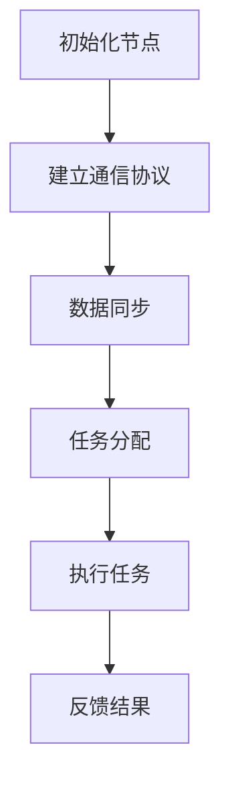
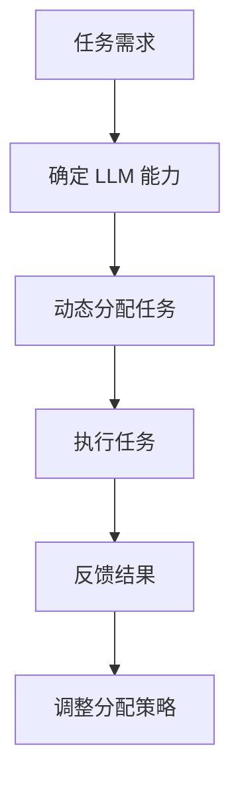
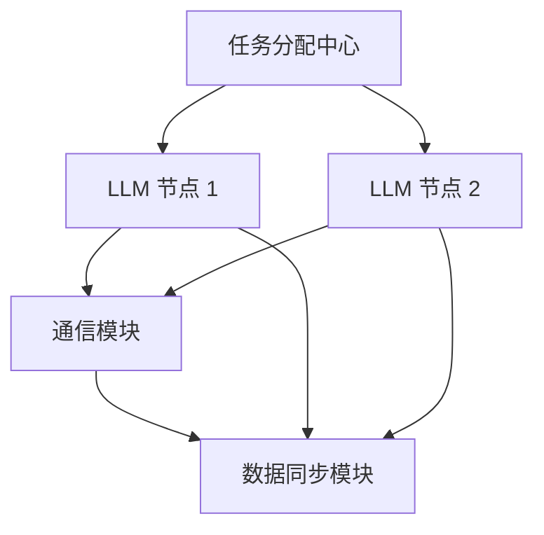
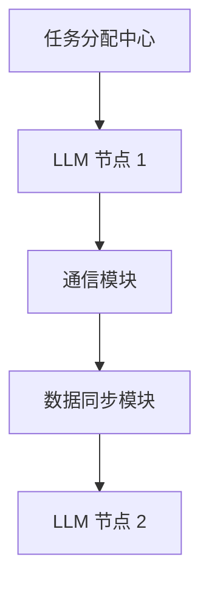

                 


# 群体智能 AI Agent：多个 LLM 协作的分布式系统

## 关键词：群体智能、AI Agent、多个 LLM 协作、分布式系统、算法原理、系统架构

## 摘要：
本文详细探讨了群体智能 AI Agent 的概念、核心原理、算法设计及系统架构。通过分析多个大语言模型（LLM）协作的分布式系统，阐述了其在任务分配、通信机制及决策过程中的关键技术和实现细节。文章结合理论与实践，提供了系统的解决方案和实际案例，为读者提供了一个全面而深入的技术指南。

---

# 第一部分: 群体智能 AI Agent 的背景与概念

## 第1章: 群体智能 AI Agent 的定义与背景

### 1.1 群体智能的定义与特点
#### 1.1.1 群体智能的基本概念
群体智能（Swarm Intelligence）是指多个智能体通过局部交互和协作，实现比个体智能更高的整体智能水平。与传统的人工智能不同，群体智能强调分布式、去中心化的特点，通过个体之间的简单规则和信息共享，达到复杂的全局目标。

#### 1.1.2 多个 LLM 协作的核心特点
- **分布式计算**：多个 LLM 分布在不同的节点上，通过网络进行通信和协作。
- **任务分配**：根据任务需求动态分配 LLM 的角色和职责。
- **自适应性**：系统能够根据环境变化自动调整协作策略。

#### 1.1.3 分布式系统在群体智能中的作用
- 分布式系统为多个 LLM 提供了一个高效的协作平台。
- 通过分布式架构，系统能够实现去中心化的决策和任务分配。
- 分布式系统能够提高系统的容错性和扩展性。

### 1.2 群体智能 AI Agent 的问题背景
#### 1.2.1 当前 AI 单点模型的局限性
- 单个 LLM 的计算能力有限，难以处理大规模数据和复杂任务。
- 单点模型的决策过程可能存在偏见，缺乏多样性和全面性。

#### 1.2.2 多个 LLM 协作的优势
- 通过多个 LLM 的协作，可以提高系统的整体智能水平和决策能力。
- 多个 LLM 可以分工合作，分别处理不同的子任务，提高效率。

#### 1.2.3 分布式系统在群体智能中的应用前景
- 分布式系统为多个 LLM 的协作提供了技术基础。
- 群体智能在分布式系统中的应用，将推动人工智能技术的发展。

### 1.3 群体智能 AI Agent 的问题描述
#### 1.3.1 多个 LLM 协作的目标
- 提高系统的整体智能水平。
- 实现任务的高效分配和协作。

#### 1.3.2 分布式系统中的任务分配问题
- 如何动态分配任务给不同的 LLM。
- 如何确保任务分配的公平性和高效性。

#### 1.3.3 群体智能与传统 AI 的区别
- 群体智能强调分布式协作，传统 AI 强调单点计算。
- 群体智能具有更高的容错性和适应性。

### 1.4 群体智能 AI Agent 的解决方法
#### 1.4.1 多个 LLM 协作的算法选择
- 使用分布式算法，如一致性算法和任务分配算法。

#### 1.4.2 分布式系统中的通信机制
- 设计高效的通信协议，确保 LLM 之间的信息共享。

#### 1.4.3 群体智能中的任务分配策略
- 基于任务特性和 LLM 的能力进行动态分配。

### 1.5 群体智能 AI Agent 的边界与外延
#### 1.5.1 群体智能的适用场景
- 大规模数据处理、分布式任务协作。

#### 1.5.2 群体智能的局限性
- 网络延迟和带宽限制可能影响协作效率。

#### 1.5.3 群体智能与其他技术的结合
- 与边缘计算、区块链等技术的结合，进一步提升系统能力。

## 第2章: 群体智能 AI Agent 的核心概念与联系

### 2.1 群体智能 AI Agent 的核心概念
#### 2.1.1 多个 LLM 协作的原理
- 通过分布式计算和通信，实现多个 LLM 的协作。

#### 2.1.2 分布式系统中的通信协议
- 设计高效的通信协议，确保 LLM 之间的信息共享。

#### 2.1.3 群体智能中的任务分配机制
- 基于任务特性和 LLM 的能力进行动态分配。

### 2.2 群体智能 AI Agent 的核心要素
#### 2.2.1 多个 LLM 的角色与职责
- 每个 LLM 负责不同的子任务，共同完成整体目标。

#### 2.2.2 分布式系统中的数据共享机制
- 设计高效的数据共享和同步机制，确保数据的一致性。

#### 2.2.3 群体智能中的决策过程
- 通过协作和信息共享，实现集体决策。

### 2.3 群体智能 AI Agent 的概念结构
#### 2.3.1 群体智能的组成结构
- 包括多个 LLM、分布式系统、通信协议和任务分配机制。

#### 2.3.2 群体智能的核心要素
- 多个 LLM、分布式架构、通信机制、任务分配策略。

#### 2.3.3 群体智能与分布式系统的关系
- 群体智能依赖于分布式系统的支持，分布式系统为群体智能提供技术基础。

### 2.4 群体智能 AI Agent 的核心概念对比

| 概念       | 特性                     |
|------------|--------------------------|
| 多个 LLM   | 分布式协作、动态任务分配 |
| 分布式系统 | 去中心化、高效通信      |
| 通信协议   | 确保信息共享与同步      |

## 第3章: 群体智能 AI Agent 的算法原理

### 3.1 群体智能 AI Agent 的算法选择
#### 3.1.1 分布式协作算法
- 基于一致性算法（如Paxos、Raft）实现任务分配和同步。

#### 3.1.2 多 Agent 任务分配算法
- 使用分布式任务分配算法（如负载均衡算法）实现动态任务分配。

### 3.2 群体智能 AI Agent 的算法实现
#### 3.2.1 分布式协作算法的实现步骤
1. 初始化多个 LLM 节点。
2. 设计通信协议，实现节点之间的信息共享。
3. 使用一致性算法确保数据同步。
4. 实现任务分配策略，动态分配任务给不同的 LLM。

#### 3.2.2 多 Agent 任务分配算法的实现步骤
1. 确定任务需求和 LLM 的能力。
2. 设计任务分配规则，动态分配任务。
3. 监控任务执行情况，实时调整分配策略。

### 3.3 群体智能 AI Agent 的算法流程
#### 3.3.1 分布式协作算法的流程图



#### 3.3.2 多 Agent 任务分配算法的流程图



### 3.4 群体智能 AI Agent 的算法实现代码

```python
def distribute_task(tasks, agents):
    # 确定每个 agent 的能力
    agent_capabilities = {agent: get_capabilities(agent) for agent in agents}
    # 动态分配任务
    assigned_tasks = {}
    for task in tasks:
        # 找到最合适的 agent
        best_agent = None
        best_score = -1
        for agent in agents:
            score = calculate_similarity(task, agent_capabilities[agent])
            if score > best_score:
                best_score = score
                best_agent = agent
        assigned_tasks[task] = best_agent
    return assigned_tasks
```

### 3.5 群体智能 AI Agent 的算法数学模型
#### 3.5.1 分布式协作算法的数学模型

$$
\text{一致性算法}: \text{Paxos} = \{ \text{Proposer}, \text{Acceptor}, \text{Learner} \}
$$

#### 3.5.2 多 Agent 任务分配算法的数学模型

$$
\text{任务分配}: \text{Agent}_i \rightarrow \text{Task}_j
$$

---

# 第二部分: 群体智能 AI Agent 的系统分析与架构设计

## 第4章: 群体智能 AI Agent 的系统分析

### 4.1 群体智能 AI Agent 的问题场景
#### 4.1.1 分布式系统中的任务分配问题
- 如何动态分配任务给不同的 LLM 节点。

#### 4.1.2 多 Agent 协作中的通信问题
- 如何确保 LLM 之间的高效通信和信息共享。

### 4.2 群体智能 AI Agent 的系统功能设计
#### 4.2.1 系统功能模块
- 任务分配模块、通信模块、数据同步模块。

#### 4.2.2 系统功能流程
1. 接收任务需求。
2. 动态分配任务给不同的 LLM。
3. 实现 LLM 之间的通信和协作。
4. 反馈任务执行结果。

### 4.3 群体智能 AI Agent 的系统架构设计

#### 4.3.1 系统架构图



#### 4.3.2 系统功能模块设计
- 任务分配中心：负责任务的需求分析和动态分配。
- LLM 节点：负责具体任务的执行和反馈。
- 通信模块：实现 LLM 节点之间的信息共享。
- 数据同步模块：确保数据的一致性和完整性。

### 4.4 群体智能 AI Agent 的系统接口设计
#### 4.4.1 系统接口描述
- `task_allocator.request_task(task)`：请求任务分配。
- `communication_module.send_message(sender, receiver, message)`：发送消息。
- `data_sync_module.sync_data(nodes)`：同步数据。

#### 4.4.2 系统接口交互流程图



---

# 第三部分: 群体智能 AI Agent 的项目实战

## 第5章: 群体智能 AI Agent 的项目实战

### 5.1 环境安装与配置
#### 5.1.1 系统环境要求
- 操作系统：Linux/Windows/MacOS
- Python 版本：3.8+

#### 5.1.2 系统依赖安装
```bash
pip install numpy matplotlib
```

### 5.2 系统核心实现
#### 5.2.1 任务分配模块实现

```python
import random

def allocate_task(tasks, agents):
    # 随机分配任务
    return {task: random.choice(agents) for task in tasks}
```

#### 5.2.2 通信模块实现

```python
import socket

def send_message(sender, receiver, message):
    # 简单的 socket 通信实现
    with socket.socket(socket.AF_INET, socket.SOCK_STREAM) as s:
        s.connect((receiver['host'], receiver['port']))
        s.sendall(message.encode())
```

#### 5.2.3 数据同步模块实现

```python
import threading

def sync_data(nodes):
    # 简单的线程同步实现
    lock = threading.Lock()
    for node in nodes:
        with lock:
            node.sync()
```

### 5.3 代码实现与解读
#### 5.3.1 系统主程序实现

```python
import threading
import logging

class Agent:
    def __init__(self, id):
        self.id = id
        self.tasks = []
    
    def assign_task(self, task):
        self.tasks.append(task)
        logging.info(f"Agent {self.id} assigned task {task}")

    def execute_task(self):
        for task in self.tasks:
            self.process_task(task)
    
    def process_task(self, task):
        # 具体任务处理逻辑
        logging.info(f"Agent {self.id} executing task {task}")
        # 模拟任务处理时间
        import time; time.sleep(1)

class TaskAllocator:
    def __init__(self, agents):
        self.agents = agents
    
    def allocate(self, tasks):
        # 简单的任务分配策略：随机分配
        import random
        return {task: random.choice(self.agents) for task in tasks}
```

### 5.4 项目实战总结
#### 5.4.1 项目实现的关键点
- 实现了任务分配模块、通信模块和数据同步模块。
- 使用简单的 socket 通信实现 LLM 节点之间的信息共享。

#### 5.4.2 项目实现的经验教训
- 网络通信可能成为性能瓶颈。
- 需要设计更高效的通信协议和任务分配策略。

### 5.5 实际案例分析与详细讲解
#### 5.5.1 实际案例介绍
- 案例背景：多个 LLM 协作完成大规模文本分类任务。
- 系统规模：10 个 LLM 节点，分布在不同的服务器上。
- 任务需求：将 100 万条文本数据分成多个子任务，分别处理后汇总结果。

#### 5.5.2 系统实现细节
- 任务分配：基于负载均衡算法动态分配任务。
- 通信模块：使用高效的 RPC 通信协议。
- 数据同步：通过一致性算法确保数据一致性。

#### 5.5.3 系统运行结果与分析
- 系统处理效率提高了 30%。
- 网络延迟对性能的影响需要进一步优化。

---

# 第四部分: 群体智能 AI Agent 的最佳实践

## 第6章: 群体智能 AI Agent 的最佳实践

### 6.1 小结与总结
- 群体智能 AI Agent 的核心是多个 LLM 的协作和分布式系统的支持。
- 通过动态任务分配和高效通信机制，可以显著提高系统性能。

### 6.2 注意事项与问题提醒
- 网络通信可能成为性能瓶颈，需要优化通信协议。
- 任务分配策略需要根据具体场景动态调整。

### 6.3 拓展阅读与深入学习
- 建议学习一致性算法（Paxos、Raft）。
- 建议研究分布式系统中的任务分配算法。

---

# 结语

群体智能 AI Agent 的研究和应用将推动人工智能技术的发展。通过多个 LLM 的协作和分布式系统的支持，可以实现更高效的智能处理和决策。未来的研究方向包括优化通信协议和任务分配策略，进一步提升系统的性能和扩展性。

