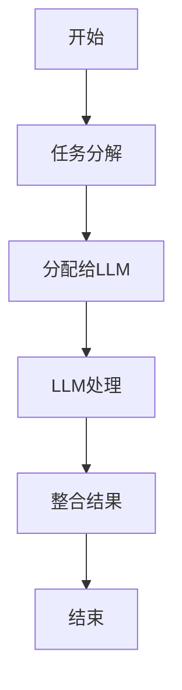
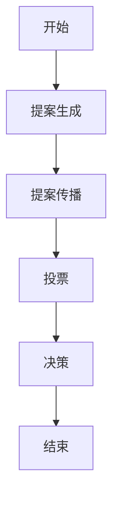
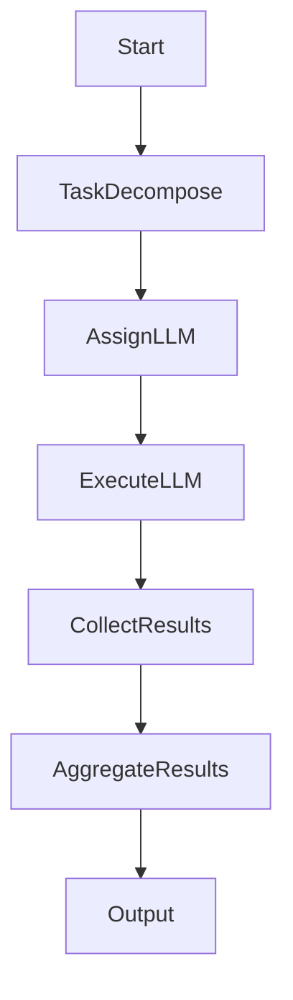

                 


# 群体智能AI Agent：多个LLM协作的分布式系统

---

## 关键词  
- 群体智能  
- AI Agent  
- 分布式系统  
- 大型语言模型（LLM）  
- 多智能体协作  
- 分布式推理  

---

## 摘要  
本文探讨了群体智能AI Agent在多个大型语言模型（LLM）协作中的应用，分析了其在分布式系统中的实现与挑战。通过背景介绍、核心概念解析、算法原理、系统架构设计、项目实战和总结展望，全面阐述了多个LLM协作的理论与实践，为读者提供了从基础到应用的深度解析。

---

## 第一部分：群体智能与AI Agent概述

### 第1章：群体智能与AI Agent的背景与概念

#### 1.1 群体智能的基本概念

##### 1.1.1 群体智能的定义与特点
群体智能（Swarm Intelligence）是分布式计算领域的重要概念，指通过多个智能体（Agent）的协作，实现超越单个智能体能力的集体智慧。其特点包括：
- **去中心化**：无单一控制中心，各智能体自主决策。
- **自组织**：智能体通过局部交互实现全局目标。
- **涌现性**：全局行为由局部规则驱动，产生新的复杂现象。

##### 1.1.2 AI Agent的基本概念与类型
AI Agent（智能体）是能够感知环境并采取行动以实现目标的实体。常见的类型包括：
- **简单反射Agent**：基于当前输入做出反应，无状态记忆。
- **基于模型的反射Agent**：利用内部模型进行决策。
- **目标驱动Agent**：根据目标选择最优行动。
- **效用驱动Agent**：通过最大化效用函数实现目标。

##### 1.1.3 多个LLM协作的意义与优势
多个LLM协作可以实现更复杂的任务，优势包括：
- **知识互补**：不同LLM擅长不同领域，协作可提升整体能力。
- **计算能力增强**：分布式计算提高处理效率。
- **容错性**：多个LLM协作可避免单点故障。

---

#### 1.2 多个LLM协作的背景与问题背景

##### 1.2.1 当前AI发展的挑战与机遇
随着AI技术的发展，单个LLM的能力已接近瓶颈，通过协作实现更复杂任务成为必然趋势。分布式系统的兴起为多个LLM协作提供了技术基础。

##### 1.2.2 多个LLM协作的必要性与应用场景
多个LLM协作适用于：
- **复杂问题求解**：如多语言翻译、跨领域推理。
- **分布式任务处理**：如大规模数据处理、实时协作。

##### 1.2.3 分布式系统中的协作问题
- **通信开销**：过多通信可能导致性能下降。
- **一致性问题**：多个LLM协作需保持数据一致。
- **故障容错**：需设计容错机制以应对部分节点故障。

---

#### 1.3 问题描述与解决方案

##### 1.3.1 分布式系统中的协作问题
多个LLM协作需解决：
- **任务分配**：如何高效分配任务给不同的LLM。
- **结果整合**：如何整合多个LLM的输出结果。
- **协作效率**：如何优化协作过程以提升效率。

##### 1.3.2 多个LLM协作的解决方案
- **任务分配算法**：基于LLM的能力分配任务。
- **结果整合方法**：通过投票、加权等方式整合结果。
- **协作机制设计**：设计高效的通信和协作流程。

##### 1.3.3 群体智能在AI Agent中的应用
群体智能为多个LLM协作提供了理论基础和算法支持，通过模仿自然群体行为实现高效的协作。

---

#### 1.4 边界与外延

##### 1.4.1 群体智能的边界
群体智能的应用范围包括：
- **分布式计算**：如多核处理器任务分配。
- **网络优化**：如路由选择、流量控制。

##### 1.4.2 多个LLM协作的外延
- **边缘计算**：在边缘设备上部署多个LLM协作。
- **云原生架构**：利用容器化技术实现多个LLM协作。

---

## 第二部分：核心概念与联系

### 第2章：核心概念与联系

#### 2.1 核心概念的原理

##### 2.1.1 分布式系统中的协作原理
分布式系统中的协作基于通信、一致性、可用性三原则（CAP原则）。

##### 2.1.2 多个LLM协作的机制
- **通信机制**：通过消息传递进行协作。
- **共识机制**：通过共识算法达成一致。

##### 2.1.3 群体智能的算法基础
包括粒子群优化（PSO）、蚂蚁算法等。

#### 2.2 核心概念的特征对比

##### 2.2.1 群体智能与分布式系统对比
| 特性 | 群体智能 | 分布式系统 |
|------|----------|------------|
| 结构 | 去中心化 | 去中心化或中心化 |
| 行为 | 涌现性 | 显式规则驱动 |

#### 2.3 核心概念的ER实体关系图

```mermaid
er
  %%{init: {'theme': 'neutral'}}
  title 实体关系图
  rectangle 实体 {
    实体1
    实体2
    ...
  }
  rectangle 属性 {
    属性1
    属性2
    ...
  }
  rectangle 关系 {
    关系1
    关系2
    ...
  }
```

---

## 第三部分：算法原理讲解

### 第3章：算法原理与实现

#### 3.1 分布式推理算法

##### 3.1.1 分布式推理算法的原理
将推理任务分解为多个子任务，分别由不同的LLM处理，最后整合结果。

##### 3.1.2 分布式推理算法的实现步骤



##### 3.1.3 分布式推理算法的Python实现示例

```python
def distribute_reasoning(tasks):
    # 分解任务
    decomposed_tasks = decompose(tasks)
    # 分配任务
    assigned_tasks = assign(decomposed_tasks)
    # 并行处理
    results = parallel_execute(assigned_tasks)
    # 整合结果
    final_result = aggregate(results)
    return final_result
```

##### 3.1.4 分布式推理算法的数学模型

$$ \text{输出} = \sum_{i=1}^{n} (\text{LLM}_i(\text{输入}_i)) $$

---

#### 3.2 共识机制算法

##### 3.2.1 共识机制的原理
通过共识算法（如RAFT、PAXOS）确保多个LLM达成一致。

##### 3.2.2 共识机制的实现步骤



##### 3.2.3 共识机制的Python实现示例

```python
def consensus(proposals):
    # 提案传播
    for p in proposals:
        propagate(p)
    # 收集投票
    votes = collect_votes(proposals)
    # 决策
    decision = decide(votes)
    return decision
```

---

## 第四部分：系统分析与架构设计方案

### 第4章：系统分析与架构设计方案

#### 4.1 系统功能设计

##### 4.1.1 功能模块划分
- **任务管理模块**：分解任务并分配给不同的LLM。
- **通信模块**：负责LLM之间的通信。
- **结果整合模块**：整合多个LLM的输出结果。

##### 4.1.2 功能流程设计



---

## 第五部分：项目实战

### 第5章：项目实战

#### 5.1 项目环境安装与配置

##### 5.1.1 环境安装
安装必要的库，如`transformers`、`pytorch`等。

##### 5.1.2 配置分布式环境
配置网络通信和分布式计算框架（如MPI、Dask）。

---

#### 5.2 核心功能实现

##### 5.2.1 任务分解与分配
编写代码将任务分解并分配给不同的LLM。

##### 5.2.2 并行计算与结果整合
实现并行计算，并整合多个LLM的结果。

---

## 第六部分：总结与展望

### 第6章：总结与展望

#### 6.1 全文总结
总结全文内容，强调多个LLM协作的重要性和实现方法。

#### 6.2 展望与未来工作
提出未来的研究方向和改进空间。

#### 6.3 最佳实践 tips
- **性能优化**：合理分配任务，减少通信开销。
- **安全性**：确保通信安全，防止数据泄露。
- **可扩展性**：设计可扩展的架构，支持更多LLM协作。

---

## 参考文献  
[在此处列出参考文献]

---

通过以上目录结构和内容安排，您可以根据实际需求逐步展开各个部分的详细内容。每一步都从背景到实现，从理论到实践，层层深入，确保文章的完整性和逻辑性。

