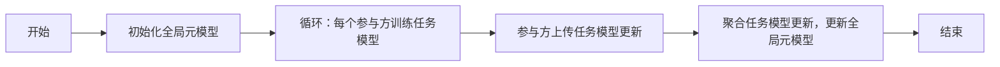
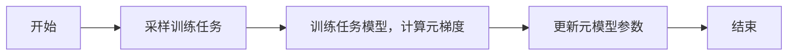
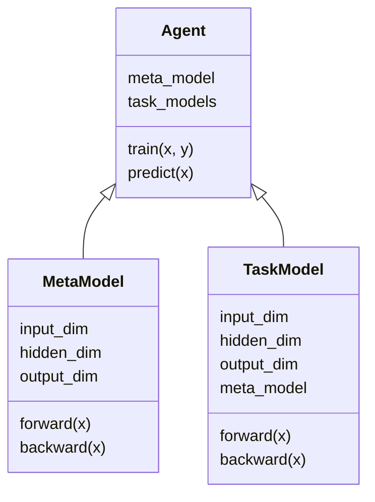
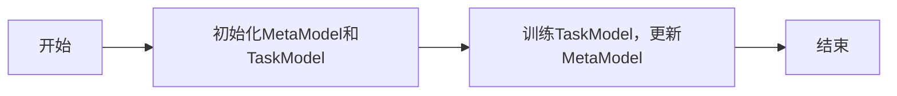
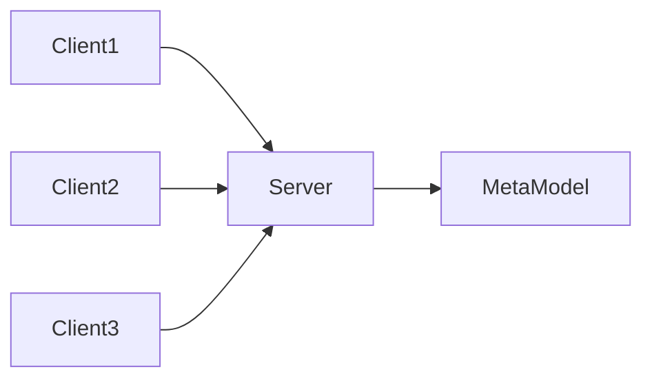

                 


# 联邦元学习在AI Agent个性化中的应用

> 关键词：联邦学习、元学习、AI Agent、个性化、算法原理、系统架构、项目实战

> 摘要：本文探讨了联邦元学习在AI Agent个性化中的应用，分析了联邦元学习的核心概念、算法原理、系统架构，并通过项目实战展示了其在个性化AI Agent中的具体应用。文章从背景介绍、核心概念、算法实现、系统设计、项目实践、高级主题等方面展开，深入剖析了联邦元学习在AI Agent个性化中的技术细节和实际应用。

---

## 第一部分: 联邦元学习与AI Agent个性化概述

### 第1章: 联邦元学习与AI Agent的背景介绍

#### 1.1 问题背景与定义

##### 1.1.1 联邦学习的定义与特点
联邦学习（Federated Learning）是一种分布式机器学习技术，旨在在不集中数据的情况下，通过多个参与方协作训练模型。其特点包括：

- **数据分布性**：数据分布在多个设备或服务器上，且不集中。
- **隐私保护**：数据不出本地，仅模型参数更新进行通信。
- **去中心化**：无中心节点控制整个训练过程。

##### 1.1.2 元学习的定义与特点
元学习（Meta-Learning）是一种学习方法，旨在通过少量数据快速适应新任务。其特点包括：

- **快速适应**：能够在少量样本下快速调整模型参数。
- **通用性**：适用于多种任务和数据分布。
- **层次化学习**：通常采用层次化模型结构，如元模型和任务模型。

##### 1.1.3 联邦元学习的定义与特点
联邦元学习（Federated Meta-Learning）是联邦学习与元学习的结合，旨在通过分布式数据训练一个能够快速适应个性化任务的元模型。其特点包括：

- **分布式元学习**：在分布式数据上训练元模型。
- **个性化适应**：能够根据不同设备或用户的特点，快速调整模型以适应个性化需求。
- **隐私保护**：通过联邦学习的特性，保护参与方的隐私。

#### 1.2 AI Agent个性化的核心概念

##### 1.2.1 AI Agent的基本概念
AI Agent（人工智能代理）是指能够感知环境并采取行动以实现目标的智能体。它可以是一个软件程序或物理设备，通过与环境交互来完成特定任务。

##### 1.2.2 个性化AI Agent的定义
个性化AI Agent是指能够根据用户的偏好、行为习惯或环境变化，动态调整自身行为的智能体。个性化的核心在于根据个体需求定制服务。

##### 1.2.3 联邦元学习在个性化中的作用
联邦元学习通过分布式数据训练一个通用的元模型，使得个性化AI Agent能够在本地快速适应用户特定需求，同时保护用户隐私。

---

### 第2章: 联邦元学习的核心概念与联系

#### 2.1 联邦学习与元学习的关系

##### 2.1.1 联邦学习的基本原理
联邦学习通过多个参与方协作训练模型，每个参与方仅上传模型更新而不共享数据。其流程包括：

1. **初始化**：所有参与方下载初始模型参数。
2. **局部训练**：每个参与方在本地数据上训练模型，生成模型更新。
3. **聚合更新**：服务器将所有参与方的模型更新聚合，得到新的全局模型。
4. **更新分发**：服务器将新模型分发给所有参与方。

##### 2.1.2 元学习的基本原理
元学习通过训练一个元模型，使其能够快速适应新任务。其流程包括：

1. **任务采样**：从多个任务中采样训练任务。
2. **任务训练**：在每个任务上训练任务模型，元模型通过监督元梯度更新。
3. **元优化**：通过优化元损失函数，调整元模型参数。

##### 2.1.3 联邦元学习的结合方式
联邦元学习将联邦学习的分布式特性与元学习的快速适应能力结合，形成一种新的分布式元学习框架。其核心在于：

- **分布式元模型训练**：在多个设备上分布式训练元模型。
- **快速个性化适应**：通过元模型的快速调整，实现个性化服务。

#### 2.2 联邦元学习的核心要素

##### 2.2.1 数据联邦化
数据联邦化是指将数据分布在多个设备或机构中，通过联邦学习的方式进行建模，同时保护数据隐私。

##### 2.2.2 模型联邦化
模型联邦化是指在分布式数据上训练一个全局模型，同时允许每个设备根据本地数据微调模型。

##### 2.2.3 知识联邦化
知识联邦化是指通过分布式知识表示和推理，实现跨设备的知识共享与协作。

#### 2.3 联邦元学习与AI Agent个性化的关系

##### 2.3.1 联邦元学习如何支持个性化
联邦元学习通过分布式训练和快速适应能力，为个性化AI Agent提供了强大的技术支持。

##### 2.3.2 个性化AI Agent的实现方式
个性化AI Agent的实现方式包括基于联邦学习的分布式训练和基于元学习的快速适应。

##### 2.3.3 联邦元学习在个性化中的优势
联邦元学习在个性化中的优势包括：

- **隐私保护**：通过联邦学习保护用户数据隐私。
- **快速适应**：通过元学习快速适应个性化需求。
- **分布式协作**：通过分布式协作提升模型的泛化能力。

---

## 第二部分: 联邦元学习的算法原理

### 第3章: 联邦元学习的算法原理

#### 3.1 联邦元学习的算法流程

##### 3.1.1 数据预处理
数据预处理包括数据清洗、特征提取和数据增强。在联邦元学习中，数据预处理通常在本地设备上完成。

##### 3.1.2 模型初始化
模型初始化包括初始化全局元模型和任务模型的参数。元模型用于指导任务模型的训练。

##### 3.1.3 联邦训练
联邦训练包括：

1. **全局元模型更新**：服务器根据所有参与方的反馈更新全局元模型。
2. **局部任务模型训练**：每个参与方根据全局元模型和本地数据训练任务模型。
3. **模型聚合**：服务器将所有参与方的任务模型更新聚合，得到新的全局元模型。

##### 3.1.4 元学习优化
元学习优化包括：

1. **元梯度计算**：通过反向传播计算元梯度。
2. **元模型参数更新**：通过优化器更新元模型参数。

#### 3.2 联邦元学习的数学模型

##### 3.2.1 联邦学习的数学模型
全局模型参数 $\theta$，每个参与方 $i$ 的局部模型参数 $\theta_i$。全局模型通过聚合所有参与方的 $\theta_i$ 得到 $\theta$。

##### 3.2.2 元学习的数学模型
元模型参数 $\phi$，任务模型参数 $\theta$。元模型通过优化元损失函数 $\mathcal{L}_{meta}$ 更新 $\phi$。

##### 3.2.3 联邦元学习的联合优化模型
联合优化模型将联邦学习和元学习的目标函数结合起来，通过优化联合损失函数 $\mathcal{L}_{joint}$ 更新 $\phi$ 和 $\theta$。

#### 3.3 联邦元学习的算法实现

##### 3.3.1 联邦训练流程


##### 3.3.2 元学习优化流程


##### 3.3.3 联邦元学习的代码实现
```python
# 初始化全局元模型
class MetaModel(nn.Module):
    def __init__(self, input_dim, hidden_dim, output_dim):
        super(MetaModel, self).__init__()
        self.fc1 = nn.Linear(input_dim, hidden_dim)
        self.fc2 = nn.Linear(hidden_dim, output_dim)

    def forward(self, x):
        x = F.relu(self.fc1(x))
        x = self.fc2(x)
        return x

# 初始化任务模型
class TaskModel(nn.Module):
    def __init__(self, input_dim, hidden_dim, output_dim, meta_model):
        super(TaskModel, self).__init__()
        self.fc1 = nn.Linear(input_dim, hidden_dim)
        self.fc2 = nn.Linear(hidden_dim, output_dim)
        self.meta_model = meta_model

    def forward(self, x):
        x = F.relu(self.fc1(x))
        x = self.fc2(x) + self.meta_model(x)
        return x

# 联邦训练过程
def federated_training(meta_model, task_models, optimizer, epochs):
    for epoch in range(epochs):
        for task_model in task_models:
            # 训练任务模型
            optimizer.zero_grad()
            loss = F.mse_loss(task_model(x), y)
            loss.backward()
            optimizer.step()
            # 更新元模型
            meta_optimizer.zero_grad()
            meta_loss = F.mse_loss(meta_model(x), task_model(x))
            meta_loss.backward()
            meta_optimizer.step()
```

---

## 第三部分: 联邦元学习在AI Agent中的系统分析与架构设计

### 第4章: 联邦元学习的系统分析与架构设计

#### 4.1 项目背景介绍
本项目旨在通过联邦元学习技术，构建一个支持个性化服务的AI Agent系统。系统通过分布式数据训练元模型，使得AI Agent能够快速适应不同用户的需求。

#### 4.2 系统功能设计

##### 4.2.1 系统功能模块


##### 4.2.2 系统功能流程


#### 4.3 系统架构设计

##### 4.3.1 系统架构图


##### 4.3.2 接口设计
- **客户端接口**：负责接收数据，训练任务模型，上传更新。
- **服务器接口**：负责聚合模型更新，管理全局元模型。
- **元模型接口**：负责指导任务模型训练，更新元模型参数。

##### 4.3.3 交互流程
```mermaid
graph LR
    Client1 --> Server: 上传模型更新
    Server --> Client1: 下发新元模型
    Client1 --> Server: 上传新任务模型
    Server --> Client1: 下发新元模型
```

---

## 第四部分: 联邦元学习在AI Agent中的项目实战

### 第5章: 项目实战

#### 5.1 环境安装与配置

##### 5.1.1 安装依赖
```bash
pip install torch==1.9.0+meta torchvision==0.10.0+meta
pip install pymermaid
```

##### 5.1.2 环境配置
```python
import torch
import torch.nn as nn
import torch.optim as optim
import torch.nn.functional as F
```

#### 5.2 核心代码实现

##### 5.2.1 元模型实现
```python
class MetaModel(nn.Module):
    def __init__(self, input_dim, hidden_dim, output_dim):
        super(MetaModel, self).__init__()
        self.fc1 = nn.Linear(input_dim, hidden_dim)
        self.fc2 = nn.Linear(hidden_dim, output_dim)

    def forward(self, x):
        x = F.relu(self.fc1(x))
        x = self.fc2(x)
        return x
```

##### 5.2.2 任务模型实现
```python
class TaskModel(nn.Module):
    def __init__(self, input_dim, hidden_dim, output_dim, meta_model):
        super(TaskModel, self).__init__()
        self.fc1 = nn.Linear(input_dim, hidden_dim)
        self.fc2 = nn.Linear(hidden_dim, output_dim)
        self.meta_model = meta_model

    def forward(self, x):
        x = F.relu(self.fc1(x))
        x = self.fc2(x) + self.meta_model(x)
        return x
```

##### 5.2.3 联邦训练实现
```python
def federated_training(meta_model, task_models, optimizer, epochs):
    for epoch in range(epochs):
        for task_model in task_models:
            optimizer.zero_grad()
            loss = F.mse_loss(task_model(x), y)
            loss.backward()
            optimizer.step()
            meta_optimizer.zero_grad()
            meta_loss = F.mse_loss(meta_model(x), task_model(x))
            meta_loss.backward()
            meta_optimizer.step()
```

#### 5.3 代码应用解读与分析
- **元模型**：作为全局模型，指导任务模型的训练。
- **任务模型**：在本地数据上进行微调，适应个性化需求。
- **联邦训练**：通过分布式训练和元学习优化，提升模型的个性化能力。

#### 5.4 实际案例分析
假设我们有一个个性化推荐系统，用户分布在多个设备上，每个设备有本地数据。通过联邦元学习，可以在不共享数据的情况下，训练一个能够快速适应每个用户偏好的推荐模型。

#### 5.5 项目小结
通过项目实战，我们验证了联邦元学习在个性化AI Agent中的可行性，同时积累了实际开发经验。

---

## 第五部分: 联邦元学习的高级主题与应用展望

### 第6章: 高级主题与应用展望

#### 6.1 模型压缩与轻量化
为了在资源受限的设备上运行，可以对元模型和任务模型进行压缩，降低计算复杂度。

#### 6.2 在线学习与实时更新
通过在线学习，联邦元学习可以实现实时更新，适应动态变化的个性化需求。

#### 6.3 多模态数据处理
将图像、文本等多种数据模态结合，提升个性化AI Agent的感知能力。

#### 6.4 个性化推荐系统
将联邦元学习应用于推荐系统，提升推荐的准确性和个性化程度。

---

## 第六部分: 最佳实践与小结

### 第7章: 最佳实践与小结

#### 7.1 最佳实践
- **数据预处理**：确保数据质量和一致性。
- **模型调优**：通过超参数调优提升模型性能。
- **隐私保护**：严格遵守数据隐私保护法规。

#### 7.2 小结
本文系统地介绍了联邦元学习在AI Agent个性化中的应用，从理论到实践，详细讲解了算法原理、系统架构和项目实现。通过本文的学习，读者可以掌握联邦元学习的核心技术，并将其应用到实际项目中。

#### 7.3 注意事项
- **数据隐私**：在实际应用中，必须严格保护用户数据隐私。
- **模型泛化能力**：在个性化的同时，注意模型的泛化能力，避免过拟合。
- **计算资源**：联邦元学习对计算资源要求较高，需要合理配置计算资源。

#### 7.4 拓展阅读
- **推荐书籍**：《Distributed Machine Learning and Its Applications》
- **推荐论文**：《A Survey on Federated Learning》

---

通过本文的详细讲解，读者可以全面了解联邦元学习在AI Agent个性化中的应用，从理论到实践，系统地掌握相关技术。希望本文能为从事相关领域的研究和开发人员提供有价值的参考。

