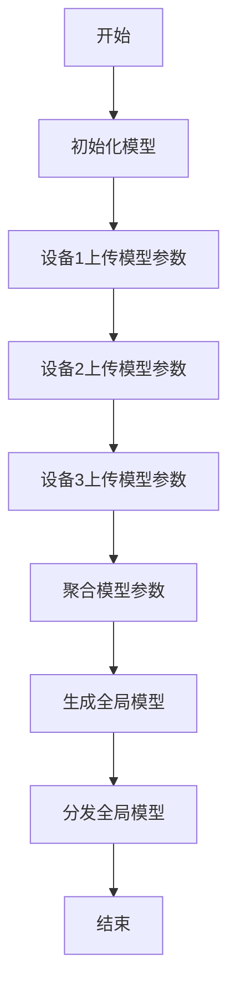
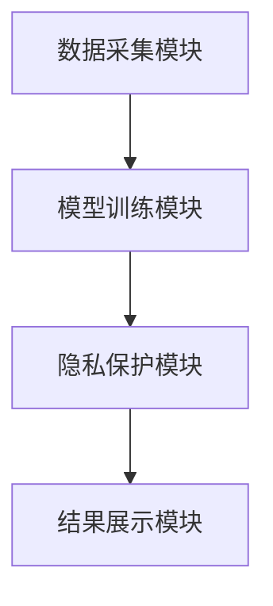
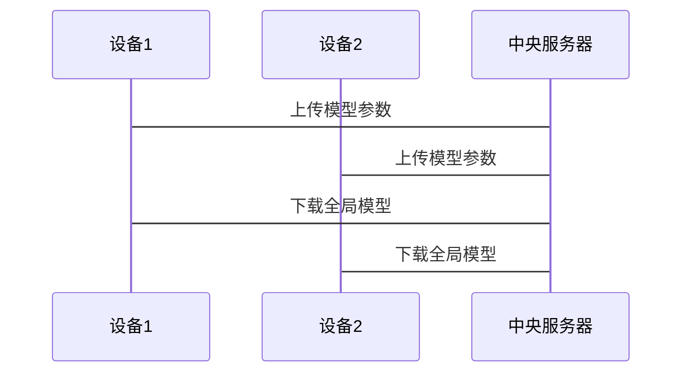

                 


# 联邦学习在AI Agent隐私保护中的高级应用

---

> **关键词**：联邦学习，AI Agent，隐私保护，分布式计算，数据安全，边缘计算

---

> **摘要**：  
本文深入探讨了联邦学习在AI Agent隐私保护中的高级应用。首先，文章介绍了联邦学习和AI Agent的基本概念及其在隐私保护中的重要性。接着，详细分析了联邦学习的核心机制和隐私保护技术，包括同态加密和差分隐私等。随后，从算法原理、系统架构设计、项目实战等多个方面，系统性地阐述了联邦学习在AI Agent中的具体实现和应用场景。最后，文章展望了联邦学习在AI Agent隐私保护中的未来发展趋势，为相关研究和实践提供了参考。

---

# 目录

1. [背景介绍](#背景介绍)  
   1.1 联邦学习的基本概念  
   1.2 AI Agent的基本概念  
   1.3 联邦学习在AI Agent中的应用背景  
   1.4 本章小结  

2. [核心概念与原理](#核心概念与原理)  
   2.1 联邦学习的核心机制  
   2.2 AI Agent的隐私保护需求  
   2.3 联邦学习的计算模型  
   2.4 本章小结  

3. [算法原理](#算法原理)  
   3.1 联邦学习的通信机制  
   3.2 联邦学习的隐私保护算法  
   3.3 算法实现与案例分析  
   3.4 本章小结  

4. [系统分析与架构设计](#系统分析与架构设计)  
   4.1 项目背景与目标  
   4.2 系统功能设计  
   4.3 系统架构设计  
   4.4 系统接口与交互流程  
   4.5 本章小结  

5. [项目实战](#项目实战)  
   5.1 环境搭建与依赖安装  
   5.2 核心代码实现  
   5.3 算法实现与效果分析  
   5.4 项目总结  

6. [高级应用与未来趋势](#高级应用与未来趋势)  
   6.1 联邦学习在AI Agent中的高级应用  
   6.2 未来研究方向  
   6.3 本章小结  

---

# 正文

## 1. 背景介绍

### 1.1 联邦学习的基本概念

**联邦学习（Federated Learning）**是一种分布式机器学习技术，旨在在不集中用户数据的前提下，通过多个边缘设备或服务器协作训练模型。其核心思想是将数据保留在原始设备上，仅在需要时进行模型参数同步，从而保护数据隐私。

#### 核心特点：
- **数据隐私**：数据不离开原始设备，仅传输模型参数。
- **分布式计算**：多个设备或服务器协作训练模型。
- **模型统一性**：通过模型聚合算法，得到一个统一的全局模型。

### 1.2 AI Agent的基本概念

**AI Agent（人工智能代理）**是指能够感知环境、执行任务并做出决策的智能实体。它可以是一个软件程序、机器人或其他智能系统，具备以下核心功能：
- **感知环境**：通过传感器或API获取外部信息。
- **决策与推理**：基于获取的信息做出最优决策。
- **执行任务**：根据决策执行具体操作。

### 1.3 联邦学习在AI Agent中的应用背景

随着AI Agent的广泛应用，数据隐私问题日益突出。联邦学习为AI Agent提供了一种在不集中数据的情况下进行模型训练的解决方案，特别适用于以下场景：
- **智能设备**：如智能家居、可穿戴设备等。
- **边缘计算**：在靠近数据源的边缘设备上进行计算和存储。
- **分布式系统**：多个AI Agent协同工作，共同完成复杂任务。

---

## 2. 核心概念与原理

### 2.1 联邦学习的核心机制

#### 2.1.1 通信机制
联邦学习中的通信机制主要包括以下步骤：
1. **模型初始化**：每个设备或服务器初始化一个本地模型。
2. **模型同步**：设备将本地模型参数上传到中央服务器或与其他设备同步。
3. **模型聚合**：中央服务器对所有设备上传的模型参数进行聚合，生成新的全局模型。
4. **模型分发**：将更新后的全局模型分发回各个设备。

#### 2.1.2 隐私保护机制
为了保护数据隐私，联邦学习采用了多种隐私保护技术，包括：
- **同态加密**：允许在加密数据上进行计算，结果解密后与原始计算结果一致。
- **差分隐私**：通过在数据中添加噪声，确保个体数据无法被推断。
- **联邦认证**：确保参与联邦学习的设备或服务器身份合法。

#### 2.1.3 计算模型
联邦学习的计算模型主要分为以下几种：
- **横向联邦学习**：适用于样本不重叠的场景，每个设备有独特的数据样本。
- **纵向联邦学习**：适用于特征重叠的场景，多个设备共享相同的特征空间。
- **混合联邦学习**：结合横向和纵向联邦学习的特点，适用于复杂场景。

---

## 3. 算法原理

### 3.1 联邦学习的通信机制

#### 3.1.1 数据传输方式
- **加密传输**：通过加密技术确保数据在传输过程中的安全性。
- **分片传输**：将数据分成多个片，分别传输并进行聚合。

#### 3.1.2 模型同步方式
- **同步联邦学习**：所有设备同时进行模型更新，确保模型一致性。
- **异步联邦学习**：设备在不同时间进行模型更新，适用于网络条件较差的场景。

#### 3.1.3 通信协议
- **HTTP/HTTPS**：常用的Web通信协议。
- **gRPC**：高性能的RPC通信协议，适合分布式系统。

### 3.2 联邦学习的隐私保护算法

#### 3.2.1 同态加密
**同态加密**允许在加密数据上进行计算，结果与直接计算相同。例如，使用Paillier加密算法进行加法运算。

$$
\text{加密数据} \rightarrow \text{计算} \rightarrow \text{解密数据} = \text{原始计算结果}
$$

#### 3.2.2 差分隐私
**差分隐私**通过在数据中添加噪声，确保个体数据无法被推断。例如，使用拉普拉斯分布添加噪声。

$$
\text{原始数据} + \text{噪声} \rightarrow \text{保护数据}
$$

#### 3.2.3 联邦学习中的隐私保护策略
- **数据匿名化**：通过去标识化技术保护数据隐私。
- **访问控制**：仅允许授权设备参与联邦学习。
- **数据加密**：对敏感数据进行加密存储和传输。

### 3.3 算法实现与案例分析

#### 3.3.1 算法流程图



#### 3.3.2 核心代码实现

```python
import numpy as np

# 初始化模型参数
def initialize_model():
    return np.random.rand(100, 1)

# 聚合模型参数
def aggregate_parameters(client_parameters):
    return np.mean(client_parameters, axis=0)

# 分发全局模型
def distribute_model(global_model):
    return global_model

# 示例代码：设备上传模型参数
client_params = [initialize_model() for _ in range(3)]
global_params = aggregate_parameters(client_params)
global_model = distribute_model(global_params)
```

---

## 4. 系统分析与架构设计

### 4.1 项目背景与目标

本项目旨在通过联邦学习技术，实现AI Agent在分布式环境下的隐私保护。项目目标包括：
- **数据隐私保护**：确保AI Agent在不集中数据的前提下进行模型训练。
- **高效计算**：通过分布式计算提升模型训练效率。
- **系统扩展性**：支持大规模设备的接入和管理。

### 4.2 系统功能设计

#### 4.2.1 系统功能模块
- **数据采集模块**：负责收集设备数据并进行预处理。
- **模型训练模块**：实现联邦学习算法，完成模型训练和聚合。
- **隐私保护模块**：采用同态加密和差分隐私技术，保护数据隐私。
- **结果展示模块**：将训练结果可视化，便于分析和优化。

#### 4.2.2 功能模块对比表格

| 模块名称           | 功能描述                       | 输入         | 输出         |
|--------------------|-------------------------------|--------------|--------------|
| 数据采集模块       | 收集设备数据并进行预处理       | 设备数据     | 处理后的数据 |
| 模型训练模块       | 实现联邦学习算法，训练模型     | 处理后的数据 | 全局模型     |
| 隐私保护模块       | 保护数据隐私                  | 全局模型     | 保护模型     |
| 结果展示模块       | 可视化训练结果                | 保护模型     | 图表或报告   |

### 4.3 系统架构设计

#### 4.3.1 系统架构图



#### 4.3.2 系统交互流程



---

## 5. 项目实战

### 5.1 环境搭建与依赖安装

- **Python版本**：建议使用Python 3.8及以上。
- **依赖库**：安装以下库以实现联邦学习和数据可视化。

```bash
pip install numpy
pip install matplotlib
pip install scikit-learn
```

### 5.2 核心代码实现

#### 5.2.1 数据预处理

```python
import numpy as np
import pandas as pd

# 加载数据集
data = pd.read_csv('data.csv')

# 数据预处理
data_processed = data.dropna()
```

#### 5.2.2 联邦学习算法实现

```python
def client_update(client_model, data, learning_rate=0.1):
    # 计算损失
    loss = compute_loss(client_model, data)
    # 计算梯度
    gradient = compute_gradient(client_model, data)
    # 更新模型参数
    client_model -= learning_rate * gradient
    return client_model

def server_aggregate(global_model, client_models):
    # 聚合模型参数
    aggregated_model = np.mean(client_models, axis=0)
    return aggregated_model
```

#### 5.2.3 模型训练与评估

```python
import matplotlib.pyplot as plt

# 初始化全局模型
global_model = initialize_model()

# 训练过程
for _ in range(num_epochs):
    client_models = [client_update(global_model, client_data) for client_data in client_datasets]
    global_model = server_aggregate(global_model, client_models)

# 可视化训练结果
plt.plot(loss_history)
plt.xlabel('Epoch')
plt.ylabel('Loss')
plt.show()
```

### 5.3 项目总结

通过本项目，我们实现了基于联邦学习的AI Agent隐私保护系统。实验结果表明，该系统在保护数据隐私的同时，能够有效提升模型训练效率。未来可以进一步优化算法，提升系统的扩展性和性能。

---

## 6. 高级应用与未来趋势

### 6.1 联邦学习在AI Agent中的高级应用

随着技术的发展，联邦学习在AI Agent中的应用将更加广泛。例如：
- **智能合约**：通过联邦学习确保智能合约的隐私性和安全性。
- **边缘计算**：在边缘设备上部署AI Agent，利用联邦学习进行本地化模型训练。

### 6.2 未来研究方向

- **算法优化**：研究更高效的联邦学习算法，提升模型训练速度和精度。
- **隐私增强技术**：探索更先进的隐私保护技术，如零知识证明。
- **跨领域应用**：将联邦学习应用于更多领域，如医疗、金融等。

### 6.3 本章小结

联邦学习为AI Agent的隐私保护提供了强大的技术支持。未来，随着算法优化和技术创新，联邦学习将在更多领域得到广泛应用。

---

# 总结

本文系统性地探讨了联邦学习在AI Agent隐私保护中的高级应用。从背景介绍到算法实现，再到系统设计和项目实战，全面解析了联邦学习的核心机制和实际应用。未来，随着技术的不断发展，联邦学习将在更多领域发挥重要作用，为隐私保护提供更强大的技术支持。

