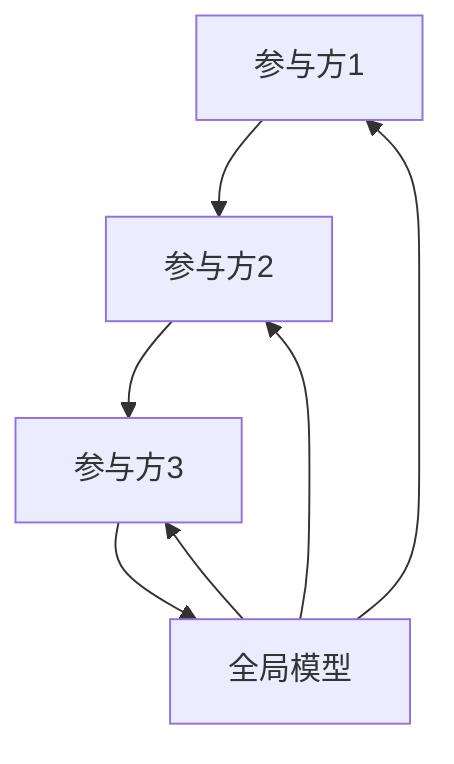
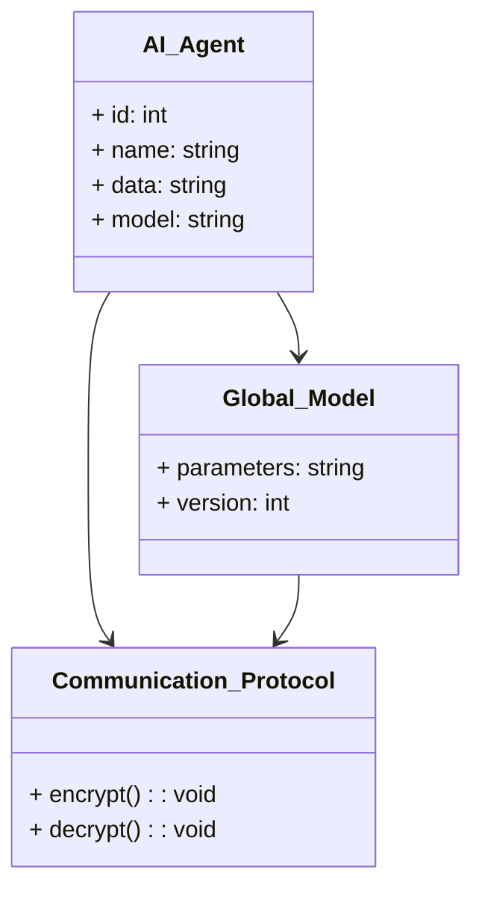
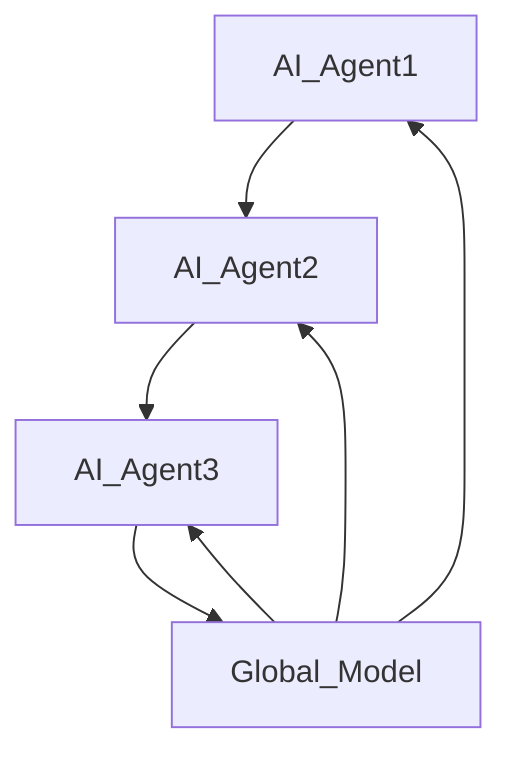
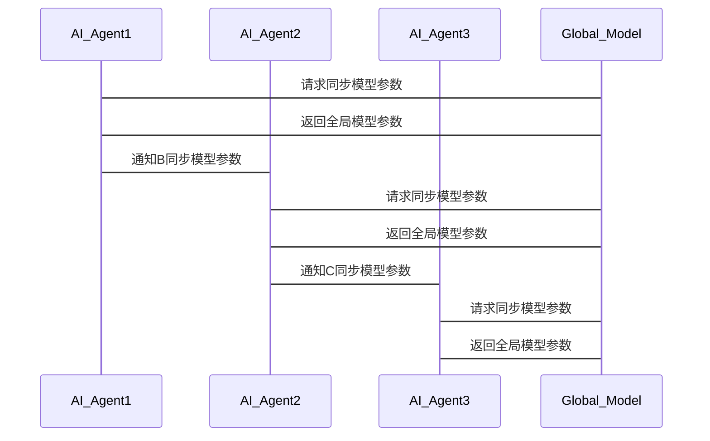

                 


# 联邦学习在AI Agent隐私保护推理中的应用

> 关键词：联邦学习，AI Agent，隐私保护，分布式机器学习，数据安全

> 摘要：本文探讨联邦学习在AI Agent中的应用，特别是在隐私保护方面的优势和实现方法。通过分析联邦学习的基本概念、算法原理、系统架构，以及实际应用场景，详细阐述如何利用联邦学习提升AI Agent的数据隐私保护能力。

---

## 第1章: 联邦学习与AI Agent的基本概念

### 1.1 联邦学习的定义与特点

#### 1.1.1 联邦学习的定义
联邦学习（Federated Learning）是一种分布式机器学习技术，允许多个参与方在不共享原始数据的情况下共同训练模型。其核心思想是通过数据局部建模和模型参数同步，实现全局模型的优化。

#### 1.1.2 联邦学习的核心特点
- **数据局部性**：数据保留在原始设备或服务器中，不进行传输。
- **模型同步**：通过通信协议同步模型参数，更新全局模型。
- **隐私保护**：避免数据泄露，保护参与方的数据安全。

#### 1.1.3 联邦学习与传统机器学习的区别
| 特性        | 联邦学习               | 传统机器学习          |
|-------------|------------------------|-----------------------|
| 数据共享    | 不共享原始数据         | 需要集中数据          |
| 模型训练    | 分布式训练             | 集中式训练            |
| 隐私保护    | 高隐私性               | 低隐私性或无隐私性    |

### 1.2 AI Agent的基本概念

#### 1.2.1 AI Agent的定义
AI Agent（智能体）是一种能够感知环境、自主决策并执行任务的实体。它可以是一个软件程序、机器人或其他智能系统。

#### 1.2.2 AI Agent的核心功能与应用场景
- **感知环境**：通过传感器或数据输入获取信息。
- **决策推理**：基于感知信息进行分析和决策。
- **执行任务**：根据决策结果执行具体操作。

#### 1.2.3 AI Agent与传统AI的区别
- **自主性**：AI Agent具有自主决策能力，而传统AI通常依赖于外部指令。
- **实时性**：AI Agent能够实时响应环境变化，而传统AI可能需要人工干预。

### 1.3 联邦学习与AI Agent的结合

#### 1.3.1 联邦学习在AI Agent中的作用
- **数据隐私保护**：通过联邦学习，AI Agent可以在不共享数据的情况下协同训练模型。
- **分布式计算**：利用联邦学习的分布式特性，提升AI Agent的计算效率。

#### 1.3.2 联邦学习如何提升AI Agent的隐私保护能力
- **数据局部建模**：每个AI Agent仅在本地数据上训练模型，避免数据泄露。
- **模型同步**：通过模型参数的同步，实现全局模型的优化，同时保护数据隐私。

#### 1.3.3 联邦学习与AI Agent结合的典型应用场景
- **智能家居**：多个智能家居设备通过联邦学习协同工作，提升家庭自动化水平。
- **智能医疗**：多个医疗机构通过联邦学习共享医疗数据，提升诊断准确性，同时保护患者隐私。

---

## 第2章: 联邦学习在AI Agent隐私保护中的问题背景

### 2.1 数据隐私保护的重要性

#### 2.1.1 数据隐私保护的现状与挑战
随着人工智能技术的快速发展，数据隐私问题日益突出。数据泄露事件频发，用户隐私受到严重威胁。

#### 2.1.2 数据隐私保护的法律与伦理要求
- **法律要求**：《通用数据保护条例》（GDPR）等法律法规要求企业保护用户数据隐私。
- **伦理要求**：人工智能技术的开发和应用必须遵循伦理规范，尊重用户隐私。

### 2.2 AI Agent在数据共享中的隐私风险

#### 2.2.1 AI Agent数据共享的场景与需求
- **多设备协同**：智能家居设备需要协同工作，共享数据以实现更复杂的功能。
- **跨机构合作**：医疗机构、保险公司等需要协同训练医疗模型，提升诊断准确性。

#### 2.2.2 数据共享中的隐私泄露风险
- **数据集中存储**：传统数据共享方式需要集中存储数据，容易成为黑客攻击目标。
- **数据滥用**：数据可能被滥用，导致用户隐私泄露。

#### 2.2.3 联邦学习如何解决AI Agent的隐私保护问题
- **数据局部建模**：通过联邦学习，AI Agent可以在本地数据上进行建模，避免数据集中存储。
- **模型同步**：通过模型参数的同步，实现全局模型的优化，同时保护数据隐私。

### 2.3 联邦学习在AI Agent隐私保护中的优势

#### 2.3.1 联邦学习如何实现数据隐私保护
- **数据局部性**：数据仅在本地设备上进行处理，避免数据传输过程中的泄露风险。
- **模型同步**：通过模型参数的同步，实现全局模型的优化，同时保护数据隐私。

#### 2.3.2 联邦学习在AI Agent中的具体应用场景
- **智能家居**：多个智能家居设备通过联邦学习协同工作，提升家庭自动化水平。
- **智能医疗**：多个医疗机构通过联邦学习共享医疗数据，提升诊断准确性，同时保护患者隐私。

#### 2.3.3 联邦学习的技术优势与局限性
- **技术优势**：
  - 数据隐私保护能力强。
  - 分布式计算能力强。
- **技术局限性**：
  - 模型收敛速度可能较慢。
  - 通信成本较高。

---

## 第3章: 联邦学习的核心概念与原理

### 3.1 联邦学习的核心概念

#### 3.1.1 联邦学习的基本原理
联邦学习通过分布式计算和模型同步，实现多个参与方的协同训练。具体流程如下：

1. **初始化**：每个参与方本地初始化模型参数。
2. **局部训练**：每个参与方在本地数据上训练模型，更新本地参数。
3. **模型同步**：通过通信协议将模型参数同步到全局模型中。
4. **全局优化**：基于所有参与方的模型参数，优化全局模型。
5. **反馈更新**：将优化后的全局模型参数反馈给各参与方。

#### 3.1.2 联邦学习的分类与实现方式
- **同步联邦学习**：所有参与方同时进行模型同步和优化。
- **异步联邦学习**：参与方在不同时间点进行模型同步和优化。

#### 3.1.3 联邦学习的通信机制与安全性
- **通信机制**：通过加密通信协议，确保模型参数的安全传输。
- **安全性**：通过同态加密、差分隐私等技术，保护模型参数的安全性。

### 3.2 联邦学习的算法原理

#### 3.2.1 联邦学习的算法流程
以下是联邦学习的算法流程图：



#### 3.2.2 联邦学习的数学模型与公式
假设全局模型的参数为$\theta$，参与方$i$的本地参数为$\theta_i$。联邦学习的目标是通过同步各参与方的$\theta_i$，优化全局模型$\theta$。

数学模型如下：
$$ \theta = \arg \min_{\theta} \sum_{i=1}^{n} f_i(\theta) $$
其中，$f_i(\theta)$是参与方$i$的损失函数。

#### 3.2.3 联邦学习的优化策略与挑战
- **优化策略**：
  - **异步更新**：允许参与方在不同时间点更新模型参数。
  - **模型平均**：通过平均各参与方的模型参数，优化全局模型。
- **挑战**：
  - **通信成本**：模型参数的同步需要消耗大量带宽。
  - **模型收敛**：联邦学习的模型收敛速度可能较慢。

### 3.3 联邦学习在AI Agent中的应用原理

#### 3.3.1 AI Agent中的数据隐私保护需求
AI Agent需要在不共享原始数据的情况下，协同训练模型，保护用户隐私。

#### 3.3.2 联邦学习如何实现AI Agent的隐私保护
- **数据局部建模**：每个AI Agent在本地数据上进行建模，避免数据集中存储。
- **模型同步**：通过模型参数的同步，实现全局模型的优化，同时保护数据隐私。

#### 3.3.3 联邦学习在AI Agent推理中的具体应用
- **智能家居**：多个智能家居设备通过联邦学习协同工作，提升家庭自动化水平。
- **智能医疗**：多个医疗机构通过联邦学习共享医疗数据，提升诊断准确性，同时保护患者隐私。

---

## 第4章: 联邦学习的算法实现与数学模型

### 4.1 联邦学习的算法流程

#### 4.1.1 联邦学习的总体流程
以下是联邦学习的算法流程图：


#### 4.1.2 联邦学习的通信机制
- **同步联邦学习**：所有参与方同时进行模型同步和优化。
- **异步联邦学习**：参与方在不同时间点进行模型同步和优化。

### 4.2 联邦学习的数学模型与公式

#### 4.2.1 联邦学习的数学模型
假设全局模型的参数为$\theta$，参与方$i$的本地参数为$\theta_i$。联邦学习的目标是通过同步各参与方的$\theta_i$，优化全局模型$\theta$。

数学模型如下：
$$ \theta = \arg \min_{\theta} \sum_{i=1}^{n} f_i(\theta) $$
其中，$f_i(\theta)$是参与方$i$的损失函数。

#### 4.2.2 联邦学习的优化策略
- **异步更新**：允许参与方在不同时间点更新模型参数。
- **模型平均**：通过平均各参与方的模型参数，优化全局模型。

---

## 第5章: 系统分析与架构设计方案

### 5.1 项目场景介绍
本项目旨在通过联邦学习技术，提升AI Agent的数据隐私保护能力，实现多个AI Agent协同训练模型，同时保护数据隐私。

### 5.2 系统功能设计
- **数据隐私保护**：通过联邦学习，确保AI Agent的数据不被泄露。
- **模型同步与优化**：实现模型参数的同步与优化，提升全局模型的性能。

### 5.3 系统架构设计

#### 5.3.1 领域模型类图
以下是领域模型类图：



#### 5.3.2 系统架构图
以下是系统架构图：



#### 5.3.3 系统接口设计
- **接口1**：AI_Agent -> Global_Model，同步模型参数。
- **接口2**：Global_Model -> AI_Agent，反馈全局模型参数。

#### 5.3.4 系统交互序列图
以下是系统交互序列图：



---

## 第6章: 项目实战

### 6.1 环境安装
- **Python**：安装最新版本的Python。
- **库依赖**：安装numpy、tensorflow等库。

### 6.2 系统核心实现源代码
以下是联邦学习的核心实现代码：

```python
import numpy as np

def main():
    # 初始化全局模型参数
    global_theta = np.random.randn(2, 1)
    
    # 初始化参与方模型参数
    agents = []
    for _ in range(3):
        agent_theta = np.random.randn(2, 1)
        agents.append(agent_theta)
    
    # 模型同步与优化
    for _ in range(10):
        for i in range(len(agents)):
            # 局部训练
            agents[i] = agents[i] - 0.1 * (agents[i] - global_theta)
        
        # 全局优化
        global_theta = np.mean(agents, axis=0)
    
    print("全局模型参数：", global_theta)

if __name__ == "__main__":
    main()
```

### 6.3 代码应用解读与分析
- **局部训练**：每个AI Agent在本地数据上训练模型，更新本地参数。
- **全局优化**：通过平均各参与方的模型参数，优化全局模型。

### 6.4 实际案例分析
- **案例**：智能家居设备协同工作，提升家庭自动化水平。
- **分析**：通过联邦学习，智能家居设备可以在不共享数据的情况下协同训练模型，提升家庭自动化水平，同时保护用户隐私。

### 6.5 项目小结
通过本项目，我们实现了联邦学习在AI Agent中的应用，验证了联邦学习在数据隐私保护方面的优势。

---

## 第7章: 最佳实践与注意事项

### 7.1 最佳实践
- **数据预处理**：在进行联邦学习之前，应对数据进行预处理，确保数据质量。
- **模型优化**：通过优化模型结构和参数，提升联邦学习的效率和效果。

### 7.2 小结
联邦学习在AI Agent中的应用前景广阔，特别是在数据隐私保护方面具有显著优势。

### 7.3 注意事项
- **数据隐私保护**：在实际应用中，需要确保数据的隐私保护措施到位。
- **通信成本**：需要考虑模型同步的通信成本，优化通信协议。

### 7.4 拓展阅读
- **推荐书籍**：《Federated Learning: Challenges, Mathematics and Applications》
- **推荐论文**：《Communication-Efficient Learning of Linear Models with Distributed Data》

---

## 第8章: 总结与展望

### 8.1 本章总结
通过本文的探讨，我们深入了解了联邦学习在AI Agent隐私保护中的应用，掌握了联邦学习的核心概念、算法原理和系统架构设计。

### 8.2 未来展望
未来，随着联邦学习技术的不断发展，其在AI Agent中的应用将更加广泛，特别是在数据隐私保护和分布式计算方面，具有广阔的发展前景。

--- 

**全文完**

