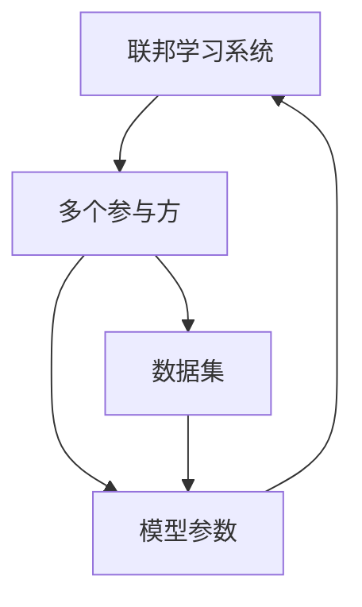
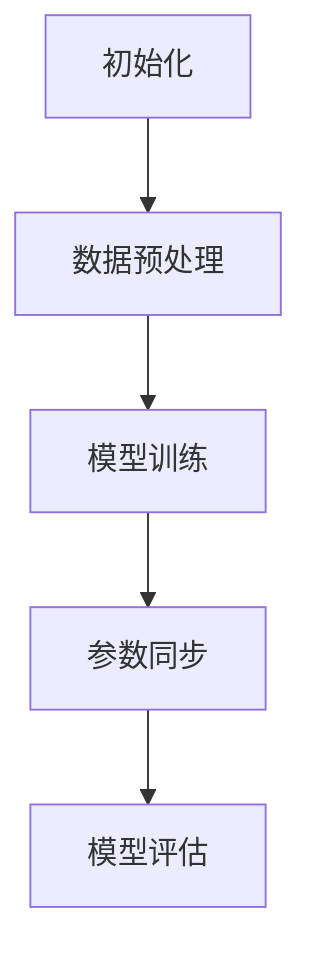
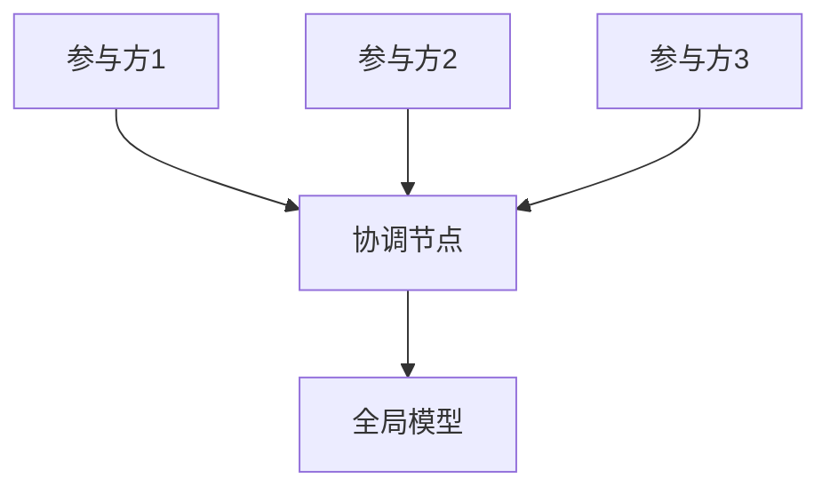

                 


# 《联邦学习在分布式AI Agent系统中的应用》

> 关键词：联邦学习, 分布式AI, AI Agent, 联邦算法, 联邦系统架构, 分布式计算

> 摘要：本文详细探讨了联邦学习在分布式AI Agent系统中的应用，分析了联邦学习的核心概念、算法原理、系统架构，并通过实际案例展示了如何在分布式AI Agent系统中实施联邦学习。文章从背景、技术细节、系统设计到项目实战，逐步深入，为读者提供全面的指导。

---

# 第一部分: 联邦学习概述

## 第1章: 联邦学习的背景与核心概念

### 1.1 联邦学习的背景

随着分布式系统的广泛应用，数据孤岛问题日益突出。各个机构或系统拥有自己的数据，但这些数据往往无法集中共享，导致机器学习模型难以在全局范围内优化。联邦学习（Federated Learning）作为一种新兴的技术，旨在在不共享原始数据的前提下，通过分布式的模型训练，实现全局模型的优化。

#### 1.1.1 数据孤岛与隐私保护的挑战

在分布式AI系统中，数据通常分散在多个机构或设备中，例如医院、移动设备等。这些数据可能包含敏感信息，直接共享会带来隐私泄露的风险。此外，数据的分布性也使得集中式训练变得不可行。

#### 1.1.2 联邦学习的提出与目标

联邦学习的目标是在不共享原始数据的前提下，通过分布式模型训练，使得各个参与方能够共同优化一个全局模型。这种技术不仅能够保护数据隐私，还能够充分利用分布式数据的优势。

### 1.2 联邦学习的核心概念

#### 1.2.1 联邦学习的定义

联邦学习是一种分布式机器学习技术，通过在多个参与方之间协作训练模型，使得各方能够在不共享数据的情况下，共同优化一个全局模型。

#### 1.2.2 联邦学习的关键特性

- **数据局部性**：每个参与方只拥有自己的数据，不与其他参与方共享。
- **模型同步**：通过通信协议，参与方定期同步模型参数，更新全局模型。
- **隐私保护**：数据不出域，模型更新在云端或协调节点进行。

#### 1.2.3 联邦学习的参与者与角色

- **参与方（Participants）**：拥有数据的实体，如设备、机构等。
- **协调节点（Coordinator）**：负责组织和协调模型训练过程，可能是云服务器或其他第三方机构。

### 1.3 联邦学习与传统机器学习的对比

| 特性 | 联邦学习 | 传统机器学习 |
|------|----------|--------------|
| 数据分布 | 分散在多个参与方 | 集中在一个数据集 |
| 模型训练 | 分布式训练 | 集中式训练 |
| 隐私保护 | 高 | 低 |

---

## 第2章: 联邦学习的核心概念与联系

### 2.1 联邦学习的核心概念原理

#### 2.1.1 联邦学习的数学模型

假设我们有 $K$ 个参与方，每个参与方 $i$ 拥有数据集 $D_i$。目标是训练一个全局模型 $\theta$，使得所有参与方的模型尽可能接近全局最优。

全局模型的更新过程可以表示为：

$$\theta_{t+1} = \sum_{i=1}^{K} \frac{1}{K} \theta_i^{(t+1)}$$

其中 $\theta_i^{(t+1)}$ 是参与方 $i$ 在第 $t+1$ 轮的模型参数。

#### 2.1.2 联邦学习的通信机制

通信机制是联邦学习的关键部分。通常，参与方会在每一轮训练结束后，将模型参数上传到协调节点，协调节点将所有参与方的参数进行平均，得到新的全局模型。

### 2.2 联邦学习的核心概念属性特征对比表格

| 特性 | 联邦学习 | 传统机器学习 |
|------|----------|--------------|
| 数据分布 | 分散在多个参与方 | 集中在一个数据集 |
| 模型训练 | 分布式训练 | 集中式训练 |
| 隐私保护 | 高 | 低 |

### 2.3 ER实体关系图架构



---

## 第3章: 联邦学习的算法原理

### 3.1 联邦学习算法的分类

#### 3.1.1 横向联邦学习

横向联邦学习适用于数据样本相同，但特征不同的场景。例如，多个医院拥有相同的患者数据结构，但数据不共享。

#### 3.1.2 纵向联邦学习

纵向联邦学习适用于数据特征相同，但样本不同的场景。例如，多个机构拥有相同的客户特征，但数据样本不同。

#### 3.1.3 混合联邦学习

混合联邦学习是横向和纵向联邦学习的结合，适用于数据既不同又部分重叠的场景。

### 3.2 联邦学习算法流程



---

## 第4章: 联邦学习的系统架构与设计

### 4.1 系统功能设计

#### 4.1.1 数据预处理

- 数据清洗：处理缺失值、异常值等。
- 数据转换：将数据转换为模型训练所需的格式。

#### 4.1.2 模型训练

- 模型初始化：在每个参与方初始化模型参数。
- 模型更新：每个参与方在本地数据上训练模型，更新参数。

#### 4.1.3 参数同步

- 参与方将模型参数上传到协调节点。
- 协调节点将所有参与方的参数进行平均，得到新的全局模型。

### 4.2 系统架构设计



---

## 第5章: 联邦学习的项目实战

### 5.1 项目背景

假设我们有三个医院，每个医院拥有自己的患者数据，希望通过联邦学习训练一个全局的疾病预测模型。

### 5.2 环境搭建

- 安装必要的库：TensorFlow、Keras等。
- 配置分布式环境：使用Kubernetes或Docker容器化部署。

### 5.3 核心实现代码

```python
import tensorflow as tf
from tensorflow.keras import layers

# 模型定义
def create_model():
    model = tf.keras.Sequential([
        layers.Dense(64, activation='relu'),
        layers.Dense(1, activation='sigmoid')
    ])
    model.compile(optimizer='adam', loss='binary_crossentropy')
    return model

# 联邦学习训练过程
def federated_training(participants=3):
    # 初始化全局模型
    global_model = create_model()
    global_model_weights = global_model.get_weights()

    # 每个参与方进行本地训练
    for _ in range(epochs):
        participant_weights = []
        for _ in range(participants):
            # 模拟本地训练
            model = create_model()
            model.set_weights(global_model_weights)
            # 训练模型
            model.fit(local_data, local_labels, epochs=1, verbose=0)
            # 获取模型权重
            participant_weights.append(model.get_weights())
        
        # 同步模型权重
        average_weights = []
        for i in range(len(participant_weights[0])):
            average_weights.append(sum([p[i] for p in participant_weights]) / participants)
        global_model.set_weights(average_weights)

    return global_model
```

### 5.4 实际案例分析

通过上述代码，我们可以看到联邦学习的核心流程：初始化全局模型，每个参与方进行本地训练，同步模型权重，更新全局模型。这种流程可以在不共享数据的前提下，实现全局模型的优化。

---

## 第6章: 联邦学习的扩展与展望

### 6.1 研究热点

- 联邦学习的通信优化。
- 联邦学习的隐私保护。

### 6.2 未来趋势

- 联邦学习的标准化。
- 联邦学习的商业化。

### 6.3 注意事项

- 数据分布的均匀性。
- 模型收敛的速度。

---

# 结语

联邦学习作为一种分布式机器学习技术，为解决数据孤岛和隐私保护问题提供了新的思路。通过本文的介绍，读者可以深入了解联邦学习的核心概念、算法原理和系统设计，并通过实际案例掌握联邦学习的实现方法。未来，随着技术的不断发展，联邦学习将在更多领域得到广泛应用。

