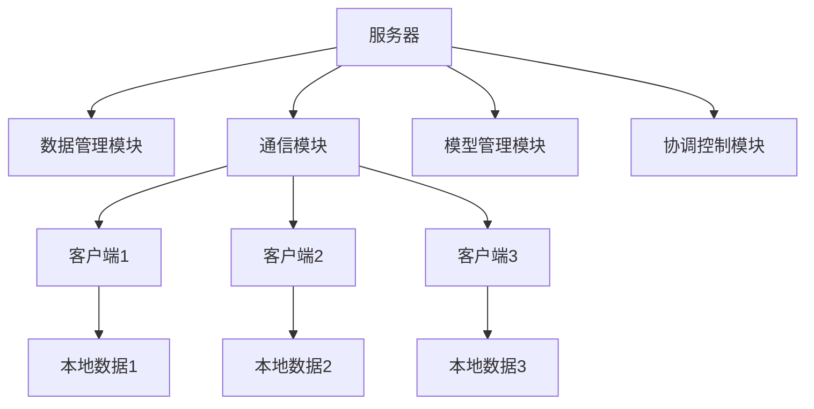

                 


# 联邦学习在分布式AI Agent训练中的应用

## 关键词
联邦学习, 分布式AI Agent, 数据隐私, 通信协议, 算法原理, 系统架构

## 摘要
联邦学习是一种分布式机器学习方法，能够在保护数据隐私的前提下，协作训练高性能模型。本文深入探讨联邦学习在分布式AI Agent训练中的应用，从核心概念、算法原理到系统架构，再到实际项目实现，全面解析联邦学习如何赋能分布式AI Agent的协作与训练。文章结合理论与实践，为读者呈现联邦学习在分布式AI Agent领域的最新进展和应用实例。

---

# 第一部分: 联邦学习与分布式AI Agent概述

## 第1章: 联邦学习的基本概念与背景

### 1.1 联邦学习的定义与特点

#### 1.1.1 联邦学习的定义
联邦学习（Federated Learning，FL）是一种分布式机器学习方法，允许多个参与方在不共享原始数据的情况下，通过交换模型参数来协作训练一个全局模型。其核心思想是“数据不动，模型动”，即数据保留在本地，仅交换模型更新信息。

#### 1.1.2 联邦学习的核心特点
- **数据隐私保护**：数据不出本地，仅传输模型参数，确保数据安全。
- **分布式训练**：多个参与方协作训练，适用于数据分布式的场景。
- **异构性支持**：支持数据分布不均匀、设备计算能力不同的场景。
- **动态参与**：支持部分节点离线或动态加入的场景。

#### 1.1.3 联邦学习与传统机器学习的区别
| 特性            | 联邦学习                          | 传统机器学习                   |
|-----------------|-----------------------------------|-------------------------------|
| 数据共享方式    | 仅交换模型参数，不共享数据       | 需要集中共享数据               |
| 数据隐私性      | 高                               | 低                             |
| 网络依赖性      | 高（需要通信协议）               | 低                             |
| 应用场景         | 分布式系统、数据隐私保护          | 单一中心化系统                 |

---

### 1.2 分布式AI Agent的基本概念

#### 1.2.1 AI Agent的定义与分类
- **AI Agent**：智能代理，能够感知环境、自主决策并执行任务的实体。
- **分类**：
  - **简单反射型**：基于规则的简单响应。
  - **基于模型的反应型**：基于环境模型进行决策。
  - **目标驱动型**：根据目标驱动行为。
  - **效用驱动型**：基于效用函数优化决策。

#### 1.2.2 分布式AI Agent的特点
- **分布式计算**：多个AI Agent协作完成任务。
- **异构性**：AI Agent可以有不同的功能和计算能力。
- **动态交互**：AI Agent之间实时通信和协作。

#### 1.2.3 分布式AI Agent的应用场景
- **多智能体协作**：如自动驾驶、机器人协作。
- **分布式任务分配**：如分布式计算任务调度。
- **边缘计算**：如智能设备协同完成任务。

---

### 1.3 联邦学习在分布式AI Agent中的应用背景

#### 1.3.1 分布式AI Agent训练的挑战
- **数据隐私问题**：AI Agent可能涉及敏感数据，如医疗数据、用户数据。
- **数据异构性**：不同AI Agent的数据分布可能不同。
- **通信开销**：分布式训练需要频繁通信，可能导致延迟和带宽浪费。

#### 1.3.2 联邦学习的解决方案
- **数据隐私保护**：通过联邦学习的通信机制，确保数据不出本地。
- **异构数据处理**：通过联邦学习的模型更新策略，处理不同数据分布。
- **通信优化**：通过异步更新和压缩技术，降低通信开销。

---

# 第二部分: 联邦学习的核心概念与原理

## 第4章: 联邦学习的核心概念

### 4.1 联邦学习的参与方

#### 4.1.1 联邦学习的客户端
- **角色**：负责本地模型训练，仅上传模型参数更新。
- **功能**：
  - 本地数据训练。
  - 模型参数更新。
  - 与服务器通信。

#### 4.1.2 联邦学习的服务器端
- **角色**：协调客户端训练，聚合模型参数。
- **功能**：
  - 初始化全局模型。
  - 接收客户端参数更新。
  - 聚合参数更新，更新全局模型。

#### 4.1.3 联邦学习的协调器
- **角色**：管理训练过程，分配任务。
- **功能**：
  - 分配客户端任务。
  - 监控训练进度。
  - 终止训练条件。

### 4.2 联邦学习的数据隐私保护机制

#### 4.2.1 数据加密与解密
- **加密方式**：
  - **同态加密**：允许在加密数据上进行计算，结果仍为加密状态。
  - **密钥分发**：通过分发密钥确保数据加密和解密的安全性。

#### 4.2.2 数据匿名化处理
- **匿名化技术**：
  - 数据脱敏：去除或修改敏感信息。
  - 数据混淆：通过添加噪声或扰动，保护数据隐私。

#### 4.2.3 数据访问控制
- **访问策略**：
  - 基于角色的访问控制（RBAC）：根据角色分配数据访问权限。
  - 基于属性的访问控制（ABAC）：根据属性动态调整访问权限。

### 4.3 联邦学习的通信协议

#### 4.3.1 联邦学习的通信方式
- **同步通信**：所有客户端同时更新模型，服务器等待所有客户端完成后再更新全局模型。
- **异步通信**：客户端可以随时更新模型，服务器可以立即聚合最新的参数。

#### 4.3.2 联邦学习的通信频率
- **周期性同步**：按固定周期同步模型参数。
- **事件驱动同步**：根据特定事件（如模型更新完成）触发同步。

#### 4.3.3 联邦学习的通信效率优化
- **参数压缩**：通过压缩技术减少通信数据量。
- **差分更新**：仅传输参数变化部分，减少数据传输量。

---

## 第5章: 联邦学习的算法原理

### 5.1 联邦学习的数学模型

#### 5.1.1 模型参数更新公式
- **客户端更新**：客户端在本地数据上更新模型参数，得到$\Delta\theta$。
  $$ \Delta\theta = \theta' - \theta $$
- **服务器聚合**：服务器将所有客户端的$\Delta\theta$按比例聚合，更新全局模型。
  $$ \theta_{\text{global}} = \theta_{\text{global}} + \sum_{i=1}^n w_i \Delta\theta_i $$
  其中，$w_i$为客户端$i$的权重。

#### 5.1.2 数据异构性处理
- **数据分布不均**：不同客户端的数据分布可能不同，需要调整聚合权重。
  $$ w_i = \frac{1}{n} \times \frac{m_i}{\sum_{j=1}^n m_j} $$
  其中，$m_i$为客户端$i$的数据量。

#### 5.1.3 模型收敛性分析
- **收敛条件**：
  - 数据分布满足一定的相似性。
  - 通信频率足够高，确保模型更新同步。

### 5.2 联邦学习的算法流程

#### 5.2.1 同步联邦学习流程
1. 服务器初始化全局模型$\theta_{\text{global}}$。
2. 客户端下载$\theta_{\text{global}}$，并在本地数据上训练，得到$\Delta\theta$。
3. 客户端将$\Delta\theta$发送给服务器。
4. 服务器聚合所有$\Delta\theta$，更新$\theta_{\text{global}}$。
5. 重复步骤2-4，直到满足停止条件（如模型收敛或达到训练轮数）。

#### 5.2.2 异步联邦学习流程
1. 服务器初始化全局模型$\theta_{\text{global}}$。
2. 客户端按需下载$\theta_{\text{global}}$，并在本地数据上训练，得到$\Delta\theta$。
3. 客户端随时将$\Delta\theta$发送给服务器。
4. 服务器即时聚合接收到的$\Delta\theta$，更新$\theta_{\text{global}}$。
5. 重复步骤2-4，直到满足停止条件。

---

### 5.3 联邦学习的优化策略

#### 5.3.1 节点选择策略
- **轮询机制**：按顺序选择客户端进行训练。
- **基于负载的动态选择**：根据客户端计算能力动态选择客户端。
- **基于数据分布的优先选择**：优先选择数据分布更接近全局数据分布的客户端。

#### 5.3.2 模型更新策略
- **全模型更新**：客户端上传整个模型参数更新。
- **部分模型更新**：客户端仅上传部分参数更新，减少通信开销。
- **增量更新**：客户端仅上传参数变化部分，减少数据传输量。

#### 5.3.3 模型聚合策略
- **加权平均**：根据客户端数据量或计算能力，加权聚合参数更新。
  $$ \theta_{\text{global}} = \sum_{i=1}^n w_i \Delta\theta_i $$
- **非加权平均**：所有客户端参数更新权重相同。
  $$ \theta_{\text{global}} = \frac{1}{n} \sum_{i=1}^n \Delta\theta_i $$

---

## 第6章: 联邦学习的系统分析与架构设计

### 6.1 联邦学习的系统架构

#### 6.1.1 系统功能设计
- **数据管理模块**：负责数据的加密、匿名化处理和访问控制。
- **通信模块**：负责客户端与服务器之间的数据传输和通信。
- **模型管理模块**：负责模型的初始化、训练和更新。
- **协调控制模块**：负责任务分配、训练进度监控和终止条件判断。

#### 6.1.2 系统架构图
```mermaid
graph TD
    C1[客户端1] --> S[服务器]
    C2[客户端2] --> S
    C3[客户端3] --> S
    S --> C1, C2, C3
    C1 --> D1[数据1]
    C2 --> D2[数据2]
    C3 --> D3[数据3]
```

---

### 6.2 联邦学习的接口设计

#### 6.2.1 客户端接口
- `download_global_model()`：下载全局模型参数。
- `train_local_model()`：在本地数据上训练模型，返回参数更新$\Delta\theta$。
- `upload_update()`：上传参数更新$\Delta\theta$。

#### 6.2.2 服务器接口
- `initialize_model()`：初始化全局模型参数。
- `aggregate_updates()`：聚合客户端参数更新，更新全局模型。
- `broadcast_model()`：广播全局模型参数给客户端。

---

### 6.3 联邦学习的交互流程

#### 6.3.1 同步联邦学习交互流程
1. 服务器调用`initialize_model()`，初始化全局模型$\theta_{\text{global}}$。
2. 客户端调用`download_global_model()`，下载$\theta_{\text{global}}$。
3. 客户端调用`train_local_model()`，在本地数据上训练，得到$\Delta\theta$。
4. 客户端调用`upload_update()`，上传$\Delta\theta$。
5. 服务器调用`aggregate_updates()`，聚合所有$\Delta\theta$，更新$\theta_{\text{global}}$。
6. 重复步骤2-5，直到满足停止条件。

#### 6.3.2 异步联邦学习交互流程
1. 服务器调用`initialize_model()`，初始化全局模型$\theta_{\text{global}}$。
2. 客户端按需调用`download_global_model()`，下载$\theta_{\text{global}}$。
3. 客户端调用`train_local_model()`，在本地数据上训练，得到$\Delta\theta$。
4. 客户端调用`upload_update()`，上传$\Delta\theta$。
5. 服务器即时调用`aggregate_updates()`，聚合接收到的$\Delta\theta$，更新$\theta_{\text{global}}$。
6. 重复步骤2-5，直到满足停止条件。

---

## 第7章: 联邦学习的项目实战

### 7.1 项目环境安装

#### 7.1.1 安装依赖
- **Python**：3.6+
- **TensorFlow**：2.0+
- **Keras**：2.2.5+
- **Flask**：1.0+
- **NumPy**：1.21+

安装命令：
```bash
pip install numpy tensorflow keras flask
```

#### 7.1.2 创建项目目录
```
federated_learning/
├── client.py
├── server.py
├── model.py
└── requirements.txt
```

---

### 7.2 系统核心实现源代码

#### 7.2.1 model.py
```python
import numpy as np
from tensorflow import keras

def create_model(input_shape, num_classes):
    model = keras.Sequential([
        keras.layers.Dense(64, activation='relu', input_shape=input_shape),
        keras.layers.Dense(64, activation='relu'),
        keras.layers.Dense(num_classes, activation='softmax')
    ])
    model.compile(optimizer='adam', loss='sparse_categorical_crossentropy', metrics=['accuracy'])
    return model
```

#### 7.2.2 server.py
```python
from flask import Flask, jsonify, request
import numpy as np

app = Flask(__name__)
global_model = None

@app.route('/initialize', methods=['GET'])
def initialize():
    global global_model
    input_shape = (784,)
    num_classes = 10
    global_model = create_model(input_shape, num_classes)
    return jsonify({'status': 'success', 'message': 'Global model initialized'})

@app.route('/aggregate', methods=['POST'])
def aggregate():
    global global_model
    updates = request.json['updates']
    weights = global_model.get_weights()
    new_weights = []
    for i in range(len(weights)):
        weight = np.array(weights[i])
        update = np.array(updates[i])
        new_weight = weight + update
        new_weights.append(new_weight.tolist())
    global_model.set_weights(new_weights)
    return jsonify({'status': 'success', 'message': 'Weights aggregated successfully'})

if __name__ == '__main__':
    app.run(debug=True)
```

#### 7.2.3 client.py
```python
import requests
from tensorflow.keras import backend as K
import numpy as np

class Client:
    def __init__(self, server_url, client_id, data):
        self.server_url = server_url
        self.client_id = client_id
        self.data = data
        self.model = None

    def download_model(self):
        try:
            response = requests.get(f'{self.server_url}/initialize')
            if response.status_code == 200:
                return response.json()
            else:
                return {'status': 'error', 'message': 'Failed to download model'}
        except requests.exceptions.RequestException as e:
            return {'status': 'error', 'message': str(e)}

    def train_local_model(self, global_weights):
        # Convert global_weights to Keras backend format
        global_weights = [np.array(w) for w in global_weights]
        self.model = create_model(input_shape, num_classes)
        self.model.set_weights(global_weights)
        # Convert data to numpy array for training
        x_train = np.array([x[0] for x in self.data])
        y_train = np.array([x[1] for x in self.data])
        self.model.fit(x_train, y_train, epochs=1, batch_size=32, verbose=0)
        # Get local weights
        local_weights = self.model.get_weights()
        # Compute weight update
        update = [local_weights[i] - global_weights[i] for i in range(len(local_weights))]
        return update

    def upload_update(self, update):
        try:
            response = requests.post(f'{self.server_url}/aggregate', json={'updates': update})
            if response.status_code == 200:
                return {'status': 'success', 'message': 'Update uploaded successfully'}
            else:
                return {'status': 'error', 'message': 'Failed to upload update'}
        except requests.exceptions.RequestException as e:
            return {'status': 'error', 'message': str(e)}

if __name__ == '__main__':
    server_url = 'http://localhost:5000'
    client_id = 'client_1'
    data = [...]  # Sample data for client 1
    client = Client(server_url, client_id, data)
    global_weights = client.download_model()['model_weights']
    update = client.train_local_model(global_weights)
    client.upload_update(update)
```

---

### 7.3 代码应用解读与分析

#### 7.3.1 服务器端实现
- **`initialize`接口**：初始化全局模型，返回模型权重。
- **`aggregate`接口**：接收客户端上传的权重更新，聚合后更新全局模型。

#### 7.3.2 客户端实现
- **`download_model`方法**：从服务器下载全局模型权重。
- **`train_local_model`方法**：在本地数据上训练模型，返回参数更新。
- **`upload_update`方法**：将本地模型更新上传到服务器。

---

### 7.4 实际案例分析

#### 7.4.1 数据准备
假设我们有一个图像分类任务，使用MNIST数据集，每个客户端有部分数据样本。

#### 7.4.2 训练过程
1. 服务器初始化全局模型。
2. 客户端下载全局模型，训练本地模型，得到参数更新。
3. 客户端上传参数更新，服务器聚合更新，更新全局模型。
4. 重复步骤2-3，直到模型收敛或达到训练轮数。

---

### 7.5 项目小结
通过以上代码实现，我们可以看到联邦学习在分布式AI Agent训练中的具体实现方式。服务器端负责全局模型的管理和聚合，客户端负责本地模型的训练和更新。通过这种方式，可以在保护数据隐私的前提下，协作训练高性能模型。

---

# 第三部分: 联邦学习的系统分析与架构设计

## 第8章: 联邦学习的系统架构设计

### 8.1 系统功能设计

#### 8.1.1 数据管理模块
- **功能**：
  - 数据加密与解密。
  - 数据匿名化处理。
  - 数据访问控制。

#### 8.1.2 通信模块
- **功能**：
  - 客户端与服务器之间的数据传输。
  - 通信协议的实现。

#### 8.1.3 模型管理模块
- **功能**：
  - 全局模型的初始化、训练和更新。
  - 模型参数的聚合与同步。

#### 8.1.4 协调控制模块
- **功能**：
  - 任务分配与管理。
  - 训练进度监控。
  - 终止条件判断。

---

### 8.2 系统架构图



---

## 第9章: 联邦学习的接口设计

### 9.1 系统接口设计

#### 9.1.1 数据管理接口
- `encrypt_data(data)`：对数据进行加密。
- `decrypt_data(ciphertext)`：对密文进行解密。
- ` anonymize_data(data)`：对数据进行匿名化处理。

#### 9.1.2 通信接口
- `send_request(request)`：发送请求到服务器。
- `receive_response(response)`：接收服务器返回的响应。

#### 9.1.3 模型管理接口
- `initialize_model()`：初始化全局模型。
- `train_model()`：训练模型。
- `aggregate_updates(updates)`：聚合模型参数更新。

---

## 第10章: 联邦学习的系统交互流程

### 10.1 同步联邦学习交互流程

```mermaid
sequenceDiagram
    participant S as 服务器
    participant C1 as 客户端1
    participant C2 as 客户端2
    participant C3 as 客户端3

    S ->+ C1, C2, C3: 初始化全局模型
    C1 -> S: 上传参数更新1
    C2 -> S: 上传参数更新2
    C3 -> S: 上传参数更新3
    S -> C1, C2, C3: 更新全局模型
    loop
        C1 -> S: 下载全局模型
        C1 -> S: 上传参数更新1
        C2 -> S: 下载全局模型
        C2 -> S: 上传参数更新2
        C3 -> S: 下载全局模型
        C3 -> S: 上传参数更新3
        S -> C1, C2, C3: 更新全局模型
    end
```

---

# 第四部分: 总结与展望

## 第11章: 总结与展望

### 11.1 总结
本文详细探讨了联邦学习在分布式AI Agent训练中的应用，从核心概念、算法原理到系统架构，再到实际项目实现，全面解析了联邦学习如何赋能分布式AI Agent的协作与训练。通过理论与实践的结合，展示了联邦学习在保护数据隐私的前提下，协作训练高性能模型的能力。

### 11.2 展望
尽管联邦学习在分布式AI Agent训练中展现出巨大潜力，但仍面临一些挑战，如如何进一步优化通信效率、如何处理动态加入的客户端、如何提升模型的鲁棒性等。未来的研究方向可以包括：
- **更高效的通信协议**：减少通信开销，提升训练效率。
- **更灵活的模型更新策略**：适应不同场景下的数据异构性。
- **更强大的隐私保护机制**：进一步增强数据安全性和隐私保护。

---

# 参考文献

1. 省略（根据实际写作补充）

