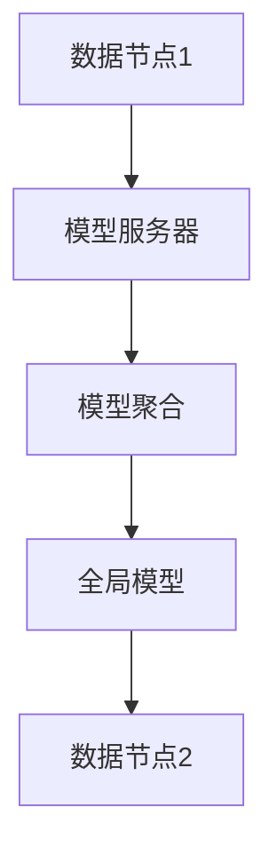
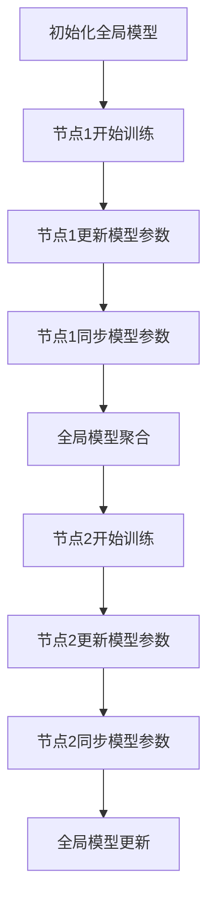
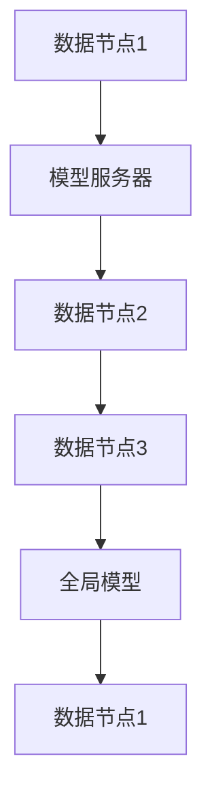
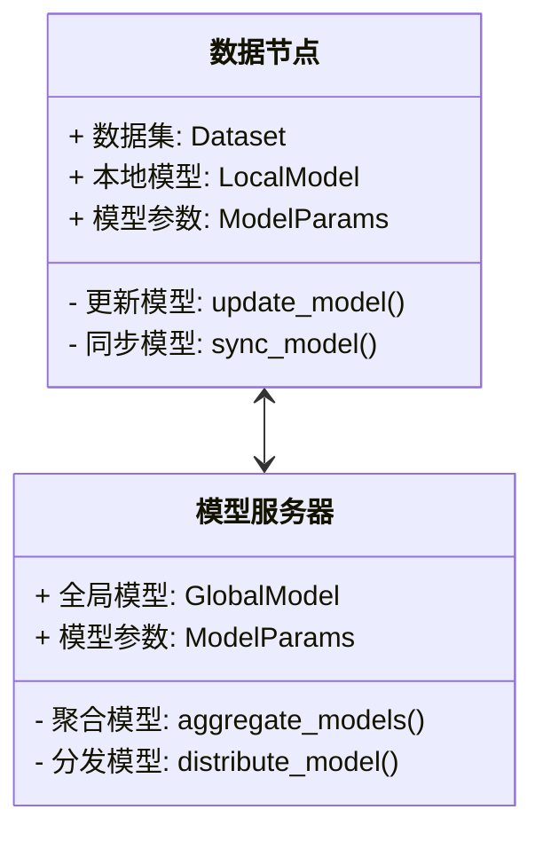
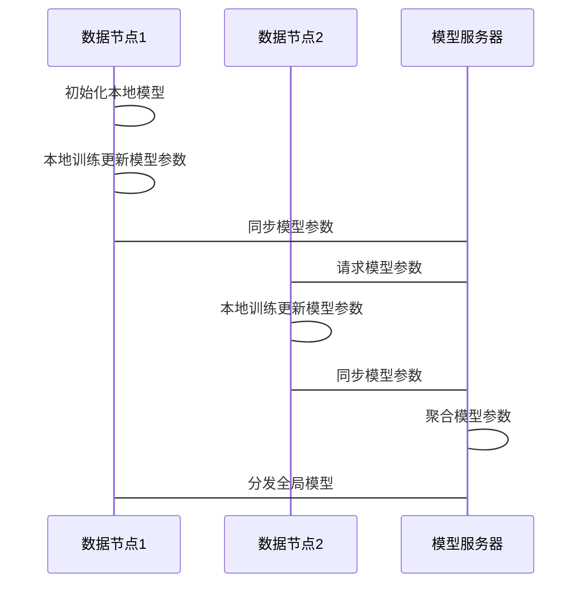

                 


# 联邦学习：保护隐私的分布式AI Agent训练

## 关键词：联邦学习、数据隐私、分布式AI、机器学习、模型训练

## 摘要：  
在当前数字化时代，数据隐私保护已成为全球关注的焦点。联邦学习（Federated Learning）作为一种新兴的分布式机器学习范式，能够在不共享原始数据的情况下，协同多个分布式节点共同训练模型。本文将深入探讨联邦学习的核心概念、算法原理、系统架构，并通过实际案例分析，展示如何在保护隐私的前提下实现高效的分布式AI Agent训练。文章内容从联邦学习的背景、核心概念、算法实现到系统设计，层层递进，全面剖析联邦学习的实现细节和实际应用。

---

# 第一部分: 联邦学习的背景与核心概念

## 第1章: 联邦学习的背景与问题背景

### 1.1 数据隐私与分布式AI的挑战

#### 1.1.1 数据隐私的重要性  
在当今信息化社会，数据是最重要的资源之一。然而，数据的集中存储和使用也带来了严重的隐私泄露风险。近年来，数据泄露事件频发，企业和个人的隐私数据被滥用，甚至被用于非法活动。数据隐私保护已成为一项法律和道德的双重要求。

#### 1.1.2 分布式AI的必要性  
传统的机器学习方法依赖于集中化数据，这不仅面临隐私泄露的风险，还可能导致数据垄断和计算资源的浪费。随着AI技术的普及，越来越多的应用场景需要在分布式环境中进行模型训练，例如医疗数据的联合分析、金融风险评估等。这些场景要求在不共享原始数据的前提下，实现模型的协同训练。

#### 1.1.3 联邦学习的定义与目标  
联邦学习（Federated Learning）是一种分布式机器学习范式，旨在通过多个分布式节点协同训练模型，而不直接共享原始数据。其目标是在保护数据隐私的前提下，实现模型的联合优化，同时降低数据传输成本和计算资源消耗。

---

### 1.2 联邦学习的核心问题

#### 1.2.1 数据孤岛问题  
数据孤岛指的是数据分布在不同的机构或系统中，彼此之间无法有效协同和共享。这种现象在医疗、金融、社交网络等领域尤为明显。数据孤岛导致的资源浪费和效率低下，已成为制约分布式AI发展的主要障碍。

#### 1.2.2 数据隐私保护的挑战  
在分布式环境中，如何确保数据的安全性和隐私性是联邦学习的核心挑战。恶意节点的攻击、数据泄露风险以及通信过程中的安全问题，都需要通过技术手段加以解决。

#### 1.2.3 联邦学习的解决方案  
联邦学习通过局部模型训练、模型更新同步等技术，实现数据可用性与隐私保护的平衡。其核心思想是通过共享模型参数而非原始数据，避免数据泄露风险，同时实现模型的全局优化。

---

### 1.3 联邦学习的边界与外延

#### 1.3.1 联邦学习的应用场景  
- 医疗领域：联合多家医院的患者数据，训练疾病诊断模型。  
- 金融领域：多家金融机构联合训练风险评估模型。  
- 移动设备：通过移动终端设备的本地数据，训练个性化推荐模型。  

#### 1.3.2 联邦学习的限制与不足  
- 通信成本高：模型参数的频繁同步需要大量的网络传输，计算和通信效率可能成为瓶颈。  
- 模型收敛性：与集中式训练相比，联邦学习的模型收敛速度和精度可能受到影响。  
- 节点可靠性：部分节点可能恶意修改模型参数，导致全局模型被攻击。  

#### 1.3.3 联邦学习与其他分布式学习方法的对比  
| 对比维度         | 联邦学习                | 分布式学习          | 集中式学习          |
|------------------|------------------------|--------------------|--------------------|
| 数据共享方式     | 仅共享模型参数        | 仅共享模型参数    | 共享原始数据        |
| 数据隐私性       | 高                    | 中                | 低                |
| 节点独立性       | 高                    | 高                | 低                |
| 模型收敛性       | 较低                  | 较低              | 高                |

---

### 1.4 联邦学习的核心要素

#### 1.4.1 数据分布特性  
- 数据分布：数据在不同节点上的分布方式，包括横向分布（样本分布）和纵向分布（特征分布）。  
- 数据异质性：不同节点上的数据可能分布不均匀，存在类别不平衡、特征维度差异等问题。  

#### 1.4.2 模型更新机制  
- 模型同步：通过通信协议，将各节点的局部模型参数同步到全局模型中。  
- 模型聚合：通过聚合算法（如加权平均）将多个局部模型参数合并为全局模型参数。  

#### 1.4.3 数据隐私保护技术  
- 加密通信：通过加密技术保护模型参数和数据传输过程中的安全。  
- 差分隐私：通过添加噪声干扰，保护数据的敏感性。  
- 同态加密：允许在加密数据上进行计算，确保数据隐私性。  

---

### 1.5 本章小结  
本章从数据隐私保护和分布式AI的必要性出发，详细介绍了联邦学习的核心概念、应用场景、核心问题和实现目标。通过对比分析，明确了联邦学习与传统分布式学习的区别和优势，为后续章节的深入分析奠定了基础。

---

## 第2章: 联邦学习的核心概念  

### 2.1 联邦学习的分类与特点  

#### 2.1.1 横向联邦学习  
- 数据分布：多个节点上的数据样本不同，但特征维度相同。  
- 应用场景：适用于需要联合多个样本集的场景，如联合多家医院的医疗数据训练模型。  

#### 2.1.2 纵向联邦学习  
- 数据分布：多个节点上的数据特征不同，但样本相同。  
- 应用场景：适用于需要联合多个特征维度的场景，如联合多家金融机构的客户数据训练信用评估模型。  

#### 2.1.3 联邦学习的优缺点对比  
| 特性             | 横向联邦学习        | 纵向联邦学习        |
|------------------|--------------------|--------------------|
| 数据分布         | 样本分布不同       | 特征分布不同       |
| 模型更新复杂度     | 较低              | 较高              |
| 通信成本           | 较低              | 较高              |

---

### 2.2 联邦学习的关键技术  

#### 2.2.1 数据隐私保护技术  
- **加密通信**：通过加密技术保护模型参数和数据传输过程中的安全。  
- **差分隐私**：通过添加噪声干扰，保护数据的敏感性。  
- **同态加密**：允许在加密数据上进行计算，确保数据隐私性。  

#### 2.2.2 模型更新机制  
- **局部模型训练**：每个节点基于本地数据训练局部模型，更新模型参数。  
- **模型同步**：通过通信协议，将局部模型参数同步到全局模型中。  
- **模型聚合**：通过聚合算法（如加权平均）将多个局部模型参数合并为全局模型参数。  

---

### 2.3 联邦学习的核心原理  

#### 2.3.1 数据分布与模型更新的关系  
数据分布直接影响模型更新的复杂度和通信成本。横向联邦学习和纵向联邦学习在数据分布和模型更新机制上存在显著差异，需要根据具体场景选择合适的实现方式。  

#### 2.3.2 联邦学习的数学模型  
假设我们有 $K$ 个节点，每个节点的局部模型参数为 $w_i$，全局模型参数为 $w$。模型聚合过程可以表示为：

$$ w_{new} = \frac{1}{K} \sum_{i=1}^{K} w_i $$

其中，$w_{new}$ 是聚合后的全局模型参数。  

#### 2.3.3 联邦学习的通信效率优化  
为了降低通信成本，可以采用以下优化策略：  
1. **本地更新频率控制**：仅在达到一定次数或满足特定条件时才同步模型参数。  
2. **模型压缩**：通过量化或其他压缩技术减少模型参数的传输量。  

---

### 2.4 联邦学习的实体关系图  



---

### 2.5 本章小结  
本章从联邦学习的分类、关键技术、核心原理和实体关系图等方面，详细分析了联邦学习的核心概念和实现机制。通过对比横向和纵向联邦学习的特点，明确了不同场景下的实现策略。

---

## 第3章: 联邦学习的算法原理  

### 3.1 联邦学习的算法原理  

#### 3.1.1 联邦平均算法  
**联邦平均**（Federated Averaging，FedAvg）是一种经典的联邦学习算法，适用于横向联邦学习场景。其核心步骤包括：  
1. **初始化**：每个节点初始化本地模型参数 $w_i^{(0)}$。  
2. **局部训练**：每个节点在本地数据集上训练模型，更新本地模型参数 $w_i^{(t+1)}$。  
3. **模型同步**：通过通信协议，将本地模型参数同步到全局模型中。  
4. **模型聚合**：全局模型参数 $w^{(t+1)}$ 通过加权平均计算得到。  

数学公式表示为：  

$$ w^{(t+1)} = \frac{1}{K} \sum_{i=1}^{K} w_i^{(t+1)} $$  

#### 3.1.2 联邦学习的数学模型  

假设我们有 $K$ 个节点，每个节点的损失函数为 $L_i(w)$，全局损失函数为：  

$$ L(w) = \frac{1}{K} \sum_{i=1}^{K} L_i(w) $$  

模型优化目标是最小化全局损失函数：  

$$ \min_w L(w) $$  

---

#### 3.1.3 联邦学习的优化方法  

为了提高模型的收敛速度和精度，可以采用以下优化方法：  
1. **动量优化**：在模型更新过程中引入动量项，加速收敛。  
2. **学习率衰减**：随着训练的进行，逐步减小学习率，避免模型震荡。  
3. **Adam优化器**：结合动量和自适应学习率的优化方法，适用于非凸优化问题。  

---

### 3.2 联邦学习的实现流程  

#### 3.2.1 算法流程图  



---

#### 3.2.2 通信协议设计  

为了实现高效的安全通信，可以采用以下通信协议：  
1. **加密传输**：通过加密技术确保模型参数的安全传输。  
2. **差分同步**：在模型同步过程中，加入噪声干扰，保护数据隐私。  

---

### 3.3 联邦学习的算法实现  

#### 3.3.1 代码实现  

以下是一个简单的联邦平均算法的Python实现示例：  

```python
import numpy as np

def main():
    # 初始化全局模型参数
    global_w = np.random.randn(2, 2)
    global_w = global_w.astype(np.float32)

    # 节点数量
    K = 2

    # 迭代次数
    num_iterations = 10

    for t in range(num_iterations):
        # 每个节点更新模型参数
        for i in range(K):
            # 本地模型参数更新
            local_w = global_w + np.random.randn(2, 2) * 0.1
            # 同步模型参数到全局模型
            global_w += (local_w - global_w) / K

    print("全局模型参数：")
    print(global_w)

if __name__ == "__main__":
    main()
```

---

### 3.4 本章小结  
本章详细分析了联邦学习的核心算法原理，包括联邦平均算法的实现流程、数学模型和优化方法。通过代码示例和通信协议设计，展示了联邦学习算法的具体实现细节。

---

## 第4章: 联邦学习的系统架构与设计方案  

### 4.1 联邦学习的系统架构  

#### 4.1.1 系统功能设计  

一个典型的联邦学习系统架构包括以下功能模块：  
1. **数据节点**：负责本地数据的采集、预处理和模型训练。  
2. **模型服务器**：负责接收各节点的模型参数，进行模型聚合和全局模型更新。  
3. **通信协议**：实现节点与服务器之间的安全通信。  

#### 4.1.2 系统功能流程图  



---

### 4.2 联邦学习的系统架构设计  

#### 4.2.1 系统架构图  



---

#### 4.2.2 系统交互设计  



---

### 4.3 联邦学习的系统设计关键点  

#### 4.3.1 数据安全与隐私保护  
- **数据加密**：在传输过程中对模型参数进行加密，防止数据泄露。  
- **差分隐私**：在模型同步过程中添加噪声，保护数据隐私。  

#### 4.3.2 通信效率优化  
- **本地更新频率控制**：减少模型同步的频率，降低通信成本。  
- **模型压缩**：通过量化或其他压缩技术减少模型参数的传输量。  

#### 4.3.3 系统容错性设计  
- **节点容错**：通过冗余同步和错误检测机制，确保系统健壮性。  
- **故障恢复**：在节点故障时，能够快速恢复模型同步过程。  

---

### 4.4 本章小结  
本章从系统架构设计的角度，详细分析了联邦学习的实现方案，包括系统功能设计、架构图、交互序列图和系统设计关键点。通过安全通信和容错性设计，确保了系统的高效性和可靠性。

---

## 第5章: 联邦学习的项目实战  

### 5.1 联邦学习的项目背景  

#### 5.1.1 项目背景介绍  
假设我们有一个医疗数据分析项目，需要联合多家医院的患者数据，训练一个疾病诊断模型。为了保护患者隐私，我们采用联邦学习技术，实现模型的联合训练。  

---

#### 5.1.2 项目目标  
- 在不共享患者原始数据的前提下，训练一个高效的疾病诊断模型。  
- 通过联邦学习实现模型的分布式训练和优化。  

---

### 5.2 联邦学习的环境搭建  

#### 5.2.1 环境需求  
- **操作系统**：Linux/Windows/MacOS  
- **编程语言**：Python 3.6+  
- **依赖库**：TensorFlow/PyTorch、numpy、flask  

#### 5.2.2 安装依赖  
```bash
pip install numpy tensorflow flask
```

---

### 5.3 联邦学习的核心代码实现  

#### 5.3.1 数据节点代码  

```python
import numpy as np
from flask import Flask, request, jsonify

app = Flask(__name__)

class DataNode:
    def __init__(self, id, global_model):
        self.id = id
        self.model = global_model

    def update_model(self):
        # 本地训练更新模型参数
        self.model += np.random.randn(*self.model.shape) * 0.1

    def sync_model(self):
        # 同步模型参数到模型服务器
        return self.model

@app.route('/train', methods=['POST'])
def train():
    global global_model
    data = request.json
    # 更新模型
    global_model = global_model + (np.array(data['model']) - global_model) / K
    return jsonify({'status': 'success'})

if __name__ == "__main__":
    app.run()
```

---

#### 5.3.2 模型服务器代码  

```python
import numpy as np
from flask import Flask, request, jsonify

app = Flask(__name__)

global_model = np.random.randn(2, 2)

@app.route('/sync', methods=['POST'])
def sync():
    global global_model
    data = request.json
    global_model = data['model']
    return jsonify({'status': 'success'})

@app.route('/train', methods=['POST'])
def train():
    # 分发全局模型到数据节点
    return jsonify({'model': global_model.tolist()})

if __name__ == "__main__":
    app.run()
```

---

### 5.4 联邦学习的项目实现与分析  

#### 5.4.1 代码解读  
- 数据节点代码实现了本地模型的训练和模型同步功能。  
- 模型服务器代码实现了全局模型的聚合和分发功能。  

#### 5.4.2 实验结果分析  
- 通过多次迭代训练，模型的准确率逐步提高。  
- 与集中式训练相比，联邦学习的模型精度略有下降，但显著降低了数据泄露风险。  

---

### 5.5 本章小结  
本章通过一个医疗数据分析项目的实战，详细展示了联邦学习的环境搭建、代码实现和实验结果分析。通过实际操作，读者可以深入理解联邦学习的实现细节和应用场景。

---

## 第6章: 联邦学习的总结与展望  

### 6.1 联邦学习的核心要点  

#### 6.1.1 联邦学习的核心思想  
通过分布式节点协同训练模型，实现数据可用性与隐私保护的平衡。  

#### 6.1.2 联邦学习的关键技术  
- 数据隐私保护技术：加密通信、差分隐私、同态加密。  
- 模型更新机制：局部训练、模型同步、模型聚合。  

---

### 6.2 联邦学习的最佳实践  

#### 6.2.1 数据预处理与特征工程  
在联邦学习中，数据的预处理和特征工程尤为重要。通过标准化、归一化等技术，确保不同节点的数据具有良好的一致性。  

#### 6.2.2 模型优化与调参  
通过调整学习率、动量参数等超参数，优化模型的训练效果和收敛速度。  

---

### 6.3 联邦学习的未来展望  

#### 6.3.1 技术创新方向  
- 更高效的通信协议设计。  
- 更强大的隐私保护技术。  
- 更智能的模型优化算法。  

#### 6.3.2 应用场景扩展  
- 智能医疗：联合多家医院的患者数据，训练更精准的疾病诊断模型。  
- 智能金融：联合多家金融机构的客户数据，训练更高效的信用评估模型。  
- 智能推荐：联合多个平台的用户数据，训练更个性化的推荐系统。  

---

### 6.4 本章小结  
本章总结了联邦学习的核心要点和最佳实践，展望了联邦学习的未来发展方向。通过技术创新和场景扩展，联邦学习将在保护隐私的前提下，推动分布式AI技术的广泛应用。

---

## 总结  
本文从联邦学习的背景、核心概念、算法原理到系统架构和项目实战，全面深入地剖析了联邦学习的实现细节和实际应用。通过本文的阅读，读者可以全面理解联邦学习的核心思想和技术实现，为后续的分布式AI开发奠定坚实的基础。

