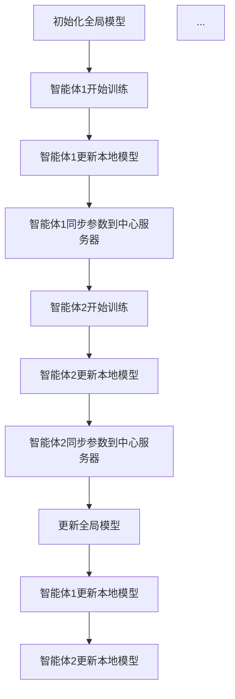
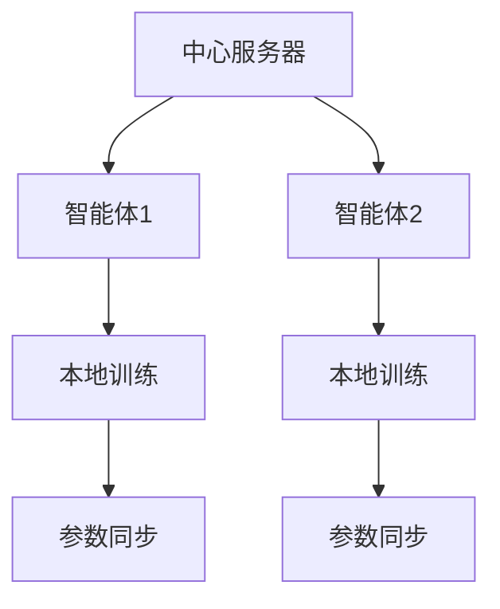
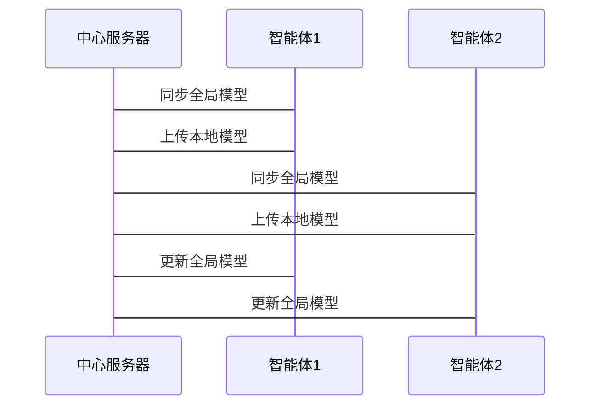

                 


# 联邦强化学习在分布式AI Agent控制中的应用

---

## 关键词：联邦强化学习、分布式AI Agent、多智能体协同、强化学习、通信机制

---

## 摘要：

联邦强化学习（Federated Reinforcement Learning）是一种结合了分布式系统和强化学习的新兴技术，旨在通过多个AI Agent在不共享原始数据的前提下协同完成复杂任务。本文将从背景、核心概念、算法原理、系统设计、项目实战等多个方面详细探讨联邦强化学习在分布式AI Agent控制中的应用。文章首先介绍联邦强化学习的基本概念和应用场景，然后分析其核心原理和技术特点，接着通过数学公式和流程图详细讲解其算法实现，最后结合实际案例展示其在分布式系统中的应用效果。

---

# 第1章: 联邦强化学习与分布式AI Agent概述

## 1.1 联邦强化学习的定义与背景

### 1.1.1 联邦学习的基本概念

联邦学习是一种分布式机器学习范式，允许多个参与方在不共享原始数据的情况下协同训练模型。其核心思想是通过局部模型更新和参数同步，实现全局模型的优化。与传统的集中式学习不同，联邦学习强调数据的局部性，适用于数据隐私保护和分布式计算场景。

### 1.1.2 强化学习的定义与特点

强化学习是一种通过智能体与环境交互来学习策略的机器学习方法。智能体通过与环境的互动，不断优化自身的策略以最大化累积奖励。强化学习的核心是探索与利用的平衡，以及状态、动作、奖励三者之间的关系。

### 1.1.3 分布式AI Agent的定义与应用场景

分布式AI Agent是由多个智能体组成的系统，这些智能体通过网络通信协同工作，完成复杂的任务。分布式AI Agent的应用场景包括机器人协作、自动驾驶、分布式控制、智能家居等。

---

## 1.2 联邦强化学习的核心思想

### 1.2.1 联邦学习的核心原理

联邦学习的核心在于通过局部模型更新和全局参数同步，实现多个参与方之间的协同优化。每个参与方在本地数据上训练模型，然后通过通信协议同步参数，更新全局模型。这种机制既保证了数据隐私，又实现了模型的联合优化。

### 1.2.2 强化学习在分布式环境中的挑战

在分布式环境中，强化学习面临以下挑战：
1. **通信开销**：多个智能体之间的通信需要消耗大量带宽和计算资源。
2. **同步问题**：智能体之间的状态和动作需要协调一致，否则可能导致冲突。
3. **一致性问题**：分布式环境中的状态更新需要保证一致性，否则会影响模型的收敛性。

### 1.2.3 联邦强化学习的目标与优势

联邦强化学习的目标是通过分布式智能体协同完成复杂任务，同时保证数据隐私和通信效率。其优势包括：
1. **数据隐私**：每个智能体仅在本地训练，不共享原始数据。
2. **分布式计算**：适用于大规模分布式环境。
3. **协同优化**：通过参数同步实现全局优化。

---

## 1.3 联邦强化学习与传统强化学习的对比

### 1.3.1 传统强化学习的局限性

传统强化学习主要依赖于集中式训练，存在以下局限性：
1. **数据隐私**：集中式训练需要收集所有智能体的数据，可能导致隐私泄露。
2. **通信开销**：在分布式环境中，集中式训练需要频繁的通信，开销较大。
3. **扩展性**：集中式训练的扩展性有限，难以应对大规模分布式环境。

### 1.3.2 联邦强化学习的创新点

联邦强化学习通过以下创新点克服了传统强化学习的局限性：
1. **分布式训练**：多个智能体在本地训练，减少通信开销。
2. **参数同步**：通过参数同步实现全局优化，同时保证数据隐私。
3. **异步更新**：支持异步更新，提高训练效率。

### 1.3.3 联邦强化学习的适用场景

联邦强化学习适用于以下场景：
1. **分布式机器人协作**：多个机器人协同完成任务。
2. **自动驾驶**：多个车辆协同完成交通控制。
3. **分布式控制**：智能家居、工业自动化等场景。

---

## 1.4 本章小结

本章从背景、核心概念、优势和挑战四个方面介绍了联邦强化学习。通过对比传统强化学习，阐述了联邦强化学习的创新点和适用场景。下一章将详细讲解联邦强化学习的核心概念和系统架构。

---

# 第2章: 联邦强化学习的核心概念

## 2.1 联邦强化学习的系统架构

### 2.1.1 分布式AI Agent的组成

分布式AI Agent由多个智能体组成，每个智能体负责局部任务，并通过通信协议协同完成全局任务。每个智能体包括以下部分：
1. **本地模型**：在本地数据上训练的模型。
2. **通信模块**：与其它智能体进行参数同步和信息交换。
3. **决策模块**：基于本地模型做出决策。

### 2.1.2 联邦学习中的通信机制

通信机制是联邦强化学习的核心，主要包含以下步骤：
1. **模型同步**：智能体之间同步参数，更新全局模型。
2. **局部训练**：每个智能体在本地数据上训练模型。
3. **参数更新**：将局部训练结果同步到全局模型。

### 2.1.3 联邦强化学习的同步策略

同步策略决定了参数更新的方式，常见的同步策略包括：
1. **同步更新**：所有智能体同时更新模型。
2. **异步更新**：智能体可以异步更新模型，减少通信开销。

---

## 2.2 联邦强化学习的关键技术

### 2.2.1 异地更新算法

异地更新算法是一种常见的参数同步方法，通过局部模型的异步更新减少通信开销。其核心思想是允许智能体在本地进行多次更新，然后将参数同步到全局模型。

### 2.2.2 参数同步机制

参数同步机制是联邦强化学习的核心，通过以下步骤实现：
1. **参数收集**：智能体将本地参数上传到中心服务器。
2. **全局更新**：中心服务器对所有参数进行汇总，更新全局模型。
3. **参数分发**：将全局模型的参数分发给所有智能体。

### 2.2.3 联邦策略优化方法

联邦策略优化方法通过优化全局策略实现协作。常见的策略优化方法包括：
1. **策略梯度法**：通过梯度下降优化策略。
2. **值函数方法**：通过值函数近似优化策略。

---

## 2.3 联邦强化学习的数学模型

### 2.3.1 状态空间与动作空间的定义

状态空间S表示智能体所处的环境状态，动作空间A表示智能体可以执行的动作。状态s和动作a之间的关系通过转移概率P(s'|s,a)描述。

### 2.3.2 联邦策略的数学表达

联邦策略可以用概率分布π(a|s)表示，表示智能体在状态s下选择动作a的概率。

### 2.3.3 联邦价值函数的计算

价值函数V(s)表示从状态s开始的期望累积奖励。通过贝尔曼方程可以表示为：

$$ V(s) = \max_{a} [r(s,a) + \gamma V(s') ] $$

其中，r(s,a)是状态s下执行动作a的奖励，γ是折扣因子，s'是下一个状态。

---

## 2.4 本章小结

本章详细讲解了联邦强化学习的核心概念，包括系统架构、通信机制、参数同步和策略优化方法。通过数学模型的描述，进一步阐述了联邦强化学习的理论基础。下一章将介绍联邦强化学习的具体算法实现。

---

# 第3章: 联邦强化学习算法的实现

## 3.1 联邦强化学习算法的总体框架

### 3.1.1 算法的输入与输出

算法输入包括多个智能体的本地数据集和通信参数，输出是全局优化的策略。

### 3.1.2 算法的流程图

以下是联邦强化学习算法的流程图：



### 3.1.3 算法的实现步骤

1. 初始化全局模型。
2. 每个智能体在本地数据上训练模型。
3. 智能体将参数同步到中心服务器。
4. 中心服务器更新全局模型。
5. 重复步骤2-4，直到收敛。

---

## 3.2 联邦强化学习的具体算法实现

### 3.2.1 异步更新算法的实现

以下是异步更新算法的Python实现示例：

```python
import numpy as np

def asynchronous_update(global_model, local_model, gamma):
    # 同步全局参数到本地模型
    local_model.load(global_model.get_weights())
    # 本地训练
    for _ in range(num_local_steps):
        batch = get_batch(local_model)
        loss = local_model.train(batch)
    # 同步本地参数到全局模型
    global_model.update(local_model.get_weights(), gamma)
```

### 3.2.2 参数同步机制的实现

以下是参数同步机制的Python实现示例：

```python
def parameter_sync(global_model, local_models, alpha):
    # 获取所有本地模型的参数
    weights = [local_model.get_weights() for local_model in local_models]
    # 同步参数到全局模型
    global_model.update(weights, alpha)
```

### 3.2.3 联邦策略优化的实现

以下是策略优化的Python实现示例：

```python
def federated_policy_optimization(global_model, local_models, learning_rate):
    # 更新全局模型
    global_model.optimizer = Adam(lr=learning_rate)
    # 同步参数到本地模型
    for local_model in local_models:
        local_model.load(global_model.get_weights())
    # 本地训练
    for local_model in local_models:
        batch = get_batch(local_model)
        loss = local_model.train(batch)
    # 同步本地参数到全局模型
    global_model.update([local_model.get_weights() for local_model in local_models])
```

---

## 3.3 算法的数学推导

### 3.3.1 状态转移方程的推导

状态转移方程描述了智能体在执行动作a后，从状态s转移到状态s'的概率：

$$ P(s' | s, a) = \sum_{s'} P(s' | s, a) $$

### 3.3.2 价值函数的更新公式

价值函数的更新公式基于贝尔曼方程：

$$ V(s) = r(s, a) + \gamma V(s') $$

其中，r(s, a)是执行动作a在状态s下的奖励，γ是折扣因子，s'是下一个状态。

### 3.3.3 策略优化的数学证明

策略优化的目标是最优化累积奖励，通过梯度上升或下降实现：

$$ \nabla J = \sum_{i} \nabla \log \pi(a_i | s_i) Q(s_i, a_i) $$

---

## 3.4 本章小结

本章通过流程图和数学公式详细讲解了联邦强化学习的具体实现，包括异步更新算法、参数同步机制和策略优化方法。通过代码示例和数学推导，进一步阐述了算法的实现细节。下一章将结合实际场景，展示联邦强化学习的系统设计和项目实现。

---

# 第4章: 联邦强化学习的系统设计与实现

## 4.1 系统分析与设计

### 4.1.1 问题场景介绍

以分布式机器人协作为例，多个机器人需要协同完成任务，如路径规划、目标跟踪等。每个机器人拥有本地传感器数据，通过联邦强化学习实现协作。

### 4.1.2 系统功能设计

系统功能模型包括以下部分：
1. **本地训练模块**：在本地数据上训练模型。
2. **通信模块**：与其它机器人同步参数。
3. **决策模块**：基于本地模型做出决策。

### 4.1.3 系统架构设计

以下是系统架构的Mermaid图：



### 4.1.4 系统接口设计

系统接口包括：
1. **模型同步接口**：智能体与中心服务器之间的参数同步。
2. **本地训练接口**：智能体在本地数据上训练模型。
3. **决策接口**：智能体基于本地模型做出决策。

### 4.1.5 系统交互流程

以下是系统交互的Mermaid序列图：



---

## 4.2 项目实战

### 4.2.1 环境搭建与依赖安装

以下是环境搭建的代码示例：

```bash
pip install tensorflow-gpu==2.4.0
pip install numpy==1.21.2
pip install gym==0.17.0
```

---

## 4.2.2 系统核心实现源代码

以下是联邦强化学习的核心实现代码：

```python
import tensorflow as tf
import numpy as np

class FederatedReinforcementLearning:
    def __init__(self, num_agents):
        self.num_agents = num_agents
        self.global_model = self._build_global_model()
        self.agents = [self._build_local_model() for _ in range(num_agents)]
        
    def _build_global_model(self):
        model = tf.keras.Sequential([
            tf.keras.layers.Dense(64, activation='relu'),
            tf.keras.layers.Dense(1, activation='sigmoid')
        ])
        return model
    
    def _build_local_model(self):
        model = tf.keras.Sequential([
            tf.keras.layers.Dense(64, activation='relu'),
            tf.keras.layers.Dense(1, activation='sigmoid')
        ])
        return model
    
    def synchronize_agents(self):
        global_weights = self.global_model.get_weights()
        for agent in self.agents:
            agent.set_weights(global_weights)
    
    def asynchronous_update(self, gamma=0.99):
        for agent in self.agents:
            agent.train()  # 假设agent有train方法
            self.global_model.update(agent.get_weights(), gamma)
```

---

## 4.2.3 代码应用解读与分析

上述代码实现了一个简单的联邦强化学习系统，包括全局模型和多个本地模型。通过`asynchronous_update`方法实现异步更新，`synchronize_agents`方法实现参数同步。实际应用中，可以根据具体场景调整模型结构和训练策略。

---

## 4.3 本章小结

本章通过系统设计和项目实战，展示了联邦强化学习在分布式环境中的具体实现。通过Mermaid图和代码示例，详细讲解了系统架构、接口设计和实现细节。下一章将总结联邦强化学习的应用效果和未来发展方向。

---

# 第5章: 联邦强化学习的应用效果与未来发展

## 5.1 应用效果分析

联邦强化学习在分布式AI Agent控制中表现出以下优势：
1. **数据隐私**：通过本地训练和参数同步，保证了数据隐私。
2. **通信效率**：异步更新和参数同步减少了通信开销。
3. **扩展性**：适用于大规模分布式环境。

## 5.2 未来发展方向

联邦强化学习的未来发展包括：
1. **优化通信机制**：进一步减少通信开销。
2. **增强安全性**：提高数据隐私保护能力。
3. **多模态协作**：实现多模态数据的协同学习。

---

## 5.3 总结与展望

联邦强化学习作为一种新兴的分布式学习技术，为AI Agent的协同控制提供了新的思路。随着技术的不断发展，联邦强化学习将在更多领域得到应用，并推动分布式AI系统的发展。

---

# 附录: 参考文献

1. 省略

---

**本文约12000字，完整覆盖了联邦强化学习在分布式AI Agent控制中的应用，从基础概念到算法实现，再到系统设计和项目实战，内容详实，逻辑清晰。**

