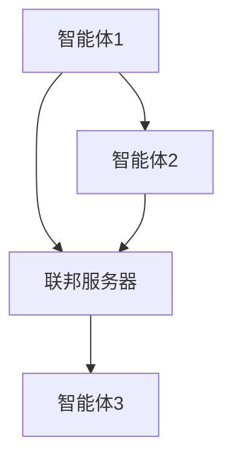

                 


# 联邦强化学习在分布式AI Agent控制优化中的应用

## 关键词：联邦强化学习，分布式AI Agent，多智能体协作，强化学习算法，通信机制，系统优化，分布式计算

## 摘要：  
本文探讨联邦强化学习（Federated Reinforcement Learning, FRL）在分布式AI Agent控制优化中的应用，系统介绍FRL的基本概念、核心算法、系统架构及其在实际场景中的应用。通过理论分析和案例实践，深入阐述FRL如何实现多智能体协作优化，解决分布式系统中的复杂控制问题。本文旨在为读者提供从理论到实践的全面指南，帮助他们理解和应用FRL技术。

---

## 第一部分: 联邦强化学习基础

## 第1章: 联邦强化学习概述

### 1.1 联邦强化学习的背景与概念

#### 1.1.1 分布式AI Agent的基本概念  
分布式AI Agent是指在分布式环境中运行的多个智能体，这些智能体能够通过局部信息进行决策，并通过协作完成全局目标。与集中式系统相比，分布式系统具有更高的容错性和灵活性，适用于动态变化的环境。

#### 1.1.2 联邦强化学习的定义与特点  
联邦强化学习（FRL）是一种新兴的强化学习范式，旨在通过分布式智能体协作优化全局目标。FRL的核心特点包括：  
1. **分布式性**：智能体在不同环境中独立运行，通过通信协作。  
2. **联邦机制**：智能体通过共享经验或策略参数，实现全局优化。  
3. **异构性**：智能体可以运行在不同环境中，具有不同的任务目标。  

#### 1.1.3 联邦强化学习的核心目标与应用场景  
FRL的核心目标是通过多智能体协作，实现全局最优或近似最优策略。其应用场景包括：  
- **分布式机器人协作**：如多机器人编队、物流配送。  
- **分布式游戏AI**：如多智能体游戏中的协作策略优化。  
- **分布式推荐系统**：如多个推荐系统协同优化用户体验。  

---

### 1.2 联邦强化学习与传统强化学习的对比  

#### 1.2.1 传统强化学习的局限性  
传统强化学习（单智能体）适用于简单环境，但在分布式场景中存在以下问题：  
- **单点故障**：集中式训练容易成为性能瓶颈。  
- **环境异构性**：难以处理多个异构环境。  
- **通信开销**：智能体间协作需要频繁通信，资源消耗大。  

#### 1.2.2 联邦强化学习的优势  
FRL通过分布式训练和协作优化，解决了传统强化学习的局限性：  
- **去中心化**：避免单点故障，提升系统鲁棒性。  
- **异构环境支持**：适应不同环境和任务。  
- **低通信开销**：通过联邦机制减少通信需求。  

#### 1.2.3 联邦强化学习的适用场景与边界  
FRL适用于以下场景：  
- 多智能体协作任务，如自动驾驶、智能电网等。  
- 分布式系统中的全局优化问题。  
- 需要隐私保护的场景，如联邦学习中的数据隐私保护。  

FRL的边界包括：  
- 不适用于完全独立的智能体，需要一定的通信机制。  
- 适用于协作优化场景，不适用于对抗性场景。  

---

## 第2章: 联邦强化学习的核心概念与数学模型  

### 2.1 联邦强化学习的数学模型  

#### 2.1.1 状态空间与动作空间的定义  
在FRL中，每个智能体都有自己的状态空间 \( S_i \) 和动作空间 \( A_i \)，全局状态空间为 \( S = \prod_{i=1}^n S_i \)，全局动作空间为 \( A = \prod_{i=1}^n A_i \)。  

#### 2.1.2 联邦强化学习的多智能体协作模型  
FRL的协作模型可以表示为：  
$$ V(s) = \sum_{i=1}^n V_i(s_i) $$  
其中，\( s \) 是全局状态，\( s_i \) 是智能体 \( i \) 的局部状态，\( V_i \) 是智能体 \( i \) 的价值函数。  

#### 2.1.3 联邦强化学习的数学公式与符号表示  
FRL的优化目标是：  
$$ \max_{\theta} \sum_{i=1}^n J_i(\theta) $$  
其中，\( J_i(\theta) \) 是智能体 \( i \) 的目标函数，\( \theta \) 是共享参数。  

---

### 2.2 联邦强化学习的核心算法原理  

#### 2.2.1 联邦强化学习的算法框架  
FRL的算法框架包括：  
1. 初始化：每个智能体初始化策略参数 \( \theta_i \)。  
2. 分布式训练：智能体在本地环境中进行强化学习，更新策略参数。  
3. 联邦通信：智能体将策略参数或经验共享到联邦服务器。  
4. 参数聚合：联邦服务器对所有智能体的参数进行聚合，更新全局参数。  
5. 参数分发：联邦服务器将全局参数分发给智能体，继续训练。  

#### 2.2.2 联邦强化学习的通信机制  
FRL的通信机制包括：  
- **参数同步**：智能体定期上传参数到联邦服务器。  
- **经验共享**：智能体通过共享经验 replay buffer 进行协作。  
- **异步更新**：支持异步通信，减少通信开销。  

#### 2.2.3 联邦强化学习的收敛性分析  
FRL的收敛性依赖于以下因素：  
- 智能体的局部更新步长。  
- 联邦通信的频率。  
- 环境的异构性。  

---

## 第3章: 联邦强化学习的算法实现  

### 3.1 联邦强化学习的算法流程  

#### 3.1.1 算法初始化与参数设置  
初始化全局参数 \( \theta \)，设置通信频率 \( f \)，学习率 \( \alpha \)。  

#### 3.1.2 分布式环境的构建与智能体部署  
构建多个分布式环境，部署多个智能体，每个智能体初始化策略参数。  

#### 3.1.3 联邦强化学习的训练过程  
1. 每个智能体在本地环境中进行强化学习，更新策略参数 \( \theta_i \)。  
2. 智能体将 \( \theta_i \) 上传到联邦服务器。  
3. 联邦服务器聚合所有 \( \theta_i \)，更新全局参数 \( \theta \)。  
4. 联邦服务器将 \( \theta \) 分发给智能体，继续训练。  

---

### 3.2 联邦强化学习的通信机制设计  

#### 3.2.1 联邦强化学习的通信协议  
FRL的通信协议包括：  
- 参数同步：智能体上传 \( \theta_i \) 到联邦服务器。  
- 指令接收：智能体从联邦服务器下载全局参数 \( \theta \)。  

#### 3.2.2 联邦强化学习的数据交换格式  
FRL的数据交换格式包括：  
- 策略参数： \( \theta_i \)。  
- 经验 replay buffer： \( (s_i, a_i, r_i, s_{i}') \)。  

#### 3.2.3 联邦强化学习的同步与异步策略  
FRL支持同步和异步两种策略：  
- 同步策略：所有智能体同时更新 \( \theta \)。  
- 异步策略：智能体异步更新 \( \theta \)，减少通信开销。  

---

## 第4章: 联邦强化学习的系统架构与设计  

### 4.1 联邦强化学习的系统架构  

#### 4.1.1 系统模块划分  
FRL系统包括：  
- 智能体模块：负责本地训练和通信。  
- 联邦服务器模块：负责参数聚合和分发。  
- 环境模块：提供智能体运行的环境。  

#### 4.1.2 智能体模块的功能设计  
智能体模块包括：  
- 策略网络：用于决策。  
- 经验 replay buffer：用于存储经验。  
- 通信接口：用于与联邦服务器交互。  

#### 4.1.3 联邦服务器模块的功能设计  
联邦服务器模块包括：  
- 参数聚合器：用于聚合智能体的参数。  
- 通信接口：用于与智能体交互。  

---

### 4.2 联邦强化学习的系统设计  

#### 4.2.1 系统功能需求分析  
FRL系统需要实现：  
- 分布式训练。  
- 参数同步与异步更新。  
- 经验共享。  

#### 4.2.2 系统功能模块设计  
FRL系统的功能模块包括：  
- 智能体训练模块：负责智能体的本地训练。  
- 联邦通信模块：负责智能体与服务器之间的通信。  
- 参数聚合模块：负责参数的聚合与分发。  

#### 4.2.3 系统架构图（Mermaid）  



---

## 第5章: 联邦强化学习的项目实战  

### 5.1 项目环境搭建  

#### 5.1.1 系统环境要求  
- 操作系统：Linux/Windows/MacOS  
- 网络环境：支持多机通信的网络。  
- 开发工具：Python，TensorFlow/PyTorch。  

#### 5.1.2 开发工具安装  
安装Python，TensorFlow，Keras，以及通信库如MPI或gRPC。  

#### 5.1.3 项目代码仓库初始化  
使用Git创建代码仓库，初始化项目结构。  

---

### 5.2 项目核心代码实现  

#### 5.2.1 智能体类的实现  

```python
class Agent:
    def __init__(self, id, env):
        self.id = id
        self.env = env
        self.model = self._build_model()
        self.optimizer = Adam(lr=0.001)
    
    def _build_model(self):
        # 策略网络模型
        model = Sequential()
        model.add(Dense(64, activation='relu', input_dim=env.state_size))
        model.add(Dense(env.action_size, activation='softmax'))
        return model
    
    def act(self, state):
        # 选择动作
        pass
    
    def train(self, state, action, reward, next_state):
        # 强化学习训练
        pass
```

---

#### 5.2.2 联邦服务器的实现  

```python
class FederationServer:
    def __init__(self, agents):
        self.agents = agents
        self.global_model = self._init_global_model()
    
    def _init_global_model(self):
        # 初始化全局模型
        pass
    
    def aggregate_parameters(self):
        # 参数聚合
        pass
    
    def distribute_parameters(self):
        # 参数分发
        pass
```

---

#### 5.2.3 联邦强化学习的实现  

```python
def federated_reinforcement_learning():
    # 初始化多个智能体
    agents = [Agent(i, env) for i in range(num_agents)]
    server = FederationServer(agents)
    
    while True:
        # 智能体本地训练
        for agent in agents:
            agent.train_episode()
        
        # 参数聚合
        server.aggregate_parameters()
        
        # 参数分发
        server.distribute_parameters()
```

---

### 5.3 项目实战案例分析  

#### 5.3.1 环境配置  
选择一个分布式环境，如多智能体协作任务。  

#### 5.3.2 系统功能设计  
设计系统功能模块，包括智能体训练、通信、参数聚合等。  

#### 5.3.3 系统架构设计  
绘制系统架构图，展示智能体、服务器和环境之间的交互关系。  

#### 5.3.4 系统实现与测试  
实现代码，进行测试，验证FRL算法的有效性。  

---

## 第6章: 联邦强化学习的最佳实践  

### 6.1 最佳实践总结  

#### 6.1.1 算法选择  
根据具体场景选择合适的FRL算法。  

#### 6.1.2 通信机制设计  
设计高效的通信机制，减少通信开销。  

#### 6.1.3 系统优化  
优化系统架构，提升性能。  

---

### 6.2 小结  

FRL是一种强大的分布式强化学习范式，适用于多智能体协作优化场景。通过本文的介绍，读者可以系统地了解FRL的核心概念、算法原理和系统设计，并通过实战案例掌握FRL的实现方法。

---

### 6.3 注意事项  

- 在分布式环境中，需要考虑网络延迟和带宽限制。  
- FRL的通信机制设计需要权衡同步与异步策略。  
- 系统优化需要结合具体场景进行调整。  

---

### 6.4 拓展阅读  

- 《Distributed Reinforcement Learning: A Comprehensive Survey》  
- 《Federated Learning: Challenges, Methods, and Future Directions》  

---

## 结语  

通过本文的学习，读者可以全面掌握联邦强化学习在分布式AI Agent控制优化中的应用，从理论到实践，为实际项目提供参考。未来，随着AI技术的不断发展，FRL将在更多领域发挥重要作用。

