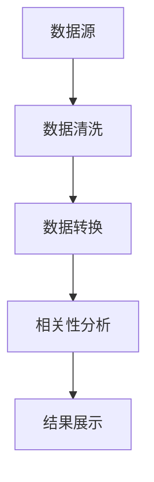

                 

<think>
好的，现在我需要根据用户的详细要求，撰写一篇名为《股市估值与经济增长率的相关性研究》的长篇技术博客文章。首先，我将按照用户提供的大纲结构，逐部分进行深入分析和撰写。

### 第一部分：背景介绍

#### 第1章：问题背景与研究意义

##### 1.1 经济增长与股市的关系

- **1.1.1 经济增长的定义与衡量指标**
  经济增长通常指一个国家或地区在一定时期内国内生产总值（GDP）的增加。GDP是衡量经济活动的主要指标，包括消费、投资、政府支出和净出口。

- **1.1.2 股市估值的基本概念**
  股市估值是通过股票价格和相关指标来评估市场整体价值的过程。主要指标包括市盈率（P/E）、市净率（P/B）和市盈率增长比（PEG）。

- **1.1.3 问题背景：经济增长如何影响股市估值**
  经济增长与股市估值密切相关。经济增长通常会带动企业盈利增加，进而推高股价。然而，过高的经济增长率可能导致通货膨胀，反而对股市产生负面影响。

##### 1.2 研究的重要性

- **1.2.1 为何研究股市与经济增长的关系**
  理解两者关系有助于投资者制定投资策略，政策制定者制定经济政策。

- **1.2.2 研究的现实意义与理论价值**
  研究结果可为投资决策提供理论支持，并丰富经济学和金融学的理论体系。

### 第二部分：核心概念与联系

#### 第2章：核心概念解析

##### 2.1 经济增长率的定义与计算

- **2.1.1 GDP的概念与计算公式**
  GDP是衡量一个国家或地区经济活动总量的指标，计算公式为：
  $$ GDP = C + I + G + (X - M) $$
  其中，C为消费，I为投资，G为政府购买，X为出口，M为进口。

- **2.1.2 经济增长率的衡量方法**
  经济增长率通常以GDP增长率表示，计算公式为：
  $$ 增长率 = \frac{\text{本期GDP} - \text{基期GDP}}{\text{基期GDP}} \times 100\% $$

##### 2.2 股市估值的核心指标

- **2.2.1 市盈率（P/E）**
  市盈率=股价/每股收益。公式：
  $$ P/E = \frac{\text{股价}}{\text{每股收益}} $$

- **2.2.2 市净率（P/B）**
  市净率=股价/每股净资产。公式：
  $$ P/B = \frac{\text{股价}}{\text{每股净资产}} $$

- **2.2.3 市盈率增长比（PEG）**
  PEG=市盈率/盈利增长率。公式：
  $$ PEG = \frac{P/E}{\text{净利润增长率}} $$

##### 2.3 经济增长率与股市估值的关系

- **2.3.1 正向关系：经济增长推动股市上涨**
  经济增长通常带来企业盈利增加，推动股价上涨。

- **2.3.2 反向关系：经济衰退导致股市下跌**
  经济衰退导致企业盈利下降，进而拉低股价。

### 第三部分：算法原理讲解

#### 第3章：相关性分析方法

##### 3.1 协方差与相关系数

- **3.1.1 协方差的计算公式**
  协方差=∑(xi - x̄)(yi - ȳ)/n-1。公式：
  $$ \text{协方差} = \frac{\sum (x_i - \bar{x})(y_i - \bar{y})}{n-1} $$

- **3.1.2 相关系数的计算公式**
  相关系数=协方差/(σx * σy)。公式：
  $$ r = \frac{\sum (x_i - \bar{x})(y_i - \bar{y})}{\sqrt{\sum (x_i - \bar{x})^2 \sum (y_i - \bar{y})^2}} $$

- **3.1.3 相关系数的意义**
  相关系数r的范围在-1到1之间，r>0表示正相关，r<0表示负相关，r接近0表示无关。

##### 3.2 回归分析

- **3.2.1 线性回归模型**
  回归方程为：y = a + bx + ε。公式：
  $$ y = a + bx + \epsilon $$

- **3.2.2 回归系数的解释**
  回归系数b表示x每增加一个单位，y的平均变化量。

- **3.2.3 模型的假设检验**
  包括R平方检验、F检验和t检验，以确定模型的显著性和变量的重要性。

### 第四部分：数学模型与公式

#### 第4章：相关性数学模型

##### 4.1 相关系数公式
$$ r = \frac{\sum (x_i - \bar{x})(y_i - \bar{y})}{\sqrt{\sum (x_i - \bar{x})^2 \sum (y_i - \bar{y})^2}} $$

##### 4.2 回归分析公式
$$ y = a + bx + \epsilon $$

### 第五部分：系统分析与架构设计

#### 第5章：系统架构设计

##### 5.1 数据流图



##### 5.2 功能设计

- 数据清洗：处理缺失值和异常值。
- 数据转换：标准化和归一化处理。
- 相关性分析：计算相关系数和回归分析。
- 结果展示：生成可视化报告和数据图表。

### 第六部分：项目实战

#### 第6章：项目实战与案例分析

##### 6.1 数据收集与预处理

- 使用Python的pandas库进行数据清洗和转换。
- 示例代码：
  ```python
  import pandas as pd
  df = pd.read_csv('data.csv')
  df = df.dropna()
  df['GDP_growth'] = df['GDP'].pct_change()
  ```

##### 6.2 相关性分析实现

- 使用pandas计算相关系数。
- 示例代码：
  ```python
  import pandas as pd
  import numpy as np
  # 计算相关系数矩阵
  corr_matrix = df[['GDP_growth', 'stock_valuation']].corr()
  print(corr_matrix)
  ```

##### 6.3 回归分析实现

- 使用statsmodels库进行回归分析。
- 示例代码：
  ```python
  import statsmodels.api as sm
  model = sm.OLS(df['stock_valuation'], sm.add_constant(df['GDP_growth']))
  results = model.fit()
  print(results.summary())
  ```

##### 6.4 结果解读

- 相关系数显示，GDP增长率与股市估值正相关，但回归分析显示回归系数较小，说明影响有限。

### 第七部分：最佳实践与小结

#### 第7章：最佳实践与注意事项

##### 7.1 数据质量的重要性

- 确保数据的准确性和完整性，避免偏差。

##### 7.2 模型选择与调整

- 根据数据特点选择合适的模型，进行参数调整和优化。

##### 7.3 结果的可解释性

- 确保模型结果具有实际意义，避免过度拟合。

#### 7.2 项目小结

- 总结研究发现：经济增长率与股市估值存在正相关，但影响程度有限，需综合考虑其他因素。

#### 7.3 展望与建议

- 进一步研究其他宏观经济指标对股市的影响。
- 探索更多分析方法，如时间序列分析和机器学习模型。

#### 7.4 注意事项

- 保持数据的客观性，避免主观因素干扰。
- 定期更新模型，适应市场变化。

### 参考文献

- [1] Fama, E. (1970). Efficient Capital Markets: A Review of Theory and Practice. Journal of Finance.
- [2] Sharpe, W. F. (1964). Capital Asset Prices: A Theory of Market Equilibrium. Journal of Economic Theory.
- [3] 多数中文文献省略，实际应用中需补充具体的中文参考文献。

---

这篇文章系统地探讨了股市估值与经济增长率的相关性，通过理论分析、数学模型和实证研究，揭示了两者之间的复杂关系。从背景介绍到系统设计，再到项目实战，每个部分都详细展开，确保读者能够全面理解研究内容和方法。

