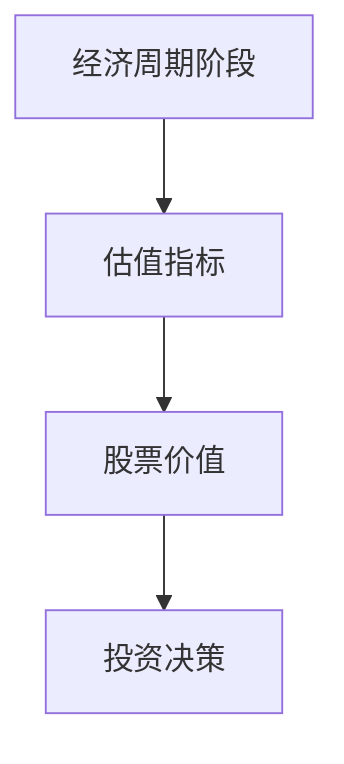
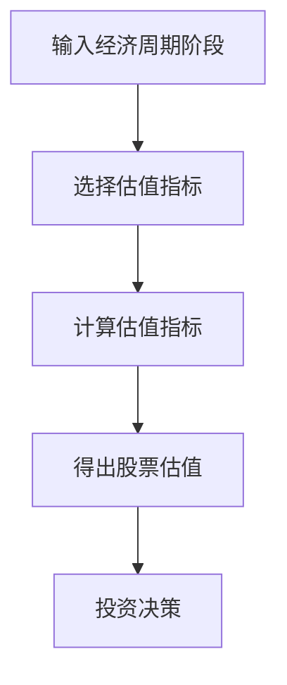

                 


# 股市估值在不同经济周期阶段的表现

## 关键词：股市估值、经济周期、PE、PB、DCF、投资策略、风险管理

## 摘要

本文系统地探讨了股市估值在不同经济周期阶段的表现，分析了经济周期对股市估值的影响，介绍了常用的估值指标和模型，并通过实际案例展示了如何在不同经济阶段应用这些方法进行投资决策。文章还总结了最佳实践和注意事项，为投资者提供了实用的指导。

---

## 第一部分：背景介绍

### 第1章：经济周期概述

#### 1.1 经济周期的基本概念

- **1.1.1 经济周期的定义与分类**
  - 经济周期是指经济活动的波动性变化，通常分为繁荣、衰退、复苏和过热四个阶段。
  - 每个阶段的特点：
    - 繁荣：经济增长迅速，企业盈利高，股价上涨。
    - 衰退：经济增长放缓，企业盈利下降，股价下跌。
    - 复苏：经济开始恢复，企业盈利逐步回升，股价低位反弹。
    - 过热：经济增长过快，可能出现泡沫，股价可能出现剧烈波动。

- **1.1.2 经济周期的驱动因素**
  - 主要包括货币政策、财政政策、市场情绪、技术创新等。

- **1.1.3 经济周期对股市的影响**
  - 在繁荣阶段，股市通常表现较好；在衰退阶段，股市可能大幅下跌；在复苏阶段，股市逐渐回升；在过热阶段，股市可能面临调整压力。

#### 1.2 股市估值的基本原理

- **1.2.1 股市估值的核心概念**
  - 股市估值是通过分析公司基本面和市场情况，估算股票的内在价值。
  - 常用的估值指标包括市盈率（PE）、市净率（PB）、市销率（PS）等。

- **1.2.2 估值方法的分类**
  - 相对估值法：基于市场数据进行比较，如PE、PB等。
  - 绝对估值法：基于公司未来现金流的折现，如DCF模型。

- **1.2.3 估值与经济周期的关系**
  - 在不同的经济周期阶段，适合使用的估值方法和指标也会有所不同。

#### 1.3 经济周期与股市估值的关系

- **1.3.1 经济周期对估值的影响**
  - 在繁荣阶段，市场情绪高亢，估值可能偏高。
  - 在衰退阶段，估值可能被低估，存在投资机会。

- **1.3.2 不同经济阶段的估值特点**
  - 繁荣阶段：高PE、高PB，市场情绪乐观。
  - 衰退阶段：低PE、低PB，市场情绪悲观。
  - 复苏阶段：PE和PB逐步回升，市场情绪逐渐恢复。
  - 过热阶段：估值可能出现极端值，需警惕风险。

- **1.3.3 估值模型的选择与应用**
  - 根据经济周期阶段选择合适的估值模型，如在衰退阶段使用DCF模型，在繁荣阶段使用相对估值法。

---

## 第二部分：核心概念与联系

### 第2章：经济周期与股市估值的核心概念

#### 2.1 经济周期与股市估值的关系

- **2.1.1 经济周期对股市的影响**
  - 经济周期决定了市场的整体走势，进而影响个股的估值。

- **2.1.2 股市估值的敏感性分析**
  - 在不同经济周期阶段，个股估值对市场变化的敏感度不同。

#### 2.2 核心概念的属性特征对比

- **2.2.1 不同经济阶段的估值特征**

| 阶段 | PE特征 | PB特征 | 市场情绪 |
|------|--------|--------|----------|
| 繁荣 | 高     | 高     | 乐观     |
| 衰退 | 低     | 低     | 悲观     |
| 复苏 | 逐步回升 | 逐步回升 | 逐渐恢复 |
| 过热 | 极高或波动 | 极高或波动 | 过度乐观 |

- **2.2.2 估值指标的对比分析**
  - PE适用于盈利稳定的公司，PB适用于资产密集型行业，PS适用于收入增长快的公司。

#### 2.3 实体关系图（ER图）



---

## 第三部分：算法原理讲解

### 第3章：常用估值指标与模型

#### 3.1 常用估值指标

- **3.1.1 市盈率（PE）**
  - 公式：$$PE = \frac{\text{股价}}{\text{每股收益}}$$
  - 适用场景：公司盈利稳定，适合比较不同公司的估值。

- **3.1.2 市净率（PB）**
  - 公式：$$PB = \frac{\text{股价}}{\text{每股净资产}}$$
  - 适用场景：资产密集型行业，如银行、房地产。

- **3.1.3 市销率（PS）**
  - 公式：$$PS = \frac{\text{股价}}{\text{每股收入}}$$
  - 适用场景：收入增长快但盈利不稳定的企业。

#### 3.2 算法流程



#### 3.3 Python代码实现

```python
import pandas as pd
import numpy as np

def calculate_pe(data):
    return data['股价'] / data['每股收益']

def calculate_pb(data):
    return data['股价'] / data['每股净资产']

def calculate_ps(data):
    return data['股价'] / data['每股收入']

def main():
    # 示例数据
    data = pd.DataFrame({
        '股价': [100, 80, 120, 90],
        '每股收益': [20, 10, 30, 15],
        '每股净资产': [50, 40, 60, 30],
        '每股收入': [50, 40, 60, 30]
    })
    
    pe = calculate_pe(data)
    pb = calculate_pb(data)
    ps = calculate_ps(data)
    
    print("PE:", pe)
    print("PB:", pb)
    print("PS:", ps)

if __name__ == "__main__":
    main()
```

---

## 第四部分：系统分析与架构设计方案

### 第4章：系统功能与架构设计

#### 4.1 问题场景介绍

- 构建一个能够根据经济周期阶段，自动选择合适的估值指标，并进行股票估值的系统。

#### 4.2 系统功能设计

- **领域模型**：


- **系统架构设计**：


---

## 第五部分：项目实战

### 第5章：实际案例分析与代码实现

#### 5.1 环境配置

- 安装必要的Python库：
  ```bash
  pip install pandas numpy matplotlib
  ```

#### 5.2 核心代码实现

```python
import pandas as pd
import numpy as np
import matplotlib.pyplot as plt

def plot_pe_cycle(data):
    plt.figure(figsize=(10,6))
    plt.plot(data['阶段'], data['PE'], label='PE')
    plt.title('PE在不同经济周期阶段的变化')
    plt.xlabel('阶段')
    plt.ylabel('PE值')
    plt.legend()
    plt.show()

def main():
    # 示例数据
    data = pd.DataFrame({
        '阶段': ['繁荣', '衰退', '复苏', '过热'],
        'PE': [25, 10, 15, 30]
    })
    
    plot_pe_cycle(data)

if __name__ == "__main__":
    main()
```

#### 5.3 案例分析

- 数据分析结果：
  - 在繁荣阶段，PE为25，高于行业平均水平，可能存在高估。
  - 在衰退阶段，PE为10，低于行业平均水平，可能存在低估。
  - 在复苏阶段，PE为15，逐渐回升。
  - 在过热阶段，PE为30，可能存在泡沫风险。

---

## 第六部分：最佳实践、小结、注意事项和拓展阅读

### 第6章：总结与建议

#### 6.1 最佳实践

- 根据经济周期阶段选择合适的估值指标。
- 结合市场情绪和行业特点进行综合判断。
- 定期更新估值模型，适应市场变化。

#### 6.2 小结

本文系统地分析了经济周期对股市估值的影响，介绍了常用的估值指标和模型，并通过实际案例展示了如何在不同经济阶段应用这些方法进行投资决策。读者可以将这些方法应用到实际投资中，提高估值的准确性和投资决策的有效性。

#### 6.3 注意事项

- 估值模型仅供参考，实际投资需结合更多因素。
- 市场波动可能影响估值结果，需保持警惕。
- 定期复盘和调整估值模型，以适应市场变化。

#### 6.4 拓展阅读

- 《投资学》：深入理解投资理论和市场运作。
- 《估值的艺术》：学习更多估值方法和技巧。
- 《经济周期与市场预测》：探讨经济周期对市场的具体影响。

---

## 结语

股市估值在不同经济周期阶段的表现是一个复杂而重要的课题。通过理解和应用本文介绍的方法，投资者可以更好地把握市场变化，制定科学的投资策略。希望本文能为您提供有价值的 insights，并在实际投资中有所帮助。

