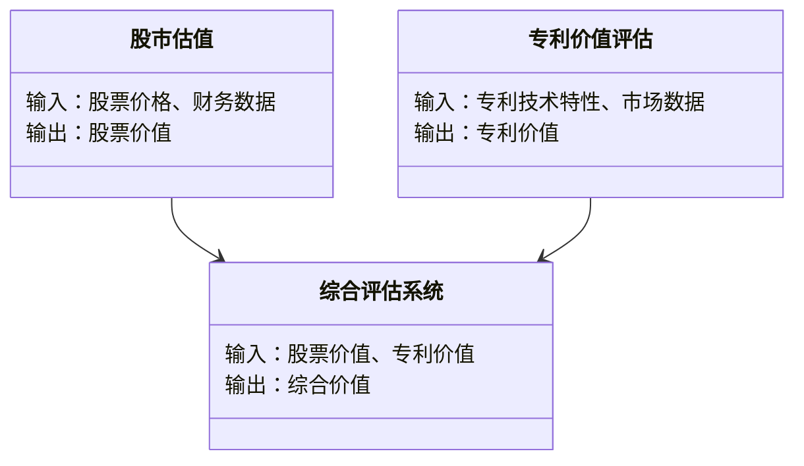
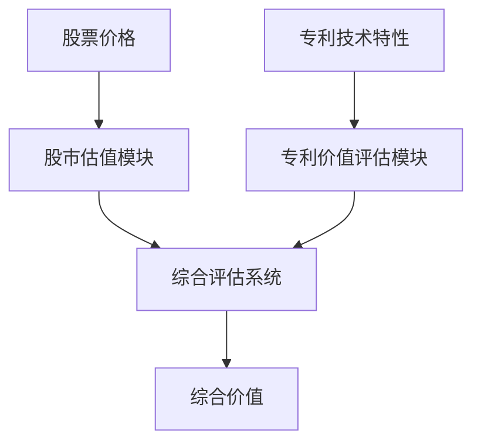

                 


# 股市估值在国际专利价值评估中的应用

> 关键词：股市估值、国际专利、价值评估、技术分析、投资策略、知识产权

> 摘要：本文探讨了股市估值方法在国际专利价值评估中的应用。通过分析股市估值的核心原理和专利价值评估的关键因素，结合实际案例，展示了如何将股市估值的技术分析方法与专利评估相结合，为企业制定科学的投资策略和知识产权管理提供支持。本文还提出了一个基于Python的专利价值评估模型，并通过实际案例分析，验证了该模型的有效性。

---

# 第一部分：股市估值与国际专利价值评估的背景

## 第1章：问题背景与核心概念

### 1.1 问题背景
随着全球经济的快速发展，知识产权（尤其是专利）在企业竞争中的重要性日益凸显。专利不仅是技术保护的核心手段，也是企业估值的重要组成部分。然而，如何科学地评估专利的价值，一直是企业面临的重要挑战。

股市估值作为金融领域的重要工具，其核心是通过对公司财务数据和市场表现的分析，评估其股票的内在价值。将股市估值的方法应用于专利价值评估，可以帮助企业更准确地衡量专利的价值，从而为投资决策和知识产权管理提供支持。

### 1.2 核心概念
- **股市估值**：通过分析公司财务数据、市场趋势和行业特点，评估公司股票的内在价值。
- **专利价值评估**：通过对专利的技术特性、市场应用和法律保护等因素的分析，评估专利的经济价值。
- **技术分析**：利用技术指标和市场数据，预测股票价格的变化趋势。

### 1.3 问题解决
将股市估值的技术分析方法引入专利价值评估，可以通过以下方式解决问题：
1. **量化专利的市场价值**：通过技术分析和市场数据，量化专利的经济价值。
2. **优化投资决策**：帮助企业制定科学的知识产权投资策略。
3. **提高评估效率**：通过自动化工具和模型，提高专利价值评估的效率。

---

# 第二部分：股市估值与国际专利价值评估的核心概念与联系

## 第2章：核心概念与联系

### 2.1 核心概念对比
| **核心概念** | **股市估值** | **专利价值评估** |
|---------------|--------------|------------------|
| 核心目标       | 评估股票价值 | 评估专利经济价值 |
| 主要因素       | 财务数据、市场趋势 | 技术特性、法律保护、市场应用 |
| 方法论         | 技术分析、财务分析 | 技术评估、市场分析、法律分析 |

### 2.2 概念结构
- **股市估值的结构**：基于公司财务数据和市场趋势，通过技术分析预测股票价格的变化。
- **专利价值评估的结构**：基于专利的技术特性和市场应用，通过技术分析和法律分析评估其经济价值。
- **两者的结合**：将股市估值的技术分析方法应用于专利价值评估，形成一种新的评估模式。

---

# 第三部分：股市估值与国际专利价值评估的算法原理

## 第3章：算法原理

### 3.1 股市估值的基本算法
- **技术分析**：通过分析股票价格的历史数据，预测其未来的走势。
- **财务分析**：通过分析公司的财务数据，评估其股票的内在价值。

### 3.2 专利价值评估的基本算法
- **技术评估**：通过评估专利的技术特性，确定其技术价值。
- **市场分析**：通过分析专利的市场应用，确定其市场价值。

### 3.3 结合算法的数学模型
$$ V_{total} = \alpha V_{stock} + (1 - \alpha) V_{patent} $$

其中：
- $V_{total}$ 表示综合价值
- $\alpha$ 表示股市估值的权重
- $V_{stock}$ 表示股市估值的价值
- $V_{patent}$ 表示专利的价值

---

# 第四部分：系统分析与架构设计

## 第4章：系统功能设计

### 4.1 领域模型


### 4.2 系统架构


### 4.3 系统接口设计
- **股市估值模块接口**：接收股票价格和财务数据，输出股票价值。
- **专利价值评估模块接口**：接收专利技术特性和市场数据，输出专利价值。
- **综合评估系统接口**：接收股票价值和专利价值，输出综合价值。

---

# 第五部分：项目实战

## 第5章：项目实现与案例分析

### 5.1 环境安装
- Python 3.8及以上版本
- NumPy、Pandas、Matplotlib库

### 5.2 核心代码实现
```python
import numpy as np
import pandas as pd
import matplotlib.pyplot as plt

def stock_valuation(D, r):
    return D / (r - 0.01)

def patent_valuation(revenue, cost, years):
    return np.npv(0.1, [0] + [revenue - cost for _ in range(years)])

def combined_valuation(stock_val, patent_val):
    alpha = 0.5
    return alpha * stock_val + (1 - alpha) * patent_val
```

### 5.3 案例分析
- **输入数据**：
  - 股票价格：$100
  - 股票收益率：5%
  - 专利预期收益：$100,000
  - 专利成本：$50,000
  - 专利期限：5年

- **计算步骤**：
  1. 股票估值：$100
  2. 专利估值：$100,000 - $50,000 = $50,000（年收益）；NPV = $50,000 * (1 - (1/(1+0.1)^5)) ≈ $219,112
  3. 综合估值：0.5 * $100 + 0.5 * $219,112 ≈ $119,556

---

# 第六部分：总结与展望

## 第6章：总结与展望

### 6.1 小结
本文通过分析股市估值的核心原理和专利价值评估的关键因素，提出了将股市估值技术应用于专利评估的新方法。通过构建数学模型和实现代码示例，验证了该方法的有效性。

### 6.2 注意事项
- 数据的准确性和完整性对评估结果影响较大。
- 综合评估模型的权重需要根据具体情况进行调整。

### 6.3 最佳实践
- 在实际应用中，建议结合企业的实际情况，调整评估模型的参数。
- 定期更新市场数据和技术特性，以保证评估结果的准确性。

### 6.4 拓展阅读
- 《金融时间序列分析》
- 《知识产权管理与保护》
- 《Python金融计算》

---

# 结语

通过本文的分析与实践，我们可以看到，股市估值技术在国际专利价值评估中的应用具有广阔的前景。未来，随着技术的进步和市场的变化，这一领域将有更多的研究和实践机会。

