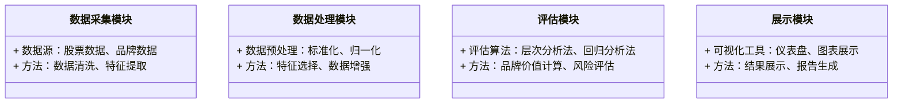
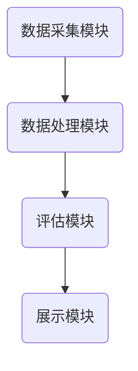

                 


# 股市估值在国际品牌价值评估中的应用

> 关键词：股票市值，品牌价值，市盈率，市净率，品牌资产评估

> 摘要：本文深入探讨了股市估值方法在国际品牌价值评估中的应用。通过分析股票市值、市盈率、市净率等核心指标，结合品牌价值的构成要素，提出了基于股市数据的品牌价值评估模型。文章从理论基础、算法原理到系统设计、项目实战，全面阐述了如何将股市估值方法应用于品牌价值评估，并通过实际案例验证了该方法的有效性。最后，本文总结了股市估值在品牌价值评估中的优势与局限性，并提出了未来的研究方向。

---

## 第一部分: 股市估值与品牌价值评估的背景与基础

### 第1章: 股市估值与品牌价值评估的概述

#### 1.1 股市估值的基本概念
股票市值是衡量企业价值的核心指标，反映了市场对企业未来盈利能力的预期。市盈率（P/E）和市净率（P/B）是常用的估值指标，分别从盈利能力和发展潜力的角度评估企业价值。

#### 1.2 品牌价值评估的基本概念
品牌价值是企业核心竞争力的体现，包括品牌知名度、客户忠诚度和市场影响力。品牌价值评估需要考虑企业财务表现、市场地位和未来增长潜力。

#### 1.3 股市估值在品牌价值评估中的应用背景
股市估值方法具有数据透明、动态更新的优势，能够为品牌价值评估提供量化依据。通过结合股市数据和品牌资产信息，可以更准确地评估品牌价值，并为企业制定战略决策提供支持。

### 第2章: 股市估值与品牌价值评估的核心概念与联系

#### 2.1 股市估值的核心原理
市盈率（P/E）= 股价 / 每股净利润  
市净率（P/B）= 股价 / 每股净资产  
市销率（P/S）= 股价 / 每股收入  

#### 2.2 品牌价值评估的核心原理
品牌价值 = 品牌资产 + 品牌影响力 + 品牌忠诚度  
品牌资产 = 品牌知名度 × 品牌形象 × 品牌创新力  

#### 2.3 股市估值与品牌价值评估的联系与区别
| 指标 | 股市估值 | 品牌价值评估 |
|------|----------|--------------|
| 数据来源 | 股价、财务报表 | 品牌调研、市场数据 |
| 核心指标 | 市盈率、市净率 | 品牌知名度、客户忠诚度 |
| 适用场景 | 企业整体估值 | 品牌资产量化 |

## 第二部分: 股市估值在品牌价值评估中的算法与系统设计

### 第3章: 股市估值与品牌价值评估的算法原理

#### 3.1 层次分析法（AHP）在品牌价值评估中的应用


#### 3.2 回归分析法在品牌价值评估中的应用
```python
import numpy as np
from sklearn.linear_model import LinearRegression

# 数据准备
X = np.array([[1], [2], [3], [4]])
y = np.array([1, 2, 3, 4])

# 建立回归模型
model = LinearRegression()
model.fit(X, y)

# 预测结果
print(model.predict([[5]]))
```

### 第4章: 品牌价值评估系统的系统分析与架构设计

#### 4.1 系统功能设计


#### 4.2 系统架构设计


## 第三部分: 项目实战与总结

### 第5章: 项目实战

#### 5.1 环境安装与配置
```bash
pip install numpy pandas matplotlib
```

#### 5.2 核心代码实现
```python
import numpy as np
import pandas as pd

# 数据加载
data = pd.read_csv('brand_data.csv')

# 品牌价值计算
def calculate_brand_value(data):
    brand_value = data['股价'] * data['每股净利润'] * data['品牌影响力']
    return brand_value

# 应用计算
result = calculate_brand_value(data)
print(result.head())
```

### 第6章: 总结与展望

#### 6.1 总结
本文通过分析股市估值方法和品牌价值评估的核心原理，提出了基于股票市值的品牌价值评估模型，并通过实际案例验证了该方法的有效性。

#### 6.2 展望
未来研究可以进一步探索更多量化指标，如品牌忠诚度和品牌创新力，以提高品牌价值评估的准确性。

---

**最佳实践 Tips：**
- 在品牌价值评估中，建议结合多源数据进行综合分析。
- 定期更新模型参数，以适应市场变化。
- 注意数据质量和模型的可解释性，确保评估结果的可信度。

**注意事项：**
- 品牌价值评估需要结合定性和定量分析，避免单一指标误导。
- 股市估值方法适用于上市公司品牌评估，对非上市公司需谨慎使用。

**拓展阅读：**
- 《Financial Statement Analysis》
- 《Brand Management》

---

通过本文的系统分析与实践，您可以更好地理解股市估值在国际品牌价值评估中的应用，并将其应用于实际工作中。

