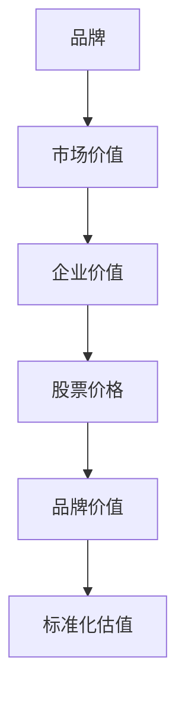
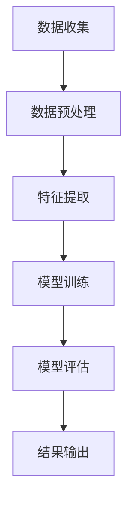
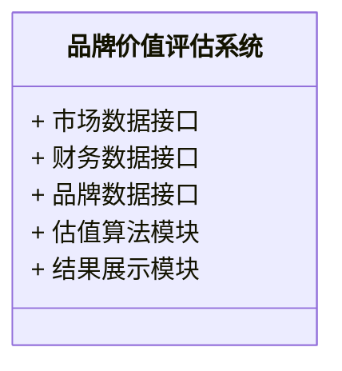
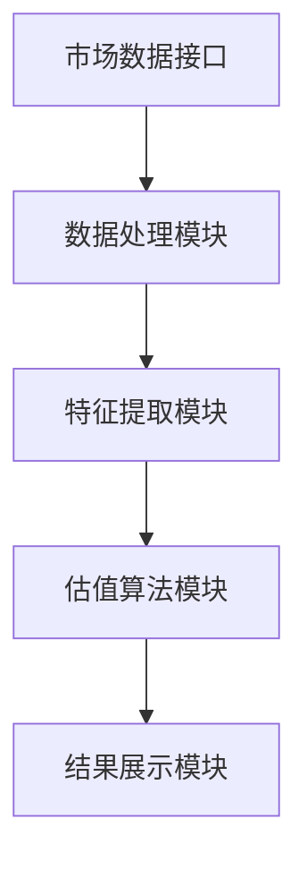
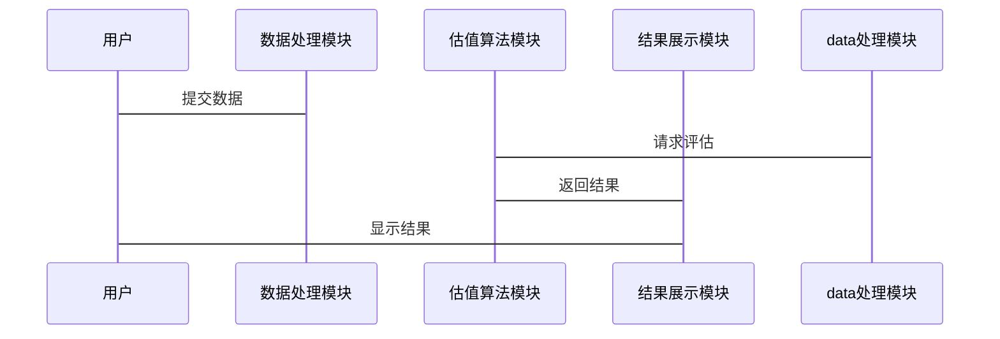

                 


# 股市估值在国际品牌估值标准化中的应用

## 关键词
股市估值, 品牌估值, 标准化, 经济学模型, 系统架构

## 摘要
本文探讨了股市估值在国际品牌估值标准化中的应用，从背景介绍、核心概念、数学模型、算法原理、系统架构到项目实战，全面解析了如何通过标准化方法提升品牌估值的准确性和一致性。通过具体案例分析和代码实现，展示了如何将理论应用于实际，为品牌估值提供了新的思路和方法。

## 第1章: 股市估值与国际品牌估值的背景介绍

### 1.1 问题背景
#### 1.1.1 全球化背景下国际品牌的价值提升
在经济全球化不断深化的今天，国际品牌的价值日益凸显。品牌不仅是企业核心竞争力的体现，也是股市投资者评估企业价值的重要指标。品牌的强盛往往意味着企业在市场中的领先地位和持续盈利能力，这直接影响到企业的市值。

#### 1.1.2 股市估值在品牌价值评估中的作用
股市估值是通过市场交易数据来衡量企业价值的一种方法。品牌作为企业的核心资产之一，其价值可以通过股市估值间接反映。投资者通过分析企业的市盈率、市净率等指标，可以评估品牌的市场影响力和企业盈利能力，从而做出投资决策。

#### 1.1.3 品牌估值标准化的必要性与挑战
品牌估值的标准化是实现跨国品牌价值统一评估的基础。不同国家和地区的会计准则、市场环境和消费者行为存在差异，这导致品牌估值方法和结果的多样性。标准化不仅有助于跨国企业统一品牌价值评估标准，也为投资者提供了统一的参考依据，便于跨市场的投资决策。

### 1.2 问题描述
#### 1.2.1 品牌价值与股市估值的关系
品牌价值是企业长期竞争优势的体现，而股市估值则反映了市场对品牌价值的认可程度。两者的结合可以更全面地评估企业的市场地位和财务健康状况。

#### 1.2.2 国际品牌估值的多样性与差异性
不同国家和地区的市场环境、消费者偏好和文化背景差异，导致国际品牌估值在不同市场中存在差异。这种差异性使得品牌估值的标准化变得复杂。

#### 1.2.3 标准化估值的缺失与影响
缺乏统一的标准化估值方法，导致品牌价值评估结果的不一致性和不可比性。这不仅影响了投资者的决策，也阻碍了跨国企业在全球范围内的统一品牌管理。

### 1.3 问题解决
#### 1.3.1 标准化估值的核心目标
通过制定统一的估值标准和方法，实现品牌价值的可比性和一致性，为投资者和企业提供可靠的评估依据。

#### 1.3.2 标准化估值的方法与路径
采用多维度的评估指标，结合定量分析和定性分析，构建统一的评估框架。通过大数据分析和机器学习技术，优化估值模型，提高评估结果的准确性。

#### 1.3.3 标准化估值的实施步骤与框架
1. 确定核心评估指标，包括品牌知名度、市场占有率、消费者忠诚度等。
2. 收集和整理相关数据，建立数据仓库。
3. 建立数学模型，如加权平均模型、回归分析模型等。
4. 进行模型训练和优化，确保评估结果的准确性和一致性。
5. 实施标准化评估，定期更新和维护模型。

### 1.4 边界与外延
#### 1.4.1 品牌价值的边界条件
品牌价值的评估应考虑企业的财务状况、市场环境、消费者行为等因素，同时需区分短期波动和长期趋势。

#### 1.4.2 标准化估值的适用范围
标准化估值适用于跨国企业和跨国投资，但需根据具体市场环境进行调整。

#### 1.4.3 与非标准化估值的区别与联系
标准化估值注重统一性和可比性，而非标准化估值则更加灵活，适用于特定市场或企业的个性化需求。两者可以根据实际情况结合使用。

### 1.5 核心要素组成
#### 1.5.1 品牌价值的核心要素
- 品牌知名度
- 市场占有率
- 消费者忠诚度
- 品牌形象
- 创新能力

#### 1.5.2 股市估值的关键指标
- 市盈率（P/E）
- 市净率（P/B）
- 市销率（P/S）
- 股息率
- 净资产收益率（ROE）

#### 1.5.3 标准化估值的构成要素
- 统一的评估标准
- 多维度的评估指标
- 科学的数学模型
- 定期更新和维护机制

## 第2章: 国际品牌估值标准化的核心概念与联系

### 2.1 核心概念原理
#### 2.1.1 品牌价值的定义与测量
品牌价值是品牌为企业带来的超额利润的能力，可以通过市场数据和消费者行为分析来测量。

#### 2.1.2 股市估值的定义与方法
股市估值是通过市场交易数据和财务指标来评估企业价值的方法，包括相对估值法和绝对估值法。

#### 2.1.3 标准化估值的原理与机制
标准化估值通过统一的评估标准和方法，消除市场差异，实现品牌价值的可比性和一致性。

### 2.2 核心概念对比分析
#### 2.2.1 品牌价值与市场价值的对比
| 对比维度 | 品牌价值 | 市场价值 |
|----------|----------|----------|
| 定义     | 品牌为企业带来的超额利润能力 | 企业在市场中的整体价值，包括品牌、资产等 |
| 测量方式 | 市盈率、市净率等 | 股价、市值等 |
| 影响因素 | 品牌知名度、消费者忠诚度 | 市场需求、财务状况 |

#### 2.2.2 股市估值与企业价值的对比
| 对比维度 | 股市估值 | 企业价值 |
|----------|----------|----------|
| 定义     | 市场对企业的价值判断 | 企业的整体经济价值 |
| 测量方式 | 市盈率、市净率等 | 资产评估、现金流折现法 |
| 影响因素 | 市场情绪、投资者预期 | 资产状况、盈利能力 |

#### 2.2.3 标准化估值与非标准化估值的对比
| 对比维度 | 标准化估值 | 非标准化估值 |
|----------|----------|----------|
| 定义     | 统一的评估标准和方法 | 根据具体情况进行灵活评估 |
| 优点     | 可比性高，适用于跨国企业和跨市场比较 | 灵活性强，适用于个性化需求 |
| 缺点     | 可能忽视特定市场环境的特殊性 | 标准化程度低，难以统一比较 |

### 2.3 ER实体关系图


## 第3章: 股市估值与品牌价值的数学模型与公式

### 3.1 品牌价值评估的数学模型
#### 3.1.1 Tobin's Q模型
Tobin's Q模型用于衡量企业整体价值，公式为：
$$ Q = \frac{Market\ Value\ of\ the\ Firm}{Book\ Value\ of\ the\ Firm} $$
其中，市场价值为企业市值，账面价值为企业账面资产价值。

#### 3.1.2 市盈率模型
市盈率（P/E）= 股价 / 每股收益（EPS）

#### 3.1.3 市净率模型
市净率（P/B）= 股价 / 每股净资产（BPS）

### 3.2 股市估值的核心公式
#### 3.2.1 市盈率
$$ P/E = \frac{Price}{Earnings\ per\ Share} $$

#### 3.2.2 市净率
$$ P/B = \frac{Price}{Book\ Value\ per\ Share} $$

#### 3.2.3 市销率
$$ P/S = \frac{Price}{Revenue\ per\ Share} $$

### 3.3 品牌价值评估的数学模型
#### 3.3.1 加权平均模型
$$ Brand\ Value = \sum_{i=1}^{n} w_i \times Factor_i $$
其中，\( w_i \) 是第 \( i \) 个因素的权重，\( Factor_i \) 是第 \( i \) 个因素的得分。

#### 3.3.2 回归分析模型
$$ Value = \beta_0 + \beta_1 \times Market\ Value + \epsilon $$
其中，\( \beta_0 \) 是截距，\( \beta_1 \) 是回归系数，\( \epsilon \) 是误差项。

### 3.4 实际案例分析
假设某国际品牌A的市盈率为15，每股收益为2元，则其股价为：
$$ Price = P/E \times EPS = 15 \times 2 = 30元 $$

## 第4章: 股市估值与品牌价值评估的算法原理

### 4.1 算法原理
#### 4.1.1 数据收集与预处理
- 数据来源：股票市场数据、财务报表、品牌相关数据
- 数据清洗：处理缺失值、异常值
- 数据转换：标准化、归一化

#### 4.1.2 特征提取
- 选择关键特征：市盈率、市净率、品牌知名度等
- 特征工程：特征选择、特征组合

#### 4.1.3 模型训练
- 算法选择：线性回归、随机森林、神经网络
- 模型训练：使用训练数据拟合模型
- 模型优化：调整参数、交叉验证

### 4.2 算法实现
#### 4.2.1 算法流程图


#### 4.2.2 Python代码实现
```python
import pandas as pd
from sklearn.model_selection import train_test_split
from sklearn.linear_model import LinearRegression
from sklearn.metrics import mean_squared_error

# 数据加载
data = pd.read_csv('brand_value.csv')

# 特征选择
X = data[['P/E', 'P/B', 'Market Share']]
y = data['Brand Value']

# 数据分割
X_train, X_test, y_train, y_test = train_test_split(X, y, test_size=0.2, random_state=42)

# 模型训练
model = LinearRegression()
model.fit(X_train, y_train)

# 模型预测
y_pred = model.predict(X_test)

# 模型评估
mse = mean_squared_error(y_test, y_pred)
print(f'Mean Squared Error: {mse}')
```

## 第5章: 股市估值与品牌价值评估的系统架构设计

### 5.1 系统功能设计
#### 5.1.1 领域模型


#### 5.1.2 系统架构


#### 5.1.3 接口设计
- 数据输入接口：接收市场数据、财务数据、品牌数据
- 数据处理接口：数据清洗、转换
- 模型接口：调用估值算法模块
- 结果输出接口：展示评估结果

#### 5.1.4 交互设计


## 第6章: 项目实战

### 6.1 环境安装
- 安装Python和相关库（pandas, numpy, scikit-learn）
- 数据库安装（如MySQL）

### 6.2 核心代码实现
```python
import pandas as pd
from sklearn.linear_model import LinearRegression
from sklearn.metrics import r2_score

# 数据加载
data = pd.read_csv('brand.csv')

# 特征选择
X = data[['P/E', 'P/B', 'Market Share']]
y = data['Brand Value']

# 数据分割
X_train, X_test, y_train, y_test = train_test_split(X, y, test_size=0.2, random_state=42)

# 模型训练
model = LinearRegression()
model.fit(X_train, y_train)

# 预测与评估
y_pred = model.predict(X_test)
r2 = r2_score(y_test, y_pred)
print(f'R squared: {r2}')
```

### 6.3 代码解读与分析
- 数据加载：读取CSV文件中的数据
- 特征选择：选择市盈率、市净率、市场份额作为特征
- 数据分割：将数据分为训练集和测试集
- 模型训练：使用线性回归模型进行训练
- 预测与评估：计算预测结果并评估模型的拟合优度

### 6.4 案例分析
以某国际品牌为例，分析其品牌价值评估过程，展示如何通过标准化估值方法得出准确的品牌价值。

### 6.5 项目小结
总结项目实施过程中的关键点，分析结果，提出改进建议。

## 第7章: 小结与展望

### 7.1 最佳实践 tips
- 数据质量至关重要，确保数据的准确性和完整性
- 结合多种评估方法，提高评估结果的准确性
- 定期更新模型，适应市场变化

### 7.2 小结
本文详细探讨了股市估值在国际品牌估值标准化中的应用，从理论到实践，全面解析了标准化估值的核心概念、数学模型、算法原理和系统架构。

### 7.3 注意事项
- 注意市场环境的差异性
- 确保数据的准确性和及时性
- 定期优化模型，适应市场变化

### 7.4 拓展阅读
建议进一步研究机器学习在品牌估值中的应用，探索更复杂的模型和算法。

## 附录

### 附录A: 数据来源与处理
详细说明数据来源、数据清洗和预处理步骤。

### 附录B: 工具安装与配置
列出所需的工具和库，提供安装和配置的详细步骤。

### 附录C: 术语表
解释文章中涉及的专业术语。

### 附录D: 参考文献
列出所有引用的文献和资料。

通过以上步骤，我们可以全面理解和应用股市估值在国际品牌估值标准化中的方法，为投资者和企业提供可靠的评估依据。

