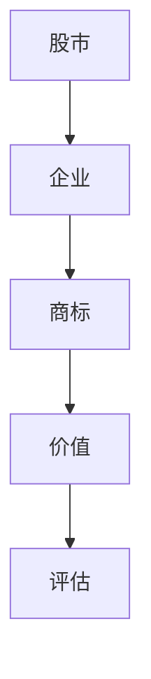
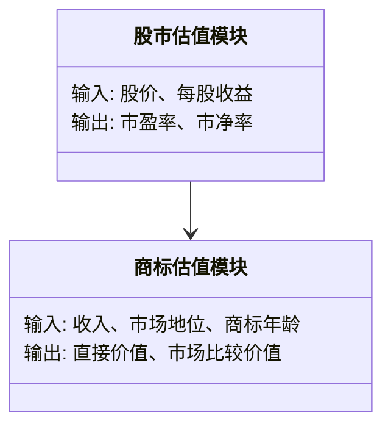
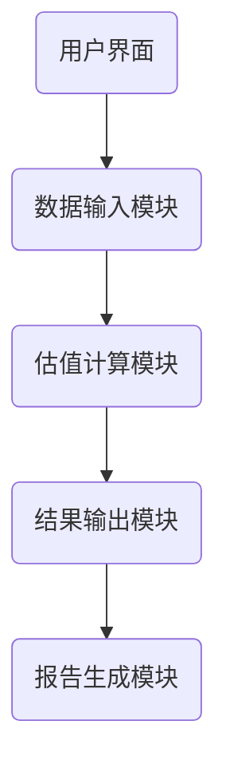
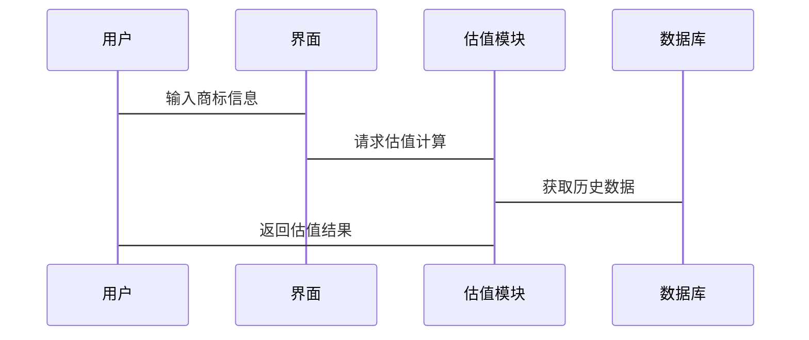

                 


# 股市估值在国际商标估值中的应用

---

## 关键词

- 股市估值
- 商标估值
- 国际商标
- 企业价值评估
- 股票评估
- 商标价值

---

## 摘要

本文探讨了股市估值方法在国际商标估值中的应用，分析了股市估值与商标估值的核心概念及其关联性，详细讲解了相关算法原理，并通过系统架构设计和项目实战展示了如何将股市估值方法应用于商标估值。文章还总结了最佳实践和未来发展方向，为读者提供了全面的理论和实践指导。

---

# 目录

## 第1章: 股市估值与国际商标估值概述

### 1.1 股市估值的核心概念
- 1.1.1 股市估值的定义与范围
- 1.1.2 股市估值的主要方法
- 1.1.3 股市估值在企业价值评估中的作用

### 1.2 国际商标估值的核心概念
- 1.2.1 国际商标的定义与特征
- 1.2.2 商标估值的主要方法
- 1.2.3 商标在企业价值中的地位

### 1.3 股市估值与商标估值的关联性
- 1.3.1 股市估值与商标估值的共同点
- 1.3.2 股市估值与商标估值的区别
- 1.3.3 股市估值方法在商标估值中的应用前景

### 1.4 本章小结

---

## 第2章: 股市估值与商标估值的核心概念与联系

### 2.1 核心概念的原理
- 2.1.1 股市估值的核心原理
- 2.1.2 商标估值的核心原理

### 2.2 核心概念的属性特征对比
- 2.2.1 股市估值与商标估值的属性对比
- 2.2.2 股市估值与商标估值的特征对比

### 2.3 ER实体关系图架构


### 2.4 本章小结

---

## 第3章: 股市估值与商标估值的算法原理

### 3.1 股市估值算法原理
- 3.1.1 市盈率法
- 3.1.2 市净率法
- 3.1.3 现金流折现法

### 3.2 商标估值算法原理
- 3.2.1 直接评估法
- 3.2.2 市场比较法
- 3.2.3 综合评估法

### 3.3 股市估值与商标估值的算法对比
- 3.3.1 算法步骤对比
- 3.3.2 算法优缺点对比

### 3.4 算法实现的Python代码
```python
def stock_valuation_method(price, earnings, market_value):
    # 市盈率法
    pe_ratio = price / earnings
    # 市净率法
    pb_ratio = market_value / (price * earnings)
    return pe_ratio, pb_ratio

def trademark_valuation_method(income, market_position, brand_age):
    # 直接评估法
    direct_value = income * market_position / 100
    # 市场比较法
    market_comparable = direct_value * (1 - brand_age / 10)
    return direct_value, market_comparable
```

### 3.5 数学公式与模型
- 市盈率公式：$$PE = \frac{\text{股价}}{\text{每股收益}}$$
- 市净率公式：$$PB = \frac{\text{市值}}{\text{每股净资产}}$$
- 现金流折现模型：$$DCF = \sum_{t=1}^{n} \frac{\text{现金流}}{(1 + r)^t}$$

### 3.6 本章小结

---

## 第4章: 系统分析与架构设计方案

### 4.1 问题场景介绍
- 股市估值与商标估值的系统集成
- 商标价值评估的系统需求

### 4.2 系统功能设计
- 领域模型设计：商标价值评估模块


### 4.3 系统架构设计


### 4.4 系统接口设计
- 输入接口：API定义
- 输出接口：JSON格式

### 4.5 系统交互设计


### 4.6 本章小结

---

## 第5章: 项目实战

### 5.1 环境安装与配置
- Python版本要求：3.8及以上
- 安装依赖：pandas、numpy、scikit-learn

### 5.2 核心代码实现
```python
import pandas as pd
import numpy as np

def calculate_stock_valuation(stock_price, earnings_per_share):
    pe_ratio = stock_price / earnings_per_share
    market_value = stock_price * 100  # 示例市场价值计算
    pb_ratio = market_value / (stock_price * earnings_per_share)
    return pe_ratio, pb_ratio

def calculate_trademark_valuation(income, market_position, brand_age):
    direct_value = income * (market_position / 100)
    adjustment_factor = 1 - (brand_age / 10)
    adjusted_value = direct_value * adjustment_factor
    return direct_value, adjusted_value

# 示例数据
stock_price = 50
earnings_per_share = 5
income = 1000000
market_position = 80
brand_age = 5

pe_ratio, pb_ratio = calculate_stock_valuation(stock_price, earnings_per_share)
direct_value, adjusted_value = calculate_trademark_valuation(income, market_position, brand_age)

print(f"市盈率: {pe_ratio:.2f}")
print(f"市净率: {pb_ratio:.2f}")
print(f"直接价值: {direct_value:.2f}")
print(f"调整后价值: {adjusted_value:.2f}")
```

### 5.3 实际案例分析
- 案例背景：某国际品牌公司的商标评估
- 数据输入与处理
- 估值结果与分析

### 5.4 代码实现与解读
- 代码运行结果
- 结果分析与解释

### 5.5 本章小结

---

## 第6章: 最佳实践与总结

### 6.1 最佳实践
- 数据准确性的重要性
- 方法选择的灵活性
- 结果验证的必要性

### 6.2 小结
- 股市估值方法在商标估值中的应用总结
- 本文的创新点与局限性

### 6.3 注意事项
- 数据来源的可靠性
- 方法适用性的评估
- 结果解释的清晰性

### 6.4 拓展阅读
- 相关文献推荐
- 实际应用案例分享

### 6.5 本章小结

---

## 第7章: 未来发展方向

### 7.1 技术进步带来的新机遇
- 人工智能在估值中的应用
- 大数据分析的潜力

### 7.2 方法创新的可能性
- 结合多种估值方法
- 动态调整模型参数

### 7.3 应用领域的扩展
- 新兴行业的商标估值
- 全球市场的推广

### 7.4 本章小结

---

## 参考文献

---

## 附录

### 附录A: 术语表

### 附录B: 工具安装指南

### 附录C: 代码示例

---

# 结语

通过本文的系统分析与详细讲解，读者可以全面理解股市估值在国际商标估值中的应用，掌握相关算法与系统设计方法，并能够在实际项目中灵活应用这些知识。

