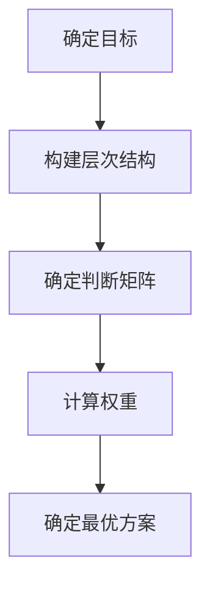
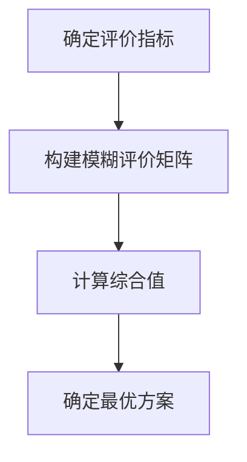
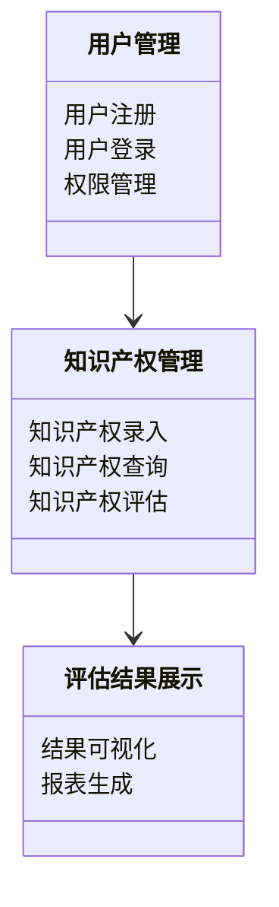

                 


```markdown
# 股市估值在国际知识产权价值链中的应用

> 关键词：股市估值，知识产权，价值链，层次分析法，模糊综合评价法

> 摘要：本文探讨了股市估值在国际知识产权价值链中的应用，分析了知识产权在国际价值链中的核心作用，构建了知识产权评估模型，并结合实际案例，详细介绍了如何利用层次分析法和模糊综合评价法进行知识产权评估。通过系统设计和项目实战，展示了如何将知识产权评估应用于股市估值，为投资者和企业提供了科学的决策依据。

---

## 第一部分: 股市估值与国际知识产权价值链的背景介绍

### 第1章: 知识产权的基本概念与重要性

#### 1.1 知识产权的定义与核心要素

知识产权（Intellectual Property，IP）是指人们在智力活动中创造的成果，包括专利权、商标权、著作权、商业秘密等。知识产权的核心要素包括：

1. **创新性**：知识产权必须具有新颖性，即与现有知识相比具有独特性。
2. **实用性**：知识产权必须能够在实际应用中产生价值。
3. **法律保护**：知识产权需要通过法律手段进行保护，确保其合法性和有效性。

```mermaid
entityDiagram
    class 知识产权 {
        专利权
        商标权
        著作权
        商业秘密
    }
    class 企业 {
        产品
        技术
        品牌
    }
    知识产权 --> 企业
```

#### 1.2 知识产权的保护与运用

知识产权的保护是确保其价值的关键。通过法律手段保护知识产权，可以防止他人未经许可使用或模仿。同时，知识产权的运用可以通过授权、转让等方式为企业创造价值。

---

### 第2章: 国际知识产权价值链的现状与趋势

#### 2.1 国际知识产权的现状

随着全球化的发展，知识产权在国际贸易中的地位日益重要。企业通过拥有自主知识产权，可以提升竞争力，扩大市场份额。

#### 2.2 知识产权价值链的构建与优化

知识产权价值链包括从创造、保护到运用的全过程。通过优化价值链，企业可以更高效地管理知识产权，提升其市场价值。

---

## 第二部分: 知识产权在国际价值链中的核心作用

### 第3章: 知识产权在国际产业链中的作用

#### 3.1 知识产权在国际贸易中的地位

知识产权是国际贸易中的重要组成部分。通过拥有自主知识产权，企业可以提高产品附加值，增强市场竞争力。

#### 3.2 知识产权对国际分工的影响

知识产权的分布不均导致国际分工的不平等。发达国家通过掌握核心技术，占据价值链高端，而发展中国家则主要处于低端环节。

---

## 第三部分: 知识产权评估算法原理

### 第4章: 层次分析法（AHP）在知识产权评估中的应用

#### 4.1 层次分析法的原理

层次分析法是一种定性与定量相结合的决策分析方法。它通过构建层次结构，计算各因素的权重，确定最优方案。



#### 4.2 知识产权评估的数学模型

层次分析法的数学模型如下：

$$
A = \begin{bmatrix}
1 & 3/5 & 2 \\
5/3 & 1 & 4/5 \\
1/2 & 5/4 & 1
\end{bmatrix}
$$

其中，$A$ 是判断矩阵，用于表示各因素的重要性。

---

### 第5章: 模糊综合评价法（FCE）在知识产权评估中的应用

#### 5.1 模糊综合评价法的原理

模糊综合评价法是一种处理模糊性问题的方法。它通过构建模糊评价矩阵，计算模糊综合值，确定最优方案。



#### 5.2 知识产权评估的数学模型

模糊综合评价法的数学模型如下：

$$
R = \sum_{i=1}^{n} w_i \cdot r_i
$$

其中，$w_i$ 是各指标的权重，$r_i$ 是各指标的评分。

---

## 第四部分: 系统分析与架构设计

### 第6章: 系统功能设计

#### 6.1 领域模型

系统功能模块包括：

1. **用户管理**：包括用户注册、登录、权限管理。
2. **知识产权管理**：包括知识产权录入、查询、评估。
3. **评估结果展示**：包括评估结果可视化、报表生成。



---

## 第五部分: 项目实战

### 第7章: 环境配置与代码实现

#### 7.1 环境配置

安装必要的库：

```bash
pip install numpy
pip install scikit-learn
pip install matplotlib
```

#### 7.2 核心代码实现

层次分析法的Python实现：

```python
import numpy as np

def calculate_weights(matrix):
    n = len(matrix)
    total = np.sum(matrix, axis=1)
    weights = matrix / total[:, np.newaxis]
    return weights

# 示例矩阵
matrix = np.array([
    [1, 3/5, 2],
    [5/3, 1, 4/5],
    [1/2, 5/4, 1]
])

weights = calculate_weights(matrix)
print("权重矩阵：")
print(weights)
```

模糊综合评价法的Python实现：

```python
import numpy as np

def calculate_fuzzy综合评价(matrix):
    n = len(matrix)
    total = np.sum(matrix, axis=1)
    normalized = matrix / total[:, np.newaxis]
    return normalized

# 示例矩阵
matrix = np.array([
    [1, 2, 3],
    [4, 5, 6],
    [7, 8, 9]
])

result = calculate_fuzzy综合评价(matrix)
print("模糊综合评价结果：")
print(result)
```

---

## 第六部分: 最佳实践与总结

### 第8章: 最佳实践

#### 8.1 小结

知识产权是股市估值的重要组成部分。通过层次分析法和模糊综合评价法，可以更科学地评估知识产权的价值，为企业和投资者提供决策依据。

#### 8.2 注意事项

1. 在使用层次分析法时，需确保判断矩阵的一致性。
2. 在使用模糊综合评价法时，需合理设置模糊度。
3. 在实际应用中，需结合具体情况进行调整。

#### 8.3 拓展阅读

建议进一步阅读相关书籍和文献，深入了解知识产权评估的其他方法和应用。

---

通过以上步骤，我们详细介绍了股市估值在国际知识产权价值链中的应用，从理论到实践，为读者提供了全面的指导。希望本文能为相关领域的研究和实践提供有价值的参考。
```

