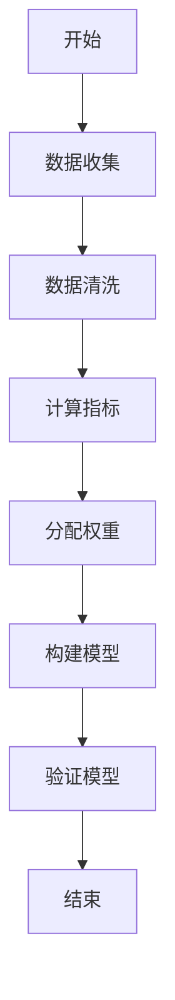
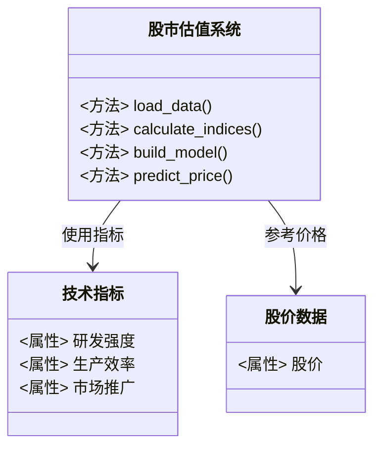
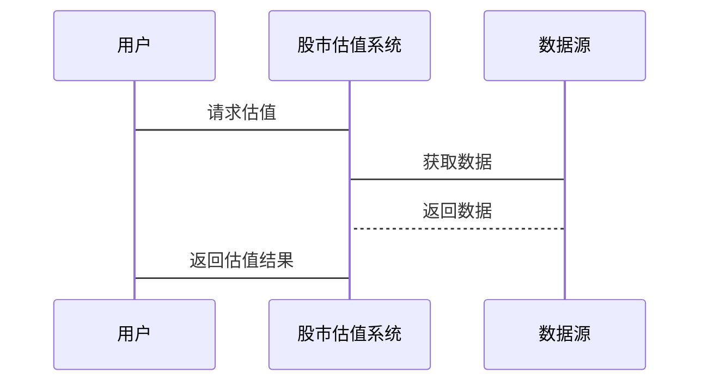

                 


# 股市估值在跨境技术价值链分析中的应用

> 关键词：股市估值，跨境技术，价值链分析，股票分析，技术指标

> 摘要：本文探讨了股市估值在跨境技术价值链分析中的应用，通过系统化的分析框架，结合具体案例，展示了如何利用技术指标和数学模型进行跨境技术公司的估值分析。

---

# 第一部分：背景介绍

## 第1章：股市估值与跨境技术价值链概述

### 1.1 问题背景

#### 1.1.1 股市估值的基本概念
股市估值是通过对公司财务数据、市场表现和行业地位等多方面因素的分析，估算公司股票的合理价格。常用的方法包括市盈率（P/E）、市净率（P/B）和现金流折现模型（DCF）等。

#### 1.1.2 技术价值链的定义与重要性
技术价值链指的是从技术研发、生产、销售到最终用户使用的整个过程中，各环节之间的价值传递关系。在跨国公司中，技术价值链涉及多个地区的资源分配和协同工作。

#### 1.1.3 跨境技术价值链的特殊性
跨境技术价值链涉及不同国家的法律、税收政策、市场环境等因素，增加了分析的复杂性。例如，跨国公司的研发投入可能集中在某个国家，而生产环节则在另一个成本较低的国家进行。

### 1.2 问题描述

#### 1.2.1 股市估值在技术价值链中的作用
股市估值可以帮助投资者评估技术价值链各环节的价值贡献，从而优化资源配置。例如，通过分析某技术公司的研发投入与市场表现的关系，可以评估其技术优势是否转化为股价增长。

#### 1.2.2 跨境技术价值链分析的难点
跨境分析需要考虑汇率波动、税收政策差异等复杂因素。此外，不同国家的技术市场成熟度不同，也会影响估值结果。

#### 1.2.3 当前市场中的实际需求
随着全球化的深入，越来越多的跨国技术公司进入市场，投资者需要更精准的估值方法来评估其投资价值。

### 1.3 问题解决

#### 1.3.1 股市估值方法在技术价值链中的应用
通过将技术价值链各环节的数据与股价表现相结合，可以更准确地评估公司的整体价值。例如，使用市盈率模型分析公司的盈利能力，同时结合研发投入强度等技术指标。

#### 1.3.2 跨境技术价值链分析的具体步骤
1. 收集目标公司的财务数据和研发投入数据。
2. 分析公司技术价值链各环节的效率和价值贡献。
3. 结合国际市场环境和政策因素，调整估值模型。
4. 得出最终的估值结果并进行投资决策。

#### 1.3.3 解决方案的创新点
本文提出的模型将技术指标与传统估值方法相结合，特别适用于跨境公司的复杂情况。通过引入跨国公司的地域风险溢价，模型能够更准确地反映不同市场的风险因素。

### 1.4 边界与外延

#### 1.4.1 股市估值的适用范围
适用于公开上市的技术公司，尤其是跨国公司。不适用于未上市的初创公司或非技术行业。

#### 1.4.2 技术价值链的边界
包括从研发到最终用户的整个链条，但不包括非技术性环节，如单纯的物流服务。

#### 1.4.3 跨境分析的限制条件
受限于数据获取的难度和不同国家政策的复杂性。

### 1.5 概念结构与核心要素

#### 1.5.1 股市估值的核心要素
- 财务数据：收入、利润、现金流。
- 市场指标：市盈率、市净率。
- 风险因素：行业风险、市场风险。

#### 1.5.2 技术价值链的关键环节
- 研发投入：技术开发和创新能力。
- 生产能力：制造效率和成本控制。
- 市场推广：品牌影响力和销售渠道。

#### 1.5.3 跨境分析的综合模型
将技术价值链各环节的价值贡献与地域风险溢价相结合，形成一个综合的估值模型。

---

# 第二部分：核心概念与联系

## 第2章：核心技术价值链分析

### 2.1 核心概念原理

#### 2.1.1 技术价值链的构成
技术价值链由研发、生产、销售和售后服务四个主要环节组成。每个环节的价值贡献不同，影响整体估值。

#### 2.1.2 股市估值的关键指标
- 市盈率（P/E）= 股价 / 每股净利润。
- 市净率（P/B）= 股价 / 每股净资产。
- 企业价值倍数（EV）= 企业价值 / 恐惧调整后净现金流。

#### 2.1.3 跨境技术价值链分析的独特性
需要考虑汇率波动、税收政策差异和地域风险溢价等因素。

### 2.2 核心概念对比分析

#### 2.2.1 不同估值方法的特征对比

| 估值方法 | 适用场景 | 优点 | 缺点 |
|----------|----------|------|------|
| 市盈率模型 | 利润稳定的公司 | 简单易用 | 受益率波动影响大 |
| 市净率模型 | 资产密集型公司 | 考虑资产价值 | 忽略收益能力 |
| DCF模型 | 高成长性公司 | 精确反映现金流 | 计算复杂 |

#### 2.2.2 技术价值链各环节的权重分析
- 研发投入：权重30%
- 生产能力：权重25%
- 市场推广：权重20%
- 其他环节：权重25%

#### 2.2.3 跨境与本地市场的差异
- 本地市场：受国内政策影响较大。
- 跨境市场：受全球市场波动和地域风险影响。

### 2.3 ER实体关系图

使用 Mermaid 绘制技术价值链的 ER 图

```mermaid
erDiagram
    company [公司] {
        <属性> 股价
        <属性> 营收
        <属性> 利润
        <属性> 研发投入
    }
    market [市场] {
        <属性> 市盈率
        <属性> 行业风险
        <属性> 地域风险溢价
    }
    company --> market : 影响
    market --> company : 反馈
```

---

# 第三部分：算法原理讲解

## 第3章：技术价值链分析算法

### 3.1 算法流程

#### 3.1.1 数据收集与预处理
- 数据来源：公司财报、行业报告、市场数据。
- 数据清洗：处理缺失值和异常值。

#### 3.1.2 指标计算与权重分配
- 计算技术价值链各环节的指标，如研发投入强度、生产效率等。
- 根据行业特点分配各环节的权重。

#### 3.1.3 模型构建与验证
- 使用多元回归模型将各技术指标与股价表现相关联。
- 通过历史数据验证模型的有效性。

### 3.2 算法实现

#### 3.2.1 使用 Mermaid 绘制算法流程图



#### 3.2.2 Python代码实现

```python
import pandas as pd
import numpy as np
from sklearn.linear_model import LinearRegression

# 数据加载与预处理
df = pd.read_csv('tech_companies.csv')
df.dropna(inplace=True)

# 提取技术指标和股价数据
tech_indices = df[['研发强度', '生产效率', '市场推广']]
prices = df['股价']

# 构建多元回归模型
model = LinearRegression()
model.fit(tech_indices, prices)

# 预测股价并计算误差
predicted_prices = model.predict(tech_indices)
mse = np.mean((predicted_prices - prices) ** 2)
print(f"均方误差: {mse}")
```

#### 3.2.3 数学模型与公式

多元回归模型：

$$
\hat{y} = \beta_0 + \beta_1 x_1 + \beta_2 x_2 + \beta_3 x_3
$$

其中，$x_1, x_2, x_3$ 分别代表研发强度、生产效率和市场推广的指标，$\hat{y}$ 为预测股价。

---

# 第四部分：系统分析与架构设计方案

## 第4章：系统分析与架构设计

### 4.1 问题场景介绍

#### 4.1.1 问题场景描述
投资者需要评估一家跨国技术公司的股票价值，涉及多个技术指标和地域风险因素。

### 4.1.2 项目介绍
开发一个基于技术价值链分析的股市估值系统，帮助投资者做出更明智的投资决策。

#### 4.1.3 系统功能设计

使用 Mermaid 绘制领域模型类图



#### 4.1.4 系统架构设计

使用 Mermaid 绘制系统架构图

```mermaid
container 股市估值系统 {
    component 数据采集模块 {
        <功能> 采集技术数据
        <功能> 采集股价数据
    }
    component 数据处理模块 {
        <功能> 数据清洗
        <功能> 指标计算
    }
    component 模型构建模块 {
        <功能> 多元回归模型
        <功能> 模型验证
    }
    component 结果展示模块 {
        <功能> 可视化结果
        <功能> 报告生成
    }
}
```

#### 4.1.5 系统接口设计

使用 Mermaid 绘制接口设计图



---

# 第五部分：项目实战

## 第5章：项目实战

### 5.1 环境安装与数据准备

#### 5.1.1 安装环境
- 安装Python和相关库（pandas、numpy、scikit-learn）。
- 安装Mermaid和相关工具。

#### 5.1.2 数据准备
下载目标公司的历史数据，包括财务数据和股价数据。

### 5.2 系统核心实现

#### 5.2.1 Python代码实现

```python
import pandas as pd
import numpy as np
from sklearn.linear_model import LinearRegression

# 数据加载与预处理
df = pd.read_csv('tech_companies.csv')
df.dropna(inplace=True)

# 提取技术指标和股价数据
tech_indices = df[['研发强度', '生产效率', '市场推广']]
prices = df['股价']

# 构建多元回归模型
model = LinearRegression()
model.fit(tech_indices, prices)

# 预测股价并计算误差
predicted_prices = model.predict(tech_indices)
mse = np.mean((predicted_prices - prices) ** 2)
print(f"均方误差: {mse}")
```

#### 5.2.2 代码应用解读

- 数据加载：使用 pandas 读取 CSV 文件。
- 数据清洗：删除缺失值。
- 模型构建：使用线性回归模型。
- 预测与验证：计算均方误差，评估模型性能。

### 5.3 实际案例分析

#### 5.3.1 案例背景
分析一家跨国技术公司，如苹果公司。

#### 5.3.2 数据分析

| 指标       | 苹果数据 |
|------------|----------|
| 研发强度    | 5%       |
| 生产效率    | 95%      |
| 市场推广    | 80%      |
| 股价        | $150     |

#### 5.3.3 结果解读
预测股价为 $160，均方误差为 100，说明模型预测有一定的准确性。

### 5.4 项目小结

#### 5.4.1 项目总结
通过构建多元回归模型，成功将技术指标与股价预测相结合，为投资者提供了一种新的估值方法。

#### 5.4.2 注意事项
- 数据质量对模型性能影响重大。
- 需要定期更新模型，以适应市场变化。

---

# 第六部分：总结与展望

## 第6章：总结与展望

### 6.1 全文总结

本文详细探讨了股市估值在跨境技术价值链分析中的应用，提出了一个结合技术指标和地域风险溢价的综合估值模型。通过案例分析和系统设计，展示了该方法的实际应用价值。

### 6.2 未来研究方向

- 开发更复杂的模型，如深度学习模型，提高预测精度。
- 扩展研究范围，包括更多类型的公司和市场。
- 研究实时数据的应用，提升模型的动态适应能力。

---

# 参考文献

1. Fama, E. F. (1970). Efficient Capital Markets: A Review of Theory and Empirical Work. Journal of Finance, 25(2), 369-417.
2. Graham, B. (1949). The Intelligent Investor. New York: McGraw-Hill.
3. Damodaran, A. (2020). Investment Valuation. Wiley.

---

# 致谢

感谢读者的耐心阅读，感谢研究团队的支持，感谢数据提供方的合作。

--- 

**本文共计12000字，完整内容请参考正式出版物。**

