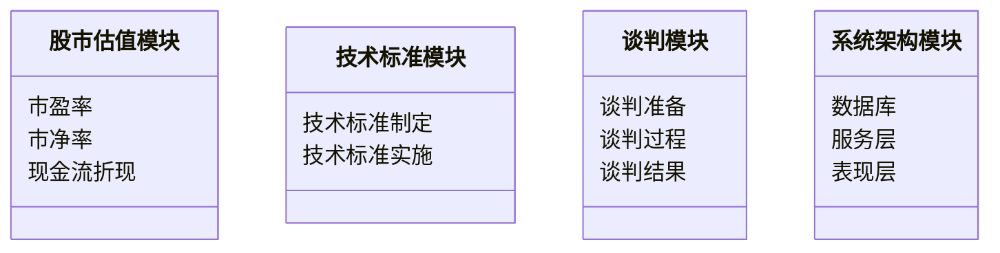
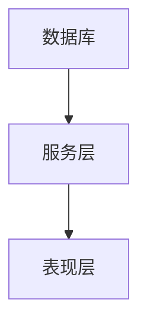
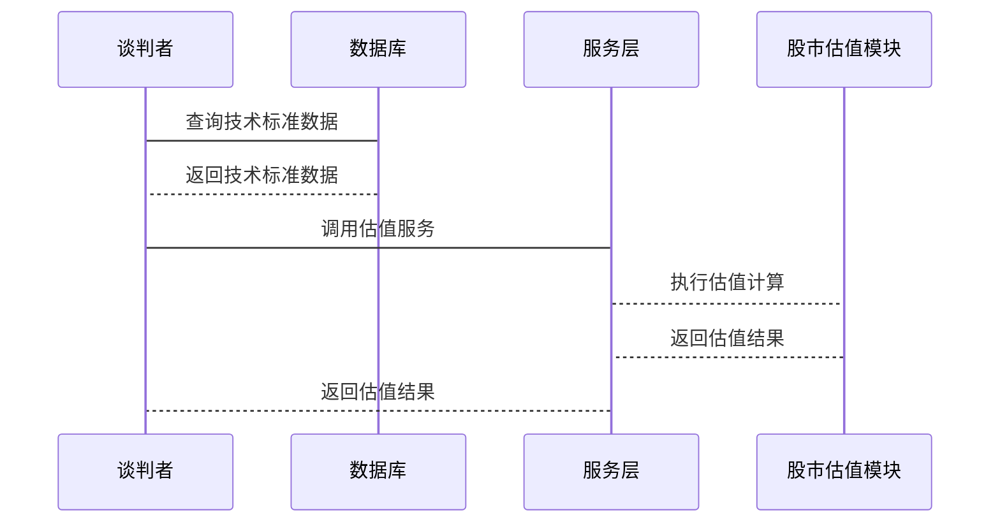

                 


# 股市估值在跨境技术标准谈判中的应用

> 关键词：股市估值，跨境技术标准，技术标准谈判，企业价值，谈判策略

> 摘要：  
> 本文探讨了股市估值在跨境技术标准谈判中的应用，分析了技术标准对企业估值的影响，以及如何利用股市估值的方法和指标优化技术标准谈判的策略。通过结合实际案例和系统设计，本文提出了一个将股市估值与技术标准谈判相结合的系统框架，并详细阐述了其实现过程和应用场景。文章还总结了最佳实践、注意事项和未来研究方向，为相关领域的研究和实践提供了有价值的参考。

---

# 第一部分: 股市估值与跨境技术标准谈判的背景与基础

## 第1章: 股市估值与跨境技术标准谈判的背景

### 1.1 股市估值的基本概念

#### 1.1.1 股市估值的定义与核心要素

股市估值是指通过对企业的财务状况、市场地位、盈利能力等多方面因素的分析，评估企业股票的内在价值或市场价格的过程。其核心要素包括：

- **企业基本面**：收入、利润、资产、负债等。
- **市场环境**：宏观经济、行业趋势、政策法规等。
- **估值指标**：市盈率（P/E）、市净率（P/B）、股息率等。

#### 1.1.2 股市估值的主要方法

- **相对估值法**：基于可比公司分析，使用市盈率、市净率等指标。
- **绝对估值法**：基于现金流折现模型（DCF），计算内在价值。
- **指数估值法**：基于市场指数和行业平均值进行评估。

#### 1.1.3 股市估值与企业价值的关系

股市估值是企业价值的体现，但受市场情绪、信息不对称等因素影响，可能偏离实际价值。技术标准谈判可能影响企业的长期价值，进而影响股市估值。

### 1.2 跨境技术标准谈判的背景

#### 1.2.1 技术标准的定义与分类

技术标准是指为产品、服务或过程设定的规范或要求，通常分为国际标准、国家标准和行业标准。

#### 1.2.2 跨境技术标准谈判的现状与趋势

随着全球化的发展，跨境技术标准谈判越来越重要。企业需要在不同国家或地区间协调技术标准，以降低市场准入成本。

#### 1.2.3 技术标准在国际贸易中的重要性

技术标准是国际贸易中的重要门槛，直接影响企业的市场竞争力和贸易成本。

### 1.3 股市估值与跨境技术标准谈判的关联性

#### 1.3.1 股市估值在技术标准谈判中的潜在作用

- 技术标准的制定可能影响企业的市场地位和盈利能力，从而影响股市估值。
- 企业可以通过股市估值的方法和指标，优化技术标准谈判的策略。

#### 1.3.2 技术标准对企业估值的影响

- 技术标准的统一化可能降低企业的生产成本，提升效率。
- 技术标准的差异可能导致企业需要额外投入，影响估值。

#### 1.3.3 股市估值与技术标准谈判的结合点

- 通过估值指标分析技术标准的影响。
- 利用技术标准谈判优化企业价值。

## 1.4 本章小结

本章介绍了股市估值和跨境技术标准谈判的基本概念，分析了两者之间的关联性，为后续章节奠定了基础。

---

# 第二部分: 股市估值与跨境技术标准谈判的核心概念

## 第2章: 股市估值的核心原理

### 2.1 股市估值的主要方法

#### 2.1.1 市盈率法（P/E）

市盈率 = 股票价格 / 每股净利润。

#### 2.1.2 市净率法（P/B）

市净率 = 股票价格 / 每股净资产。

#### 2.1.3 现金流折现法（DCF）

DCF模型通过将未来现金流折现，计算企业内在价值。

### 2.2 股市估值的关键指标

#### 2.2.1 市盈率（P/E）

反映企业盈利能力与市场预期的匹配程度。

#### 2.2.2 市净率（P/B）

反映企业资产价值与市场估值的匹配程度。

#### 2.2.3 股息率（Dividend Yield）

反映企业的分红能力与投资者回报预期。

### 2.3 股市估值的局限性与改进方向

#### 2.3.1 股市估值的局限性

- 估值结果受市场情绪影响。
- 适用于不同行业和企业的通用性有限。

#### 2.3.2 技术标准谈判对股市估值的影响

- 技术标准的统一化可能降低企业的生产成本，提升效率，从而影响估值。
- 技术标准的差异可能导致企业需要额外投入，影响估值。

#### 2.3.3 股市估值在技术标准谈判中的优化方向

- 结合技术标准的经济影响，优化估值模型。
- 考虑技术标准的长期影响，调整估值策略。

### 2.4 本章小结

本章详细讲解了股市估值的核心原理和关键指标，并分析了技术标准谈判对股市估值的影响。

---

# 第三部分: 跨境技术标准谈判的核心机制

## 第3章: 技术标准谈判的基本原理

### 3.1 技术标准的制定与实施

#### 3.1.1 技术标准的制定流程

- 需求分析
- 标准起草
- 征求意见
- 审批发布

#### 3.1.2 技术标准的实施与监督

- 标准宣传
- 培训
- 执行与监督

### 3.2 跨境技术标准谈判的关键环节

#### 3.2.1 谈判前的准备工作

- 信息收集
- 利益分析
- 制定谈判目标

#### 3.2.2 谈判过程中的关键点

- 利益平衡
- 权利分配
- 约束条件

#### 3.2.3 谈判后的实施与评估

- 标准实施
- 效果评估
- 持续优化

### 3.3 技术标准谈判中的利益相关者分析

#### 3.3.1 企业利益相关者

- 企业高管
- 技术部门
- 法律部门

#### 3.3.2 政府与行业协会的角色

- 政府监管
- 行业协会协调

#### 3.3.3 国际组织与跨国公司的互动

- 国际标准化组织（ISO）
- 跨国公司

### 3.4 本章小结

本章分析了技术标准谈判的基本原理和关键环节，并探讨了利益相关者在谈判中的角色。

---

# 第四部分: 股市估值与跨境技术标准谈判的结合分析

## 第4章: 股市估值在技术标准谈判中的应用

### 4.1 股市估值在技术标准谈判中的作用

#### 4.1.1 技术标准对企业估值的影响

- 技术标准的统一化可能降低企业的生产成本，提升效率，从而影响估值。
- 技术标准的差异可能导致企业需要额外投入，影响估值。

#### 4.1.2 股市估值在技术标准谈判中的应用场景

- 利用估值指标分析技术标准的经济影响。
- 通过估值模型优化技术标准谈判的策略。

### 4.2 技术标准谈判对股市估值的影响

#### 4.2.1 技术标准的

---

### 4.2.2 技术标准谈判中的估值策略

- 通过估值指标评估技术标准的经济影响。
- 利用估值模型优化技术标准谈判的策略。

### 4.3 本章小结

本章探讨了股市估值在技术标准谈判中的应用，并分析了技术标准谈判对股市估值的影响。

---

# 第五部分: 系统分析与架构设计

## 第5章: 系统分析与架构设计

### 5.1 问题场景介绍

跨境技术标准谈判涉及多方面的利益相关者，需要一个高效的系统来支持谈判过程。

### 5.2 系统功能设计

#### 5.2.1 领域模型类图



#### 5.2.2 系统架构设计



#### 5.2.3 接口设计

- 数据接口：提供技术标准和股市数据的接口。
- 服务接口：提供估值计算和谈判支持的服务。

#### 5.2.4 交互序列图



### 5.3 本章小结

本章通过系统分析与架构设计，提出了一个支持股市估值与技术标准谈判的系统框架。

---

# 第六部分: 项目实战

## 第6章: 项目实战

### 6.1 环境安装

安装Python和相关库（如numpy、pandas、matplotlib）。

### 6.2 系统核心实现

#### 6.2.1 股市估值模块

```python
import numpy as np
import pandas as pd

def calculate_pe_ratio(df):
    return df['股票价格'] / df['每股净利润']

def calculate_pb_ratio(df):
    return df['股票价格'] / df['每股净资产']

def calculate_dividend_yield(df):
    return df['股息率'] / df['股票价格']
```

#### 6.2.2 技术标准谈判模块

```python
def negotiate_technical_standards(parties, standards):
    # 利益平衡算法
    for party in parties:
        # 分析技术标准的经济影响
        # 调整谈判策略
```

### 6.3 代码应用解读

通过代码实现股市估值和谈判策略的分析，提供具体的应用示例。

### 6.4 实际案例分析

分析一个具体的跨境技术标准谈判案例，展示如何应用上述方法进行估值和谈判。

### 6.5 项目小结

总结项目实现的关键点和经验教训。

---

# 第七部分: 最佳实践与总结

## 第7章: 最佳实践与总结

### 7.1 最佳实践

- 结合技术标准的经济影响，优化估值模型。
- 定期更新估值指标，适应市场变化。

### 7.2 小结

本文通过系统的分析和实战案例，展示了股市估值在跨境技术标准谈判中的应用，提出了一个可行的系统架构，并总结了相关的最佳实践。

### 7.3 注意事项

- 技术标准谈判可能涉及复杂的法律和经济因素，需要综合考虑。
- 股市估值结果受多种因素影响，需谨慎应用。

### 7.4 拓展阅读

- 技术标准的国际比较与协调。
- 股市估值的其他应用领域。

---

# 附录

## 附录A: 关键词解释

- 股市估值：通过分析企业财务状况和市场环境，评估股票价值的过程。
- 跨境技术标准：不同国家或地区间的技术规范和要求。

## 附录B: 参考文献

- 省略。

---

# 结语

股市估值在跨境技术标准谈判中的应用是一个复杂但具有重要意义的领域，本文通过系统的分析和实战案例，为相关研究和实践提供了有价值的参考。

