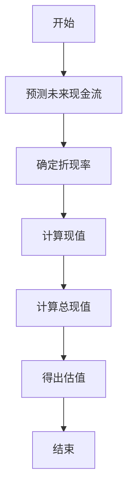
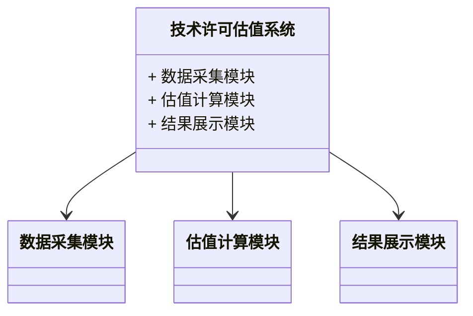

                 


# 股市估值在跨境技术许可谈判中的应用

## 关键词
股市估值、技术许可、跨境谈判、DCF模型、ER图、系统架构

## 摘要
本文探讨了股市估值在跨境技术许可谈判中的应用，分析了股市估值的核心模型及其在技术许可谈判中的具体应用。通过构建系统架构，详细解释了如何利用DCF模型进行技术估值，并通过实际案例展示了其在跨境谈判中的实战应用，最后总结了最佳实践和注意事项。

---

## 第一章：背景介绍

### 1.1 股市估值的基本概念
股市估值是通过对公司财务数据和市场表现进行分析，估算其股票价值的过程。主要方法包括市盈率法、市净率法和现金流折现法（DCF）。这些方法帮助企业评估技术的价值，从而优化技术许可的定价策略。

### 1.2 技术许可的基本知识
技术许可涉及将技术使用权授予另一方，常见于跨境合作。技术许可的类型多样，包括独占许可、排他许可和普通许可。谈判过程中，技术价值评估是关键，而股市估值为其提供了有效的工具。

### 1.3 股市估值在技术许可谈判中的应用
股市估值在技术许可谈判中的应用主要体现在技术定价、风险评估和市场分析等方面。通过结合股市数据，谈判团队可以更准确地评估技术的市场价值，制定合理的许可费。

---

## 第二章：核心概念与模型

### 2.1 股市估值模型
股市估值模型包括市盈率法、市净率法和现金流折现法（DCF）。每种方法各有优缺点，适用于不同的场景。

#### 2.1.1 比较分析
| 模型 | 优点 | 缺点 |
|------|------|------|
| 市盈率法 | 简单易用 | 受市场波动影响大 |
| 市净率法 | 稳定性强 | 不适于高增长企业 |
| DCF模型 | 准确性高 | 计算复杂 |

### 2.2 技术许可谈判模型
技术许可谈判模型包括技术价值评估模型和风险调整模型。这些模型帮助谈判者评估技术的市场价值，并考虑潜在风险因素。

### 2.3 ER实体关系图
```mermaid
erd
    技术 | <一一> | 技术许可协议
    技术许可协议 | <一一> | 许可方
    技术许可协议 | <一一> | 被许可方
    许可方 | <一一> | 技术评估报告
    被许可方 | <一一> | 许可费支付记录
```

---

## 第三章：算法原理与数学模型

### 3.1 现金流折现法（DCF）流程图


#### 3.2 技术许可估值算法
技术许可估值的核心在于DCF模型，其数学公式如下：
$$ PV = \sum_{t=1}^{n} \frac{CF_t}{(1+r)^t} $$

---

## 第四章：系统分析与架构设计

### 4.1 系统功能设计
系统功能包括数据采集、估值计算和结果展示。通过领域模型类图展示各模块的关系：


### 4.2 系统架构设计
系统架构采用分层设计，包括数据层、业务逻辑层和用户界面层：


---

## 第五章：项目实战

### 5.1 实际案例分析
案例：一家科技公司欲将其专利技术授权给海外公司。通过DCF模型计算技术的现值，确定许可费。

### 5.2 核心代码实现
```python
def discounted_cash_flow(cash_flows, discount_rate):
    present_value = 0
    for t, cf in enumerate(cash_flows):
        present_value += cf / (1 + discount_rate) ** t
    return present_value
```

---

## 第六章：总结与最佳实践

### 6.1 最佳实践
1. 选择合适的估值模型
2. 结合市场分析和风险评估
3. 灵活调整谈判策略

### 6.2 小结
通过本文的分析，读者可以了解股市估值在技术许可谈判中的应用，并掌握具体的操作方法。

### 6.3 注意事项
1. 考虑市场波动和政策风险
2. 确保数据的准确性和及时性
3. 结合企业实际情况进行调整

---

## 附录
- 常用股市估值工具
- 技术许可谈判协议模板
- 相关法律法规解读

