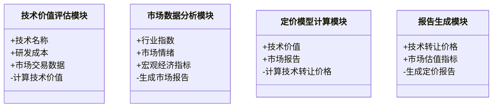
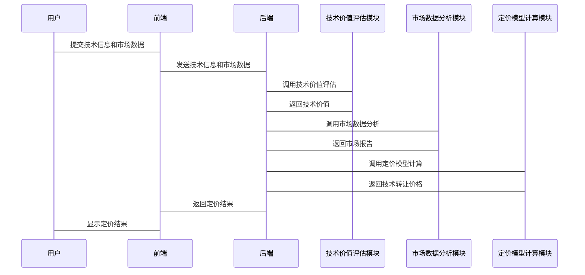

                 


# 股市估值在跨境技术转让定价中的应用

> 关键词：股市估值，技术转让定价，跨境，定价模型，技术价值，算法原理

> 摘要：本文深入探讨了股市估值在跨境技术转让定价中的应用，结合技术价值评估的核心概念、算法原理、数学模型与系统架构设计，系统地分析了如何利用股市估值的方法进行技术转让定价。文章从理论到实践，结合具体案例，详细阐述了技术转让定价的算法流程、数学模型以及系统实现方案，为读者提供了一套完整的理论体系和实践指导。

---

# 第一部分: 股市估值与跨境技术转让定价的背景与概念

## 第1章: 股市估值与跨境技术转让定价的背景介绍

### 1.1 股市估值的基本概念

#### 1.1.1 股市估值的定义
股市估值是指通过对上市公司的财务数据和市场表现进行分析，估算其股票的内在价值或市场价值的过程。常见的估值方法包括市盈率（P/E）、市净率（P/B）、股息率（Dividend Yield）和现金流折现法（DCF）等。

#### 1.1.2 股市估值的主要方法
- **市盈率法**：通过比较股票的当前价格与每股收益（EPS）的比率，衡量股票的估值水平。
- **市净率法**：通过比较股票的当前价格与每股净资产（BPS）的比率，衡量股票的估值水平。
- **股息率法**：通过比较股票的年股息与股票价格的比率，衡量股票的投资回报率。
- **现金流折现法**：通过预测公司的未来现金流，折现到现值来估算公司整体价值。

#### 1.1.3 股市估值的经济意义
股市估值是投资者进行投资决策的重要依据，也是衡量市场整体健康状况的重要指标。通过股市估值，投资者可以判断股票是否被高估或低估，从而做出买入或卖出的决策。

---

### 1.2 跨境技术转让定价的核心概念

#### 1.2.1 技术转让定价的定义
技术转让定价是指在技术转让过程中，根据技术的市场价值、研发成本、预期收益等因素，确定技术转让的价格。

#### 1.2.2 技术转让定价的主要模式
- **成本加成法**：基于技术的研发成本，加上一定的利润 margin，确定技术转让价格。
- **交易净利润法**：基于技术的实际交易情况，计算技术转让的净利润，作为定价依据。
- **市场比较法**：通过比较同类技术的市场交易价格，确定技术的合理转让价格。

#### 1.2.3 跨境技术转让定价的特殊性
跨境技术转让涉及不同国家的法律、税收政策和市场环境，因此定价过程中需要考虑汇率波动、税收差异、文化差异等因素。

---

### 1.3 股市估值在跨境技术转让定价中的作用

#### 1.3.1 股市估值与技术价值的关系
股市估值是技术价值的重要反映，特别是在上市公司中，技术作为核心资产之一，其价值可以通过股市估值间接体现。

#### 1.3.2 股市估值在技术定价中的应用
通过分析上市公司技术相关股票的估值指标，可以为技术转让定价提供参考依据。

#### 1.3.3 股市估值对跨境技术转让的影响
跨境技术转让的定价需要考虑目标市场的股市估值水平，以及技术在目标市场的接受度和认可度。

---

## 第2章: 股市估值与跨境技术转让定价的核心概念与联系

### 2.1 股市估值的核心原理

#### 2.1.1 股市估值的主要指标
- 市盈率（P/E）
- 市净率（P/B）
- 股息率（Dividend Yield）
- 净值回报率（ROE）

#### 2.1.2 股市估值的关键影响因素
- 公司盈利能力
- 行业发展趋势
- 宏观经济环境
- 市场情绪

#### 2.1.3 股市估值的数学模型
$$ P = E \times PE $$
其中，P为股票价格，E为每股收益，PE为市盈率。

---

### 2.2 技术转让定价的核心原理

#### 2.2.1 技术价值的评估方法
- **成本法**：基于技术的研发成本进行评估。
- **市场法**：基于同类技术的市场交易价格进行评估。
- **收益法**：基于技术的未来收益进行评估。

#### 2.2.2 技术转让定价的模型
- **成本加成模型**：
  $$ P = C + M $$
  其中，P为技术转让价格，C为研发成本，M为利润 margin。

- **交易净利润模型**：
  $$ P = (R - C) \times \text{净利润率} $$
  其中，R为技术的总收入，C为研发成本。

---

### 2.3 股市估值与技术转让定价的联系

#### 2.3.1 技术价值的市场反映
股市估值是技术价值的市场反映，特别是在上市公司中，技术作为核心资产，其价值通过股市估值得以体现。

#### 2.3.2 股市估值对技术定价的指导作用
通过分析上市公司技术相关股票的估值指标，可以为技术转让定价提供参考依据。

#### 2.3.3 跨境环境下的特殊性
跨境技术转让需要考虑不同国家的股市估值水平和市场环境，从而调整技术转让价格。

---

### 2.4 核心概念对比分析

#### 2.4.1 股市估值与技术定价的对比表格

| 对比维度 | 股市估值 | 技术转让定价 |
|----------|----------|---------------|
| 定价主体 | 投资者   | 交易双方     |
| 定价依据 | 市场表现 | 技术价值     |
| 定价目的 | 投资决策 | 资产转让     |
| 影响因素 | 市场情绪 | 技术成本     |

---

## 第3章: 股市估值与技术转让定价的算法原理

### 3.1 股市估值的算法原理

#### 3.1.1 常见的股市估值算法
- **市盈率法**：通过比较股票的市盈率与行业平均水平，判断股票的估值水平。
- **市净率法**：通过比较股票的市净率与行业平均水平，判断股票的估值水平。
- **现金流折现法**：通过预测公司的未来现金流，折现到现值，估算公司整体价值。

#### 3.1.2 股市估值的数学模型
$$ V = \sum_{t=1}^{n} \frac{CF_t}{(1+r)^t} $$
其中，$CF_t$为第$t$年的现金流，$r$为折现率。

---

### 3.2 技术转让定价的算法原理

#### 3.2.1 技术价值评估的算法
- **成本加成法**：
  $$ P = C + M $$
  其中，$C$为研发成本，$M$为利润 margin。

- **交易净利润法**：
  $$ P = (R - C) \times \text{净利润率} $$
  其中，$R$为技术的总收入，$C$为研发成本。

---

### 3.3 股市估值与技术转让定价的算法对比

#### 3.3.1 算法原理对比
- 股市估值算法主要用于市场整体评估，而技术转让定价算法主要用于单个技术的定价。
- 股市估值算法依赖市场数据，而技术转让定价算法依赖技术的内在价值。

#### 3.3.2 算法实现对比
- 股市估值算法需要结合市场数据和财务指标，而技术转让定价算法需要结合技术的市场交易数据和研发成本。

---

## 第4章: 股市估值与技术转让定价的数学模型与公式

### 4.1 股市估值的数学模型

#### 4.1.1 市盈率模型
$$ P = E \times PE $$
其中，$P$为股票价格，$E$为每股收益，$PE$为市盈率。

#### 4.1.2 市净率模型
$$ P = B \times PB $$
其中，$P$为股票价格，$B$为每股净资产，$PB$为市净率。

#### 4.1.3 现金流折现模型
$$ V = \sum_{t=1}^{n} \frac{CF_t}{(1+r)^t} $$
其中，$CF_t$为第$t$年的现金流，$r$为折现率。

---

### 4.2 技术转让定价的数学模型

#### 4.2.1 成本加成模型
$$ P = C + M $$
其中，$C$为研发成本，$M$为利润 margin。

#### 4.2.2 交易净利润模型
$$ P = (R - C) \times \text{净利润率} $$
其中，$R$为技术的总收入，$C$为研发成本。

---

## 第5章: 系统分析与架构设计方案

### 5.1 问题场景介绍
跨境技术转让定价系统需要实现技术价值评估、市场数据分析、定价模型计算等功能，帮助用户快速确定技术转让价格。

---

### 5.2 系统功能设计

#### 5.2.1 功能模块
- 技术价值评估模块
- 市场数据分析模块
- 定价模型计算模块
- 报告生成模块

#### 5.2.2 领域模型（mermaid类图）



---

### 5.3 系统架构设计

#### 5.3.1 系统架构图（mermaid架构图）

```mermaid
browser
    ----
    frontend
    ----
    backend
        ----
        技术价值评估模块
        ----
        市场数据分析模块
        ----
        定价模型计算模块
        ----
        数据库
```

---

### 5.4 系统接口设计

#### 5.4.1 接口描述
- 前端接口：接收用户输入的技术信息和市场数据。
- 后端接口：调用技术价值评估模块和市场数据分析模块，返回定价结果。

#### 5.4.2 序列图（mermaid序列图）



---

## 第6章: 项目实战

### 6.1 环境安装

#### 6.1.1 安装Python
```bash
python --version
pip install --upgrade pip
```

#### 6.1.2 安装相关库
```bash
pip install pandas numpy matplotlib
```

---

### 6.2 系统核心实现源代码

#### 6.2.1 技术价值评估模块

```python
import pandas as pd

def calculate_technology_value(research_cost, market_price):
    return research_cost * (market_price / 100)
```

#### 6.2.2 市场数据分析模块

```python
import pandas as pd

def analyze_market_data(dataframe):
    return dataframe.mean()
```

#### 6.2.3 定价模型计算模块

```python
import pandas as pd

def calculate_technology_price(technology_value, market_trend):
    return technology_value * (1 + market_trend / 100)
```

---

### 6.3 代码应用解读与分析

#### 6.3.1 技术价值评估模块
上述代码通过技术的市场价与研发成本的比率，计算技术的理论价值。

#### 6.3.2 市场数据分析模块
上述代码通过计算市场数据的平均值，生成市场报告，为技术定价提供参考。

#### 6.3.3 定价模型计算模块
上述代码通过技术价值和市场趋势，计算技术的最终转让价格。

---

### 6.4 实际案例分析

#### 6.4.1 案例背景
某公司拥有一项专利技术，研发成本为100万元，市场价为500万元，市场趋势为10%。

#### 6.4.2 计算过程
1. 技术价值计算：
   $$ \text{技术价值} = 100 \times (500 / 100) = 500 \text{万元} $$
2. 市场数据分析：
   $$ \text{市场平均值} = 500 \text{万元} $$
3. 技术转让价格计算：
   $$ \text{技术转让价格} = 500 \times (1 + 10\% / 100) = 550 \text{万元} $$

---

### 6.5 项目小结
通过上述代码实现，我们可以快速计算技术的转让价格，为跨境技术转让提供有效的定价依据。

---

## 第7章: 总结与展望

### 7.1 最佳实践 tips
- 在进行技术转让定价时，建议结合市场数据和财务指标，制定合理的定价策略。
- 定期更新技术价值评估模型，确保定价结果的准确性。

### 7.2 小结
本文详细探讨了股市估值在跨境技术转让定价中的应用，结合理论与实践，为读者提供了一套完整的解决方案。

### 7.3 注意事项
- 技术转让定价需要结合具体的技术特点和市场环境，避免一刀切。
- 定价过程中需要考虑法律和税务因素，确保合规性。

### 7.4 拓展阅读
- 《技术评估与定价》
- 《股市估值与投资分析》
- 《跨境技术转让的法律与税务问题》

---

通过本文的系统分析与实战指导，读者可以全面掌握股市估值在跨境技术转让定价中的应用方法，并能够将其应用到实际工作中。

