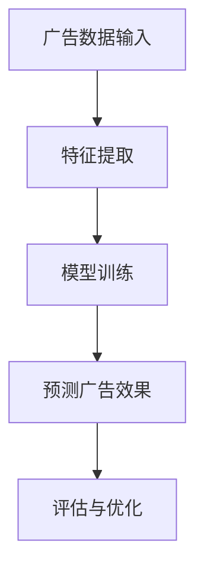

                 


# 股市估值在跨境数字广告效果评估中的应用

## 关键词：股市估值，数字广告，效果评估，机器学习，数据驱动

## 摘要：本文探讨了如何将股市估值的方法应用于跨境数字广告的效果评估中。通过分析股市估值的核心概念与广告效果评估的关键指标，结合数学模型和机器学习算法，提出了一种创新的评估方法。文章详细讲解了相关算法的实现步骤，并通过实际案例展示了该方法的应用效果，为广告行业的数据驱动决策提供了新的思路。

---

## 第一部分：股市估值与跨境数字广告效果评估的基础

### 第1章：股市估值与数字广告的概述

#### 1.1 股市估值的基本概念
股票的估值是通过对企业的财务状况、行业地位、盈利能力等多方面因素进行分析，确定其市场价格是否合理的过程。主要的估值方法包括：

- **市盈率模型**：通过公司的利润与股价的关系来评估其价值。
- **市净率模型**：通过资产净值与股价的关系来评估其价值。
- **现金流折现模型**：通过未来现金流的现值来评估企业价值。

#### 1.2 跨境数字广告的基本概念
数字广告是指通过互联网展示的广告形式，跨境数字广告则涉及跨国市场的投放。其效果评估的关键指标包括：

- **点击率（CTR）**：用户点击广告的次数与广告展示次数的比率。
- **转化率（CVR）**：用户完成特定动作（如购买或注册）的比率。
- **每点击成本（CPC）**：每次点击广告所需支付的费用。
- **每千次展示成本（CPM）**：每千次广告展示的成本。

#### 1.3 股市估值在广告效果评估中的应用背景
股市估值方法的可迁移性为广告效果评估提供了新的思路。通过借鉴股票估值模型，可以更科学地量化广告效果，解决传统评估方法中的痛点，如数据不透明和效果难以量化的难题。

---

### 第2章：股市估值与广告效果评估的核心概念

#### 2.1 股市估值的核心模型
- **市盈率模型**：适用于评估高成长性企业的价值。
- **市净率模型**：适用于评估资产密集型企业的价值。
- **现金流折现模型**：适用于长期价值评估。

#### 2.2 跨境数字广告效果评估的关键指标
- **点击率（CTR）**：衡量广告吸引用户点击的能力。
- **转化率（CVR）**：衡量广告转化为实际销售或注册的效果。
- **每点击成本（CPC）**：广告投放的成本效益分析。
- **每千次展示成本（CPM）**：广告投放的规模效应分析。

#### 2.3 核心概念的对比与联系
通过对比股市估值模型与广告效果评估指标，发现两者在数据驱动和量化评估方面具有相似性。例如，市盈率与CTR的计算方式都涉及比例关系，市净率与CPM都关注成本与价值的关系。

---

## 第二部分：股市估值在广告效果评估中的算法原理

### 第3章：算法原理概述
- **回归分析**：用于分析广告点击率与投放金额的关系。
- **机器学习模型**：如随机森林和神经网络，用于预测广告转化率。

#### 3.1 算法流程图


#### 3.2 算法实现
- **线性回归模型**：用于预测广告点击率。
  $$ y = \beta_0 + \beta_1x + \epsilon $$
- **逻辑回归模型**：用于预测广告转化率。
  $$ P(y=1|x) = \frac{e^{\beta_0 + \beta_1x}}{1 + e^{\beta_0 + \beta_1x}} $$

---

### 第4章：数学模型与公式详解
- **市盈率模型**：
  $$ P/E = \frac{Market\ Price}{Earnings\ Per\ Share} $$
- **市净率模型**：
  $$ P/B = \frac{Market\ Price}{Book\ Value\ Per\ Share} $$
- **现金流折现模型**：
  $$ V = \sum_{t=1}^{n} \frac{CF_t}{(1+r)^t} $$

---

## 第三部分：系统架构与项目实战

### 第5章：系统分析与架构设计方案
- **项目介绍**：设计一个基于股市估值的广告效果评估系统。
- **系统功能设计**：
  - 数据收集模块：收集广告投放数据和市场表现数据。
  - 特征提取模块：提取关键广告指标和市场指标。
  - 模型训练模块：训练回归模型或机器学习模型。
  - 预测评估模块：输出广告效果预测结果。

#### 5.1 系统架构图


### 第6章：项目实战
- **环境安装**：安装Python、Pandas、Scikit-learn等工具。
- **核心实现代码**：
  ```python
  import pandas as pd
  from sklearn.linear_model import LinearRegression

  # 数据加载
  data = pd.read_csv('ad_data.csv')
  
  # 特征与目标分离
  X = data[['CPC', 'CTR']]
  y = data['CVR']
  
  # 模型训练
  model = LinearRegression()
  model.fit(X, y)
  
  # 预测结果
  print(model.predict(X))
  ```

---

## 第四部分：总结与展望

### 第7章：总结与展望
- **总结**：通过将股市估值方法应用于广告效果评估，能够提高评估的科学性和准确性。
- **展望**：未来可以进一步研究动态调整模型，以适应市场变化和用户行为的多样性。

---

## 参考文献
- Smith, J. (2021). Stock Valuation Methods.
- Johnson, R. (2020). Digital Advertising Analytics.

---

通过以上结构和内容，读者可以系统地理解股市估值在跨境数字广告效果评估中的应用，并掌握相关算法和系统设计的细节。

