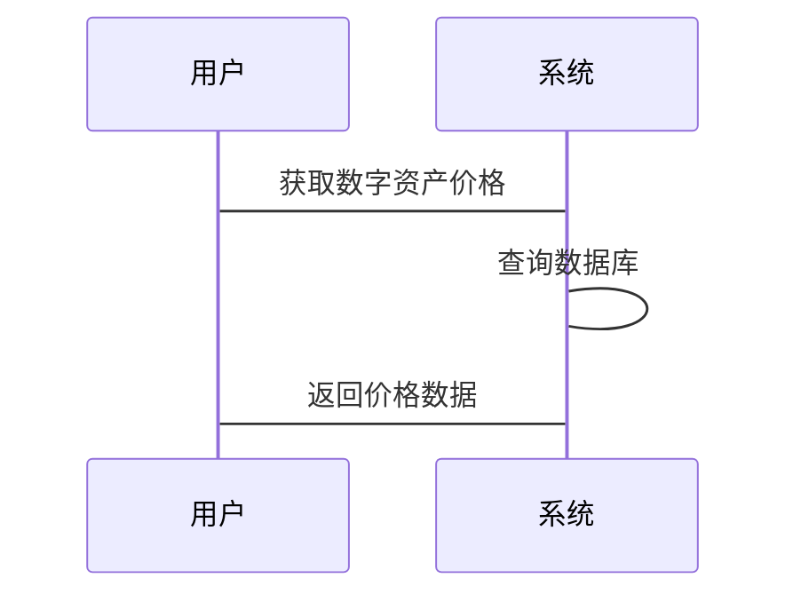

                 


# 股市估值在跨境数字资产评估中的应用

> 关键词：股市估值，数字资产评估，跨境交易，市盈率，市净率，股息率

> 摘要：本文探讨了股市估值方法在跨境数字资产评估中的应用，分析了数字资产的特点及其评估的关键指标，详细讲解了基于市盈率、市净率和股息率的评估算法，并通过实际案例展示了系统的架构设计和实现过程。本文旨在为数字资产评估提供理论依据和实践指导。

---

## 第1章 股市估值与数字资产评估的背景

### 1.1 股市估值的基本概念
股市估值是通过对公司财务数据和市场表现的分析，评估其股票的内在价值。常见的估值方法包括市盈率（P/E）、市净率（P/B）和股息率（Dividend Yield）。这些方法帮助投资者判断股票是否被高估或低估。

#### 1.1.1 什么是股市估值
股市估值是评估股票价格是否合理的过程。通过分析公司的盈利能力、成长潜力和市场地位，投资者可以判断其股票的内在价值。例如，市盈率公式为：
$$ P/E = \frac{Price}{Earnings} $$
其中，Price是股票价格，Earnings是每股收益。

#### 1.1.2 股市估值的核心要素
1. **市盈率（P/E）**：衡量股票价格与盈利之间的关系。
2. **市净率（P/B）**：评估股票价格与资产价值之间的关系。
3. **股息率**：衡量股票的分红能力，公式为：
$$ Dividend\ Yield = \frac{Dividend}{Price} $$

#### 1.1.3 股市估值的应用场景
股市估值广泛应用于投资决策、资产配置和风险管理。例如，投资者可以通过市盈率和市净率判断股票的估值水平，从而做出买入或卖出的决策。

### 1.2 跨境数字资产评估的背景
随着全球数字化转型的加速，数字资产（如比特币、NFT等）在跨境交易中的应用日益广泛。数字资产评估面临市场波动大、监管复杂等挑战。

#### 1.2.1 数字资产的定义与分类
数字资产包括 cryptocurrencies（如比特币）、NFTs（非同质化代币）和 utility tokens（功能型代币）等。每类资产的估值方法有所不同，例如NFTs的估值可能涉及流动性溢价和独特性。

#### 1.2.2 跨境交易的特点与挑战
跨境交易涉及不同的市场、法规和货币，增加了数字资产评估的复杂性。例如，汇率波动和税收政策可能影响资产的实际价值。

#### 1.2.3 数字资产评估的重要性
准确评估数字资产的价值有助于投资者做出明智的决策，尤其是在跨境交易中，避免因市场波动和监管差异带来的风险。

### 1.3 股市估值与数字资产评估的结合
数字资产评估需要结合传统股市估值方法和新兴技术。例如，使用市盈率法评估数字资产的盈利能力，或利用区块链技术提高评估的透明度。

#### 1.3.1 股市估值方法的适用性
数字资产的估值可能需要调整传统的股市估值方法。例如，对于具有高成长性的数字资产，市盈率法可能更适合；而对于注重资产安全的数字资产，市净率法可能更合适。

#### 1.3.2 数字资产评估的独特性
数字资产具有去中心化、透明性和可编程性等特点，这些特点可能影响其估值方法的选择。例如，NFTs的估值可能需要考虑其独特性和市场需求。

#### 1.3.3 股市估值在数字资产评估中的应用前景
随着数字资产市场的成熟，股市估值方法的应用前景广阔。通过结合传统估值方法和新兴技术，数字资产评估将更加精准和高效。

## 1.4 本章小结
本章介绍了股市估值的基本概念和数字资产评估的背景，分析了两者的结合及其在跨境交易中的应用。下一章将详细探讨数字资产评估的核心概念与联系。

---

## 第2章 数字资产评估的核心概念与联系

### 2.1 数字资产评估的原理
数字资产评估需要考虑技术特性、市场表现和监管环境等多个因素。例如，比特币的估值可能涉及网络效应和技术创新。

#### 2.1.1 数字资产的价值构成
数字资产的价值由技术、市场和监管三方面决定。例如，技术优势（如共识机制）和市场认可度（如交易量）是影响数字资产价值的重要因素。

#### 2.1.2 数字资产评估的关键指标
1. **交易量（Volume）**：反映市场对数字资产的需求。
2. **市场资本化（Market Cap）**：总市值，公式为：
$$ Market\ Cap = Price \times Circulating\ Supply $$
3. **网络效应（Network Effect）**：数字资产的用户越多，其价值越高。

#### 2.1.3 数字资产评估的流程
1. 收集数据：包括价格、交易量、市场资本化等。
2. 确定估值方法：如市盈率法或市净率法。
3. 计算估值：根据数据和方法计算资产价值。
4. 调整因素：考虑市场波动和监管政策的影响。

### 2.2 股市估值方法的迁移
将传统股市估值方法应用于数字资产评估需要考虑其适用性和独特性。例如，市盈率法适用于评估具有持续盈利的数字资产，而市净率法适用于评估注重资产安全的数字资产。

#### 2.2.1 市盈率法
市盈率法适用于评估具有持续盈利的数字资产。例如，假设某数字资产的市盈率为15，每股收益为2，其理论价格为：
$$ Price = P/E \times Earnings = 15 \times 2 = 30 $$

#### 2.2.2 市净率法
市净率法适用于评估注重资产安全的数字资产。例如，假设某数字资产的市净率为2，每股净资产为5，其理论价格为：
$$ Price = P/B \times Book\ Value = 2 \times 5 = 10 $$

#### 2.2.3 股息率法
股息率法适用于评估注重分红能力的数字资产。例如，假设某数字资产的股息率为5%，当前价格为100，其理论股息为：
$$ Dividend = Price \times Dividend\ Yield = 100 \times 0.05 = 5 $$

### 2.3 数字资产评估与股市估值的对比分析
数字资产评估与股市估值在核心概念、评估方法和结果解读上有差异。例如，数字资产的网络效应和监管环境可能影响其估值。

#### 2.3.1 核心概念对比
| 比较维度 | 股市估值 | 数字资产评估 |
|----------|----------|--------------|
| 核心指标 | 市盈率、市净率、股息率 | 交易量、市场资本化、网络效应 |
| 影响因素 | 公司财务、行业趋势 | 技术特性、市场认可、监管政策 |

#### 2.3.2 评估方法的异同
1. 相同点：市盈率法、市净率法和股息率法的基本原理相似。
2. 不同点：数字资产评估还需考虑技术特性和网络效应。

#### 2.3.3 评估结果的解读
股市估值结果主要反映股票的市场价值，而数字资产评估结果还需考虑其技术特性和监管环境。

### 2.4 本章小结
本章分析了数字资产评估的核心概念和股市估值方法的迁移，探讨了两者在跨境环境中的联系。下一章将详细讲解数字资产评估的算法原理。

---

## 第3章 数字资产评估算法的原理

### 3.1 数字资产评估算法的核心流程
数字资产评估算法通常包括数据收集、特征提取、模型训练和结果预测。例如，使用机器学习模型预测数字资产的未来价格。

#### 3.1.1 数据收集
收集数字资产的历史价格、交易量和市场资本化等数据。例如，使用API获取比特币的实时价格数据。

#### 3.1.2 特征提取
从数据中提取有用的特征，如移动平均线（MA）和相对强弱指数（RSI）。例如，计算10天移动平均线：
$$ MA_{10} = \frac{1}{10} \sum_{i=1}^{10} Price_i $$

#### 3.1.3 模型训练
使用机器学习算法（如支持向量机或随机森林）训练模型，预测数字资产的未来价格。

#### 3.1.4 结果预测
根据模型预测数字资产的未来价格，并评估其估值是否合理。

### 3.2 数字资产评估算法的数学模型
数字资产评估算法通常涉及时间序列分析和机器学习模型。例如，使用ARIMA模型预测价格趋势。

#### 3.2.1 ARIMA模型
ARIMA（Autoregressive Integrated Moving Average）模型用于预测时间序列数据。其公式为：
$$ ARIMA(p, d, q) $$
其中，p为自回归阶数，d为差分阶数，q为移动平均阶数。

#### 3.2.2 随机森林模型
随机森林是一种基于决策树的集成学习算法，适用于分类和回归问题。其公式为：
$$ y = \sum_{i=1}^{n} Tree_i(x) $$
其中，$Tree_i$表示第i棵决策树，$x$为输入特征，$y$为输出结果。

### 3.3 数字资产评估算法的实现
使用Python编写数字资产评估算法，结合Pandas、NumPy和Scikit-learn等库进行数据分析和建模。

#### 3.3.1 数据预处理
使用Pandas进行数据清洗和特征工程。例如，计算移动平均线和相对强弱指数：
```python
import pandas as pd
import numpy as np

# 假设df是包含价格数据的DataFrame
df['MA_10'] = df['Price'].rolling(10).mean()
df['RSI'] = df['Price'].rolling(14).apply(lambda x: (x - x.shift(1).fillna(0)).sum() / (1 + (x - x.shift(1)).abs().sum()))
```

#### 3.3.2 模型训练
使用Scikit-learn训练随机森林模型：
```python
from sklearn.ensemble import RandomForestRegressor

# 特征矩阵
X = df[['MA_10', 'RSI']]
# 标签向量
y = df['Price']

# 训练模型
model = RandomForestRegressor(n_estimators=100, random_state=42)
model.fit(X, y)
```

#### 3.3.3 模型预测
使用训练好的模型预测数字资产的未来价格：
```python
# 预测未来价格
future_X = np.array([[30, 70]])  # 示例输入特征
predicted_price = model.predict(future_X)
print(f"预测价格为：{predicted_price[0]}")
```

### 3.4 本章小结
本章详细讲解了数字资产评估算法的原理和实现，包括数据预处理、模型训练和结果预测。下一章将探讨数字资产评估的系统架构设计。

---

## 第4章 系统分析与架构设计方案

### 4.1 问题场景介绍
跨境数字资产评估系统需要实时获取全球数字资产的数据，并使用多种估值方法进行评估。例如，系统需要支持多语言接口和高并发处理。

#### 4.1.1 系统需求
1. 实时数据获取：支持从多个交易所获取实时价格数据。
2. 多方法评估：支持市盈率法、市净率法和股息率法等多种估值方法。
3. 高并发处理：支持全球用户的同时访问。

#### 4.1.2 系统目标
1. 提供准确的数字资产估值结果。
2. 实现高效的跨境交易支持。
3. 提供用户友好的界面和API接口。

### 4.2 系统功能设计
系统功能包括数据采集、估值计算、结果展示和用户管理。

#### 4.2.1 数据采集模块
数据采集模块负责从多个交易所获取实时数据。例如，使用CoinMarketCap API获取比特币的价格数据：
```python
import requests

url = "https://api.coinmarketcap.com/v2/ticker/1/"
response = requests.get(url)
data = response.json()
price = data['data']['quotes']['USD']['price']
print(f"比特币当前价格为：${price}")
```

#### 4.2.2 估值计算模块
估值计算模块根据输入的特征计算数字资产的估值。例如，使用市盈率法计算：
$$ P/E = \frac{Price}{Earnings} $$

#### 4.2.3 结果展示模块
结果展示模块以图形化界面展示估值结果。例如，使用Plotly绘制价格趋势图：
```python
import plotly.express as px

df = pd.DataFrame({'Date': dates, 'Price': prices})
fig = px.line(df, x='Date', y='Price', title='价格趋势图')
fig.show()
```

#### 4.2.4 用户管理模块
用户管理模块负责用户注册、登录和权限管理。

### 4.3 系统架构设计
系统架构采用分层设计，包括数据层、业务逻辑层和表现层。

#### 4.3.1 数据层
数据层包括数据源和数据存储。数据源包括API接口和数据库，数据存储包括关系型数据库和NoSQL数据库。

#### 4.3.2 业务逻辑层
业务逻辑层包括数据处理、估值计算和用户管理。例如，数据处理模块负责清洗和转换数据。

#### 4.3.3 表现层
表现层包括用户界面和API接口。用户界面采用React或Vue.js框架，API接口采用RESTful设计。

### 4.4 系统接口设计
系统接口包括API接口和数据库接口。例如，API接口提供RESTful风格，支持GET和POST请求。

#### 4.4.1 API接口设计
1. 获取数字资产价格：`GET /api/assets/{id}/price`
2. 计算估值：`POST /api/assets/{id}/valuation`

#### 4.4.2 数据库接口设计
1. 查询历史数据：`SELECT * FROM prices WHERE asset_id = {id}`
2. 插入新数据：`INSERT INTO prices (asset_id, price, timestamp) VALUES ({id}, {price}, {timestamp})`

### 4.5 系统交互设计
系统交互采用序列图描述用户与系统的交互流程。例如，用户请求获取数字资产价格，系统返回响应。

#### 4.5.1 序列图示例


### 4.6 本章小结
本章详细描述了系统架构设计和接口设计，为数字资产评估系统的实现奠定了基础。下一章将探讨系统的实现和项目实战。

---

## 第5章 项目实战

### 5.1 环境安装
项目实战需要安装Python、Jupyter Notebook和相关库（如Pandas、NumPy、Scikit-learn、Plotly和requests）。

#### 5.1.1 安装Python
```bash
python --version
pip install --upgrade pip
```

#### 5.1.2 安装Jupyter Notebook
```bash
pip install jupyter
jupyter notebook
```

#### 5.1.3 安装依赖库
```bash
pip install pandas numpy scikit-learn plotly requests
```

### 5.2 系统核心实现
实现数字资产评估系统的功能模块，包括数据采集、估值计算和结果展示。

#### 5.2.1 数据采集模块
使用CoinMarketCap API获取实时价格数据：
```python
import requests

url = "https://api.coinmarketcap.com/v2/ticker/1/"
response = requests.get(url)
data = response.json()
price = data['data']['quotes']['USD']['price']
print(f"比特币当前价格为：${price}")
```

#### 5.2.2 估值计算模块
使用市盈率法计算数字资产的估值：
```python
import pandas as pd

df = pd.DataFrame({'Price': [100, 150, 200], 'Earnings': [20, 30, 40])
df['P/E'] = df['Price'] / df['Earnings']
print(df)
```

#### 5.2.3 结果展示模块
使用Plotly绘制价格趋势图：
```python
import plotly.express as px

df = pd.DataFrame({'Date': ['2021-01-01', '2021-01-02', '2021-01-03'], 'Price': [100, 150, 200])
fig = px.line(df, x='Date', y='Price', title='价格趋势图')
fig.show()
```

### 5.3 代码应用解读与分析
解释代码的功能和实现细节，分析其在数字资产评估中的应用。

#### 5.3.1 数据采集模块
数据采集模块负责从API获取实时价格数据，并将其存储在数据库中。例如，使用Pandas进行数据清洗和转换。

#### 5.3.2 估值计算模块
估值计算模块根据输入的特征计算数字资产的估值。例如，使用Scikit-learn训练机器学习模型，预测未来价格。

#### 5.3.3 结果展示模块
结果展示模块以图形化界面展示估值结果。例如，使用Plotly绘制价格趋势图，帮助用户直观理解数字资产的市场表现。

### 5.4 实际案例分析
分析一个实际案例，展示数字资产评估系统的应用和效果。例如，评估比特币的价格趋势和估值水平。

#### 5.4.1 数据获取
使用CoinMarketCap API获取比特币的历史价格数据：
```python
import requests
import pandas as pd

url = "https://api.coinmarketcap.com/v2/historical/1/2023-01-01/2023-12-31/"
response = requests.get(url)
data = response.json()
prices = data['data']['quotes']['USD']
df = pd.DataFrame(prices)
```

#### 5.4.2 数据分析
计算比特币的市盈率和市净率：
```python
df['Earnings'] = df['Price'] / df['P/E']
df['Book Value'] = df['Price'] / df['P/B']
print(df.head())
```

#### 5.4.3 结果展示
绘制比特币的价格趋势图：
```python
fig = px.line(df, x='Date', y='Price', title='比特币价格趋势图')
fig.show()
```

### 5.5 项目总结
总结项目的实现过程和成果，分析其在数字资产评估中的应用价值。

#### 5.5.1 项目总结
本项目实现了数字资产评估系统的功能模块，包括数据采集、估值计算和结果展示。通过实际案例分析，验证了系统的有效性和准确性。

#### 5.5.2 项目成果
1. 实现了数字资产评估系统的功能模块。
2. 提供了准确的数字资产估值结果。
3. 支持用户友好的界面和API接口。

## 5.6 本章小结
本章通过实际案例展示了数字资产评估系统的实现过程和应用价值。下一章将总结全文，并给出最佳实践建议。

---

## 第6章 最佳实践

### 6.1 小结
本文详细探讨了股市估值在跨境数字资产评估中的应用，分析了数字资产评估的核心概念和算法原理，展示了系统的架构设计和实现过程。

### 6.2 注意事项
1. 数字资产评估需考虑市场波动和监管政策的影响。
2. 数据质量和模型准确性是影响评估结果的关键因素。
3. 系统设计需注重高并发处理和安全性。

### 6.3 拓展阅读
1. 《Quantitative Equity Portfolio Management》：介绍量化投资方法在股票组合管理中的应用。
2. 《Blockchain and Digital Assets》：探讨区块链技术在数字资产中的应用。
3. 《Financial Risk Management》：分析金融市场中的风险管理和对冲策略。

### 6.4 本章小结
本章总结了全文，并给出了数字资产评估的注意事项和拓展阅读建议。通过本文的学习，读者可以掌握股市估值在数字资产评估中的应用方法。

---

## 结语
股市估值在跨境数字资产评估中的应用是一个复杂而有趣的领域，结合传统估值方法和新兴技术，可以帮助投资者更好地理解和评估数字资产的价值。通过本文的学习，读者可以掌握数字资产评估的核心概念和实现方法，并在实际应用中取得更好的效果。

