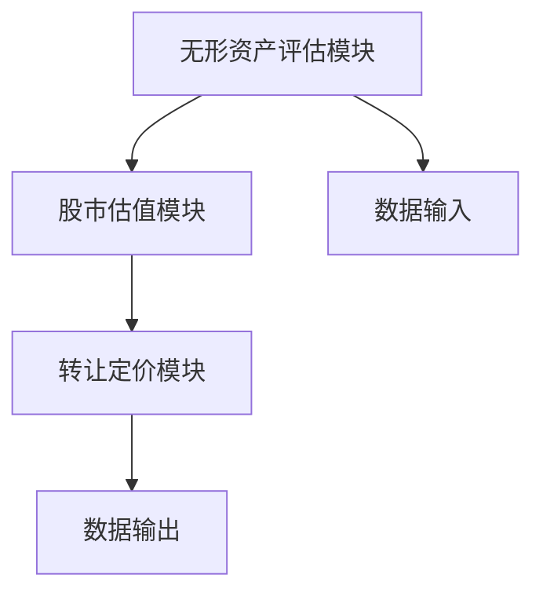

                 


# 股市估值在跨境无形资产转让定价中的应用

> 关键词：股市估值，跨境无形资产，转让定价，企业价值评估，资产评估，定价模型

> 摘要：本文系统探讨了股市估值在跨境无形资产转让定价中的应用，分析了核心概念、算法原理、系统架构，并通过实际案例展示了如何在项目中应用这些方法。内容涵盖理论与实践，旨在为专业人士提供全面的指导。

---

## 第四章: 股市估值与跨境无形资产转让定价的系统分析

### 4.1 问题场景介绍
#### 4.1.1 跨境无形资产转让定价的核心问题
#### 4.1.2 系统分析的基本框架
#### 4.1.3 问题场景的实例分析

### 4.2 系统功能设计
#### 4.2.1 领域模型构建
##### 4.2.1.1 无形资产评估模块
##### 4.2.1.2 股市估值模块
##### 4.2.1.3 转让定价模块

#### 4.2.2 系统架构设计
##### 4.2.2.1 模块划分
##### 4.2.2.2 数据流设计
##### 4.2.2.3 模块交互设计

### 4.3 系统架构图


### 4.4 系统接口与交互设计
#### 4.4.1 系统接口设计
##### 4.4.1.1 数据输入接口
##### 4.4.1.2 数据输出接口
##### 4.4.1.3 API接口

#### 4.4.2 系统交互设计
##### 4.4.2.1 用户交互流程
##### 4.4.2.2 模块间交互流程

### 4.5 实际案例分析
#### 4.5.1 案例背景
#### 4.5.2 案例分析过程
#### 4.5.3 案例结果与总结

---

## 第五章: 股市估值与跨境无形资产转让定价的项目实战

### 5.1 项目环境安装
#### 5.1.1 系统运行环境要求
#### 5.1.2 软件工具安装
#### 5.1.3 数据库配置

### 5.2 核心代码实现
#### 5.2.1 无形资产评估模块
##### 5.2.1.1 数据清洗与预处理
##### 5.2.1.2 评估模型训练
##### 5.2.1.3 模型验证与优化

#### 5.2.2 股市估值模块
##### 5.2.2.1 数据获取与处理
##### 5.2.2.2 估值模型构建
##### 5.2.2.3 模型应用与测试

#### 5.2.3 转让定价模块
##### 5.2.3.1 定价策略制定
##### 5.2.3.2 定价模型实现
##### 5.2.3.3 结果输出与分析

### 5.3 代码实现与解读
#### 5.3.1 无形资产评估模块代码
```python
# 示例代码
def asset_assessment/assets.csv':
    # 数据清洗代码
    pass
```

#### 5.3.2 股市估值模块代码
```python
# 示例代码
def stock_valuation ticker:
    # 估值模型代码
    pass
```

#### 5.3.3 转让定价模块代码
```python
# 示例代码
def transfer_pricing/assets.csv':
    # 定价模型代码
    pass
```

### 5.4 案例分析与结果解读
#### 5.4.1 案例背景
#### 5.4.2 案例数据输入
#### 5.4.3 案例计算过程
#### 5.4.4 案例结果与分析

---

## 第六章: 股市估值与跨境无形资产转让定价的总结与展望

### 6.1 总结
#### 6.1.1 核心内容回顾
#### 6.1.2 关键点总结
#### 6.1.3 实践中的注意事项

### 6.2 未来展望
#### 6.2.1 研究方向
#### 6.2.2 技术发展趋势
#### 6.2.3 应用前景分析

### 6.3 最佳实践Tips
#### 6.3.1 方法论建议
#### 6.3.2 工具推荐
#### 6.3.3 风险提示

### 6.4 小结
#### 6.4.1 内容回顾
#### 6.4.2 展望未来
#### 6.4.3 结束语

---

通过以上目录大纲，文章将系统地介绍股市估值在跨境无形资产转让定价中的应用，涵盖理论、算法、系统设计和项目实战，帮助读者全面理解和掌握相关知识。

