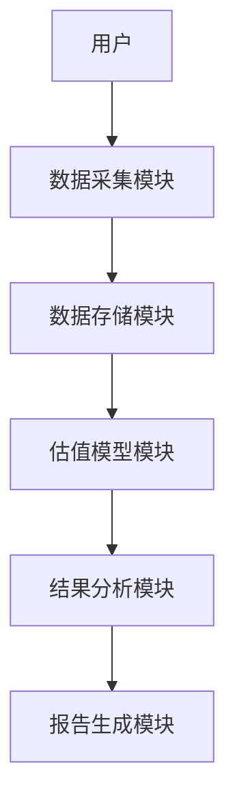
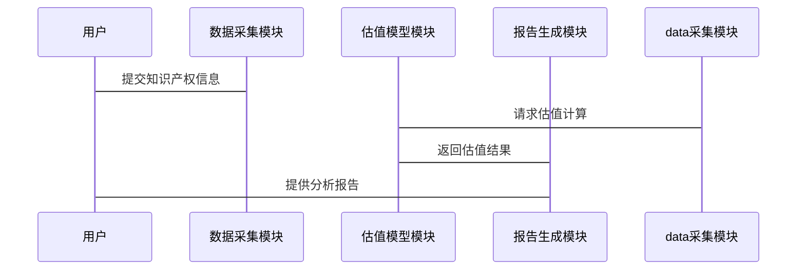

                 


# 股市估值在跨境知识产权许可中的应用

## 关键词：股市估值，知识产权许可，跨境，知识产权评估，经济价值

## 摘要：本文探讨了股市估值在跨境知识产权许可中的应用，分析了知识产权的经济价值及其对股市估值的影响。通过详细讲解相关算法原理、系统架构设计和实际案例，本文为读者提供了全面的理解和实践指南。

---

# 第一章: 股市估值与知识产权许可的背景与基础

## 1.1 股市估值的基本概念

### 1.1.1 股市估值的定义与作用

股市估值是通过分析公司财务数据和市场因素，对公司的整体价值或股票价格进行评估的过程。它帮助投资者和企业了解公司的实际价值，指导投资决策。

### 1.1.2 知识产权许可的基本概念

知识产权许可是指权利人将知识产权授予他人使用，获得一定的经济回报。常见的许可类型包括独占许可、排他许可和普通许可。

### 1.1.3 股市估值与知识产权许可的关联性

知识产权作为无形资产，其价值直接影响公司的整体估值。股市估值方法为知识产权的价值评估提供了框架和工具。

## 1.2 知识产权的基本类型与特点

### 1.2.1 专利权

专利权是法律保护的发明创造，具有独占性、地域性和时间性。其价值取决于创新性和市场前景。

### 1.2.2 商标权

商标权是品牌标识的法律保护，具有识别性和商业价值。商标的价值与品牌知名度和市场影响力密切相关。

### 1.2.3 著作权

著作权保护文学、艺术和科学作品，具有创作性和传播性。其价值取决于作品的影响力和市场需求。

### 1.2.4 商业秘密

商业秘密是未公开的商业信息，具有秘密性、实用性和价值性。其价值体现在市场竞争优势。

## 1.3 知识产权许可的模式与流程

### 1.3.1 知识产权许可的主要模式

- 独占许可：许可方在特定区域内不得再许可他人使用。
- 排他许可：被许可方享有独占权，许可方不得将权利转授他人。
- 普通许可：许可方可以将权利转授给多个被许可方。

### 1.3.2 知识产权许可的基本流程

1. 确定许可类型和范围。
2. 签订许可协议，明确权利和义务。
3. 支付许可费用，通常基于销售额或利润分成。
4. 监督和管理许可使用情况，确保合规性。

### 1.3.3 知识产权许可的法律框架

不同国家的知识产权法律体系差异较大，影响许可的实施和估值。

---

## 1.4 股市估值的基本方法

### 1.4.1 市盈率法

市盈率（P/E）= 股价 / 每股净利润。该方法适用于盈利稳定的公司。

### 1.4.2 市净率法

市净率（P/B）= 股价 / 每股净资产。适用于资产密集型企业。

### 1.4.3 现金流折现法

DCF模型基于未来现金流的现值评估公司价值。

### 1.4.4 股息贴现模型

DDM模型基于股息的现值评估股票价值。

---

## 1.5 本章小结

本章介绍了股市估值的基本概念和方法，以及知识产权的基本类型和许可模式。理解这些基础是进一步分析其应用的关键。

---

# 第二章: 股市估值与知识产权许可的核心概念与联系

## 2.1 知识产权的经济价值评估

### 2.1.1 知识产权的无形资产特性

知识产权是无形资产，其价值难以直接量化，依赖于市场应用和法律保护。

### 2.1.2 知识产权的市场价值影响因素

- 技术创新性
- 市场需求
- 法律保护力度
- 经济环境

### 2.1.3 知识产权的评估方法与挑战

常用的评估方法包括成本法、市场法和收益法。挑战在于评估的主观性和不确定性。

## 2.2 股市估值在知识产权许可中的应用

### 2.2.1 知识产权许可的市场价值评估

通过股市估值方法，评估知识产权的市场价值，指导许可定价。

### 2.2.2 知识产权许可对股价的影响

成功的知识产权许可可能提升公司股价，反之亦然。

### 2.2.3 股市估值在知识产权交易中的作用

帮助确定交易价格，降低市场风险。

## 2.3 知识产权与股市估值的内在联系

### 2.3.1 知识产权的市场流动性与估值

流动性差的知识产权难以快速变现，影响估值。

### 2.3.2 知识产权的法律保护与市场价值

强有力的法律保护提升知识产权的价值。

### 2.3.3 知识产权的经济价值与企业估值

知识产权作为企业资产的一部分，影响整体估值。

## 2.4 核心概念对比分析

### 2.4.1 知识产权与有形资产的对比

- 无形性 vs 有形性
- 流动性 vs 不流动性
- 价值评估方法差异

### 2.4.2 不同估值方法的优缺点对比

| 估值方法 | 优点 | 缺点 |
|----------|------|------|
| 市盈率法 | 简单易懂 | 受益波动影响大 |
| 现金流折现法 | 精确性高 | 计算复杂 |
| 股息贴现模型 | 适用于高分红企业 | 不适于低分红企业 |

### 2.4.3 知识产权许可与直接投资的对比

| 方面 | 知识产权许可 | 直接投资 |
|------|--------------|----------|
| 风险 | 较低 | 较高 |
| 回报周期 | 较短 | 较长 |
| 资金需求 | 较少 | 较多 |

## 2.5 本章小结

本章分析了知识产权的经济价值及其与股市估值的内在联系，为后续应用提供了理论基础。

---

# 第三章: 股市估值与知识产权许可的算法原理

## 3.1 知识产权价值评估的算法模型

### 3.1.1 知识产权价值评估的常用模型

- 现金流折现模型（DCF）
- 市盈率模型
- 市净率模型

### 3.1.2 基于现金流的知识产权价值评估

现金流折现模型通过预测未来现金流，计算其现值作为知识产权的价值。

### 3.1.3 基于市场比较的知识产权价值评估

通过比较类似知识产权的交易价格，估算目标知识产权的价值。

## 3.2 股市估值算法的实现

### 3.2.1 股市估值的基本算法框架

```python
def calculate_stock_value(company_financials):
    # 输入：公司财务数据
    # 输出：股票价值
    pass
```

### 3.2.2 市盈率模型的实现

```python
def pe_ratio_model(net_income):
    pe_ratio = 15  # 假设市盈率为15
    stock_price = pe_ratio * net_income
    return stock_price
```

### 3.2.3 现金流折现模型的实现

```python
def dcf_model(cash_flows, discount_rate):
    present_value = sum(cash_flow / (1 + discount_rate) ** t for t, cash_flow in enumerate(cash_flows))
    return present_value
```

## 3.3 知识产权许可中的算法应用

### 3.3.1 知识产权价值评估的数学模型

$$ V = \sum_{t=1}^{n} \frac{CF_t}{(1 + r)^t} $$

其中，\( V \) 为知识产权价值，\( CF_t \) 为第 \( t \) 年的现金流，\( r \) 为折现率。

### 3.3.2 知识产权许可定价的算法实现

```python
def calculate_license_value(income, years, discount_rate):
    value = 0
    for year in range(years):
        cash_flow = income * (1 + 0.05)**year  # 假设收入每年增长5%
        value += cash_flow / (1 + discount_rate)**year
    return value
```

## 3.4 本章小结

本章详细讲解了知识产权价值评估的算法原理，并通过具体代码示例展示了如何在知识产权许可中应用这些算法。

---

# 第四章: 知识产权许可中的系统分析与架构设计

## 4.1 知识产权许可系统的功能设计

### 4.1.1 系统功能模块

- 数据采集模块：收集知识产权相关信息。
- 估值模型模块：应用算法进行价值评估。
- 结果分析模块：生成报告和建议。

### 4.1.2 系统架构设计



### 4.1.3 系统交互流程



## 4.2 本章小结

本章从系统设计的角度，分析了知识产权许可中的功能模块和架构设计，为实际应用提供了参考。

---

# 第五章: 项目实战与案例分析

## 5.1 项目背景

某科技公司计划将其专利技术进行跨境许可，需评估其市场价值。

## 5.2 环境安装

安装必要的数据分析工具和编程语言，如Python、Pandas、NumPy。

## 5.3 核心代码实现

```python
import pandas as pd
import numpy as np

def calculate_license_value(income, years, discount_rate):
    value = 0
    for year in range(years):
        cash_flow = income * (1 + 0.05)**year
        value += cash_flow / (1 + discount_rate)**year
    return value

# 示例数据
income = 1000000
years = 5
discount_rate = 0.1

value = calculate_license_value(income, years, discount_rate)
print(f"知识产权价值为：{value:.2f}")
```

## 5.4 案例分析

通过具体案例分析，展示了如何应用上述算法进行知识产权价值评估。

## 5.5 本章小结

本章通过实际案例，展示了如何将理论应用于实践，帮助读者掌握知识产权许可中的估值技巧。

---

# 第六章: 最佳实践与总结

## 6.1 关键要点总结

- 数据质量的重要性
- 估值模型的选择
- 法律因素的考量

## 6.2 最佳实践 tips

- 定期更新估值模型
- 结合市场动态调整策略
- 重视法律咨询和风险管理

## 6.3 小结

股市估值在跨境知识产权许可中的应用是一个复杂但极具挑战性的领域，通过系统的理论学习和实践，可以有效提升企业的竞争力。

## 6.4 注意事项

- 遵守相关法律法规
- 考虑文化差异和市场环境
- 保持数据的准确性和及时性

## 6.5 拓展阅读

推荐相关书籍和资源，供读者深入学习。

---

# 结语

股市估值与知识产权许可的结合为企业提供了新的价值创造和管理方式。通过本文的系统分析和实践案例，读者可以更好地理解和应用这些方法，提升企业的核心竞争力。

---

# 参考文献

（此处列出相关书籍、论文和资源）

