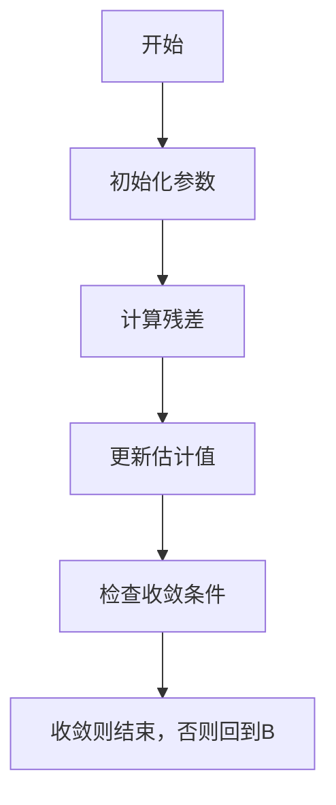
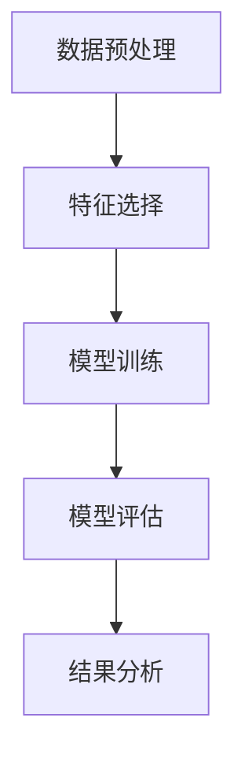
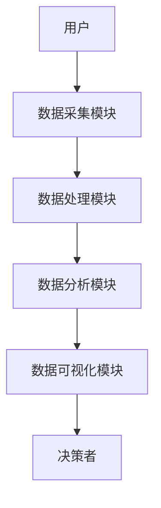

                 


# 股市估值在金融危机预警中的作用

## 关键词：股市估值，金融危机，预警模型，时间序列分析，机器学习

## 摘要：股市估值是金融市场中的重要指标，用于衡量上市公司的内在价值。在金融危机预警中，股市估值指标和相关模型能够帮助投资者和监管机构识别潜在的金融风险，从而采取相应的防范措施。本文将详细探讨股市估值在金融危机预警中的应用，分析相关数学模型和算法，并通过实际案例展示如何利用这些工具构建有效的金融危机预警系统。

---

# 第1章: 股市估值与金融危机预警的背景

## 1.1 金融市场的基本概念

### 1.1.1 金融市场的定义与分类
金融市场是资金供需双方通过交易金融资产进行交换的场所。根据交易对象的不同，金融市场可以分为债务市场、股权市场、衍生品市场和外汇市场。股权市场中的股市估值是本文的核心关注点。

### 1.1.2 股市估值的基本原理
股市估值是通过分析上市公司的财务数据、行业地位和市场环境等因素，计算其股票的内在价值。常用的估值指标包括市盈率（P/E）、市净率（P/B）和股息率（Dividend Yield）等。

### 1.1.3 股市估值的核心指标
- **市盈率（P/E）**：股票价格与每股收益的比率。
- **市净率（P/B）**：股票价格与每股净资产的比率。
- **股息率**：每股股息与股票价格的比率。

## 1.2 金融危机的类型与特征

### 1.2.1 系统性金融危机的定义
系统性金融危机是指整个金融系统出现崩溃或瘫痪的情况，通常由杠杆过高、资产泡沫破裂或流动性危机引发。

### 1.2.2 非系统性金融危机的特征
非系统性金融危机是指特定机构或市场因自身问题引发的危机，例如银行破产或个别公司的财务危机。

### 1.2.3 金融危机的预警指标
常用的金融危机预警指标包括：
- **经济指标**：GDP增长率、失业率、通货膨胀率。
- **金融指标**：银行贷款增长率、资产价格波动性、杠杆率。

## 1.3 股市估值在金融危机预警中的作用

### 1.3.1 股市估值作为经济晴雨表的作用
股市估值能够反映整体经济的健康状况。当股市估值出现异常波动时，可能是金融危机的前兆。

### 1.3.2 股市估值与金融危机的关系
股市估值指标的变化往往领先于金融危机的发生。例如，市盈率的快速下降可能预示着市场信心的丧失。

### 1.3.3 股市估值在金融危机预警中的独特地位
股市估值指标的异常变化能够帮助投资者和监管机构提前识别潜在的金融危机，从而采取相应的防范措施。

---

# 第2章: 股市估值的核心概念与模型

## 2.1 股票估值的基本方法

### 2.1.1 市盈率（P/E）模型
市盈率模型通过比较股票的市盈率与行业平均水平，判断股票的估值是否合理。

### 2.1.2 市净率（P/B）模型
市净率模型适用于评估资产密集型行业的公司，通过比较股票的市净率与行业平均水平，判断股票的估值是否合理。

### 2.1.3 股息率（Dividend Yield）模型
股息率模型适用于评估稳定收益的公司，通过比较股息率与行业平均水平，判断股票的估值是否合理。

## 2.2 金融危机预警的核心模型

### 2.2.1 马科维茨的有效投资组合模型
马科维茨的有效投资组合模型通过优化投资组合的风险和收益，构建风险最小的投资组合。

### 2.2.2 布雷aley-奥尔特曼Z值模型
布雷aley-奥尔特曼Z值模型通过分析企业的财务数据，预测企业的破产风险。

### 2.2.3 其他金融危机预警模型
其他常用的金融危机预警模型包括Z-score模型和Merton违约概率模型。

## 2.3 股市估值与金融危机预警的联系

### 2.3.1 股票估值指标在金融危机预警中的应用
股票估值指标如市盈率和市净率可以作为金融危机预警的输入变量。

### 2.3.2 金融危机预警模型的输入变量与股市估值的关系
股市估值指标的变化能够反映市场的风险偏好和投资者信心，从而影响金融危机预警模型的预测结果。

### 2.3.3 股市估值数据在预警系统中的权重分配
根据历史数据和模型表现，合理分配股市估值数据在预警系统中的权重。

---

# 第3章: 金融危机预警的数学模型与算法

## 3.1 时间序列分析模型

### 3.1.1 ARIMA模型的原理与应用
ARIMA模型是一种常用的时间序列分析模型，通过自回归和移动平均部分拟合数据。

### 3.1.2 GARCH模型的原理与应用
GARCH模型用于捕捉时间序列中的波动性特征，适用于金融市场的波动性分析。

### 3.1.3 算法流程图（使用mermaid）



## 3.2 机器学习算法在金融危机预警中的应用

### 3.2.1 支持向量机（SVM）模型
支持向量机通过构建非线性决策边界，提高分类准确率。

### 3.2.2 随机森林（Random Forest）模型
随机森林通过构建多个决策树，提高模型的鲁棒性和泛化能力。

### 3.2.3 神经网络（NN）模型
神经网络通过多层感知机结构，捕捉复杂的非线性关系。

### 3.2.4 算法实现步骤（使用mermaid流程图）



## 3.3 基于股市估值的金融危机预警算法实现

### 3.3.1 算法选择与优化
选择适合的算法，并通过参数调优提高模型性能。

### 3.3.2 算法实现的Python代码示例

```python
import pandas as pd
from sklearn.ensemble import RandomForestClassifier
from sklearn.metrics import accuracy_score

# 数据预处理
data = pd.read_csv('financial_data.csv')
X = data.drop('target', axis=1)
y = data['target']

# 模型训练
model = RandomForestClassifier(n_estimators=100)
model.fit(X, y)

# 模型评估
y_pred = model.predict(X)
print("准确率：", accuracy_score(y, y_pred))
```

### 3.3.3 算法实现的数学模型和公式
随机森林模型的数学公式如下：
$$
f(x) = \sum_{i=1}^{n} \text{Tree}(x)
$$
其中，$n$ 是决策树的数量，$\text{Tree}(x)$ 是单个决策树的预测结果。

---

# 第4章: 金融危机预警系统的架构设计

## 4.1 系统功能模块划分

### 4.1.1 数据采集模块
负责从金融市场获取实时数据，包括股票价格、成交量等。

### 4.1.2 数据处理模块
对原始数据进行清洗、转换和特征提取，为后续分析提供基础数据。

### 4.1.3 数据分析模块
利用时间序列分析和机器学习算法，对数据进行建模和预测。

### 4.1.4 数据可视化模块
将分析结果以图表形式展示，便于用户理解和决策。

### 4.1.5 系统管理模块
负责系统的运行监控和维护，确保系统稳定运行。

## 4.2 系统功能设计

### 4.2.1 项目介绍
金融危机预警系统是一个实时监控和预测系统，旨在帮助投资者和监管机构提前识别潜在的金融风险。

### 4.2.2 系统功能模块的详细设计
- **数据采集模块**：通过API接口获取实时金融数据。
- **数据处理模块**：清洗数据，提取特征。
- **数据分析模块**：构建模型，进行预测。
- **数据可视化模块**：生成图表，展示结果。
- **系统管理模块**：监控系统运行，处理异常。

### 4.2.3 系统架构设计mermaid架构图



## 4.3 项目实战

### 4.3.1 环境安装
需要安装Python、Pandas、Scikit-learn等库。

### 4.3.2 系统核心实现源代码

```python
import pandas as pd
from sklearn.ensemble import RandomForestClassifier
from sklearn.metrics import accuracy_score

# 数据预处理
data = pd.read_csv('financial_data.csv')
X = data.drop('target', axis=1)
y = data['target']

# 模型训练
model = RandomForestClassifier(n_estimators=100)
model.fit(X, y)

# 模型评估
y_pred = model.predict(X)
print("准确率：", accuracy_score(y, y_pred))
```

### 4.3.3 代码应用解读与分析
上述代码展示了如何利用随机森林模型进行金融数据分析和预测。数据预处理模块负责清洗数据，特征选择模块选择关键特征，模型训练模块构建预测模型，模型评估模块验证模型的准确性。

### 4.3.4 实际案例分析
通过分析2008年金融危机的数据，验证模型的预警能力。

### 4.3.5 项目小结
本项目展示了如何利用机器学习算法构建金融危机预警系统，为投资者和监管机构提供有效的决策支持。

---

# 第5章: 最佳实践与总结

## 5.1 最佳实践 tips

### 5.1.1 数据质量管理
确保数据的准确性和完整性，避免因数据问题影响模型性能。

### 5.1.2 模型选择与优化
根据具体问题选择合适的算法，并通过参数调优提高模型性能。

### 5.1.3 系统可扩展性设计
设计模块化架构，便于后续功能扩展和维护。

## 5.2 小结

### 5.2.1 本章核心内容回顾
本文详细探讨了股市估值在金融危机预警中的应用，分析了相关的数学模型和算法，并通过实际案例展示了如何利用这些工具构建有效的金融危机预警系统。

### 5.2.2 下一章的预览
在下一章中，我们将探讨如何利用先进的技术手段，进一步优化金融危机预警系统的性能。

---

通过以上章节的详细阐述，我们希望能够为读者提供一个全面的视角，理解股市估值在金融危机预警中的重要作用，并掌握相关的技术方法和最佳实践。

