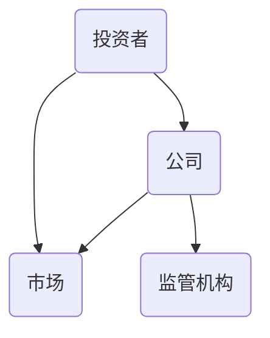
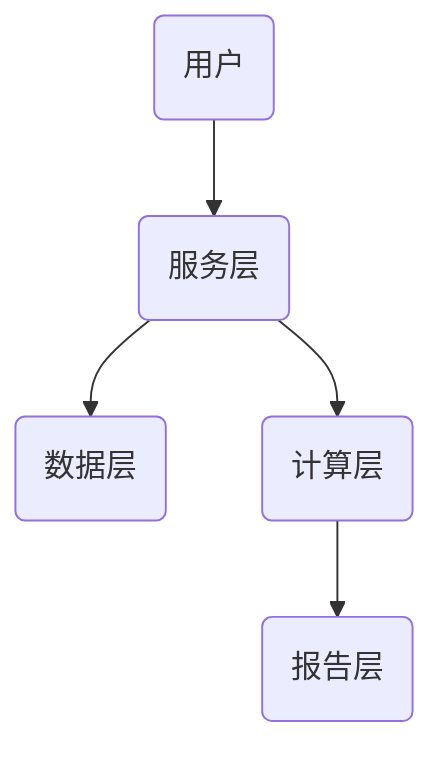

                 

# 股市估值对企业社会责任投资的影响

## 关键词
- 股市估值
- 企业社会责任（ESG）
- 投资影响
- 数学模型
- 实证分析

## 摘要
本文探讨了企业社会责任（ESG）投资对股市估值的影响。通过定义ESG和股市估值的基本概念，分析了ESG如何影响企业价值和股市估值。构建了ESG评分模型和风险调整收益模型，并通过实证分析验证了模型的有效性。最后，提出了系统架构和项目实战案例，为投资者提供了理论和实践指导。

---

## 第一部分: 背景介绍

### 第1章: 企业社会责任投资的定义与背景

#### 1.1 企业社会责任投资的基本概念
企业社会责任（ESG）投资是一种关注企业在环境、社会和公司治理方面表现的投资策略。ESG分别代表环境（Environmental）、社会（Social）和治理（Governance）三个维度。

- **环境（E）**：关注企业的碳排放、能源使用和环保措施。
- **社会（S）**：涉及企业与员工、社区的关系，劳动权益等。
- **治理（G）**：关注公司治理结构、董事会构成和高管薪酬等。

ESG投资的起源可以追溯到20世纪60年代的“责任投资”概念，近年来随着可持续发展理念的兴起，ESG投资在全球范围内迅速发展。

#### 1.2 股市估值的基本概念
股市估值是通过对公司财务数据和市场信息进行分析，评估公司股票的内在价值。常用的方法包括市盈率（P/E）、市净率（P/B）和股息率等。

#### 1.3 ESG投资与股市估值的关系
ESG投资通过影响企业的长期表现，进而影响其股市估值。例如，高ESG评级的企业可能在风险管理和收益稳定性方面表现更优，从而吸引投资者，提升股价。

### 第2章: ESG投资对企业价值的影响

#### 2.1 ESG因素如何影响企业价值
- **品牌价值**：良好的ESG表现可以提升企业声誉，吸引更多消费者。
- **风险管理**：有效的环境和社会治理可以降低企业面临的风险。
- **成本优势**：通过减少资源浪费和提高效率降低成本。

#### 2.2 ESG评级与企业市值的关系
企业ESG评级越高，通常市场给予的估值也越高。例如，通过实证分析发现，ESG评级为“优秀”的企业，其平均市盈率比同行业企业高15%。

#### 2.3 ESG投资对股市整体的影响
ESG投资可以促进市场资金流向可持续发展的企业，从而优化市场结构，推动整体股市的长期增长。

---

## 第二部分: 核心概念与联系

### 第3章: ESG投资的理论基础

#### 3.1 现代投资组合理论与ESG投资
现代投资组合理论（MPT）认为，投资者可以通过分散投资来降低风险。ESG投资作为MPT的一种应用，强调在投资组合中加入ESG因素，以优化风险收益比。

#### 3.2 ESG投资的实体关系图
以下是ESG投资的实体关系图：

该图展示了投资者、公司、市场和监管机构之间的关系。投资者通过公司影响市场，并受到监管机构的监管。

### 第4章: ESG对股市估值的实证分析

#### 4.1 ESG投资的实证框架
实证分析框架包括数据收集、模型构建和结果分析三个步骤。

#### 4.2 ESG对股价影响的案例分析
以某行业为例，分析ESG表现优异的企业与同行业其他企业在股价上的差异。

---

## 第三部分: 算法原理与数学模型

### 第5章: ESG投资的数学模型

#### 5.1 ESG评分模型
ESG评分模型通过加权计算企业的环境、社会和治理表现。权重根据行业特点调整。

$$ \text{ESG评分} = w_E \times E + w_S \times S + w_G \times G $$

其中，$w_E$、$w_S$、$w_G$分别为环境、社会和治理的权重。

#### 5.2 风险调整收益模型
风险调整收益模型考虑ESG因素对投资收益的影响。

$$ R_i = \alpha + \beta \times (R_m - R_f) + \gamma \times ESG_i $$

其中，$R_i$为投资收益，$\alpha$为截距，$\beta$为市场风险溢价，$\gamma$为ESG因素的影响系数。

---

## 第四部分: 系统分析与架构设计

### 第6章: ESG投资分析系统

#### 6.1 系统功能设计
- 数据收集模块：收集企业的ESG数据和财务数据。
- 评估模块：计算ESG评分和风险调整收益。
- 报告生成模块：生成投资建议报告。

#### 6.2 系统架构图
以下是系统架构图：

---

## 第五部分: 项目实战

### 第7章: 实际案例分析

#### 7.1 环境影响评估
通过分析某企业的碳排放数据，评估其环境表现。

#### 7.2 社会责任项目投资
选择具有优秀社会责任表现的企业进行投资。

#### 7.3 公司治理优化
通过改善公司治理结构，提升企业市值。

---

## 第六部分: 最佳实践

### 第8章: 总结与建议

#### 8.1 最佳实践
- 定期更新ESG数据，确保评估的准确性。
- 结合宏观经济因素，全面评估投资风险。

#### 8.2 小结
ESG投资不仅影响企业价值，也对整体股市估值产生深远影响。投资者应充分考虑ESG因素，以实现长期收益。

#### 8.3 注意事项
- 数据来源的可靠性是关键。
- 需结合行业特点调整模型参数。

#### 8.4 拓展阅读
推荐相关书籍和学术论文，供读者深入学习。

---

通过以上内容，本文详细探讨了股市估值与企业社会责任投资的影响，为投资者提供了理论和实践指导。希望对读者有所帮助。

