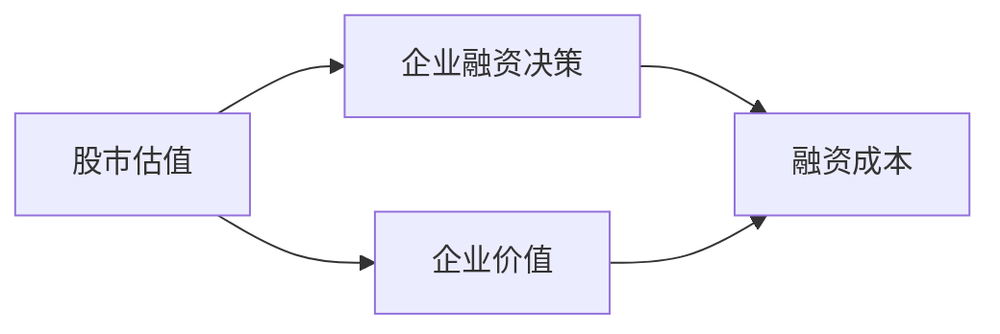

                 


# 股市估值对企业融资决策的影响

## 关键词：股市估值，企业融资决策，市盈率，市净率，现金流折现模型，企业价值评估

## 摘要：本文探讨股市估值如何影响企业的融资决策，分析股市估值的核心概念与模型，并通过实际案例展示如何利用这些模型优化融资策略。文章深入解析股市估值与融资决策之间的关系，结合算法原理和系统设计，为企业提供切实可行的融资决策支持。

---

# 第一部分: 股市估值与企业融资决策的背景介绍

## 第1章: 股市估值的基本概念

### 1.1 股市估值的定义与核心要素

股市估值是对企业股票价值进行评估的过程，旨在确定股票的合理价格。核心要素包括企业的盈利能力、成长潜力、财务状况、行业地位和市场环境。

### 1.2 股市估值的核心要素

- **企业盈利能力**：通过净利润率、ROE等指标衡量。
- **成长潜力**：评估企业的未来增长能力。
- **财务状况**：关注资产负债表，特别是资产和负债情况。
- **行业地位**：企业在行业中的竞争地位。
- **市场环境**：宏观经济环境和行业趋势。

## 第2章: 企业融资决策的重要性

### 2.1 企业融资的基本概念

企业融资是获取资金以支持运营和扩张的过程，包括债务融资和股权融资。

### 2.2 企业融资的主要方式

- **债务融资**：通过借款或发行债券获取资金。
- **股权融资**：通过发行股票或引入投资者获取资金。

### 2.3 股市估值与融资决策的关系

股市估值影响融资成本和方式选择，优化融资结构以降低风险。

## 第3章: 股市估值与企业融资决策的关系

### 3.1 股市估值如何影响融资决策

- **影响融资成本**：高估值降低债务融资成本。
- **影响融资方式**：低估值企业选择债务融资，高估值企业选择股权融资。
- **影响融资时机**：企业根据估值高低选择融资时间。

### 3.2 互动关系的动态平衡

股市估值和融资决策相互影响，企业需动态调整策略。

---

# 第二部分: 股市估值的核心概念与联系

## 第4章: 股市估值模型的原理与应用

### 4.1 主流估值模型

- **市盈率模型**：P/E = 市价/每股收益。
- **市净率模型**：P/B = 市价/每股净资产。
- **现金流折现模型**：DCF，基于未来现金流的现值计算企业价值。
- **企业价值评估模型**：综合考虑多个因素，计算企业整体价值。

### 4.2 模型优缺点对比

| 模型 | 优点 | 缺点 |
|------|------|------|
| 市盈率 | 简单易用 | 受利润波动影响大 |
| 市净率 | 考虑资产价值 | 忽略收益能力 |
| 现金流折现 | 精准 | 计算复杂 |
| 企业价值 | 综合 | 数据要求高 |

## 第5章: 股市估值与企业融资决策的核心联系

### 5.1 核心概念对比

- 股市估值关注股票价格和企业价值。
- 融资决策关注资金获取方式和成本。

### 5.2 实体关系图



---

# 第三部分: 股市估值算法原理与实现

## 第6章: 现金流折现模型的数学公式与代码实现

### 6.1 算法原理

现金流折现模型（DCF）通过预测未来现金流并计算现值，确定企业价值。

### 6.2 数学模型

$$企业价值 = \sum_{t=1}^{n} \frac{CF_t}{(1 + r)^t}$$

### 6.3 Python代码实现

```python
def discounted_cash_flow(cash_flows, discount_rate):
    return sum(cash_flow / (1 + discount_rate)**t for t, cash_flow in enumerate(cash_flows))

# 示例
discount_rate = 0.08
cash_flows = [100, 150, 200, 250, 300]
value = discounted_cash_flow(cash_flows, discount_rate)
print(f"企业价值：{value:.2f}")
```

### 6.4 流程图


---

# 第四部分: 系统分析与架构设计

## 第7章: 企业融资决策支持系统的架构

### 7.1 项目背景与目标

构建支持系统辅助企业做出科学融资决策。

### 7.2 系统功能设计

- 数据采集模块：收集企业财务数据。
- 估值计算模块：应用估值模型计算企业价值。
- 决策支持模块：提供融资建议。

### 7.3 系统架构设计


### 7.4 接口设计

- 数据接口：与财务系统对接。
- 计算接口：与估值模型交互。
- 输出接口：展示结果。

### 7.5 交互流程图


---

# 第五部分: 项目实战

## 第8章: 基于现金流折现模型的融资决策优化

### 8.1 项目环境

- Python 3.9
- NumPy、Pandas库

### 8.2 核心代码实现

```python
import numpy as np
import pandas as pd

def calculate_enterprise_value(fcf, discount_rate, terminal_value):
    return (fcf / (1 + discount_rate)) + (terminal_value / (1 + discount_rate))

# 示例数据
fcf = 100
discount_rate = 0.08
terminal_value = 200
enterprise_value = calculate_enterprise_value(fcf, discount_rate, terminal_value)
print(f"企业价值：{enterprise_value:.2f}")
```

### 8.3 实际案例分析

以科技型企业为例，使用DCF模型计算企业价值，优化融资结构，选择合适的融资方式。

### 8.4 项目总结

通过项目实战，验证模型的有效性，优化企业融资决策。

---

# 第六部分: 最佳实践与总结

## 第9章: 最佳实践

- 定期更新财务数据和市场信息。
- 组合使用多种估值模型。
- 结合行业趋势和宏观经济环境。

## 第10章: 小结

股市估值是企业融资决策的重要工具，正确应用估值模型能优化融资结构，降低风险，提升企业价值。

## 第11章: 注意事项

- 数据准确性：确保输入数据的准确性。
- 模型选择：根据企业特点选择合适的模型。
- 风险评估：考虑模型的局限性。

## 第12章: 拓展阅读

推荐阅读《企业价值评估》和《金融数据分析与建模》深入学习相关知识。

---

# 结语

通过本文的学习，读者可以理解股市估值如何影响企业融资决策，并掌握多种估值模型的应用方法。希望本文能为企业的融资决策提供有价值的参考。

