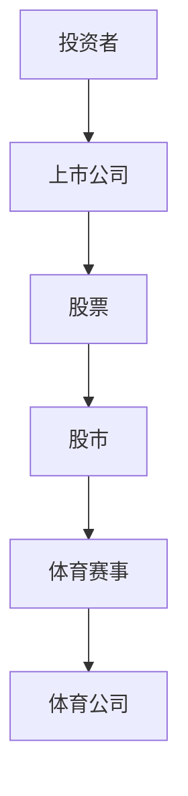
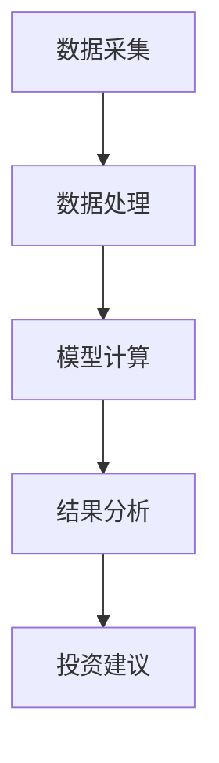
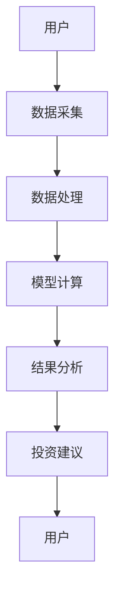

                 


# 股市估值对国际体育赛事估值的影响

## 关键词：股市估值、国际体育赛事、企业价值、投资决策、风险管理

## 摘要：本文探讨股市估值与国际体育赛事估值之间的相互影响。通过分析股市估值的基本原理、国际体育赛事的估值方法，以及两者之间的关联性，提出一套数学模型和算法，以量化体育赛事对企业价值的影响。文章结合实际案例，展示如何利用这些模型进行投资决策，并提出风险管理策略，为投资者和体育产业提供参考。

---

# 第一部分: 股市估值与国际体育赛事估值的背景与概念

## 第1章: 股市估值与国际体育赛事估值的背景介绍

### 1.1 股市估值的基本概念
#### 1.1.1 股票估值的定义与方法
股票估值是通过对企业财务状况、市场地位和行业前景等多方面因素的分析，确定其股票的合理价格。常用的估值方法包括市盈率（P/E）、市净率（P/B）、股息率等。

#### 1.1.2 股市估值的核心要素
- **盈利能力**：如净利润、ROE（净资产收益率）。
- **成长性**：如收入增长率、净利润增长率。
- **财务健康状况**：如资产负债率、流动比率。
- **行业地位**：如市场占有率、竞争优势。

#### 1.1.3 股市估值与企业价值的关系
股票估值是企业价值的反映，高估值意味着市场对企业未来表现的乐观预期，低估值则可能意味着被低估的投资机会。

### 1.2 国际体育赛事估值的基本概念
#### 1.2.1 体育赛事估值的定义与方法
体育赛事估值是通过对赛事的影响力、观众数量、赞助商投入等因素的分析，确定其经济价值。常用的估值方法包括票房收入、转播权收入、赞助收入等。

#### 1.2.2 体育赛事估值的核心要素
- **观众数量**：如现场观众人数、电视观众人数。
- **赞助商投入**：如赞助商数量、赞助金额。
- **媒体曝光度**：如转播覆盖范围、社交媒体互动量。
- **品牌价值**：如赛事品牌的认知度和美誉度。

#### 1.2.3 体育赛事与企业价值的关系
体育赛事作为企业的资产，其价值直接影响企业的财务表现和市场地位。例如，英超联赛的转播权收入对电视台的估值有直接影响。

### 1.3 股市估值与国际体育赛事估值的关联性
#### 1.3.1 体育赛事对企业价值的影响
- 体育赛事的高关注度可能提升企业的品牌价值，进而影响其股票估值。
- 体育赛事的收入增长可能直接增加企业的净利润，从而提升股票估值。

#### 1.3.2 股市对体育赛事估值的反馈机制
- 股市的波动可能影响企业的赞助预算，从而间接影响体育赛事的估值。
- 股市的投资者情绪可能影响体育赛事的门票销售和赞助商投入。

#### 1.3.3 两者关系的边界与外延
- 体育赛事估值主要影响企业的短期财务表现，而股市估值反映的是企业的长期价值。
- 需要区分直接关联和间接关联的影响路径。

### 1.4 本章小结
本章通过定义和分析股市估值与国际体育赛事估值的核心概念，揭示了两者之间的相互影响。下一章将深入探讨两者的关联性，构建数学模型。

---

## 第2章: 股市估值与国际体育赛事估值的核心概念与联系

### 2.1 核心概念的原理与特征
#### 2.1.1 股市估值的原理
股票估值基于对企业未来现金流的折现，考虑了企业的盈利能力、成长性和财务健康状况。

#### 2.1.2 体育赛事估值的原理
体育赛事估值基于其经济收益能力，包括直接收入（门票、转播权）和间接收入（赞助、品牌价值）。

#### 2.1.3 两者原理的对比分析
- 股市估值是长期性的，考虑企业整体价值；体育赛事估值是短期性的，关注具体事件的收益。

### 2.2 核心概念的属性特征对比
#### 2.2.1 股市估值的属性特征
- **时间跨度**：长期。
- **影响因素**：财务指标、行业趋势、宏观经济。
- **评估方法**：多指标分析、DCF模型。

#### 2.2.2 体育赛事估值的属性特征
- **时间跨度**：短期。
- **影响因素**：观众数量、媒体曝光、赞助商投入。
- **评估方法**：票房收入、转播权价值、赞助收入。

#### 2.2.3 属性特征对比表格
| 特性          | 股市估值                | 体育赛事估值          |
|---------------|-------------------------|-----------------------|
| 时间跨度      | 长期                   | 短期                  |
| 影响因素      | 财务指标、行业趋势      | 观众数量、赞助收入    |
| 评估方法      | DCF模型、多指标分析    | 票房收入、转播权价值  |

### 2.3 实体关系图与流程图
#### 2.3.1 实体关系图（ER图）


#### 2.3.2 流程图


### 2.5 本章小结
本章通过对比分析股市估值和体育赛事估值的核心概念，构建了两者的关联模型。下一章将基于此模型，构建数学模型和算法。

---

## 第3章: 股市估值与国际体育赛事估值的数学模型与算法

### 3.1 股市估值的数学模型
#### 3.1.1 股票价值的计算公式
股票的内在价值可以通过现金流折现模型（DCF）计算：
$$ V = \frac{CF}{(1 + r)^n} $$

其中，\( CF \) 是未来现金流，\( r \) 是折现率，\( n \) 是时间跨度。

#### 3.1.2 股票价值的评估方法
- **相对估值法**：如市盈率、市净率。
- **绝对估值法**：如DCF模型。

### 3.2 体育赛事估值的数学模型
#### 3.2.1 体育赛事价值的计算公式
体育赛事的经济价值可以通过加权平均法计算：
$$ V = \sum_{i=1}^{n} w_i \cdot x_i $$

其中，\( w_i \) 是各因素的权重，\( x_i \) 是各因素的具体数值。

#### 3.2.2 体育赛事价值的评估方法
- **票房收入法**：基于现场观众和票价计算。
- **转播权收入法**：基于转播覆盖范围和单价计算。

### 3.3 股市与体育赛事估值的关联模型
#### 3.3.1 关联模型
通过回归分析，可以量化体育赛事对企业价值的影响：
$$ V_{stock} = \beta \cdot V_{event} + \epsilon $$

其中，\( V_{stock} \) 是股票估值，\( V_{event} \) 是体育赛事估值，\( \beta \) 是回归系数，\( \epsilon \) 是误差项。

---

## 第4章: 系统分析与架构设计方案

### 4.1 问题场景介绍
通过分析某上市体育公司的案例，构建股市估值与体育赛事估值的关联模型。

### 4.2 系统功能设计
- 数据采集模块：收集股票价格、财务数据、赛事数据。
- 数据处理模块：清洗和预处理数据。
- 模型计算模块：基于数学模型计算关联系数。
- 结果分析模块：输出评估结果和投资建议。

### 4.3 系统架构设计


### 4.4 系统接口设计
- 数据接口：与数据库或API对接。
- 用户接口：输出评估结果和投资建议。

### 4.5 系统交互设计


---

## 第5章: 项目实战

### 5.1 环境安装
- 数据分析工具：Python、Pandas、NumPy。
- 可视化工具：Matplotlib、Seaborn。
- 数据采集工具：BeautifulSoup、requests。

### 5.2 核心实现源代码
```python
import pandas as pd
import numpy as np

# 数据加载
data = pd.read_csv('sports_stock.csv')

# 数据预处理
data['date'] = pd.to_datetime(data['date'])
data.set_index('date', inplace=True)

# 回归分析
from sklearn.linear_model import LinearRegression
model = LinearRegression()
model.fit(data[['V_event']], data['V_stock'])

# 结果输出
print("回归系数：", model.coef_)
print("决定系数：", model.score(data[['V_event']], data['V_stock']))
```

### 5.3 案例分析
以英超联赛为例，分析某上市足球俱乐部的股票估值与赛事估值的关联性。

---

## 第6章: 总结与展望

### 6.1 研究发现
- 体育赛事对企业价值的影响显著。
- 股市估值与体育赛事估值存在双向互动关系。

### 6.2 研究不足
- 数据获取的限制。
- 模型的适用性问题。

### 6.3 未来研究方向
- 扩展更多的数据来源。
- 提升模型的预测精度。
- 探讨更多的应用场景。

---

## 第7章: 最佳实践 Tips

### 7.1 投资建议
- 关注高关注度的体育赛事。
- 结合宏观经济因素进行投资决策。

### 7.2 风险管理
- 设置止损点，避免过度依赖单一事件。
- 分散投资，降低风险。

---

## 附录
- 数据来源与参考文献。
- 代码实现细节。
- 模型优化建议。

---

通过本文的分析，我们可以看到股市估值与国际体育赛事估值之间的复杂关系。从理论到实践，从模型构建到案例分析，我们为投资者和体育产业提供了有价值的参考。未来的研究将进一步深化这一领域的探索，为各方提供更精准的决策支持。

