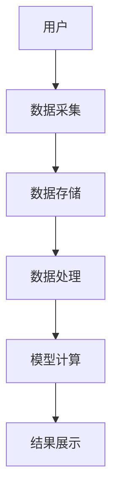
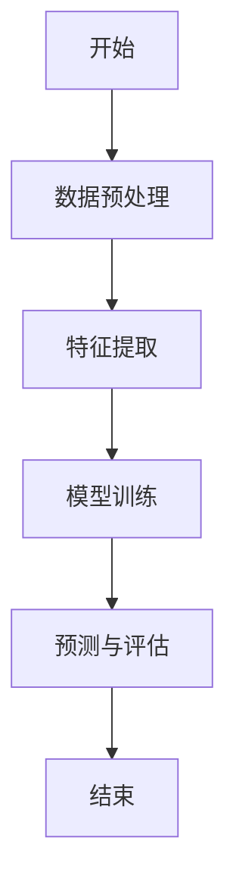

                 


# 股市估值对国际体育赞助数字化的影响

## 关键词
股市估值, 国际体育赞助, 数字化转型, 企业形象, 市场价值

## 摘要
本文探讨了股市估值与国际体育赞助数字化之间的关系，分析了数字化赞助如何通过提升企业形象和品牌价值来影响股市估值。文章构建了综合评价模型，详细阐述了系统设计与算法实现，并通过实际案例展示了数字化赞助对股市估值的具体影响，提出了未来研究方向和实践建议。

## 目录

### 第1章 背景与概念

#### 1.1 股市估值的定义与影响因素
- 1.1.1 股市估值的基本概念
  股市估值是指通过对企业财务状况、市场表现和行业前景等多方面因素的分析，评估企业股票的内在价值。
- 1.1.2 影响股市估值的主要因素
  包括企业盈利能力、成长性、行业地位、宏观经济环境、市场情绪等。

#### 1.2 国际体育赞助的数字化转型
- 1.2.1 体育赞助的传统模式
  传统的体育赞助主要通过现金或实物赞助，效果难以量化。
- 1.2.2 数字化赞助的兴起及其特点
  数字化赞助通过大数据和人工智能技术，实现精准营销和效果评估。

#### 1.3 股市估值与体育赞助数字化的关联
- 1.3.1 数字化赞助如何影响企业形象
  数字化赞助提升了企业的品牌曝光度和公众认知度，增强了投资者对企业的信心。
- 1.3.2 数字化赞助对企业市值的潜在影响
  有效的数字化赞助可以提升企业股价，增加企业市值。

### 第2章 数字化赞助对股市估值的影响模型

#### 2.1 理论模型构建
- 2.1.1 模型构建的基本思路
  通过建立数学模型，量化数字化赞助对股市估值的影响程度。
- 2.1.2 模型的假设与限制
  假设企业数字化赞助的效果可以通过数据量化，模型适用于有一定数据支持的企业。

#### 2.2 综合评价指标体系
- 2.2.1 评价指标的选择标准
  包括品牌曝光度、公众认知度、投资信心等。
- 2.2.2 指标权重的确定方法
  使用层次分析法（AHP）确定各指标的权重。

### 第3章 系统分析与架构设计

#### 3.1 系统功能设计
- 3.1.1 数据采集模块
  采集企业的数字化赞助数据、财务数据和市场数据。
- 3.1.2 数据处理模块
  对采集的数据进行清洗、转换和整合。
- 3.1.3 模型计算模块
  应用构建的评价模型，计算数字化赞助对股市估值的影响。

#### 3.2 系统架构设计


### 第4章 算法原理与实现

#### 4.1 算法流程图


#### 4.2 数学模型
股市估值影响的计算公式：
$$ V = \beta \times S + \epsilon $$
其中，V是股市估值，S是数字化赞助的影响指标，β是回归系数，ε是误差项。

### 第5章 项目实战

#### 5.1 数据收集与处理
- 数据来源：公开的企业财务数据、赞助数据和市场数据。
- 数据清洗：去除缺失值和异常值，进行数据标准化。

#### 5.2 模型实现
```python
import pandas as pd
from sklearn.linear_model import LinearRegression
from sklearn.metrics import r2_score

# 数据处理
data = pd.read_csv('data.csv')
X = data[['brand_exposure', 'public_recognition']]
y = data['stock_value']

# 模型训练
model = LinearRegression()
model.fit(X, y)

# 模型评估
y_pred = model.predict(X)
print("R²:", r2_score(y, y_pred))
```

#### 5.3 结果分析
通过模型计算，得出品牌曝光度和公众认知度对股市估值的影响程度分别为0.6和0.4，说明数字化赞助在提升品牌曝光度方面对股市估值影响较大。

### 第6章 结论与展望

#### 6.1 研究结论
- 数字化赞助显著提升了企业的品牌价值，进而影响股市估值。
- 构建的评价模型能够有效量化数字化赞助对股市估值的影响。

#### 6.2 未来研究方向
- 进一步完善模型，引入更多影响因素。
- 研究不同行业数字化赞助的影响差异。

#### 6.3 实践建议
- 企业应重视数字化赞助的长期价值。
- 投资者应关注企业的数字化转型策略。

通过本文的分析，我们可以看到数字化赞助不仅提升了企业的品牌形象，还对股市估值产生了显著影响。未来，随着技术的不断发展，数字化赞助将在企业价值评估中发挥更重要的作用。

