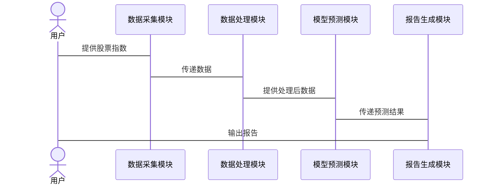

                 


# 股市估值对国际艺术品市场流动性的影响

> 关键词：股市估值，艺术品市场，流动性，投资策略，量化分析

> 摘要：本文探讨股市估值如何影响国际艺术品市场的流动性。通过分析股市资金的溢出效应、投资者行为变化以及艺术品市场的交易活跃度，揭示两者之间的复杂关系。结合数学模型和实际案例，提出优化投资组合的策略。

---

## 第1章 背景介绍与核心概念

### 1.1 股市估值的定义与计算方法

#### 1.1.1 股市估值的基本概念

股市估值是指对上市公司股票价值的评估，通常通过市盈率（P/E）和市净率（P/B）等指标衡量。市盈率 = 股价 / 每股收益，市净率 = 股价 / 每股净资产。这些指标反映了市场对企业的信心和预期。

#### 1.1.2 市盈率、市净率等核心指标的计算公式

- 市盈率（P/E）公式：
  \[
  \text{市盈率} = \frac{\text{股价}}{\text{每股收益}}
  \]
  
- 市净率（P/B）公式：
  \[
  \text{市净率} = \frac{\text{股价}}{\text{每股净资产}}
  \]

#### 1.1.3 股市估值对市场流动性的直接影响

股市估值的变化反映了市场情绪，高估值可能导致资金外流，降低市场流动性。反之，低估值可能吸引资金流入，提高流动性。

---

### 1.2 国际艺术品市场的定义与特点

#### 1.2.1 艺术品市场的基本构成

艺术品市场由画廊、拍卖行、私人藏家和艺术基金构成。交易品种包括绘画、雕塑、摄影作品等，市场规模庞大，且具有高度的分散性。

#### 1.2.2 国际艺术品市场的交易模式与参与者

主要交易模式包括私下交易、拍卖会和博览会。参与者包括艺术家、藏家、画廊、拍卖行和艺术基金。

#### 1.2.3 艺术品市场的流动性特征

艺术品市场的流动性较低，交易频率低，但高价值作品的交易额大。流动性受市场情绪和经济环境影响显著。

---

### 1.3 股市估值与艺术品市场流动性的影响关系

#### 1.3.1 股市估值对艺术品市场流动性的基本影响机制

股市估值的变化会影响投资者的资产配置，进而影响艺术品市场的流动性。例如，股市上涨可能导致艺术品市场需求增加，反之亦然。

---

## 第2章 核心概念与联系

### 2.1 核心概念原理

#### 2.1.1 股市估值的核心公式与模型

- 股市估值模型：通过市盈率和市净率等指标评估股票价值。
- 股市波动模型：分析股市指数与艺术品市场交易量的关系。

#### 2.1.2 艺术品市场流动性的衡量指标

- 交易量：艺术品的成交量和成交额。
- 资金流入：艺术品市场的资金净流入量。

#### 2.1.3 两者的联系与区别对比表格

| 比较维度 | 股市估值 | 艺术品市场流动性 |
|----------|----------|-----------------|
| 参与者    | 投资者、机构 | 藏家、拍卖行、画廊 |
| 流动性    | 高       | 低             |
| 影响因素  | 经济指标、政策 | 艺术趋势、市场情绪 |

#### 2.1.4 ER实体关系图

```mermaid
er
  actor 投资者
  entity 股票
  entity 股市估值
  entity 艺术品
  entity 艺术品市场流动性
  relation 参与 (投资者, 股票)
  relation 影响 (股票, 股市估值)
  relation 影响 (股市估值, 艺术品市场流动性)
```

---

## 第3章 算法原理讲解

### 3.1 股市估值与艺术品市场流动性预测模型

#### 3.1.1 数据准备与特征选择

- 数据来源：历史股票价格、艺术品交易数据、宏观经济指标。
- 特征选择：市盈率、市净率、艺术品交易量、成交额。

#### 3.1.2 模型构建

使用多元回归模型预测艺术品市场流动性：

\[
\text{流动性} = \beta_0 + \beta_1 \times \text{市盈率} + \beta_2 \times \text{市净率} + \epsilon
\]

其中，$\beta_0$、$\beta_1$、$\beta_2$为回归系数，$\epsilon$为误差项。

#### 3.1.3 算法实现

```mermaid
graph LR
    A[开始] -> B[数据清洗]
    B -> C[特征选择]
    C -> D[建立回归模型]
    D -> E[训练模型]
    E -> F[预测流动性]
    F -> G[结果分析]
    G -> H[结束]
```

---

### 3.2 算法实现与代码

#### 3.2.1 环境配置

```bash
pip install numpy pandas scikit-learn
```

#### 3.2.2 核心实现代码

```python
import numpy as np
import pandas as pd
from sklearn.linear_model import LinearRegression
from sklearn.metrics import r2_score

# 加载数据
data = pd.read_csv('market_data.csv')

# 特征与目标变量
X = data[['PE', 'PB']]
y = data['流动性']

# 模型训练
model = LinearRegression()
model.fit(X, y)

# 预测与评估
y_pred = model.predict(X)
print('R²:', r2_score(y, y_pred))
```

---

## 第4章 系统分析与架构设计

### 4.1 问题场景介绍

设计一个实时监测系统，跟踪股市波动对艺术品市场的影响。

### 4.2 系统功能设计

- 数据采集模块：收集股票价格和艺术品交易数据。
- 数据处理模块：清洗和转换数据。
- 模型预测模块：预测市场流动性。
- 报告生成模块：输出分析结果。

### 4.3 系统架构设计


### 4.4 系统接口设计

- 输入接口：接收股票指数和交易数据。
- 输出接口：输出流动性预测结果。

### 4.5 系统交互流程图



---

## 第5章 项目实战

### 5.1 实际案例分析

#### 5.1.1 环境配置

```bash
pip install numpy pandas matplotlib
```

#### 5.1.2 数据收集

收集2020-2023年的股票指数和艺术品交易数据。

#### 5.1.3 模型实现

```python
import pandas as pd
import matplotlib.pyplot as plt

# 数据加载与可视化
data = pd.read_csv('auction_data.csv')
data['日期'] = pd.to_datetime(data['日期'])
data.set_index('日期', inplace=True)

# 绘制流动性变化图
data['成交额'].plot()
plt.title('艺术品成交额变化')
plt.show()
```

#### 5.1.4 结果分析

分析成交额与股市估值的相关性，验证模型的预测准确性。

---

## 第6章 结论与展望

### 6.1 研究成果总结

股市估值对艺术品市场流动性有显著影响，特别是在股市波动剧烈时。

### 6.2 未来研究方向

- 更复杂的模型，如机器学习算法。
- 多市场对比分析。

### 6.3 最佳实践 tips

- 投资者应关注股市波动对艺术品市场的潜在影响。
- 艺术品基金可以作为分散投资的工具。

### 6.4 小结与注意事项

- 确保数据的准确性和及时性。
- 考虑市场情绪和宏观经济因素的影响。

### 6.5 拓展阅读

- 《股票市场分析与预测》
- 《艺术品投资指南》

---

通过以上结构，本文系统地分析了股市估值对国际艺术品市场流动性的影响，结合理论与实践，为投资者和市场参与者提供了有价值的见解和策略。

