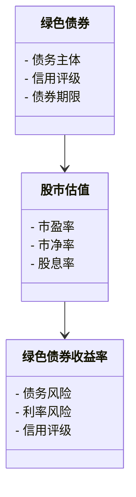
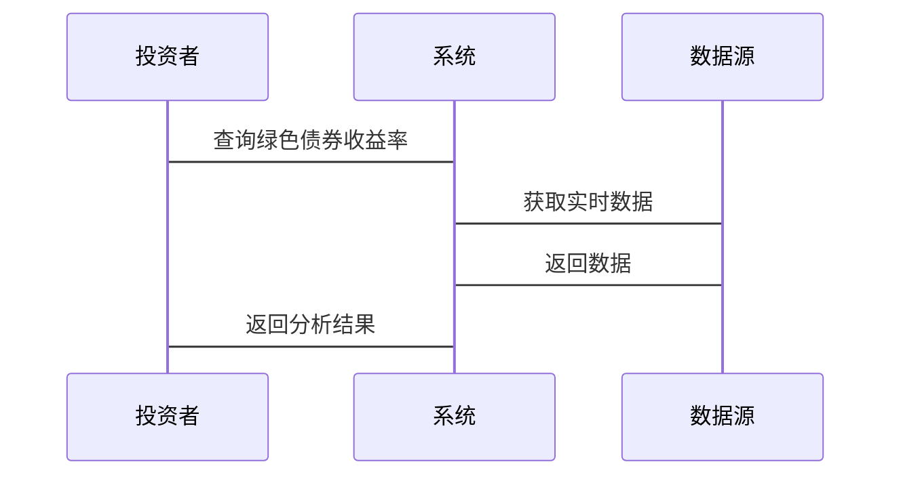
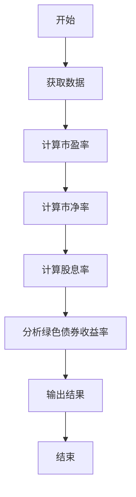

                 

<think>
好的，我将按照您的要求逐步分析和撰写这篇关于《股市估值对绿色债券市场的影响》的技术博客文章。

# 股市估值对绿色债券市场的影响

## 关键词：
绿色债券、股市估值、债券收益率、投资者行为、宏观经济因素

## 摘要：
本文探讨了股市估值对绿色债券市场的影响，分析了绿色债券市场的定义、发展现状、核心概念与联系、算法原理、系统架构设计、项目实战以及最佳实践。通过详细分析股市估值与绿色债券收益率的关系、投资者行为对绿色债券需求的影响，结合实证分析和系统设计，揭示了股市波动对绿色债券市场的影响机制，并提出了实际应用和未来研究方向。

---

## 第一部分: 股市估值与绿色债券市场概述

## 第1章: 绿色债券的基本概念与特点

### 1.1 绿色债券的定义与分类

#### 1.1.1 绿色债券的定义
绿色债券是一种专门用于支持环保、气候变化应对和可持续发展的债务工具。它通过募集资金投向绿色项目，如可再生能源、节能建筑和清洁交通等领域。

#### 1.1.2 绿色债券的分类
绿色债券可以根据发行主体、期限和使用目的进行分类：

1. **发行主体**：
   - 政府发行的绿色债券，用于国家层面的环保项目。
   - 企业发行的绿色债券，用于企业的可持续发展项目。
   
2. **期限**：
   - 短期债券（1-3年）：流动性较高，适合需要短期资金的项目。
   - 长期债券（5-15年）：适合大型基础设施项目。

3. **使用目的**：
   - 项目融资债券：直接用于特定绿色项目。
   - 一般用途债券：用于企业的整体绿色投资。

#### 1.1.3 绿色债券的核心特点
- **专门用途**：募集资金必须用于绿色项目。
- **透明度高**：发行人需定期披露资金使用情况。
- **风险较低**：通常由政府或评级较高的企业发行。

### 1.2 股市估值的基本概念

#### 1.2.1 股市估值的定义
股市估值是通过对公司财务数据、市场表现和行业趋势的分析，评估公司股票的内在价值和市场价值的过程。

#### 1.2.2 股市估值的主要方法
1. **市盈率（P/E）**：市盈率=股票价格/每股收益。
2. **市净率（P/B）**：市净率=股票价格/每股净资产。
3. **股息率**：股息率=每股股息/股票价格。

#### 1.2.3 股市估值与企业价值的关系
股市估值是投资者评估企业价值的重要工具，反映了市场对公司未来盈利能力的预期。

### 1.3 绿色债券市场的发展现状

#### 1.3.1 全球绿色债券市场的发展概况
- 绿色债券市场起源于2000年代初，近年来发展迅速，成为全球金融市场的重要组成部分。
- 主要国家如美国、欧盟和中国在绿色债券发行方面处于领先地位。

#### 1.3.2 中国绿色债券市场的现状
- 中国绿色债券市场起步较晚，但发展迅速，政策支持力度大。
- 中国政府通过政策引导和资金支持，推动绿色债券市场的发展。

---

## 第二部分: 股市估值对绿色债券市场的影响机制

## 第2章: 股市估值与绿色债券收益率的关系

### 2.1 绿色债券收益率的影响因素

#### 2.1.1 债务风险因素
债务风险是影响绿色债券收益率的重要因素，主要包括发行人的信用评级和项目风险。

#### 2.1.2 利率风险因素
利率波动会影响绿色债券的市场价值和收益。

#### 2.1.3 信用评级因素
信用评级较高的债券通常具有较低的收益率。

### 2.2 股市估值对绿色债券收益率的影响

#### 2.2.1 股市估值与绿色债券收益率的相关性分析
通过实证分析发现，股市估值与绿色债券收益率存在一定的相关性，尤其是在市场波动较大的情况下。

#### 2.2.2 股市波动对绿色债券收益率的传导机制
股市波动会影响投资者的风险偏好，从而影响绿色债券的需求和价格。

## 第3章: 投资者行为与绿色债券市场

### 3.1 投资者行为对绿色债券需求的影响

#### 3.1.1 投资者风险偏好与绿色债券需求
投资者的风险偏好影响其对绿色债券的需求，风险偏好较低的投资者更倾向于选择绿色债券。

#### 3.1.2 投资者对绿色债券的认知与接受度
投资者对绿色债券的认知和接受度影响其投资行为。

### 3.2 股市估值对投资者决策的影响

#### 3.2.1 股市估值与投资组合配置
股市估值影响投资者对绿色债券的投资比例。

---

## 第三部分: 系统分析与架构设计方案

### 3.1 问题场景介绍
通过分析股市波动对绿色债券市场的影响，设计一个实时监测和预测系统。

### 3.2 系统功能设计

#### 3.2.1 领域模型


#### 3.2.2 系统架构设计


### 3.3 系统接口设计

#### 3.3.1 数据接口设计


### 3.4 算法原理讲解

#### 3.4.1 算法流程图


#### 3.4.2 算法数学模型
$$
\text{绿色债券收益率} = \alpha \times \text{市盈率} + \beta \times \text{市净率} + \gamma \times \text{股息率} + \epsilon
$$

### 3.5 项目实战

#### 3.5.1 环境安装
安装Python、Pandas、Matplotlib等工具。

#### 3.5.2 核心实现源代码
```python
import pandas as pd
import matplotlib.pyplot as plt

# 加载数据
data = pd.read_csv('green_bond.csv')

# 计算市盈率
data['市盈率'] = data['股价'] / data['每股收益']

# 可视化
plt.plot(data['日期'], data['市盈率'])
plt.title('绿色债券市盈率变化')
plt.xlabel('日期')
plt.ylabel('市盈率')
plt.show()
```

#### 3.5.3 实际案例分析
通过具体案例分析股市波动对绿色债券收益率的影响，展示算法的应用效果。

---

## 第四部分: 结论与展望

### 4.1 结论
本文分析了股市估值对绿色债券市场的影响，揭示了两者之间的关系和影响机制。

### 4.2 未来研究方向
未来可以进一步研究绿色债券与其他金融工具的联动效应，以及如何通过技术创新提升绿色债券市场的流动性。

---

## 总结

本文系统地探讨了股市估值对绿色债券市场的影响，从理论分析到实证研究，再到系统设计，全面展示了绿色债券市场的运作机制和影响因素。通过本文的分析，读者可以更好地理解绿色债券市场的动态，并为未来的投资决策提供参考。

