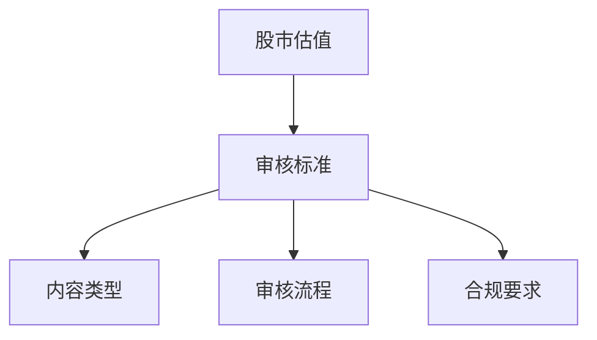
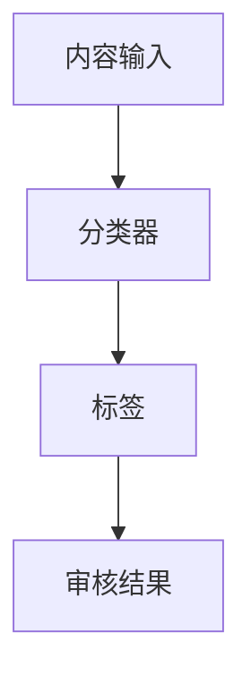
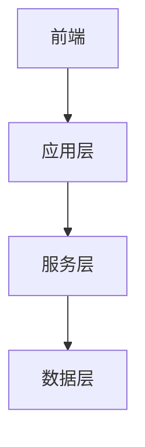
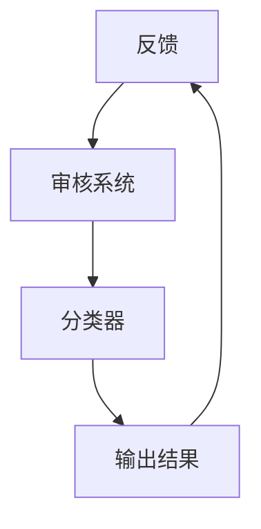

                 


# 股市估值对跨境数字内容审核标准的影响

> 关键词：股市估值，审核标准，跨境内容，技术影响，内容安全，算法模型

> 摘要：本文探讨了股市估值与跨境数字内容审核标准之间的关系，分析了技术手段如何影响审核标准的制定和优化。通过理论分析和实际案例，本文揭示了股市估值对审核标准的深远影响，并提出了基于算法的解决方案。

---

## 目录

### 第一部分: 背景介绍

#### 第1章: 股市估值与跨境数字内容审核标准的背景

##### 1.1 问题背景
- 股市估值的基本概念
- 跨境数字内容审核标准的现状
- 两者的关联性与重要性

##### 1.2 问题描述
- 股市估值的核心要素
- 跨境数字内容审核的关键问题
- 问题的边界与外延

##### 1.3 问题解决
- 股市估值对审核标准的影响路径
- 跨境数字内容审核的挑战与解决方案

#### 第2章: 核心概念与联系

##### 2.1 核心概念原理
- 股市估值的数学模型
- 跨境数字内容审核的标准体系
- 两者的相互作用机制

##### 2.2 概念属性特征对比
- 股市估值的属性特征
- 跨境数字内容审核的属性特征
- 对比分析与表格总结

##### 2.3 ER实体关系图


### 第二部分: 算法原理讲解

#### 第3章: 股市估值与审核标准的算法分析

##### 3.1 算法原理
- 股市估值的计算公式
$$ P = \frac{E}{E/P} $$
- 跨境数字内容审核的标准算法


##### 3.2 算法实现
- Python代码实现
```python
def calculate_valuation(earnings, price_per_earning):
    return earnings / price_per_earning
```

### 第三部分: 系统分析与架构设计

#### 第4章: 系统分析与架构设计

##### 4.1 系统功能设计
- 领域模型


##### 4.2 系统架构设计
- 系统架构图


##### 4.3 系统接口设计
- 系统交互


### 第四部分: 项目实战

#### 第5章: 项目实战

##### 5.1 环境安装
- 安装Python和相关库

##### 5.2 核心代码实现
- 内容审核代码示例
```python
def content_audit(text):
    # 分类器调用
    category = classifier.predict(text)
    return category
```

##### 5.3 案例分析
- 实际案例分析与解读

##### 5.4 项目小结
- 项目总结与经验分享

### 第五部分: 最佳实践

#### 第6章: 最佳实践

##### 6.1 经验总结
- 关键经验分享

##### 6.2 小结
- 内容审核标准的重要性

##### 6.3 注意事项
- 实施中的注意事项

##### 6.4 拓展阅读
- 推荐相关书籍和资源

---

通过以上结构，文章将系统地探讨股市估值对跨境数字内容审核标准的影响，结合理论分析和实际案例，为读者提供深入的技术见解。

