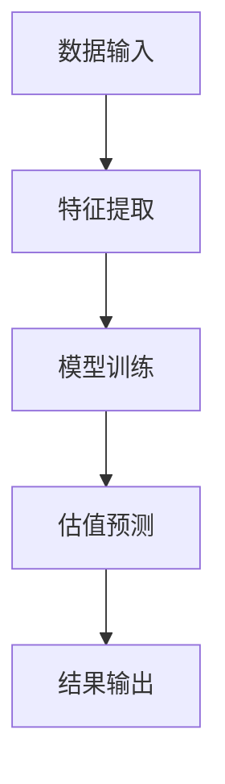
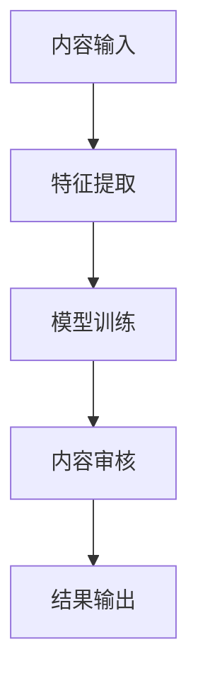

                 


# 股市估值对跨境数字内容审核的影响

**关键词**: 股市估值, 跨境数字内容审核, 机器学习, 自然语言处理, 数字化转型

**摘要**: 本文探讨了股市估值与跨境数字内容审核之间的复杂关系，分析了股市估值的核心原理、跨境数字内容审核的机制，以及两者如何相互影响。通过详细讲解算法原理、系统架构和实际案例，本文为读者提供了全面的理解和实践指南。

---

## 第一部分: 背景介绍

### 第1章: 股市估值与跨境数字内容审核的背景

#### 1.1 股市估值的基本概念
- **1.1.1 股市估值的定义**: 股市估值是指通过一定的方法和模型，对上市公司的股票价值进行评估，以确定其合理的价格区间。
- **1.1.2 股市估值的核心要素**: 包括公司财务数据（如收入、利润）、行业地位、市场环境等。
- **1.1.3 股市估值的常见方法**: 如市盈率（P/E）、市净率（P/B）等。

#### 1.2 跨境数字内容审核的定义与特点
- **1.2.1 跨境数字内容审核的定义**: 指对跨国传输的数字内容（如视频、文字）进行审查，确保符合目标市场的法律法规和文化标准。
- **1.2.2 跨境数字内容审核的核心要素**: 包括内容类型、审核标准、技术手段等。
- **1.2.3 跨境数字内容审核的挑战与难点**: 如文化差异、技术限制等。

#### 1.3 股市估值与跨境数字内容审核的联系
- **1.3.1 股市估值对数字内容审核的影响**: 例如，股市波动可能影响数字内容的审核标准。
- **1.3.2 跨境数字内容审核对股市估值的作用**: 如审核结果可能影响投资者对公司的看法。
- **1.3.3 两者的相互关系与协同效应**: 如通过数据共享和算法优化，两者可以相互促进。

#### 1.4 本章小结: 本章介绍了股市估值和跨境数字内容审核的基本概念，并探讨了它们之间的联系。

---

## 第二部分: 核心概念与联系

### 第2章: 股市估值的核心原理

#### 2.1 股市估值的数学模型
- **2.1.1 常见的股市估值模型**: 如CAPM、DCF等。
- **2.1.2 市盈率（P/E）模型**: 通过比较市盈率与行业平均水平，评估股票的估值。
- **2.1.3 市净率（P/B）模型**: 通过比较市净率与行业平均水平，评估股票的估值。
- **2.1.4 股息率模型**: 通过股息率评估股票的吸引力。

#### 2.2 股市估值的关键算法
- **2.2.1 线性回归模型**: 用于预测股票价格。
- **2.2.2 支持向量机（SVM）**: 用于分类股票的涨跌趋势。
- **2.2.3 随机森林（Random Forest）**: 用于预测股票的波动性。
- **2.2.4 神经网络模型**: 用于深度学习预测股票走势。

#### 2.3 股市估值的Mermaid流程图


### 第3章: 跨境数字内容审核的核心原理

#### 3.1 跨境数字内容审核的流程
- **3.1.1 内容分类**: 将内容按类型分类，如新闻、视频等。
- **3.1.2 内容清洗**: 去除不符合标准的内容。
- **3.1.3 内容标注**: 标注内容的关键信息。
- **3.1.4 内容验证**: 验证标注的准确性。

#### 3.2 跨境数字内容审核的关键算法
- **3.2.1 文本分类算法**: 如朴素贝叶斯、SVM等。
- **3.2.2 自然语言处理（NLP）**: 用于分析文本内容。
- **3.2.3 机器学习模型**: 如随机森林、XGBoost等。
- **3.2.4 深度学习模型**: 如BERT、GPT等。

#### 3.3 跨境数字内容审核的Mermaid流程图


---

## 第三部分: 算法原理讲解

### 第4章: 股市估值的算法原理

#### 4.1 股市估值的数学模型
- **线性回归模型**: 
  $$ y = \beta_0 + \beta_1x + \epsilon $$
  其中，$y$是股票价格，$x$是自变量，$\epsilon$是误差项。
- **随机森林模型**: 通过集成多个决策树模型，提高预测的准确性。

#### 4.2 股市估值的关键算法实现
- **Python代码示例**:
  ```python
  from sklearn.linear_model import LinearRegression
  model = LinearRegression()
  model.fit(X, y)
  predictions = model.predict(X_test)
  ```

### 第5章: 跨境数字内容审核的算法原理

#### 5.1 自然语言处理（NLP）模型
- **文本分类**: 使用BERT模型对文本进行分类。
  ```python
  from transformers import BertForSequenceClassification
  model = BertForSequenceClassification.from_pretrained('bert-base-uncased')
  inputs = tokenizer.encode('This is a test sentence.', return_tensors='pt')
  outputs = model(inputs)
  ```

#### 5.2 深度学习模型
- **序列标注**: 使用CRF模型进行命名实体识别。
  ```python
  from flair.models import SequenceTagger
  from flair.data import Corpus
  ```
  ```mermaid
  graph TD
      A[输入文本] --> B[特征提取]
      B --> C[模型训练]
      C --> D[结果输出]
  ```

---

## 第四部分: 系统分析与架构设计方案

### 第6章: 股市估值与跨境数字内容审核的系统分析

#### 6.1 问题场景介绍
- 股市波动对数字内容审核的影响。

#### 6.2 系统功能设计
- **领域模型**: 
  ```mermaid
  graph TD
      A[用户] --> B[输入模块]
      B --> C[处理模块]
      C --> D[输出模块]
  ```

#### 6.3 系统架构设计
- **架构图**:
  ```mermaid
  graph TD
      A[前端] --> B[后端]
      B --> C[数据库]
      C --> D[API]
  ```

#### 6.4 系统交互设计
- **交互图**:
  ```mermaid
  graph TD
      A[用户] --> B[登录]
      B --> C[提交请求]
      C --> D[返回结果]
  ```

### 第7章: 项目实战

#### 7.1 环境安装
- 安装必要的库：`pip install numpy pandas scikit-learn`

#### 7.2 系统核心实现源代码
- **Python代码示例**:
  ```python
  import numpy as np
  import pandas as pd
  from sklearn.linear_model import LinearRegression

  data = pd.read_csv('stock_data.csv')
  X = data[['PE', 'PB']]
  y = data['Price']
  model = LinearRegression()
  model.fit(X, y)
  print(model.predict(X_test))
  ```

#### 7.3 代码应用解读与分析
- 代码解读：上述代码通过线性回归模型，基于市盈率和市净率，预测股票价格。

#### 7.4 实际案例分析
- 案例分析：分析某公司的股票数据，预测其未来的价格走势。

#### 7.5 项目小结: 本章通过实战项目，展示了如何将股市估值与跨境数字内容审核结合。

---

## 第五部分: 最佳实践

### 第8章: 小结

#### 8.1 本章小结: 总结全文内容，强调股市估值与跨境数字内容审核的重要性。

### 第9章: 注意事项

#### 9.1 注意事项
- 数据隐私问题：在处理跨境数据时，需遵守相关法律法规。

### 第10章: 拓展阅读

#### 10.1 拓展阅读建议
- 推荐阅读关于机器学习在金融领域的应用的书籍。

---

**结语**: 通过本文的详细讲解，读者可以全面理解股市估值与跨境数字内容审核的关系，并能够将其应用于实际场景中。

