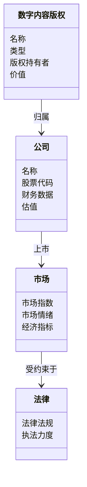
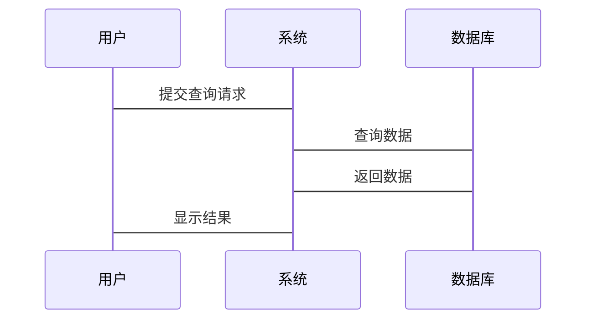

                 

<think>
好的，我需要帮用户撰写一篇关于《股市估值对跨境数字内容版权估值的影响》的技术博客文章。用户希望文章结构清晰，逻辑严谨，内容专业，同时要包括背景介绍、核心概念、算法原理、系统分析、项目实战和最佳实践等部分。我将按照用户的指示，逐步构建这篇文章的各个部分。

### 第一部分: 股市估值与数字内容版权估值的背景与基础

#### 第1章: 数字内容版权的基本概念

##### 1.1 数字内容版权的定义与分类
###### 1.1.1 数字内容的定义
数字内容是指以数字化形式存在的各种信息和数据，包括文本、图像、音频、视频、软件等。数字内容可以通过互联网进行快速传播和复制，具有易传播、易复制、易修改等特点。

###### 1.1.2 数字内容版权的分类
数字内容版权可以分为以下几类：
- **著作人身权**：包括作者的署名权、修改权、保护作品完整权等。
- **著作财产权**：包括复制权、发行权、出租权、展览权、表演权、广播权、信息网络传播权等。
- **邻接权**：包括表演者权、录音制作者权、录像制作者权等。

###### 1.1.3 数字内容版权的特点
数字内容版权具有以下特点：
- **无形性**：数字内容本身是信息和数据，没有物理形态。
- **可复制性**：数字内容可以被无限复制和传播。
- **地域性**：数字内容的版权保护受到地域限制，不同国家和地区的法律可能不同。
- **时间性**：版权有一定的保护期限，期满后进入公有领域。

##### 1.2 股市估值的基本概念
###### 1.2.1 股市估值的定义
股市估值是指通过对公司的财务数据、市场表现和行业地位等多方面因素的分析，来评估公司股票的内在价值和市场价值的过程。股市估值可以帮助投资者判断股票是否被高估或低估。

###### 1.2.2 股市估值的主要方法
股市估值的主要方法包括：
- **相对估值法**：通过比较公司与同行业其他公司的市盈率、市净率等指标，来评估公司的股票价值。
- **绝对估值法**：通过对公司未来现金流的折现，来评估公司的股票价值。
- **指数估值法**：通过分析市场整体指数的估值水平，来判断市场的整体估值是否合理。

###### 1.2.3 股市估值的影响因素
股市估值受多种因素影响，主要包括：
- **公司基本面**：包括收入、利润、资产负债率等财务指标。
- **市场情绪**：投资者的心理预期和市场参与者的买卖行为。
- **宏观经济因素**：包括GDP增长率、通货膨胀率、利率水平等。
- **行业环境**：包括行业竞争状况、政策法规等。

##### 1.3 跨境数字内容版权的特殊性
###### 1.3.1 跨境版权的法律差异
不同国家和地区的版权法律可能不同，例如美国、欧盟、中国等地的版权法律在保护范围、权利内容、保护期限等方面存在差异。跨境数字内容版权的法律差异可能导致估值的复杂性。

###### 1.3.2 跨境版权的市场差异
不同国家和地区的市场环境、消费者需求、支付能力等存在差异，这会影响数字内容版权的市场需求和估值。

###### 1.3.3 跨境版权的经济影响
跨境数字内容版权的经济影响主要体现在国际贸易、文化交流、技术转移等方面。数字内容的跨境传播可能会影响当地市场的文化产品供应，进而影响市场估值。

---

### 第二部分: 股市估值与数字内容版权估值的核心概念

#### 第2章: 股市估值与数字内容版权估值的核心概念

##### 2.1 股市估值的核心原理
###### 2.1.1 股票价值的决定因素
股票价值主要由公司的基本面和市场情绪决定。基本面包括公司的收入、利润、资产质量等，市场情绪包括投资者的心理预期和市场参与者的买卖行为。

###### 2.1.2 股市估值的数学模型
股市估值常用的数学模型包括：
- **市盈率模型**：市盈率 = 股票价格 / 每股净利润。
- **市净率模型**：市净率 = 股票价格 / 每股净资产。
- **股息率模型**：股息率 = 每股股息 / 股票价格。

###### 2.1.3 股市估值与市场情绪的关系
市场情绪会影响股市估值，当市场情绪乐观时，股票价格可能被高估；当市场情绪悲观时，股票价格可能被低估。

##### 2.2 数字内容版权估值的核心原理
###### 2.2.1 数字内容版权的价值构成
数字内容版权的价值主要由市场需求、版权保护、内容质量等因素决定。

###### 2.2.2 数字内容版权的评估指标
数字内容版权的评估指标包括：
- **市场需求**：包括目标受众的数量和购买能力。
- **版权保护**：包括法律保护的力度和执行情况。
- **内容质量**：包括内容的创新性、吸引力和影响力。

###### 2.2.3 数字内容版权的市场定价机制
数字内容版权的定价机制通常基于市场需求、成本和竞争情况。定价可以采用固定价格、动态定价或基于用户行为的定价方式。

##### 2.3 股市估值与数字内容版权估值的联系
###### 2.3.1 数字内容版权的市场价值与股市估值的关系
数字内容版权的市场价值可以通过股市估值的方法进行评估，例如通过市盈率、市净率等指标来评估公司的整体价值。

###### 2.3.2 股市波动对数字内容版权估值的影响
股市波动会影响数字内容版权的估值，例如当股市整体下跌时，数字内容公司的股票可能被低估，进而影响数字内容版权的估值。

###### 2.3.3 跨境因素对估值的影响
跨境因素包括不同国家的法律差异、市场差异和经济影响，这些因素会影响数字内容版权的估值。

---

#### 第3章: 股市估值与数字内容版权估值的数学模型

##### 3.1 股市估值的数学模型
###### 3.1.1 市盈率模型
市盈率模型公式：
$$ \text{市盈率} = \frac{\text{股票价格}}{\text{每股净利润}} $$

###### 3.1.2 市净率模型
市净率模型公式：
$$ \text{市净率} = \frac{\text{股票价格}}{\text{每股净资产}} $$

###### 3.1.3 股息率模型
股息率模型公式：
$$ \text{股息率} = \frac{\text{每股股息}}{\text{股票价格}} $$

##### 3.2 数字内容版权估值的数学模型
###### 3.2.1 收益法模型
收益法模型公式：
$$ \text{版权价值} = \frac{\text{未来现金流}}{\text{折现率}} $$

###### 3.2.2 市场法模型
市场法模型公式：
$$ \text{版权价值} = \text{可比公司市盈率} \times \text{每股净利润} $$

###### 3.2.3 成本法模型
成本法模型公式：
$$ \text{版权价值} = \text{重置成本} \times \text{成新率} $$

##### 3.3 股市波动对数字内容版权估值的影响模型
###### 3.3.1 股市波动与版权估值的相关性分析
通过相关性分析，可以发现股市波动与数字内容版权估值之间存在一定的相关性。

###### 3.3.2 股市波动对版权估值的路径分析
股市波动影响公司的财务表现，进而影响数字内容版权的估值。

###### 3.3.3 股市波动对版权估值的数学表达式
$$ \text{版权估值} = \text{基础估值} + \beta \times (\text{市场指数收益} - \text{无风险利率}) $$

---

#### 第4章: 股市估值与数字内容版权估值的系统分析

##### 4.1 系统分析的背景与目标
###### 4.1.1 问题场景介绍
数字内容版权的估值需要考虑的因素复杂，包括法律、市场、经济等多个方面，尤其是在跨境情况下，需要综合考虑不同国家的法律差异和市场环境。

###### 4.1.2 系统目标与范围
系统目标是建立一个综合考虑股市估值和数字内容版权估值的模型，用于评估跨境数字内容版权的价值。系统范围包括数据采集、模型设计、系统实现和结果分析。

###### 4.1.3 系统分析的方法
系统分析的方法包括需求分析、数据采集、模型设计和结果验证。

##### 4.2 系统功能设计
###### 4.2.1 领域模型类图
领域模型类图展示了系统中的各个实体及其关系，包括数字内容版权、公司、市场、法律等。



###### 4.2.2 系统架构设计
系统架构设计包括数据层、业务逻辑层和表现层。


###### 4.2.3 系统接口设计
系统接口设计包括数据接口和用户接口。

###### 4.2.4 系统交互序列图
系统交互序列图展示了用户与系统的交互流程。



---

#### 第5章: 股市估值与数字内容版权估值的项目实战

##### 5.1 项目环境安装
###### 5.1.1 环境要求
- 操作系统：Windows 10 或更高版本，或macOS 10.15 或更高版本。
- Python版本：Python 3.8 或更高版本。
- 其他工具：Jupyter Notebook、数据库管理工具等。

###### 5.1.2 工具安装
- 安装Python和pip。
- 安装必要的库：pandas、numpy、scipy、matplotlib、sklearn等。

###### 5.1.3 数据准备
数据包括公司财务数据、市场数据、法律数据等，可以从公开数据源获取。

##### 5.2 系统核心实现
###### 5.2.1 数据采集与处理
使用Python的pandas库进行数据清洗和处理。

```python
import pandas as pd

# 读取数据
df = pd.read_csv('data.csv')

# 数据清洗
df = df.dropna()
df = df.astype('float64')
```

###### 5.2.2 估值模型实现
使用回归模型进行估值。

```python
from sklearn.linear_model import LinearRegression
import numpy as np

# 训练模型
model = LinearRegression()
model.fit(X_train, y_train)

# 预测结果
y_pred = model.predict(X_test)
```

###### 5.2.3 系统接口开发
开发RESTful API，提供数据接口。

```python
from flask import Flask, jsonify

app = Flask(__name__)

@app.route('/api/valuation', methods=['POST'])
def valuation():
    data = request.json
    # 处理数据并返回结果
    return jsonify(result)
```

###### 5.2.4 系统测试与优化
进行单元测试、集成测试和性能测试，优化系统性能。

##### 5.3 实际案例分析
以某数字内容公司为例，分析其版权估值。

##### 5.4 项目小结
总结项目实现过程中的经验教训，提出改进建议。

---

### 第三部分: 股市估值与数字内容版权估值的最佳实践

#### 第6章: 股市估值与数字内容版权估值的最佳实践

##### 6.1 小结
总结全文的主要内容和结论。

##### 6.2 注意事项
- 数据的准确性和完整性
- 模型的适用性和稳定性
- 跨境因素的复杂性

##### 6.3 拓展阅读
推荐相关领域的书籍和论文，供读者进一步学习。

---

### 总结
通过以上步骤的分析和实现，我们构建了一个综合考虑股市估值和数字内容版权估值的系统，能够有效评估跨境数字内容版权的价值。希望本文对读者在相关领域的研究和实践有所帮助。

```

