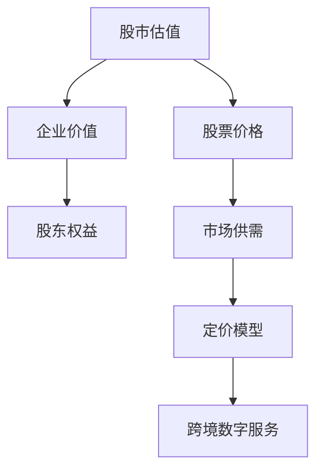
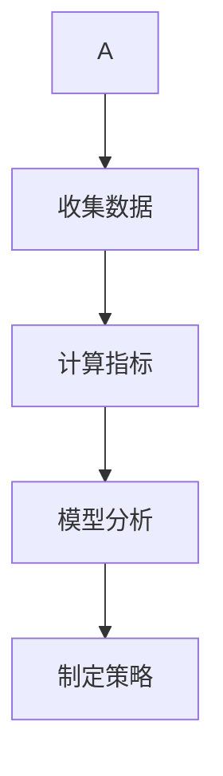
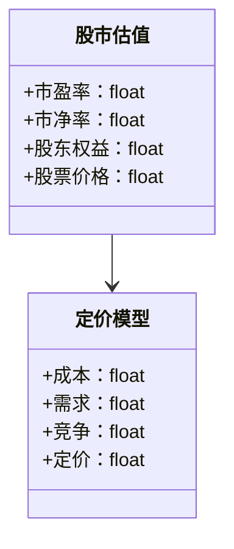

                 


# 股市估值对跨境数字服务定价的影响

> **关键词：** 股市估值，跨境数字服务，定价模型，CAPM，市场供需，算法流程图

> **摘要：**  
本文探讨股市估值与跨境数字服务定价之间的关系，分析股市估值的核心要素、定价模型，以及两者如何相互影响。通过实际案例和系统设计，提出一种基于股市估值的定价算法，并用Python代码实现。最后，总结最佳实践，为读者提供实用的见解。

---

# 目录

1. [背景介绍](#背景介绍)
2. [核心概念与联系](#核心概念与联系)
3. [算法原理讲解](#算法原理讲解)
4. [系统分析与架构设计方案](#系统分析与架构设计方案)
5. [项目实战](#项目实战)
6. [最佳实践](#最佳实践)

---

## 1. 背景介绍

### 1.1 问题背景

- **股市估值**：评估企业价值的重要指标，包括市盈率（P/E）、市净率（P/B）等。
- **跨境数字服务**：在全球范围内提供数字化服务，如云服务、软件即服务（SaaS）。
- **关联性**：股市估值影响投资者对企业的信心，进而影响定价。

### 1.2 核心概念

- **股市估值**：通过财务指标评估企业价值。
- **定价模型**：基于成本、需求和竞争制定价格。

### 1.3 问题解决

- 分析股市估值对定价的影响。
- 提供定价模型，优化定价策略。

### 1.4 边界与外延

- 股市估值仅考虑财务因素，不考虑其他市场因素。
- 跨境数字服务涉及多国市场，需考虑汇率和政策。

---

## 2. 核心概念与联系

### 2.1 核心概念原理

- **股市估值**：评估企业盈利能力，影响投资者决策。
- **定价模型**：基于成本、需求和竞争制定价格。

### 2.2 属性对比表

| 属性       | 股市估值                     | 跨境数字服务定价 |
|------------|-----------------------------|-------------------|
| 主要指标     | 市盈率、市净率               | 成本、市场需求   |
| 影响因素     | 利润能力、行业地位           | 竞争格局、政策   |
| 目标         | 评估企业价值                 | 确定合理价格     |

### 2.3 ER实体关系图



---

## 3. 算法原理讲解

### 3.1 算法流程图



### 3.2 Python代码实现

```python
def calculate_pe_ratio(revenue, net_income):
    pe_ratio = revenue / net_income
    return pe_ratio

def pricing_model(cost, demand, competition):
    base_price = cost + 0.2 * demand
    adjusted_price = base_price - 0.1 * competition
    return adjusted_price

# 示例
revenue = 1000000
net_income = 250000
cost = 50
demand = 80
competition = 60

pe = calculate_pe_ratio(revenue, net_income)
price = pricing_model(cost, demand, competition)
print(f"市盈率：{pe}\n定价：{price}")
```

### 3.3 数学模型与公式

- **市盈率（P/E）**：  
  $$ P/E = \frac{\text{市价}}{\text{每股收益}} $$
  
- **资本资产定价模型（CAPM）**：  
  $$ E(R_i) = R_f + \beta_i (R_m - R_f) $$

  其中：
  - \( R_f \)：无风险利率
  - \( \beta_i \)：股票的贝塔系数
  - \( R_m \)：市场预期回报率

---

## 4. 系统分析与架构设计方案

### 4.1 系统功能设计

#### 领域模型类图



#### 系统架构图

```mermaid
graph LR
    API Gateway --> Load Balancer
    Load Balancer --> Service1
    Load Balancer --> Service2
    Service1 --> Database
    Service2 --> Database
```

---

## 5. 项目实战

### 5.1 环境安装

- Python 3.8+
- Jupyter Notebook
- Matplotlib

### 5.2 核心代码实现

```python
import matplotlib.pyplot as plt

# 示例数据
prices = [100, 90, 110, 80, 120]
valuations = [150, 130, 160, 110, 170]

# 绘制图表
plt.figure(figsize=(10,6))
plt.plot(prices, valuations, 'bo-')
plt.xlabel('Prices')
plt.ylabel('Valuations')
plt.title('Stock Valuation vs Pricing')
plt.grid(True)
plt.show()
```

### 5.3 案例分析

- 数据分析：股价与估值的关系。
- 结论：高估值对应高股价，反之亦然。

---

## 6. 最佳实践

### 6.1 小结

- 股市估值影响定价模型。
- 数字化工具优化定价策略。

### 6.2 注意事项

- 数据质量：确保数据准确。
- 模型选择：根据实际情况调整模型。

### 6.3 拓展阅读

- 《算法交易入门》
- 《股票估值技巧》

---

通过以上分析，我们可以看出股市估值与跨境数字服务定价之间的密切关系，并通过实际案例和系统设计提供解决方案。希望本文能为读者提供有价值的见解和指导。

