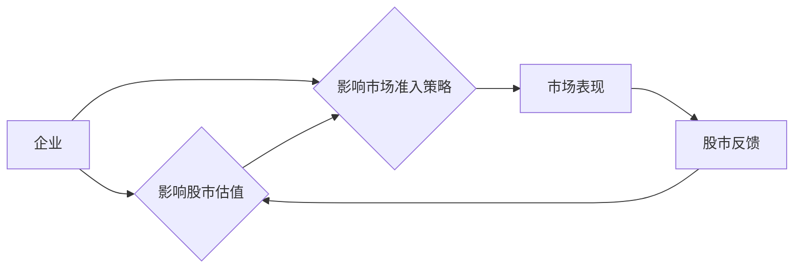

                 


# 股市估值对跨境数字服务市场准入的影响

> 关键词：股市估值、跨境数字服务、市场准入、经济影响、投资策略

> 摘要：本文探讨股市估值与跨境数字服务市场准入之间的关系，分析股市估值对企业进入市场的策略影响，以及市场准入对股市估值的反馈机制。通过理论模型和实际案例，本文揭示了股市估值在跨境数字服务市场中的关键作用，并为企业制定市场策略提供参考。

---

## 第一部分：背景介绍

### 第1章：股市估值与跨境数字服务市场准入概述

#### 1.1 股市估值的基本概念
- **1.1.1 股市估值的定义**：股市估值是通过特定方法评估企业或资产的市场价值。常用方法包括市盈率（P/E）、市净率（P/B）和现金流折现法（DCF）等。
- **1.1.2 股市估值的主要方法**：市盈率基于未来盈利预测，市净率考虑资产净值，DCF法评估未来现金流的现值。
- **1.1.3 股市估值与企业价值的关系**：高估值通常意味着市场对企业的未来增长有信心，但也可能隐含较高的投资风险。

#### 1.2 跨境数字服务市场的定义与特点
- **1.2.1 跨境数字服务市场的定义**：指跨越国界提供数字服务的市场，如在线支付、云计算、电子商务等。
- **1.2.2 数字服务市场的现状与发展**：全球数字化转型推动了跨境数字服务市场的扩张，主要参与者包括科技巨头和新兴企业。
- **1.2.3 跨境市场的独特性与挑战**：文化差异、法律监管、支付系统兼容性等问题增加了市场准入的复杂性。

#### 1.3 股市估值与市场准入的关系
- **1.3.1 问题背景与问题描述**：股市估值影响企业的融资能力，进而影响其进入新市场的资源和能力。
- **1.3.2 问题解决的必要性**：理解股市估值与市场准入的关系，有助于企业制定更有效的市场扩张策略。
- **1.3.3 股市估值对市场准入的影响边界**：分析股市估值如何通过资本成本、投资信心等影响市场准入。

---

## 第二部分：核心概念与联系

### 第2章：股市估值与市场准入的核心概念

#### 2.1 核心概念的原理
- **2.1.1 股市估值的核心要素**：盈利能力和成长性是影响估值的关键因素，投资者通过这些指标评估企业的投资价值。
- **2.1.2 市场准入的关键因素**：包括市场规模、竞争程度、政策环境和企业自身的资源能力。

#### 2.2 核心概念的特征对比
- **2.2.1 股市估值与市场准入的对比分析**：股市估值侧重于企业的内在价值，市场准入则关注外部环境和企业的市场策略。
- **2.2.2 表格展示：主要特征对比**
  | 特征       | 股市估值            | 市场准入            |
  |------------|---------------------|---------------------|
  | 关注点      | 企业价值            | 市场进入障碍        |
  | 影响因素    | 盈利能力、成长性    | 市场规模、政策环境  |

#### 2.3 实体关系图
- **2.3.1 Mermaid流程图：股市估值与市场准入的实体关系**



---

## 第三部分：算法原理讲解

### 第3章：股市估值的数学模型与算法

#### 3.1 常见的股市估值方法
- **3.1.1 市盈率（P/E）**：
  $$ P/E = \frac{\text{股价}}{\text{每股收益}} $$
  例：如果一家公司的股价为50元，每股收益为5元，P/E = 10，表示投资者愿意为每元收益支付10元。

- **3.1.2 现金流折现法（DCF）**：
  $$ V = \sum_{t=1}^{n} \frac{CF_t}{(1 + r)^t} + \frac{TV}{(1 + r)^n} $$
  其中，\( CF_t \) 是第t年的现金流，\( r \) 是折现率，\( TV \) 是终值。

#### 3.2 股市估值对市场准入的影响模型
- **3.2.1 股市估值对企业融资能力的影响**：
  $$ \text{融资能力} = f(\text{估值水平}, \text{市场信心}) $$
  企业通过高估值可以更容易获得资金，从而支持市场扩展。

#### 3.3 算法实现
- **3.3.1 市盈率计算示例**：
  ```python
  def calculate_pe_ratio(price, earnings_per_share):
      return price / earnings_per_share

  # 示例
  price = 50
  eps = 5
  pe_ratio = calculate_pe_ratio(price, eps)
  print(f"市盈率为: {pe_ratio}")
  ```

---

## 第四部分：系统分析与架构设计

### 第4章：系统架构与功能设计

#### 4.1 系统功能设计
- **4.1.1 领域模型设计**：
  ```mermaid
  classDiagram
      class 股市估值 {
          股价
          每股收益
          市盈率
      }
      class 市场准入 {
          市场规模
          竞争情况
          政策环境
      }
      股市估值 --> 市场准入
  ```

#### 4.2 系统架构设计
- **4.2.1 架构图**：
  ```mermaid
  architecture
      前端 (Web, 移动端) -- 中间件 --> 后端 (API)
      后端 --> 数据库 (存储估值数据和市场准入信息)
  ```

#### 4.3 接口设计
- **4.3.1 RESTful API示例**：
  - GET /valuation方法获取市盈率
  - POST /market_access提交市场准入申请

---

## 第五部分：项目实战

### 第5章：项目实战与案例分析

#### 5.1 环境安装
- 需要安装Python和相关库（如Pandas、NumPy、Plotly）进行数据处理和可视化。

#### 5.2 核心代码实现
- **5.2.1 计算市盈率的Python代码**：
  ```python
  import pandas as pd

  def calculate_pe(stock_data):
      pe_ratio = stock_data['股价'] / stock_data['每股收益']
      return pe_ratio

  # 示例数据
  data = {
      '股价': [50, 60, 70],
      '每股收益': [5, 6, 7]
  }
  df = pd.DataFrame(data)
  pe = calculate_pe(df)
  print(df.join(pe))
  ```

#### 5.3 案例分析
- **案例：某科技公司进入新兴市场**：
  该公司通过优化市盈率（从20降至15）吸引了更多投资者，从而获得了进入新市场的资金支持。

---

## 第六部分：最佳实践与小结

### 第6章：总结与展望

#### 6.1 小结
- 股市估值与市场准入相互影响，理解这种关系有助于企业制定有效的市场策略。
- 投资者应关注企业的估值水平和市场准入能力，以做出更明智的投资决策。

#### 6.2 注意事项
- 股市估值波动性大，需谨慎评估市场风险。
- 跨境市场准入需考虑多因素，如政策和文化差异。

#### 6.3 拓展阅读
- 推荐阅读《投资学基础》和《国际市场进入策略》。

---

通过以上结构，文章详细探讨了股市估值与跨境数字服务市场准入的关系，结合理论分析和实际案例，为企业和投资者提供了有价值的见解和策略建议。

