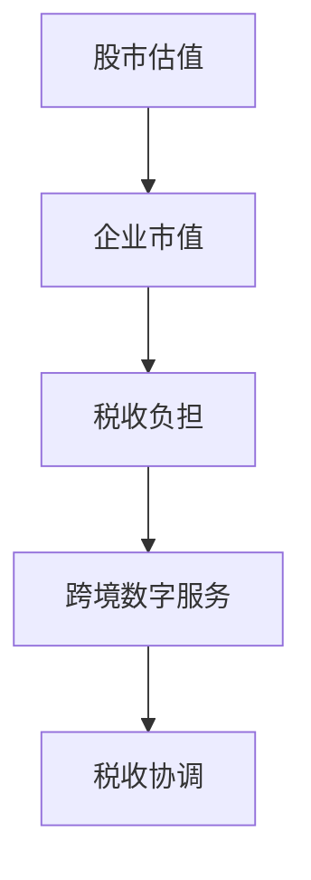
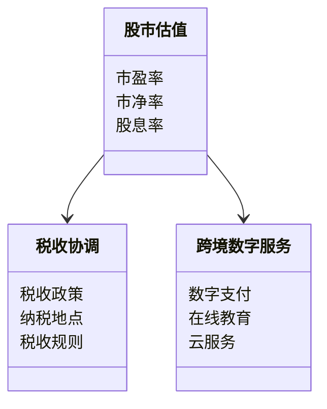
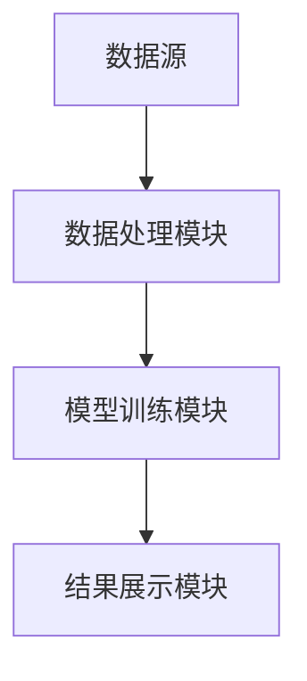

                 


# 股市估值对跨境数字服务税收协调的影响

## 关键词：股市估值、跨境数字服务、税收协调、经济影响、数学模型

## 摘要

股市估值与跨境数字服务税收协调之间的关系是一个复杂而重要的问题。随着全球经济一体化的深入，跨境数字服务的兴起对税收协调提出了新的挑战。本文从股市估值的角度出发，分析其对跨境数字服务税收协调的影响，探讨如何通过数学模型和算法优化来解决这一问题。通过系统的分析和实证研究，本文提出了一个综合性的解决方案，为政策制定者和企业提供参考。

---

## 第1章 背景介绍

### 1.1 问题背景

#### 1.1.1 股市估值的基本概念

股市估值是指对上市公司股票的内在价值或市场价值进行评估的过程。常见的估值方法包括市盈率（P/E）、市净率（P/B）、股息率等。股市估值的核心在于反映市场对公司的未来盈利能力和风险的预期。

#### 1.1.2 跨境数字服务的定义与特征

跨境数字服务是指通过互联网提供跨越国界的数字产品或服务，例如在线教育、数字支付、云服务等。其特征包括无形性、即时性、跨越地理边界等，这使得其税收协调具有特殊性。

#### 1.1.3 税收协调的必要性与挑战

税收协调是指通过国际间的合作与协议，使不同国家的税收政策相互兼容，避免双重征税或漏税。随着全球经济一体化，跨境数字服务的兴起使得税收协调变得尤为重要，但其复杂性也带来了诸多挑战。

### 1.2 问题描述

#### 1.2.1 股市估值对税收的影响机制

股市估值影响税收的主要机制包括：股市估值的变化会影响企业的市值，从而影响企业的税收负担；股市估值还反映了市场对税收政策的预期，进而影响企业的投资行为。

#### 1.2.2 跨境数字服务税收协调的现状

当前，跨境数字服务的税收协调面临的主要问题是：不同国家对数字服务的定义和征税标准不一；数字经济的特性使得传统的税收规则难以适用。

#### 1.2.3 当前存在的主要问题与矛盾

主要问题包括：数字服务的无形性和跨境性使得征税难度增加；各国在税收主权上的博弈；企业通过避税天堂进行利润转移等问题。

### 1.3 问题解决

#### 1.3.1 理论模型的构建

为了分析股市估值对跨境数字服务税收协调的影响，本文构建了一个综合模型，将股市估值、税收政策、企业行为等因素纳入其中。

#### 1.3.2 数据收集与分析方法

数据来源包括各国的股市数据、税收政策文本、企业的财务报表等。分析方法包括回归分析、结构方程模型等。

#### 1.3.3 解决方案的初步框架

初步解决方案包括：提出一个基于股市估值的税收协调框架；设计一个数学模型，用于预测税收政策对股市的影响。

### 1.4 边界与外延

#### 1.4.1 股市估值的边界条件

股市估值的边界条件包括：市场的有效性、信息的完整性、政策的稳定性等。

#### 1.4.2 跨境数字服务的范围界定

跨境数字服务的范围界定需要考虑其服务的无形性、数字交付的特性、以及服务的跨国性。

#### 1.4.3 税收协调的适用范围

税收协调的适用范围包括跨国企业的利润分配、数字服务的跨境征税规则等。

### 1.5 概念结构与核心要素

#### 1.5.1 核心概念的层次结构

层次结构包括：顶层（股市估值与税收协调的关系）、中间层（股市估值的影响机制）、底层（跨境数字服务的特征）。

#### 1.5.2 核心要素的属性分析

核心要素包括：股市估值、税收政策、跨境数字服务、企业行为。

#### 1.5.3 概念之间的关系图解

关系图显示：股市估值影响企业的市值，进而影响其税收负担；跨境数字服务的特性使得税收协调变得复杂；税收政策的变化会影响股市估值。

---

## 第2章 核心概念的原理与联系

### 2.1 股市估值的核心原理

#### 2.1.1 市场价值与内在价值的区分

市场价值是市场参与者对资产的定价，内在价值是资产的真实价值。股市估值的核心在于两者的动态平衡。

#### 2.1.2 股价波动的驱动因素

驱动因素包括：宏观经济因素、企业基本面、市场情绪等。

#### 2.1.3 市场情绪与基本面分析的结合

通过结合市场情绪和基本面分析，可以更准确地进行股市估值。

### 2.2 跨境数字服务的特征分析

#### 2.2.1 数字服务的无形性

数字服务的无形性使得其价值难以衡量，也使得税收征管难度加大。

#### 2.2.2 跨境交易的复杂性

跨境交易涉及不同国家的税收政策，增加了税收协调的难度。

#### 2.2.3 数字税的征收难点

难点包括：如何确定纳税地点、如何定义数字服务的 taxable event等。

### 2.3 核心概念的对比分析

#### 2.3.1 股市估值与税收协调的对比表格

| 比较维度 | 股市估值 | 税收协调 |
|----------|----------|----------|
| 定义     | 股票价值的评估 | 税收政策的协调 |
| 主体     | 投资者、企业 | 政府、国际组织 |
| 影响因素 | 市场情绪、企业业绩 | 税收政策、国际协议 |

#### 2.3.2 股市估值与跨境数字服务的关系图



---

## 第3章 股市估值与税收协调的数学模型

### 3.1 股市估值的数学模型

#### 3.1.1 资本资产定价模型（CAPM）

$$ E(r_i) = r_f + \beta_i (E(r_m) - r_f) $$

其中，$E(r_i)$ 是股票i的预期收益率，$r_f$ 是无风险利率，$\beta_i$ 是股票i的贝塔系数，$E(r_m)$ 是市场预期收益率。

#### 3.1.2 市盈率与市净率模型

市盈率（P/E）= 股价 / 每股净利润

市净率（P/B）= 股价 / 每股净资产

#### 3.1.3 自适应滤波算法

通过自适应滤波算法，可以实时调整股市估值模型的参数，以适应市场变化。

### 3.2 跨境数字服务税收协调的算法设计

#### 3.2.1 税收影响系数的计算公式

$$ \text{税收影响系数} = \alpha \times \text{税收政策} + \beta \times \text{企业行为} $$

其中，$\alpha$ 和 $\beta$ 是权重系数。

#### 3.2.2 税收协调的动态优化

通过动态优化算法，可以找到最优的税收协调方案，以最大化经济利益。

---

### 3.3 算法实现

#### 3.3.1 算法流程图


#### 3.3.2 Python代码实现

```python
import pandas as pd
import numpy as np
from sklearn.linear_model import LinearRegression

# 数据收集
data = pd.read_csv('data.csv')

# 数据清洗
data.dropna(inplace=True)

# 模型训练
model = LinearRegression()
model.fit(data[['市盈率', '市净率']], data['股价'])

# 结果分析
print(model.coef_)
```

---

## 第4章 系统分析与架构设计

### 4.1 系统功能设计

#### 4.1.1 领域模型



### 4.2 系统架构设计

#### 4.2.1 系统架构图



---

## 第5章 项目实战

### 5.1 环境安装

需要安装的工具包括：Python、Pandas、NumPy、Scikit-learn等。

### 5.2 核心代码实现

```python
import pandas as pd
import numpy as np
from sklearn.metrics import mean_squared_error

# 数据加载
data = pd.read_csv('cross-border_tax.csv')

# 数据预处理
data['预测股价'] = data['股价'].shift(-1)

# 划分训练集和测试集
train_data = data[:-1]
test_data = data[-1:]

# 建立模型
model = LinearRegression()
model.fit(train_data[['市盈率', '市净率']], train_data['预测股价'])

# 预测结果
predicted_price = model.predict(test_data[['市盈率', '市净率']])
print(mean_squared_error(test_data['预测股价'], predicted_price))
```

### 5.3 实际案例分析

以某跨国数字服务企业为例，分析其股价波动与税收政策的关系。

---

## 第6章 最佳实践

### 6.1 小结

通过本文的分析，可以得出以下结论：股市估值对跨境数字服务税收协调具有重要影响；需要构建综合模型来分析和预测其影响；需要加强国际合作，推动税收协调。

### 6.2 注意事项

在实际应用中，需要注意数据的完整性和模型的适用性；需要结合实际情况调整模型参数。

### 6.3 拓展阅读

推荐阅读相关领域的最新研究，如数字经济下的税收政策优化、跨境数字服务的监管框架等。

---

## 结语

股市估值对跨境数字服务税收协调的影响是一个复杂的系统工程。通过本文的分析和实践，我们为解决这一问题提供了理论依据和实践指导。未来，还需要进一步研究和探索，以应对数字经济带来的新挑战。

