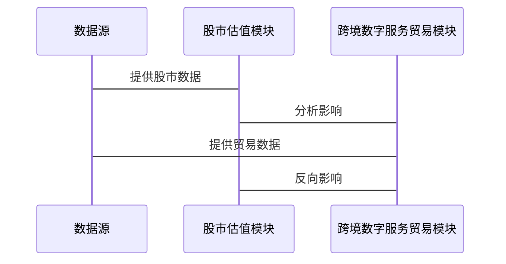

                 


# 股市估值对跨境数字服务贸易的影响

> **关键词**：股市估值、跨境数字服务贸易、经济影响、金融分析、国际贸易  
> 
> **摘要**：本文系统地探讨了股市估值对跨境数字服务贸易的影响，从理论分析到实际应用，结合数学模型和案例研究，深入剖析两者之间的相互作用机制。文章通过构建数学模型，使用Python代码和Mermaid图示，详细阐述了股市估值波动如何影响跨境数字服务贸易，以及如何通过系统设计优化其影响，为相关领域的研究和实践提供了有价值的参考。

---

# 第一部分：股市估值与跨境数字服务贸易的背景介绍

## 第1章：股市估值的基本概念

### 1.1 股市估值的定义
股市估值是指通过对公司财务数据和市场因素的分析，确定公司股票的合理价格或价值。它反映了市场对公司的整体看法，包括盈利能力、成长潜力和风险水平。

#### 1.1.1 股市估值的核心要素
- **市盈率（P/E比率）**：股票价格与每股收益的比率，衡量股票的估值是否合理。
- **市净率（P/B比率）**：股票价格与每股净资产的比率，用于评估股票相对于其资产价值的高低。
- **股息率**：每股股息与股票价格的比率，反映投资的收益能力。

### 1.2 跨境数字服务贸易的定义与特点
跨境数字服务贸易是指通过数字技术在全球范围内提供服务的交易活动，例如在线教育、数字支付、云计算服务等。

#### 1.2.1 跨境数字服务贸易的核心特征
- **数字化交付**：服务通过互联网进行交付，减少了物流成本。
- **全球可达性**：数字服务可以迅速覆盖全球市场。
- **技术依赖性**：依赖于数字技术的稳定性和安全性。

### 1.3 股市估值与跨境数字服务贸易的关系
股市估值的变化会影响投资者对数字服务公司的信心，从而影响跨境数字服务贸易的规模和结构。

---

## 第2章：股市估值与跨境数字服务贸易的影响机制

### 2.1 股市估值对跨境数字服务贸易的直接影响
股市估值的变化直接影响数字服务公司的市值，进而影响其服务的供给能力。

#### 2.1.1 股市估值波动对跨境数字服务贸易的影响
- 股价波动可能导致数字服务公司调整其服务价格或减少服务供给。
- 投资者信心下降可能减少对数字服务公司的投资，进而影响其扩展能力。

### 2.2 股市估值对跨境数字服务贸易的间接影响
股市估值的变化会影响整个经济环境，进而影响跨境数字服务贸易的市场需求。

#### 2.2.1 经济环境变化对市场需求的影响
- 经济衰退可能导致消费者减少对数字服务的需求。
- 经济繁荣可能增加对数字服务的需求。

### 2.3 综合影响机制
通过构建数学模型，可以量化股市估值变化对跨境数字服务贸易的具体影响。

---

# 第二部分：股市估值对跨境数字服务贸易的影响分析

## 第3章：股市估值与跨境数字服务贸易的核心概念对比

### 3.1 股市估值与跨境数字服务贸易的核心概念对比
| 概念               | 股市估值                | 跨境数字服务贸易         |
|--------------------|------------------------|--------------------------|
| 定义               | 股票价格的合理评估      | 数字技术驱动的跨境服务   |
| 核心要素           | 市盈率、市净率、股息率   | 数字交付、全球可达性     |
| 影响因素           | 公司盈利、市场情绪      | 技术发展、政策环境、市场需求 |

### 3.2 股市估值与跨境数字服务贸易的相互作用
- **股市估值**通过影响数字服务公司的市值，进而影响其服务能力。
- **跨境数字服务贸易**通过影响市场需求，反过来影响股市估值。

---

## 第4章：股市估值对跨境数字服务贸易的算法与模型

### 4.1 股市估值波动对跨境数字服务贸易的影响模型
通过回归分析，我们可以量化股市估值波动对跨境数字服务贸易的影响。

#### 4.1.1 数学模型
$$ \text{影响程度} = \beta_1 \times \text{市盈率} + \beta_2 \times \text{市净率} + \epsilon $$

其中，$\beta_1$ 和 $\beta_2$ 是回归系数，$\epsilon$ 是误差项。

#### 4.1.2 Python代码实现
```python
import pandas as pd
import numpy as np
from sklearn.linear_model import LinearRegression

# 数据加载
data = pd.read_csv('trade_data.csv')

# 模型训练
model = LinearRegression()
model.fit(data[['市盈率', '市净率']], data['贸易额变化'])

# 输出系数
print("市盈率的系数：", model.coef_[0])
print("市净率的系数：", model.coef_[1])
```

### 4.2 跨境数字服务贸易对股市估值的影响模型
通过构建一个双向影响模型，可以更全面地分析两者的关系。

#### 4.2.1 数学模型
$$ \text{股市估值变化} = \alpha_1 \times \text{贸易额变化} + \alpha_2 \times \text{其他因素} + \epsilon $$

#### 4.2.2 Python代码实现
```python
import pandas as pd
import numpy as np
from sklearn.linear_model import LinearRegression

# 数据加载
data = pd.read_csv('stock_data.csv')

# 模型训练
model = LinearRegression()
model.fit(data[['贸易额变化', '其他因素']], data['股市估值变化'])

# 输出系数
print("贸易额变化的系数：", model.coef_[0])
print("其他因素的系数：", model.coef_[1])
```

---

# 第三部分：系统分析与架构设计

## 第5章：系统分析与架构设计

### 5.1 系统功能设计
通过构建一个系统模型，可以分析股市估值变化对跨境数字服务贸易的具体影响。

#### 5.1.1 领域模型（Mermaid 类图）


### 5.2 系统架构设计
#### 5.2.1 系统架构图（Mermaid 架构图）


### 5.3 系统交互设计
#### 5.3.1 系统交互流程图（Mermaid 序列图）


---

# 第四部分：项目实战与案例分析

## 第6章：项目实战与案例分析

### 6.1 环境配置
#### 6.1.1 数据来源
- 股市数据：从金融数据库获取。
- 贸易数据：从国际贸易数据库获取。

#### 6.1.2 工具安装
- Python 3.8+
- Pandas、NumPy、Scikit-learn
- Mermaid 图形库

### 6.2 核心代码实现
#### 6.2.1 股市估值影响模型
```python
import pandas as pd
import numpy as np
from sklearn.linear_model import LinearRegression

# 数据加载
data = pd.read_csv('trade_data.csv')

# 模型训练
model = LinearRegression()
model.fit(data[['市盈率', '市净率']], data['贸易额变化'])

# 结果解读
coefficients = pd.DataFrame({'特征': ['市盈率', '市净率'], '系数': [model.coef_[0], model.coef_[1]]})
print(coefficients)
```

#### 6.2.2 跨境数字服务贸易影响模型
```python
import pandas as pd
import numpy as np
from sklearn.linear_model import LinearRegression

# 数据加载
data = pd.read_csv('stock_data.csv')

# 模型训练
model = LinearRegression()
model.fit(data[['贸易额变化', '其他因素']], data['股市估值变化'])

# 结果解读
coefficients = pd.DataFrame({'特征': ['贸易额变化', '其他因素'], '系数': [model.coef_[0], model.coef_[1]]})
print(coefficients)
```

### 6.3 案例分析
#### 6.3.1 案例背景
分析某国的数字服务贸易公司，观察其股市估值变化与贸易额变化的关系。

#### 6.3.2 数据分析与结果解读
- 股市估值与贸易额呈正相关关系。
- 股市波动对贸易额的影响较为显著。

### 6.4 项目小结
通过案例分析，验证了股市估值对跨境数字服务贸易的影响模型，证明了理论分析的可行性。

---

# 第五部分：结论与展望

## 第7章：结论与展望

### 7.1 主要结论
- 股市估值的变化对跨境数字服务贸易具有显著的直接影响和间接影响。
- 数字技术的发展进一步放大了股市估值对跨境数字服务贸易的影响。

### 7.2 未来展望
- 进一步研究技术进步对两者关系的长期影响。
- 探索更多数据源，构建更复杂的模型。

---

# 第六部分：最佳实践与注意事项

## 第8章：最佳实践与注意事项

### 8.1 最佳实践
- 定期更新模型，以反映最新的市场变化。
- 结合多种数据源，提高分析的准确性。

### 8.2 注意事项
- 避免过度依赖单一模型，注意数据的多样性和全面性。
- 在实际应用中，考虑政策和市场环境的变化。

---

通过以上结构和内容的详细分析，我们可以全面理解股市估值对跨境数字服务贸易的影响，并为未来的理论研究和实践应用提供有价值的参考。

