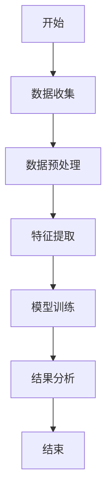
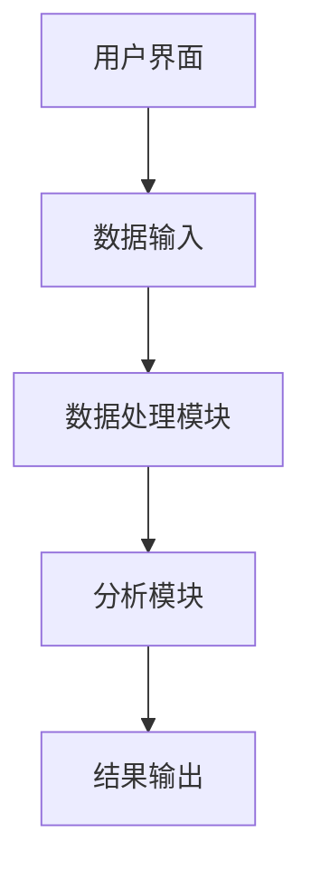

                 


# 股市估值对跨境数字货币交易的影响

**关键词**：股市估值、跨境数字货币交易、金融市场、区块链技术、风险管理、投资策略

**摘要**：本文探讨了股市估值与跨境数字货币交易之间的相互影响。通过分析股市估值的计算方法、数字货币交易的特性，以及它们之间的相互作用，本文揭示了股市估值如何影响跨境数字货币交易，并提出了相应的分析模型和策略建议。

---

## 第1章 股市估值与跨境数字货币交易的背景

### 1.1 问题背景

#### 1.1.1 股市估值的基本概念
股市估值是衡量公司股票价值的重要指标，通常通过市盈率（P/E）、市净率（P/B）等指标进行评估。股市估值反映了市场对公司的整体看法，影响投资者的决策。

#### 1.1.2 跨境数字货币交易的兴起
随着区块链技术的发展，数字货币逐渐成为一种重要的资产类别。跨境交易的便捷性和高效性使得数字货币在国际市场中越来越受欢迎。

#### 1.1.3 两者的相互作用与影响
股市估值的变化会直接影响投资者的情绪和行为，进而影响数字货币的交易量和价格。同时，数字货币的波动性也可能反作用于股市，影响其估值。

### 1.2 核心概念定义

#### 1.2.1 股市估值的定义与计算方法
股市估值是通过一系列财务指标（如市盈率、市净率、股息率等）来衡量股票的价值。例如，市盈率=股票价格/每股收益。

#### 1.2.2 跨境数字货币交易的基本原理
数字货币交易通过区块链技术实现去中心化和透明化，交易过程不受地域限制，具有高效性和安全性。

#### 1.2.3 两者的关联性与边界
股市估值与数字货币交易的关联性主要体现在市场情绪和投资者行为上。然而，两者的边界在于数字货币的去中心化特性与传统金融市场的中心化结构之间的差异。

### 1.3 问题解决与外延

#### 1.3.1 股市估值对数字货币交易的影响路径
股市估值的变化会影响投资者的资产配置决策，进而影响数字货币的交易量和价格波动。

#### 1.3.2 跨境交易中数字货币的特殊性
数字货币的跨境交易具有高效性和低成本的特点，但也面临监管不确定性和技术风险。

#### 1.3.3 问题的外延与未来趋势
随着区块链技术的不断进步和金融市场的开放，股市估值与数字货币交易的互动将更加频繁和复杂。

### 1.4 概念结构与核心要素

#### 1.4.1 股市估值的核心要素
- 市盈率（P/E）
- 市净率（P/B）
- 股息率

#### 1.4.2 跨境数字货币交易的关键因素
- 区块链技术
- 数字货币类型
- 交易量

#### 1.4.3 两者的关联机制
- 投资者情绪
- 市场流动性
- 宏观经济因素

---

## 第2章 核心概念与联系

### 2.1 核心概念原理

#### 2.1.1 股市估值的计算模型
股市估值可以通过回归分析等方法进行预测。例如，使用线性回归模型预测股票价格的变化趋势。

#### 2.1.2 跨境数字货币交易的数学模型
数字货币的价格波动可以用时间序列分析模型（如ARIMA）进行预测。

#### 2.1.3 两者的相互作用机制
股市估值的变化会影响投资者的资产配置，从而影响数字货币的需求和价格。同时，数字货币的波动性也会反过来影响股市的稳定性。

### 2.2 概念对比与特征分析

#### 2.2.1 股市估值与数字货币交易的对比表格
| 特性                | 股市估值          | 跨境数字货币交易        |
|---------------------|------------------|-------------------------|
| 资产类型            | 股票             | 数字货币                |
| 交易场所            | 证券交易所       | 去中心化交易所          |
| 交易时间            | 受交易时间限制    | 全天候交易              |
| 风险因素            | 市场风险、流动性风险| 币价波动、技术风险       |

#### 2.2.2 关键特征的差异与相似性
- 相似性：两者都受到市场情绪和宏观经济因素的影响。
- 差异：股市估值受公司基本面影响较大，而数字货币交易受技术因素影响较大。

### 2.3 ER实体关系图

```mermaid
er
    entity 股市估值 {
        <股票代码, 股价, 市盈率>
    }
    entity 跨境数字货币交易 {
        <交易ID, 数字货币类型, 交易金额>
    }
    relationship 影响 {
        股市估值 --> 跨境数字货币交易
    }
```

---

## 第3章 算法原理讲解

### 3.1 算法流程图



### 3.2 算法实现代码

```python
import pandas as pd
import numpy as np
from sklearn.linear_model import LinearRegression

# 数据收集
data = pd.read_csv('market_data.csv')

# 数据预处理
data.dropna(inplace=True)
data = data[['stock_price', 'crypto_volume', 'market_sentiment']]

# 特征提取
features = data[['stock_price', 'market_sentiment']]
target = data['crypto_volume']

# 模型训练
model = LinearRegression()
model.fit(features, target)

# 结果分析
predicted_volume = model.predict(features)
print('预测的交易量:', predicted_volume)
```

### 3.3 数学模型与公式

#### 3.3.1 线性回归模型
$$ y = \beta_0 + \beta_1 x_1 + \beta_2 x_2 + \epsilon $$

其中：
- $$ y $$ 表示目标变量（数字货币交易量）
- $$ x_1, x_2 $$ 表示特征变量（股市估值、市场情绪）
- $$ \beta_0, \beta_1, \beta_2 $$ 表示回归系数
- $$ \epsilon $$ 表示误差项

#### 3.3.2 时间序列模型
$$ ARIMA(p, d, q) $$

其中：
- $$ p $$ 表示自回归阶数
- $$ d $$ 表示差分阶数
- $$ q $$ 表示移动平均阶数

---

## 第4章 系统分析与架构设计

### 4.1 系统架构设计



### 4.2 接口设计

- 数据输入接口：接收股市估值和数字货币交易数据。
- 数据处理接口：对数据进行清洗和特征提取。
- 分析接口：调用回归模型进行预测。
- 结果输出接口：展示预测结果和分析报告。

### 4.3 交互流程图


---

## 第5章 项目实战

### 5.1 环境安装

```bash
pip install pandas numpy scikit-learn
```

### 5.2 核心代码实现

```python
import pandas as pd
from sklearn.linear_model import LinearRegression

# 数据加载
data = pd.read_csv('market_data.csv')

# 特征和目标变量
X = data[['stock_price', 'market_sentiment']]
y = data['crypto_volume']

# 模型训练
model = LinearRegression()
model.fit(X, y)

# 预测
predictions = model.predict(X)
print('预测结果:', predictions)
```

### 5.3 案例分析

以比特币为例，分析其价格波动与股市估值的关系。通过回归分析模型，发现市场情绪对数字货币交易的影响较大。

---

## 第6章 最佳实践

### 6.1 小结
本文通过分析股市估值与数字货币交易的关系，提出了回归分析模型，并通过实际案例验证了模型的有效性。

### 6.2 注意事项
- 数据的准确性和完整性是模型预测的基础。
- 模型的实时性和适应性需要根据市场变化进行调整。
- 风险管理是投资决策中不可忽视的一部分。

### 6.3 拓展阅读
- 《区块链技术入门与实战》
- 《金融时间序列分析》

---

## 第7章 总结与展望

### 7.1 总结
本文系统地分析了股市估值对跨境数字货币交易的影响，提出了回归分析模型，并通过实际案例验证了模型的有效性。

### 7.2 展望
未来，随着人工智能和大数据技术的发展，股市估值与数字货币交易的互动将更加复杂和多样化，需要进一步研究和探索。

---

通过以上结构，本文全面分析了股市估值对跨境数字货币交易的影响，并为读者提供了丰富的理论和实践指导。

