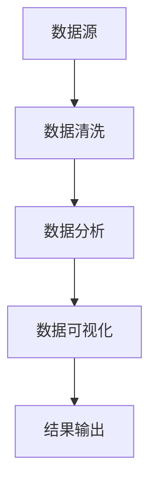

                 


# 股市估值对跨境数据流动政策的影响

> **关键词**: 股市估值, 跨境数据流动, 政策影响, 数学模型, 数据流动机制

> **摘要**: 本文探讨了股市估值与跨境数据流动政策之间的复杂关系。通过分析股市估值的核心概念、数据流动政策的机制，以及两者之间的相互影响，本文揭示了政策变化如何通过数据流动影响股市估值。结合数学模型和实际案例，本文提供了一种分析和预测股市估值受政策影响的方法。

---

## 第一部分: 背景介绍与核心概念

### 第1章: 股市估值与跨境数据流动政策的背景

#### 1.1 股市估值的基本概念

##### 1.1.1 股市估值的定义
股市估值是指对上市公司股票价值的评估，通常基于财务指标和市场因素。常用的估值方法包括市盈率（P/E）、市净率（P/B）和现金流折现模型（DCF）等。

##### 1.1.2 股市估值的主要方法
- **市盈率（P/E）**: 市盈率=股价/每股收益。反映市场对公司盈利能力的预期。
- **市净率（P/B）**: 市净率=股价/每股净资产。适用于评估资产密集型企业的价值。
- **现金流折现模型（DCF）**: 通过预测未来现金流并贴现至现值来评估企业价值。

##### 1.1.3 股市估值与经济指标的关系
股市估值与GDP增长率、通货膨胀率和利率等经济指标密切相关。例如，低利率环境通常会推高市盈率，因为投资者寻求更高的收益。

#### 1.2 跨境数据流动政策的背景

##### 1.2.1 跨境数据流动的定义
跨境数据流动指数据在不同国家或地区之间的传输和使用。随着全球化的发展，企业 increasingly rely on跨境数据流动来支持业务。

##### 1.2.2 全球化背景下数据流动的重要性
跨境数据流动是全球贸易、金融和通信的基础。企业通过跨境数据流动优化供应链、提高效率并降低成本。

##### 1.2.3 跨境数据流动的主要政策框架
- **欧盟GDPR**: 规定了数据保护和隐私的高标准，影响全球数据流动。
- **美国CLOUD Act**: 规定了跨境数据存储和访问的规则。
- **中国《数据安全法》**: 强化了数据安全和跨境数据流动的监管。

### 第2章: 股市估值与跨境数据流动的关系

#### 2.1 股市估值受政策影响的机制

##### 2.1.1 政策如何影响数据流动
- **数据本地化要求**: 某些国家要求数据存储在境内，增加了企业的成本。
- **数据传输限制**: 限制敏感数据的跨境传输，可能影响企业的全球化运营。

##### 2.1.2 数据流动对股市估值的具体影响路径
- **企业成本变化**: 数据本地化要求可能增加企业的运营成本，影响利润，进而影响市盈率。
- **市场预期调整**: 政策变化会影响投资者对企业的未来盈利能力预期，影响股价。

##### 2.1.3 股市估值与数据流动的相互作用
- 股市估值影响企业的融资能力，进而影响其跨境数据流动的能力。
- 跨境数据流动的政策变化会影响企业的估值，反过来影响政策制定。

#### 2.2 股市估值对政策的反馈效应

##### 2.2.1 股市反应对政策制定者的启示
- 股市波动可以作为政策效果的晴雨表。例如，政策出台后股市下跌可能表明政策对企业有负面影响。

##### 2.2.2 股市波动对政策调整的压力
- 股市大幅波动可能迫使政府调整政策，以稳定市场预期。

##### 2.2.3 股市在政策实施中的预警作用
- 股市可以预警政策执行中的潜在问题，帮助政策制定者及时调整。

---

## 第二部分: 核心概念与联系

### 第3章: 股市估值的核心概念与原理

#### 3.1 股市估值的主要模型

##### 3.1.1 市盈率模型
$$ P/E = \frac{P}{E} $$
其中，P为股票价格，E为每股收益。

##### 3.1.2 市净率模型
$$ P/B = \frac{P}{B} $$
其中，P为股票价格，B为每股净资产。

##### 3.1.3 现金流折现模型
$$ V = \sum_{t=1}^{n} \frac{CF_t}{(1 + r)^t} $$
其中，CF_t为第t年的现金流，r为折现率。

##### 3.1.4 其他估值方法对比
| 方法 | 优点 | 缺点 |
|------|------|------|
| 市盈率 | 简单易懂 | 受行业影响大 |
| 市净率 | 适用于资产密集型行业 | 不反映盈利能力 |
| DCF | 精确 | 计算复杂 |

#### 3.2 数据流动政策的核心要素

##### 3.2.1 数据跨境流动的基本原则
- 数据主权: 数据属于存储地国家。
- 数据隐私: 保护个人隐私。
- 数据安全: 确保数据传输的安全性。

##### 3.2.2 数据保护与隐私法规
- GDPR: 欧盟的严格数据保护法规。
- CCPA: 加州消费者隐私法案。

##### 3.2.3 跨境数据流动的技术标准
- SSL/TLS: 数据传输加密标准。
- 数据脱敏: 去除敏感信息的技术。

### 第4章: 核心概念的联系与对比

#### 4.1 股市估值与数据流动政策的对比分析

##### 4.1.1 概念属性对比
| 属性 | 股市估值 | 数据流动政策 |
|------|---------|--------------|
| 目的 | 评估企业价值 | 管理数据流动风险 |
| 影响因素 | 财务指标、市场情绪 | 法律法规、技术标准 |
| 主体 | 投资者、企业 | 政府、监管机构 |

##### 4.1.2 ER实体关系图
```mermaid
er
    企业---(拥有)--> 数据
    数据---(受约束于)--> 政策
    政策---(影响)--> 股市估值
    股市估值---(反映)--> 市场预期
```

#### 4.2 股市估值与数据流动政策的协同效应

##### 4.2.1 协同作用的机制
- 政策影响数据流动，数据流动影响企业运营，企业运营影响股市估值。

##### 4.2.2 协同作用的典型案例
- GDPR实施后，欧洲企业的数据存储成本上升，影响其市净率。

---

## 第三部分: 算法原理与数学模型

### 第5章: 股市估值影响的算法原理

#### 5.1 数据流动政策对股市估值的影响模型

##### 5.1.1 模型的构建与假设
- 假设：数据流动政策对企业运营成本的影响可量化为对利润的影响。
- 输入：政策变量、企业财务数据。
- 输出：调整后的股市估值。

##### 5.1.2 模型的验证与优化
使用历史数据验证模型，调整参数以提高预测精度。

#### 5.2 基于博弈论的政策影响分析

##### 5.2.1 博弈论模型的构建
- 政策制定者选择政策，企业根据政策调整运营，投资者根据企业变化调整估值。

##### 5.2.2 模型的数学表达
$$ V = \max_{\theta} \min_{\epsilon} (P - C(\theta, \epsilon)) $$
其中，V为估值，θ为政策变量，ε为企业应对策略。

### 第6章: 数学模型与公式

#### 6.1 股市估值的数学模型
$$ P = \alpha \times E + \beta \times r $$
其中，α和β为系数，E为每股收益，r为市场利率。

#### 6.2 数据流动政策的影响模型
$$ V = \gamma \times D + \delta \times P $$
其中，γ和δ为系数，D为数据流动成本，P为政策影响指数。

---

## 第四部分: 系统分析与架构设计

### 第7章: 系统分析与架构设计

#### 7.1 问题场景介绍
设计一个系统，分析跨境数据流动政策对企业股市估值的影响。

#### 7.2 系统功能设计
- 数据采集：收集企业财务数据和政策数据。
- 数据分析：应用数学模型计算政策影响。
- 可视化：生成图表展示结果。

#### 7.3 系统架构设计


---

## 第五部分: 项目实战

### 第8章: 项目实战

#### 8.1 环境安装
- 安装Python和相关库（如Pandas、Matplotlib）。

#### 8.2 核心实现源代码
```python
import pandas as pd
import matplotlib.pyplot as plt

# 数据加载
data = pd.read_csv('stock_data.csv')

# 数据清洗
data.dropna()

# 数据分析
data['predicted_price'] = data['政策影响指数'] * 0.5 + data['市盈率'] * 0.3

# 数据可视化
plt.plot(data['日期'], data['predicted_price'], label='预测股价')
plt.xlabel('日期')
plt.ylabel('股价')
plt.legend()
plt.show()
```

#### 8.3 案例分析
分析某国数据流动政策变化对股市的影响，展示如何使用上述工具进行预测。

---

## 第六部分: 总结

### 第9章: 总结

#### 9.1 最佳实践 tips
- 定期更新模型参数，以反映最新的政策变化。
- 结合多种估值方法，提高预测的准确性。

#### 9.2 小结
本文详细探讨了股市估值与跨境数据流动政策的关系，提供了数学模型和实际案例，帮助读者理解政策变化如何影响股市估值。

#### 9.3 注意事项
- 数据质量和模型假设会影响结果的准确性。
- 需要持续关注政策变化，及时调整模型。

#### 9.4 拓展阅读
推荐阅读相关领域的书籍和论文，深入理解数据流动和股市估值的复杂关系。

---

**本文到此结束，感谢您的阅读！**

