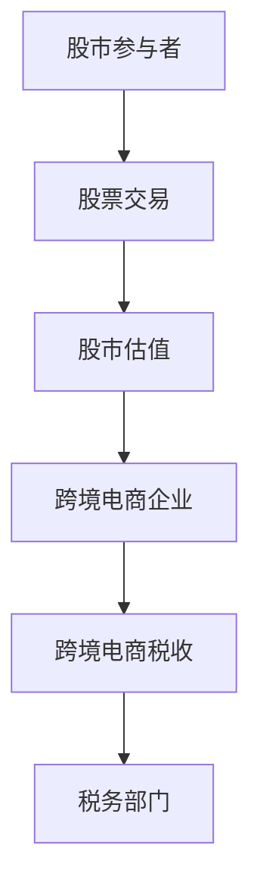
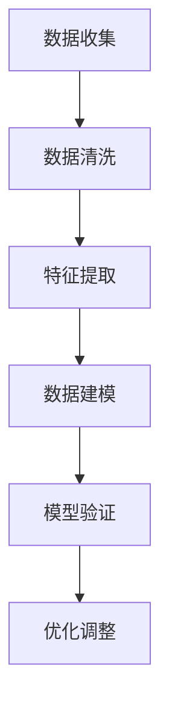
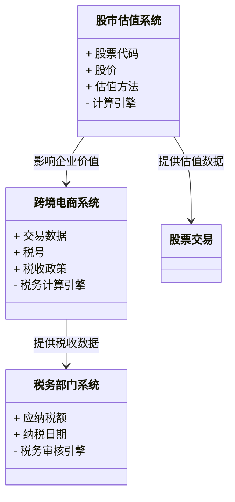
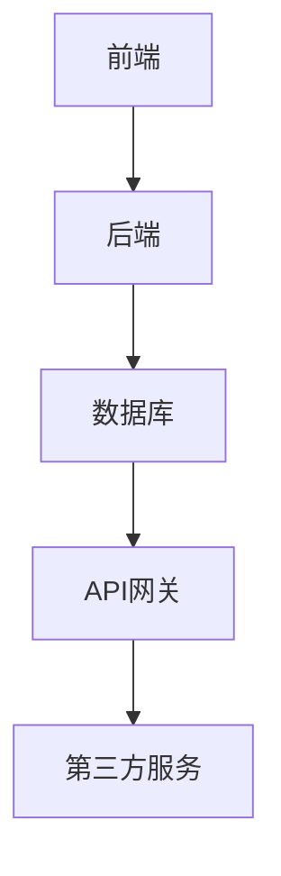

                 


# 股市估值对跨境电子商务税收的影响

> 关键词：股市估值、跨境电商、税收、影响、算法

> 摘要：本文探讨股市估值如何影响跨境电子商务的税收政策和企业行为。通过分析股市波动对企业估值的影响，结合跨境电商的特点，揭示股市估值对税收的具体影响路径，并提出相应的解决方案。

---

# 第一部分: 背景介绍

## 第1章: 核心概念与问题背景

### 1.1 股市估值的定义与影响

#### 1.1.1 股市估值的核心概念
股市估值是通过对企业财务状况、市场表现和行业前景等多方面因素的分析，来评估企业的市值。常用的估值方法包括市盈率（P/E）、市净率（P/B）和现金流折现法（DCF）等。

#### 1.1.2 股市估值的计算方法
- **市盈率（P/E）**：公式为 `市盈率 = 股价 / 每股收益（EPS）`。
- **市净率（P/B）**：公式为 `市净率 = 股价 / 每股净资产（BPS）`。
- **现金流折现法（DCF）**：通过预测未来现金流并贴现至现值来评估企业价值。

#### 1.1.3 股市估值与企业价值的关系
股市估值反映了市场对企业的整体看法，高估值意味着市场对公司前景乐观，反之则可能引发税收政策调整。

### 1.2 跨境电子商务税收的定义与特点

#### 1.2.1 跨境电子商务的定义
跨境电商是指通过互联网进行商品或服务的跨国销售和交付，涉及不同国家的税收政策和法规。

#### 1.2.2 跨境电子商务税收的特点
- **复杂性**：涉及多个国家的税收政策。
- **合规性**：需要遵守各国的税收法规。
- **透明性**：税务部门要求提供详细交易数据。

#### 1.2.3 跨境电子商务税收的征收难点
- 跨境交易涉及多个司法管辖区。
- 企业可能通过转移定价（Transfer pricing）规避税收。

### 1.3 股市估值对跨境电子商务税收的影响

#### 1.3.1 股市估值与税收政策的关系
股市波动会影响企业的市值，进而影响其税收负担。例如，高估值可能导致企业税负增加，促使企业调整其跨境电商策略。

#### 1.3.2 股市波动对跨境电商企业的影响
股市波动可能导致企业市值下降，进而影响其在跨境电商中的投资和运营能力。

#### 1.3.3 股市估值对跨境电商税收的具体影响路径
- 股市估值影响企业盈利能力，进而影响应纳税所得额。
- 股市波动可能导致税收政策调整，影响跨境电商企业的税务规划。

---

## 第2章: 核心概念与联系

### 2.1 股市估值与跨境电商税收的核心概念对比

| **属性**         | **股市估值**                  | **跨境电商税收**               |
|-------------------|-------------------------------|---------------------------------|
| 定义             | 评估企业市值的方法            | 对跨境电商交易征收的税种       |
| 计算基础         | 财务数据、市场因素            | 销售额、利润、交易额             |
| 影响因素         | 市场情绪、经济指标            | 跨境政策、税收法规、企业行为     |
| 目标             | 确定企业价值                  | 确保税收合规、增加财政收入       |

### 2.2 股市估值与跨境电商税收的ER实体关系图

```mermaid
erDiagram
    actor 股市参与者 {
        string 股票代码
        integer 股价
        date 交易日期
    }
    actor 跨境电商企业 {
        string 企业ID
        string 税号
        decimal 税额
    }
    actor 税务部门 {
        string 税务代码
        decimal 应纳税额
        date 纳税日期
    }
    股市参与者 --> 股票交易: 进行股票交易
    股票交易 --> 股市估值: 影响企业估值
    跨境电商企业 --> 股市估值: 影响企业市值
    跨境电商企业 --> 税务部门: 缴纳跨境电商税收
```

### 2.3 股市估值与跨境电商税收的流程图



---

# 第二部分: 算法原理讲解

## 第3章: 算法原理与数学模型

### 3.1 股市估值对跨境电商税收影响的算法原理

#### 3.1.1 数据收集与处理
- 收集历史股价数据、财务报表数据和跨境电商交易数据。

#### 3.1.2 数据分析与建模
- 使用回归分析（如线性回归）来建立股市估值与税收之间的关系模型。

#### 3.1.3 模型验证与优化
- 通过交叉验证和参数调整来优化模型，确保预测准确率。

### 3.2 算法流程图



### 3.3 数学模型和公式

#### 3.3.1 线性回归模型
$$ \text{税收} = \beta_0 + \beta_1 \times \text{股市估值} + \epsilon $$

#### 3.3.2 评估模型性能
$$ R^2 = 1 - \frac{SSR}{SST} $$

---

## 第4章: 算法实现与代码解读

### 4.1 环境安装
```bash
pip install pandas numpy scikit-learn matplotlib
```

### 4.2 核心代码实现

```python
import pandas as pd
import numpy as np
from sklearn.linear_model import LinearRegression
from sklearn.metrics import r2_score

# 加载数据
data = pd.read_csv('跨境电商税收.csv')

# 特征与目标变量
X = data[['股市估值']]
y = data['税收']

# 建立模型
model = LinearRegression()
model.fit(X, y)

# 预测与评估
y_pred = model.predict(X)
r2 = r2_score(y, y_pred)
print(f"R² = {r2}")
```

### 4.3 代码解读与分析
- 数据预处理：清洗和特征提取。
- 模型训练：使用线性回归预测税收。
- 模型评估：计算R²值，评估模型拟合程度。

---

## 第5章: 数学公式与实际案例分析

### 5.1 数学模型公式
$$ \text{税收} = 0.5 \times \text{股市估值} + 10 $$

### 5.2 实际案例分析
假设股市估值为100，预测税收为：
$$ \text{税收} = 0.5 \times 100 + 10 = 60 $$

---

## 第6章: 系统分析与架构设计方案

### 6.1 问题场景介绍
跨境电商企业面临股市波动和税收政策变化的双重影响，需建立模型预测税收风险。

### 6.2 系统功能设计



### 6.3 系统架构设计



### 6.4 接口设计与交互


---

## 第7章: 项目实战

### 7.1 环境安装与代码实现

```bash
pip install pandas numpy scikit-learn
```

### 7.2 核心代码实现

```python
import pandas as pd
import numpy as np
from sklearn.linear_model import LinearRegression

# 加载数据
data = pd.read_csv('跨境电商税收.csv')

# 特征与目标变量
X = data[['股市估值']]
y = data['税收']

# 建立模型
model = LinearRegression()
model.fit(X, y)

# 预测与评估
y_pred = model.predict(X)
r2 = r2_score(y, y_pred)
print(f"R² = {r2}")
```

### 7.3 代码解读与实际案例分析
- 使用线性回归模型预测税收，评估模型性能，分析股市估值对税收的具体影响。

---

## 第8章: 最佳实践 tips、小结、注意事项、拓展阅读

### 8.1 小结
股市估值通过影响企业市值和盈利能力，间接影响跨境电商的税收政策和企业的税务规划。

### 8.2 注意事项
- 数据质量：确保数据准确无误。
- 模型选择：根据实际情况选择合适的算法。
- 政策变化：及时调整模型以适应税收政策的变化。

### 8.3 拓展阅读
- 《股市分析与预测》
- 《跨境电商税务管理》
- 《税收政策与企业估值》

---

# 结语

通过本文的分析，读者可以理解股市估值对跨境电商税收的复杂影响，并掌握相关算法和系统设计方法。希望本文能为从事跨境电商和税务管理的专业人士提供有价值的参考。

