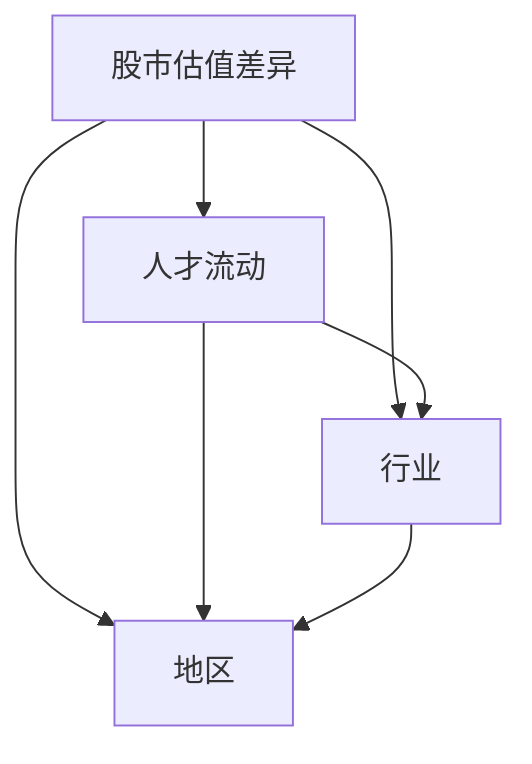
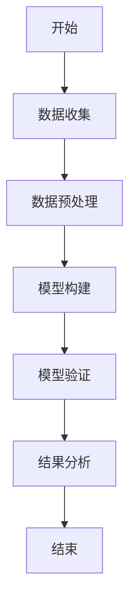

                 


# 股市估值差异对国际人才流动的影响

## 关键词：股市估值差异，国际人才流动，经济影响，人才迁移，股市分析

## 摘要：  
本文探讨股市估值差异如何影响国际人才流动。通过分析股市估值差异与人才流动的关系，结合数学模型和实际案例，深入剖析股市估值差异对人才流动的正向和负向影响，并提出优化国际人才流动的策略。

---

## 第一部分：背景介绍

### 第1章：股市估值差异与国际人才流动的背景

#### 1.1 问题背景
- **股市估值差异的定义与特征**：股市估值差异指不同市场或同一市场内股票的估值差异，受供需、信息不对称等因素影响。
- **国际人才流动的定义与特征**：指跨国界的人才迁移，受经济、政策、文化等多因素驱动。
- **两者关联性**：股市估值差异影响企业的吸引力，进而影响人才流动。

#### 1.2 问题描述
- **影响机制**：股市估值差异通过企业价值、薪资水平等因素影响人才流动。
- **驱动因素**：经济环境、政策、企业声誉等。
- **边界与外延**：需考虑地域、行业等变量。

#### 1.3 问题解决
- **正向影响**：高估值市场吸引更多人才流入。
- **负向影响**：低估值可能导致人才流失。
- **优化策略**：通过调整估值机制优化人才流动。

#### 1.4 核心概念与联系
- **核心概念对比**：股市估值差异与人才流动的属性特征对比，包括影响因素和案例分析。
- **实例分析**：股市估值差异如何影响人才流动的具体案例。

---

## 第二部分：核心概念与联系

### 第2章：股市估值差异与国际人才流动的核心概念

#### 2.1 核心概念原理
- **股市估值差异计算方法**：市盈率、市净率等指标。
- **人才流动衡量指标**：迁移率、就业率等。
- **关系模型**：构建回归模型分析两者关系。

#### 2.2 核心概念对比
- **属性特征对比**：表格展示股市估值差异与人才流动的属性对比。
- **驱动因素对比**：分析经济、政策等因素的影响。
- **案例对比**：不同地区的股市估值差异对人才流动的影响。

#### 2.3 ER实体关系图


---

## 第三部分：算法原理讲解

### 第3章：股市估值差异对人才流动的数学模型

#### 3.1 算法原理
- **回归模型**：构建股市估值差异对人才流动的回归模型。
- **变量定义**：自变量为股市估值差异，因变量为人才流动率。
- **数学表达式**：
  $$ Y = \beta_0 + \beta_1 X + \epsilon $$
  其中，$Y$为人才流动率，$X$为股市估值差异，$\epsilon$为误差项。

#### 3.2 算法流程图


#### 3.3 数学模型与公式
- **回归分析**：通过回归系数$\beta_1$衡量股市估值差异对人才流动的影响强度。

---

## 第四部分：系统分析与架构设计

### 第4章：系统分析与架构设计

#### 4.1 系统分析
- **问题场景**：分析某地区股市数据与人才流动数据。
- **项目介绍**：构建系统分析股市估值差异对人才流动的影响。

#### 4.2 系统功能设计
- **领域模型类图**：
  ```mermaid
  classDiagram
      class 股市估值差异 {
          市盈率
          市净率
      }
      class 人才流动 {
          流动率
          就业率
      }
      class 行业 {
          制造业
          IT行业
      }
      股市估值差异 --> 人才流动
      股市估值差异 --> 行业
      人才流动 --> 行业
  ```

#### 4.3 系统架构设计
- **系统架构图**：
  ```mermaid
  graph TD
      A[数据收集模块] --> B[数据处理模块]
      B --> C[模型构建模块]
      C --> D[结果展示模块]
  ```

#### 4.4 系统接口设计
- **接口描述**：模块之间的数据接口。
- **交互流程**：
  ```mermaid
  graph TD
      A[开始] --> B[数据输入]
      B --> C[数据处理]
      C --> D[模型运行]
      D --> E[结果输出]
      E --> F[结束]
  ```

---

## 第五部分：项目实战

### 第5章：项目实战

#### 5.1 项目介绍
- **项目背景**：分析某地区股市与人才流动数据。
- **数据收集**：收集该地区的股市估值数据和人才流动数据。

#### 5.2 系统核心实现
- **代码示例**：
  ```python
  import pandas as pd
  import numpy as np
  from sklearn.linear_model import LinearRegression

  # 数据加载
  df = pd.read_csv('data.csv')
  X = df[['市盈率', '市净率']]
  y = df['人才流动率']

  # 模型训练
  model = LinearRegression()
  model.fit(X, y)

  # 结果输出
  print('回归系数:', model.coef_)
  print('截距:', model.intercept_)
  ```

#### 5.3 应用解读
- **代码分析**：使用线性回归模型分析股市估值差异对人才流动的影响。
- **结果展示**：回归系数表示股市估值差异对人才流动的影响程度。

#### 5.4 案例分析
- **具体案例**：分析某行业的股市估值差异如何影响人才流动。
- **结果解读**：解释模型输出结果的意义。

---

## 第六部分：最佳实践

### 第6章：最佳实践

#### 6.1 关键点总结
- **关键点**：股市估值差异对人才流动的影响需综合考虑多因素。

#### 6.2 注意事项
- **数据质量**：确保数据准确性和完整性。
- **模型选择**：根据实际情况选择合适模型。

#### 6.3 未来研究方向
- **扩展研究**：引入更多变量进行分析。
- **优化模型**：尝试更复杂的模型以提高预测精度。

#### 6.4 拓展阅读
- 推荐相关书籍和论文，供读者进一步学习。

---

## 结语

股市估值差异对国际人才流动的影响是一个复杂但重要的课题。通过本文的分析，读者可以深入了解两者之间的关系，并在实际应用中优化人才流动策略。希望本文能为相关领域的研究和实践提供有价值的参考。

