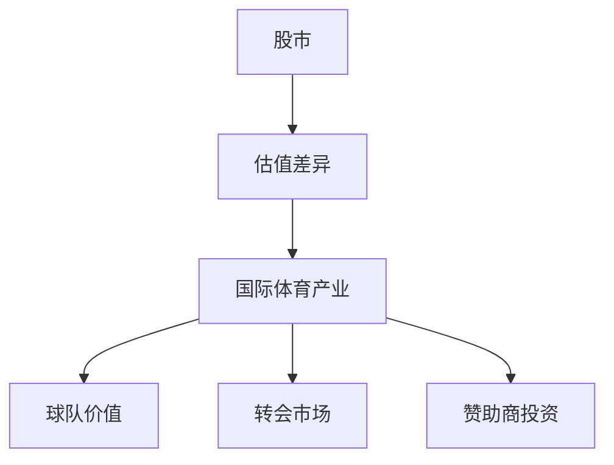
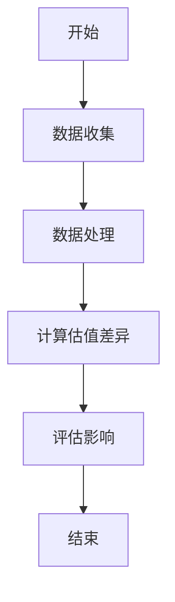

                 


# 股市估值差异对国际体育产业的影响

## 关键词
- 股市估值差异、国际体育产业、球队价值、转会市场、赞助商投资、风险管理

## 摘要
股市估值差异对国际体育产业的影响是一个复杂而重要的课题。本文通过分析股市估值差异的形成机制，探讨其对国际体育产业中的球队价值、转会市场和赞助商投资的具体影响，并进一步分析这些影响如何通过财务表现和市场情绪传递到体育产业。文章还讨论了国际体育产业对股市的反馈机制，包括通过企业并购、赞助商投资和资本市场融资等途径对股市的影响。最后，本文提出了风险管理策略，帮助体育组织应对股市估值差异带来的风险。

---

## 第一部分：背景介绍

### 第1章：股市估值差异与国际体育产业概述

#### 1.1 股市估值差异的定义与特征
股市估值差异是指同一市场中不同股票或不同市场中相同股票之间的估值差异。这种差异通常由市场情绪、信息不对称、宏观经济因素和行业特性等多种因素引起。在国际体育产业中，球队、联赛和体育公司等的股票估值差异尤为显著，因为这些实体的业绩表现与体育赛事的观赏性和商业成功密切相关。

#### 1.2 问题背景与问题描述
国际体育产业是一个庞大的市场，涵盖球队、联赛、体育用品、体育媒体等多个领域。随着体育产业的商业化和全球化，其与资本市场的联系日益紧密。然而，股市估值差异可能导致体育组织的市值波动，进而影响其运营决策和投资行为。例如，球队的估值差异可能影响其转会策略和赞助商的选择。

#### 1.3 问题解决与边界外延
本文旨在探讨股市估值差异对国际体育产业的具体影响，并提出相应的解决方案。研究范围限定于上市公司体育组织，如英超俱乐部和NBA球队，以及相关的体育媒体公司。本文不涉及非上市体育组织和小型体育项目。

### 第2章：核心概念与联系

#### 2.1 核心概念原理
股市估值差异可以通过市盈率、市净率等指标来衡量。国际体育产业的核心要素包括球队价值、转会市场和赞助商投资。股市估值差异与这些要素之间存在相互作用：股市估值差异影响球队价值，球队价值又影响转会市场的活跃度和赞助商的投资决策。

#### 2.2 核心概念属性特征对比
| 核心概念 | 属性 | 描述 |
|----------|------|------|
| 股市估值差异 | 形成因素 | 市场情绪、信息不对称、宏观经济 |
| 国际体育产业 | 核心要素 | 球队价值、转会市场、赞助商投资 |

#### 2.3 ER实体关系图


### 第3章：算法原理讲解

#### 3.1 算法原理概述
计算股市估值差异需要收集相关数据，如球队的财务数据和市场数据。通过数据分析，可以识别球队价值与股市估值之间的差异，并评估这些差异对转会市场和赞助商投资的影响。

#### 3.2 算法流程图


#### 3.3 Python源代码实现
```python
import pandas as pd
import numpy as np

def calculate_valuation_difference(data):
    return data['市盈率'] - data['行业平均市盈率']

data = pd.DataFrame({
    '球队': ['A', 'B', 'C'],
    '市盈率': [15, 20, 25],
    '行业平均市盈率': [18, 18, 18]
})

valuation_diff = calculate_valuation_difference(data)
print(valuation_diff)
```

---

## 第二部分：系统分析

### 第4章：影响分析

#### 4.1 股市估值差异对球队价值的影响
股市估值差异直接影响球队的市值。例如，如果一支球队的市盈率低于行业平均水平，其市值可能被低估，进而影响其转会策略和赞助商的投资决策。

#### 4.2 股市估值差异对转会市场的影响
球队价值的波动会影响转会市场的活跃度。当球队市值上升时，转会预算可能增加；反之，转会预算可能减少。

#### 4.3 股市估值差异对赞助商投资的影响
赞助商的投资决策受到球队市值的影响。如果球队市值被高估，赞助商可能减少投资；如果球队市值被低估，赞助商可能增加投资。

### 第5章：机制分析

#### 5.1 股市估值差异的传递机制
股市估值差异通过财务表现和市场情绪传递到体育产业。例如，球队的财务表现不佳可能导致其市值下降，进而影响转会市场和赞助商投资。

#### 5.2 国际体育产业的反馈机制
国际体育产业通过企业并购、赞助商投资和资本市场融资等途径对股市产生反馈。例如，球队通过资本市场融资用于体育设施建设和转会市场投资。

### 第6章：风险管理

#### 6.1 风险管理策略
体育组织可以通过多元化投资、加强内部管理、优化资本结构等方式应对股市估值差异带来的风险。

#### 6.2 风险管理工具
常用的工具包括金融衍生品、资产配置优化和风险评估模型。

---

## 第三部分：项目实战

### 第7章：实际案例分析

#### 7.1 案例选择
选择英超俱乐部和NBA球队作为案例，分析其股市估值差异对球队价值、转会市场和赞助商投资的具体影响。

#### 7.2 数据收集与分析
收集相关数据，分析球队市值与转会市场活跃度之间的关系。

#### 7.3 案例分析与解读
通过具体案例分析，总结股市估值差异对国际体育产业的影响。

### 第8章：系统实现

#### 8.1 系统功能设计
设计一个用于分析股市估值差异对国际体育产业影响的系统，包括数据收集、处理和分析模块。

#### 8.2 系统架构设计
使用分层架构，包括数据层、业务逻辑层和用户界面层。

#### 8.3 系统接口设计
定义系统接口，如数据接口、分析接口和用户接口。

#### 8.4 系统交互流程
描述用户与系统之间的交互流程，如数据输入、分析请求和结果展示。

### 第9章：代码实现

#### 9.1 环境安装
安装必要的软件和库，如Python和Pandas。

#### 9.2 核心实现
编写核心代码，实现数据处理和分析功能。

#### 9.3 代码解读
详细解读代码，说明每部分的功能和实现原理。

#### 9.4 应用案例
通过具体案例展示代码的应用，如分析英超俱乐部的股市估值差异。

---

## 第四部分：最佳实践

### 第10章：小结与总结

#### 10.1 核心内容总结
总结股市估值差异对国际体育产业的影响，以及应对策略。

#### 10.2 重要结论
强调股市估值差异对国际体育产业的重要性和未来趋势。

### 第11章：注意事项与建议

#### 11.1 注意事项
提醒读者在实际应用中注意数据的准确性和模型的适用性。

#### 11.2 实践建议
建议体育组织加强与资本市场的联系，优化资本结构和风险管理策略。

### 第12章：未来展望与拓展阅读

#### 12.1 未来研究方向
提出未来的研究方向，如动态估值模型和全球体育市场一体化。

#### 12.2 拓展阅读
推荐相关书籍和论文，供读者进一步学习。

---

通过以上分析，我们可以看到股市估值差异对国际体育产业的影响是多方面的，需要从理论和实践两个层面进行深入研究。希望本文能够为相关研究和实践提供有价值的参考。

